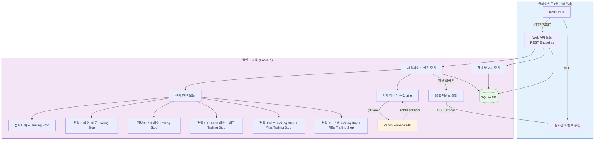
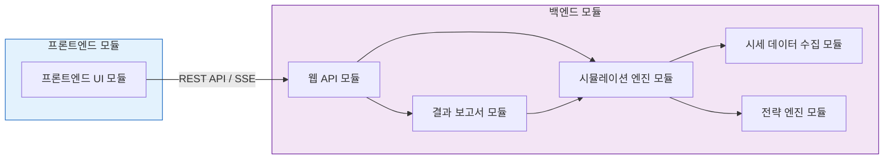
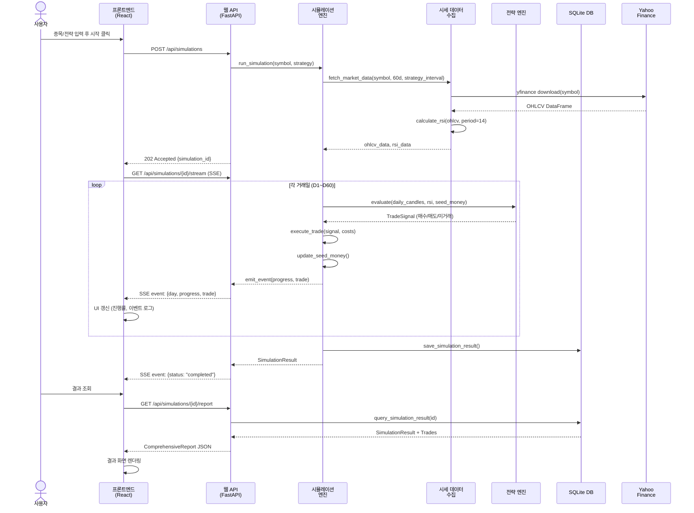
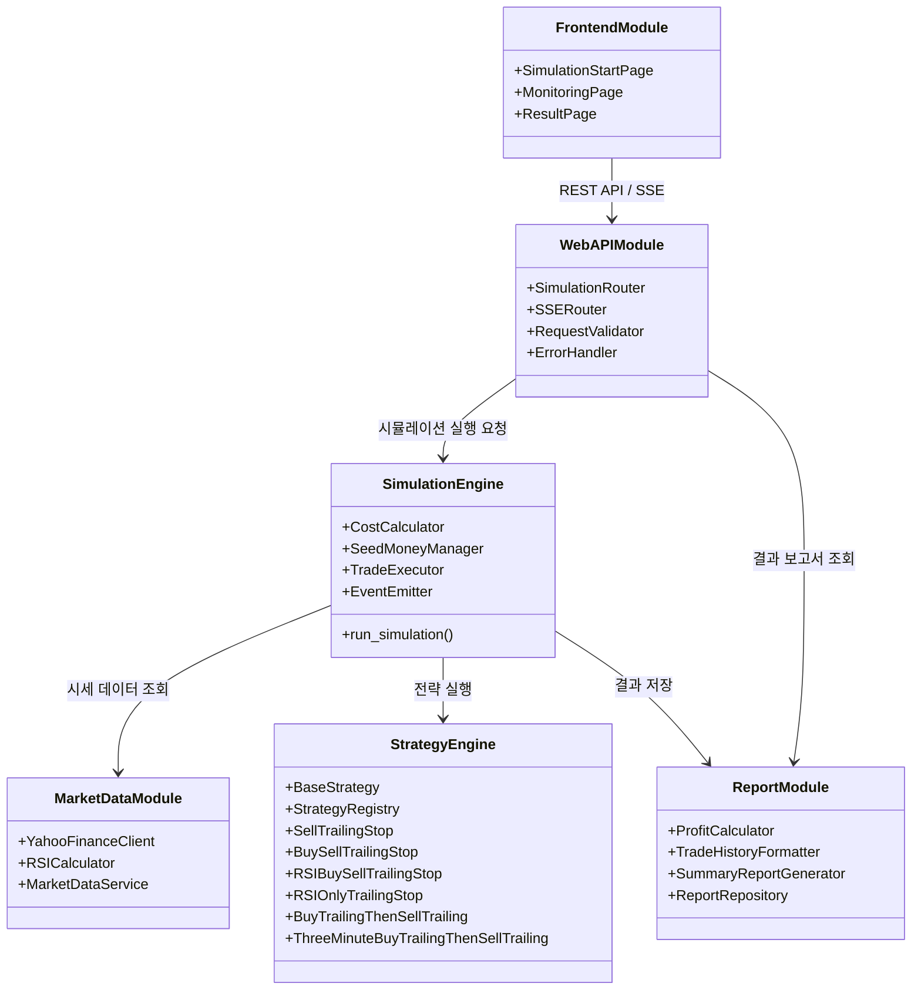
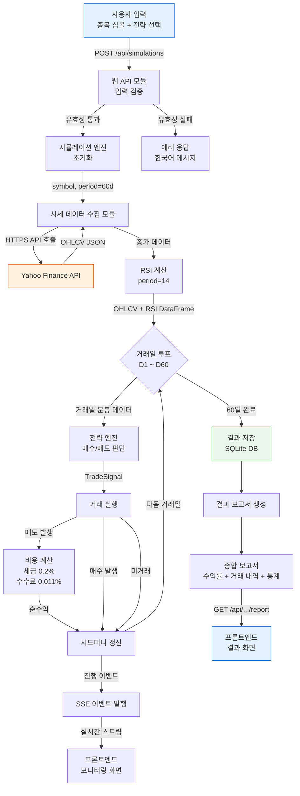
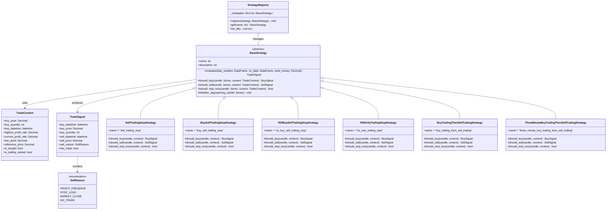
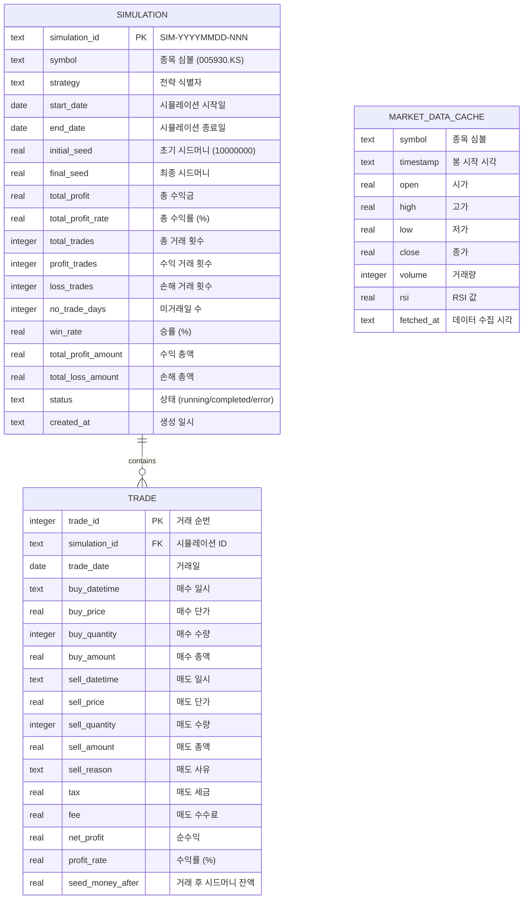
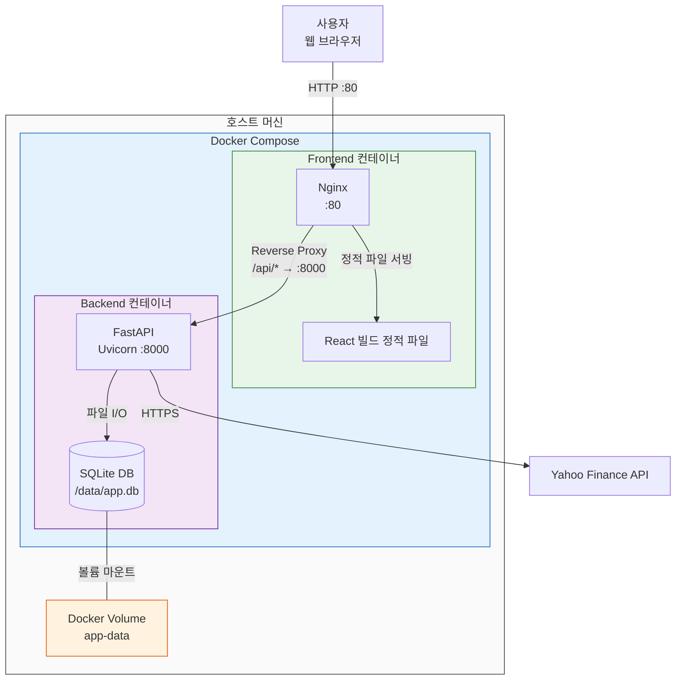

# 고수준 설계 문서 (HLD)
# High-Level Design Document

| 항목 | 내용 |
|------|------|
| **문서 버전** | 1.2.0 |
| **작성일** | 2026-02-16 |
| **기반 문서** | SRS v1.2.0, 유저스토리 v1.2.0, 사용자 인터뷰 (2026-02-15, 2026-02-16) |
| **티켓** | TICKET-075 |

---

## v1.2.0 변경 로그 (요약)

- 2026-02-16 3차 인터뷰 기반 신규 전략C(3분봉 Trailing Buy + 매도 Trailing Stop) 아키텍처 반영
- 전략 모듈 확장 영향 정의: 전략 인터페이스, StrategyRegistry, 분봉 단위별(5분/3분) 실행 흐름 반영
- WebAPI 전략 enum/검증 범위 확장(기존 5종 → 6종)
- Frontend 전략 선택 옵션 확장(전략 1/2/3/A/B/C)
- 모듈 분해 섹션에 전략 모듈 LLD 갱신 범위(전략C 클래스/레지스트리/계약 영향) 명시

---

## 목차

1. [서론](#1-서론)
2. [아키텍처 개요](#2-아키텍처-개요)
3. [기술 스택 선정](#3-기술-스택-선정)
4. [모듈 구조](#4-모듈-구조-module-decomposition)
5. [모듈 간 인터페이스 정의](#5-모듈-간-인터페이스-정의)
6. [데이터 흐름도](#6-데이터-흐름도)
7. [전략 확장 구조 설계](#7-전략-확장-구조-설계)
8. [데이터 모델](#8-데이터-모델)
9. [배포 아키텍처](#9-배포-아키텍처)
10. [SRS 요구사항 추적 매트릭스](#10-srs-요구사항-추적-매트릭스)

---

## 1. 서론

### 1.1 목적

본 문서는 주식투자 전략 시뮬레이션 시스템의 고수준 설계(High-Level Design)를 정의한다. SRS v1.2.0에서 명세된 18개 기능 요구사항(FR-001~FR-018)과 8개 비기능 요구사항(NFR-001~NFR-008)을 충족하는 시스템 아키텍처, 모듈 구조, 기술 스택, 데이터 모델, 배포 구조를 설계하여 상세 설계(LLD) 및 구현의 기반을 제공한다.

### 1.2 범위

본 HLD 문서가 다루는 범위는 다음과 같다:

- **시스템 아키텍처**: 전체 시스템 구조 및 컴포넌트 간 관계
- **모듈 분해**: 기능 단위 모듈의 책임, 입출력, 의존 관계
- **기술 스택**: 백엔드, 프론트엔드, 데이터베이스, 데이터 처리, 실시간 통신 기술 선정 및 근거
- **인터페이스 정의**: 모듈 간 통신 방식 및 REST API 엔드포인트
- **데이터 모델**: DB 스키마 및 주요 엔티티
- **배포 아키텍처**: Docker 기반 컨테이너화 배포 구조

### 1.3 참조 문서

| 문서 | 경로 | 설명 |
|------|------|------|
| SRS v1.2.0 | docs/srs/srs-v1.2.0.md | 소프트웨어 요구사항 명세서 (FR 18개, NFR 8개) |
| 유저스토리 v1.2.0 | docs/userstory/userstory-v1.2.0.md | 20개 유저스토리 정의 |
| 사용자 인터뷰 (2026-02-15) | docs/userinterview/20260215.md | 1~4차 인터뷰 원문 |
| 사용자 인터뷰 (2026-02-16) | docs/userinterview/20260216.md | 1~3차 인터뷰 원문 |

### 1.4 용어 정의

| 용어 | 정의 |
|------|------|
| **5분 분봉** | 5분 간격으로 기록된 OHLCV(시가/고가/저가/종가/거래량) 데이터 |
| **3분 분봉** | 3분 간격으로 기록된 OHLCV(시가/고가/저가/종가/거래량) 데이터 |
| **RSI** | Relative Strength Index. 14기간 기준 상대강도지수 (0~100) |
| **Trailing Stop** | 주가가 유리한 방향으로 움직일 때 손절/이익보전 기준을 자동 상향 조정하는 매매 기법 |
| **이익보전율** | (현재 수익률 / 당일 최고 수익률) × 100. 80% 이하 시 매도 트리거 |
| **시드머니** | 시뮬레이션 초기 투자 원금 (₩10,000,000). 거래 결과에 따라 누적 증감 |
| **전저점** | 전략이 사용하는 분봉(5분 또는 3분) 기준 추적 중인 최저 가격 지점 |
| **SSE** | Server-Sent Events. 서버에서 클라이언트로 단방향 실시간 데이터 전송 프로토콜 |
| **Strategy Pattern** | 알고리즘을 캡슐화하여 교체 가능하게 만드는 GoF 디자인 패턴 |

---

## 2. 아키텍처 개요

### 2.1 시스템 아키텍처 다이어그램



### 2.2 아키텍처 스타일 및 패턴

| 항목 | 선정 | 근거 |
|------|------|------|
| **전체 아키텍처** | 모놀리식 레이어드 아키텍처 (Monolithic Layered) | 단일 종목·단일 사용자 대상 시뮬레이션 시스템으로 MSA 수준의 복잡성이 불필요. 개발·배포·디버깅 효율 극대화 |
| **프론트엔드** | SPA (Single Page Application) | 시뮬레이션 시작→모니터링→결과 조회의 연속적 워크플로를 페이지 전환 없이 제공 (NFR-003, NFR-004) |
| **백엔드 API** | RESTful API + SSE | REST로 시뮬레이션 CRUD 처리, SSE로 실시간 모니터링 이벤트 단방향 푸시 (FR-011) |
| **전략 모듈** | Strategy Pattern (GoF) | 전략 인터페이스 기반으로 6개 전략 구현(기존 3 + 신규 3), 신규 전략 추가 시 기존 코드 무변경 (FR-006, FR-016, FR-017, FR-018, NFR-008) |
| **데이터 레이어** | Repository Pattern | DB 접근 로직을 캡슐화하여 데이터 저장소 교체 용이성 확보 |

**아키텍처 선정 근거 상세:**

1. **모놀리식 선정 이유**: 본 시스템은 단일 종목에 대한 백테스팅 시뮬레이션으로, 동시 사용자가 1명이며 시뮬레이션 실행이 순차적이다. 마이크로서비스로 분리할 경우 모듈 간 네트워크 통신 오버헤드가 시뮬레이션 성능(NFR-001: 60초 이내 완료)에 부정적 영향을 미친다.
2. **레이어드 구조 선정 이유**: 시세 데이터 수집 → 전략 실행 → 시뮬레이션 → 결과 보고서의 단방향 파이프라인 특성상 레이어드 구조가 자연스럽다. 각 레이어(API → Service → Data)의 관심사 분리로 유지보수성(NFR-008)을 확보한다.

### 2.3 아키텍처 원칙

| 원칙 | 설명 | 관련 요구사항 |
|------|------|-------------|
| **관심사 분리 (Separation of Concerns)** | 데이터 수집, 전략 로직, 시뮬레이션 엔진, API, UI를 독립 모듈로 분리 | NFR-008 |
| **개방-폐쇄 원칙 (OCP)** | 전략 인터페이스를 통해 기존 코드 수정 없이 새 전략 추가 가능 | FR-006, NFR-008 |
| **단일 책임 원칙 (SRP)** | 각 모듈이 하나의 명확한 책임만 담당 | NFR-008 |
| **데이터 정확성 우선** | 금액 계산 시 Decimal 타입 사용, 소수점 이하 원 단위 정확성 보장 | NFR-005 |
| **실패 격리 (Fault Isolation)** | Yahoo Finance API 장애 시 시스템 전체 장애 방지, 오류 메시지 표시 | FR-001 |

---

## 3. 기술 스택 선정

### 3.1 기술 스택 총괄표

| 영역 | 기술 | 버전 | 선정 근거 |
|------|------|------|----------|
| **Backend Framework** | Python + FastAPI | Python 3.11+, FastAPI 0.100+ | 아래 3.2 참조 |
| **Frontend Framework** | React + TypeScript | React 18+, TS 5+ | 아래 3.3 참조 |
| **Database** | SQLite | 3.x | 아래 3.4 참조 |
| **Data Processing** | pandas + numpy | pandas 2.x, numpy 1.x | 아래 3.5 참조 |
| **시세 데이터 수집** | yfinance | 0.2+ | 아래 3.6 참조 |
| **실시간 통신** | SSE (Server-Sent Events) | - | 아래 3.7 참조 |
| **HTTP 클라이언트** | Axios | 1.x | REST API 호출, 인터셉터/에러 핸들링 용이 |
| **상태 관리** | Zustand | 4.x | 경량, React 친화적, 보일러플레이트 최소 |
| **테스트** | pytest (BE), Vitest (FE) | - | 각 생태계 표준 테스트 프레임워크 |
| **컨테이너** | Docker + Docker Compose | - | 개발/운영 환경 일관성, 원커맨드 배포 |

### 3.2 Backend: Python + FastAPI

**선정 근거:**

1. **yfinance 생태계**: Yahoo Finance 데이터 수집을 위한 `yfinance` 라이브러리가 Python 네이티브이며, 가장 성숙하고 안정적인 구현체이다 (FR-001, FR-002).
2. **수치 계산 생태계**: pandas, numpy를 활용한 5분 분봉 데이터 처리, RSI 계산, 수익률 산출이 Python에서 가장 효율적이다 (FR-002, FR-007, FR-013).
3. **FastAPI 비동기 지원**: 시뮬레이션 실행 중 SSE를 통한 실시간 모니터링 이벤트 발행에 비동기 처리가 필수적이며, FastAPI의 async/await + StreamingResponse가 이를 네이티브로 지원한다 (FR-011).
4. **자동 API 문서화**: FastAPI의 OpenAPI/Swagger 자동 생성으로 프론트엔드 연동 개발 생산성 향상.
5. **타입 안전성**: Pydantic 기반 요청/응답 모델로 데이터 정확성 검증 강화 (NFR-005).

**Flask 대비 FastAPI 선정 이유**: Flask는 동기 기반으로 SSE 구현 시 별도 확장(flask-sse)이 필요하며, 타입 검증이 내장되지 않는다. FastAPI는 비동기 SSE, Pydantic 타입 검증, 자동 문서화를 네이티브로 제공하여 본 프로젝트의 실시간 모니터링(FR-011) 및 데이터 정확성(NFR-005) 요구사항에 더 적합하다.

### 3.3 Frontend: React + TypeScript

**선정 근거:**

1. **컴포넌트 기반 아키텍처**: 시뮬레이션 시작 폼, 모니터링 대시보드, 결과 보고서 테이블 등 UI 컴포넌트의 재사용 및 독립적 관리에 적합 (FR-010, FR-011, FR-012).
2. **SSE 통합 용이성**: `EventSource` API를 통한 SSE 실시간 이벤트 수신 및 상태 업데이트가 React의 상태 관리와 자연스럽게 통합 (FR-011).
3. **TypeScript 타입 안전성**: API 응답 타입, 시뮬레이션 결과 데이터 구조의 타입 정의로 런타임 에러 방지 및 개발 생산성 향상.
4. **생태계 성숙도**: 차트 라이브러리(Recharts), 테이블 라이브러리, UI 프레임워크 등 풍부한 생태계로 결과 보고서 시각화에 활용 (FR-013, FR-014, FR-015).
5. **SPA 사용자 경험**: 시뮬레이션 시작→모니터링→결과 조회의 연속적 워크플로를 페이지 새로고침 없이 제공하여 사용자 경험 향상 (NFR-004).

### 3.4 Database: SQLite

**선정 근거:**

1. **프로젝트 규모 적합성**: 단일 사용자, 단일 종목 시뮬레이션 시스템으로 PostgreSQL 수준의 동시성·확장성이 불필요. SQLite의 파일 기반 경량 DB가 적합하다.
2. **무설치 운영**: 별도 DB 서버 프로세스 불필요. Python 표준 라이브러리(`sqlite3`)로 즉시 사용 가능.
3. **Docker 배포 간소화**: DB 서버 컨테이너 불필요, 볼륨 마운트만으로 데이터 영속성 확보 가능 (NFR-006).
4. **데이터 영속성**: 시뮬레이션 결과를 파일에 저장하여 브라우저 종료 후 재조회 가능 (FR-012).
5. **마이그레이션 용이성**: 향후 동시 사용자 확장 필요 시 SQLAlchemy ORM을 통해 PostgreSQL로 무중단 전환 가능.

### 3.5 Data Processing: pandas + numpy

**선정 근거:**

1. **분봉 데이터 처리**: 5분 분봉 OHLCV 시계열 데이터의 필터링, 정렬, 집계에 pandas DataFrame이 최적 (FR-001).
2. **RSI 계산**: 14기간 RSI 산출 시 rolling window, 이동 평균 등 pandas/numpy 벡터 연산으로 고성능 처리 (FR-002, NFR-001).
3. **수익률 계산**: 매매 비용(세금 0.2%, 수수료 0.011%) 반영 순수익, 누적 시드머니 계산에 numpy의 정밀 수치 연산 활용 (FR-007, FR-008).
4. **yfinance 호환**: yfinance가 pandas DataFrame 형태로 데이터를 반환하므로 추가 변환 없이 직접 활용 가능.

### 3.6 시세 데이터 수집: yfinance

**선정 근거:**

1. **Yahoo Finance 공식 Python 래퍼**: 코스피 종목(`.KS` 심볼)의 5분 분봉 데이터를 `interval='5m'`, `period='60d'`로 직접 조회 가능 (FR-001).
2. **무료 API**: 별도 API 키 없이 사용 가능하여 초기 비용 없음.
3. **pandas 네이티브 출력**: 조회 결과를 pandas DataFrame으로 직접 반환하여 후처리 파이프라인과 즉시 연결.
4. **RSI 산출 기반 데이터**: OHLCV 데이터를 기반으로 pandas-ta 등 기술적 지표 라이브러리를 사용하거나 직접 RSI를 산출할 수 있음 (FR-002).

### 3.7 실시간 통신: SSE (Server-Sent Events)

**선정 근거:**

1. **단방향 통신 적합**: 시뮬레이션 모니터링은 서버→클라이언트 단방향 이벤트 푸시만 요구 (진행률, 매수/매도 이벤트). 클라이언트→서버 실시간 메시지가 불필요하므로 양방향 WebSocket은 오버스펙이다.
2. **구현 간소화**: FastAPI의 `StreamingResponse`와 브라우저 `EventSource` API만으로 구현 가능. WebSocket 대비 연결 관리, 프로토콜 핸들링이 단순.
3. **자동 재연결**: EventSource는 연결 끊김 시 자동 재연결을 지원하여 안정적 모니터링 보장 (NFR-002).
4. **HTTP 호환**: 기존 HTTP 인프라(프록시, 로드밸런서)와 호환되어 배포 구성 간소화.

**WebSocket 대비 SSE 선정 이유**: 본 시스템의 모니터링(FR-011)은 서버가 시뮬레이션 진행 이벤트를 일방적으로 클라이언트에 전송하는 패턴이다. 클라이언트가 시뮬레이션 중간에 서버로 메시지를 보내는 요구사항이 없으므로 SSE가 더 효율적이며 구현이 간결하다.

---

## 4. 모듈 구조 (Module Decomposition)

### 4.1 모듈 총괄



**명시적 모듈 리스트 및 LLD 타깃:**

| 모듈 | 역할 요약 | 주요 인터페이스 | LLD 타깃 |
|------|----------|----------------|----------|
| 시세 데이터 수집 모듈 | OHLCV/RSI 조회·가공 | `fetch_market_data(symbol, period, interval)` | MARKETDATA |
| 전략 엔진 모듈 | 전략별 매수/매도 판단 | `evaluate(daily_candles, rsi_data, seed_money)` | **STRATEGY (v1.2.0: 전략C 클래스, Registry 식별자, 3분봉 초기화/매수 판단 규칙 LLD 갱신)** |
| 시뮬레이션 엔진 모듈 | 거래일 루프/체결/정산 | `run_simulation(symbol, strategy_name)` | SIMULATION |
| 웹 API 모듈 | 요청 검증/실행 트리거/SSE | `POST /api/simulations`, `GET /stream` | WEBAPI |
| 결과 보고서 모듈 | 결과 집계/조회 | `generate_report(simulation_id)` | REPORT |
| 프론트엔드 모듈 | 입력/모니터링/결과 UI | `SimulationStartPage`, `StrategySelector` | FRONTEND |

### 4.2 시세 데이터 수집 모듈 (Market Data Module)

| 항목 | 내용 |
|------|------|
| **관련 요구사항** | FR-001, FR-002 |
| **책임** | Yahoo Finance API를 통한 5분/3분 분봉 데이터 조회 및 RSI 지표 산출 |

**세부 컴포넌트:**

| 컴포넌트 | 책임 |
|---------|------|
| `YahooFinanceClient` | yfinance 라이브러리를 통한 API 호출, 5분/3분 분봉 OHLCV 데이터 조회 (60일) |
| `RSICalculator` | 5분 분봉 종가 기반 14기간 RSI 산출. pandas rolling 연산 활용 |
| `MarketDataService` | 데이터 조회 + RSI 산출을 통합한 서비스 레이어. 에러 처리(재시도 3회) |

**입력:**

| 입력 | 타입 | 설명 |
|------|------|------|
| `symbol` | string | 코스피 종목 심볼 (예: `005930.KS`) |
| `period` | string | 조회 기간 (`60d`) |
| `interval` | string | 분봉 간격 (`5m` 또는 `3m`) |

**출력:**

| 출력 | 타입 | 설명 |
|------|------|------|
| `ohlcv_data` | DataFrame | 타임스탬프, OHLCV 컬럼 포함 시계열 데이터 |
| `rsi_data` | DataFrame | 타임스탬프, RSI 값 (0~100) 컬럼 포함 |

**의존 관계:**
- 외부: Yahoo Finance API (HTTPS)
- 라이브러리: yfinance, pandas, numpy

---

### 4.3 전략 엔진 모듈 (Strategy Engine Module)

| 항목 | 내용 |
|------|------|
| **관련 요구사항** | FR-003, FR-004, FR-005, FR-006, FR-016, FR-017, FR-018, NFR-008 |
| **책임** | 투자 전략 인터페이스 정의 및 6개 전략 구현체 제공. Strategy Pattern 기반 확장 구조 |

**세부 컴포넌트:**

| 컴포넌트 | 책임 |
|---------|------|
| `BaseStrategy` (ABC) | 전략 추상 기반 클래스. 매수/매도/손절 판단 메서드 인터페이스 정의 |
| `SellTrailingStopStrategy` | 전략 1: 09:05 매수, 1% 수익 후 이익보전 80% 매도, 15:00 손절 |
| `BuySellTrailingStopStrategy` | 전략 2: 기준가 대비 1% 하락→전저점 추적→0.2% 반등 매수, 전략 1 매도 동일 |
| `RSIBuySellTrailingStopStrategy` | 전략 3: 전략 2 매수 조건 + RSI ≤ 30 조건 추가 |
| `RSIOnlyTrailingStopStrategy` | 전략 A: RSI ≤ 30 시점 매수, 매도 Trailing Stop 적용, 당일 손절 미적용 |
| `BuyTrailingThenSellTrailingStrategy` | 전략 B: 기준가 하락→반등 매수, 매도 Trailing Stop 적용, 당일 손절 미적용 |
| `ThreeMinuteBuyTrailingThenSellTrailingStrategy` | 전략 C: 09:03 기준가(3분봉 시가) 대비 1% 하락 후 전저점 추적, 0.2% 반등 매수 + 매도 Trailing Stop, 당일 손절 미적용 |
| `StrategyRegistry` | 전략 등록/조회. 전략 이름 → 전략 인스턴스 매핑 |

**입력:**

| 입력 | 타입 | 설명 |
|------|------|------|
| `daily_candles` | DataFrame | 특정 거래일의 전략별 분봉 데이터 (5분 또는 3분, 09:00~15:30) |
| `rsi_data` | DataFrame | 해당 거래일의 RSI 값 (전략 3 전용) |
| `seed_money` | Decimal | 현재 시드머니 잔액 |
| `position_state` | PositionState | 보유 여부, 최근 체결 방향(매수/매도), 연속 매수 방지 상태 |

**출력:**

| 출력 | 타입 | 설명 |
|------|------|------|
| `trade_signal` | TradeSignal | 매수/매도 시점, 가격, 수량, 매도 사유를 포함한 거래 시그널 |

**의존 관계:**
- 시세 데이터 수집 모듈 (OHLCV, RSI 데이터)

---

### 4.4 시뮬레이션 엔진 모듈 (Simulation Engine Module)

| 항목 | 내용 |
|------|------|
| **관련 요구사항** | FR-007, FR-008, FR-009 |
| **책임** | 60일 반복 매매 시뮬레이션 실행, 매매 비용 처리, 시드머니 누적 관리 |

**세부 컴포넌트:**

| 컴포넌트 | 책임 |
|---------|------|
| `SimulationEngine` | 전체 시뮬레이션 루프 제어. 거래일별 전략 실행 반복 |
| `CostCalculator` | 매도 세금(0.2%), 수수료(0.011%) 계산. Decimal 정밀 연산 |
| `SeedMoneyManager` | 시드머니 잔액 관리. 매수 수량 산출(floor), 잔여 현금 보존 |
| `TradeExecutor` | 개별 거래 실행. 매수 금액, 매도 금액, 비용 차감, 순수익 산출 |
| `SimulationEventEmitter` | 시뮬레이션 진행 이벤트(진행률, 매수/매도) 발행 → SSE로 전달 |

**입력:**

| 입력 | 타입 | 설명 |
|------|------|------|
| `symbol` | string | 대상 종목 심볼 |
| `strategy_name` | string | 선택된 전략 이름 |
| `initial_seed` | Decimal | 초기 시드머니 (₩10,000,000) |

**출력:**

| 출력 | 타입 | 설명 |
|------|------|------|
| `simulation_result` | SimulationResult | 시뮬레이션 결과 (거래 내역, 시드머니, 통계) |
| `events` | AsyncGenerator | 실시간 모니터링 이벤트 스트림 |

**의존 관계:**
- 시세 데이터 수집 모듈 (OHLCV, RSI 데이터)
- 전략 엔진 모듈 (매매 시그널)

---

### 4.5 웹 API 모듈 (Web API Module)

| 항목 | 내용 |
|------|------|
| **관련 요구사항** | FR-010, FR-011, FR-012, FR-016, FR-017, FR-018 |
| **책임** | REST API 엔드포인트 제공, SSE 실시간 이벤트 스트리밍, 입력 검증 및 전략 enum 관리 |

**세부 컴포넌트:**

| 컴포넌트 | 책임 |
|---------|------|
| `SimulationRouter` | 시뮬레이션 시작/상태 조회/결과 조회 REST API |
| `SSERouter` | 시뮬레이션 모니터링 SSE 엔드포인트 |
| `RequestValidator` | Pydantic 기반 요청 데이터 유효성 검증 (심볼 형식, 전략 enum: 1/2/3/A/B/C) |
| `ResponseFormatter` | API 응답 데이터 포맷팅 (금액 표시, 날짜 형식) |
| `ErrorHandler` | 전역 예외 처리, 한국어 오류 메시지 반환 |
| `CORSMiddleware` | 프론트엔드 SPA의 크로스 오리진 요청 허용 |

**입력:**

| 입력 | 타입 | 설명 |
|------|------|------|
| HTTP 요청 | Request | REST API 요청 (JSON body, path params) |

**출력:**

| 출력 | 타입 | 설명 |
|------|------|------|
| HTTP 응답 | Response | JSON 응답 (시뮬레이션 결과, 상태, 에러 메시지) |
| SSE 스트림 | StreamingResponse | 실시간 이벤트 스트림 |

**의존 관계:**
- 시뮬레이션 엔진 모듈 (시뮬레이션 실행)
- 결과 보고서 모듈 (결과 조회)

---

### 4.6 결과 보고서 모듈 (Report Module)

| 항목 | 내용 |
|------|------|
| **관련 요구사항** | FR-013, FR-014, FR-015 |
| **책임** | 시뮬레이션 결과를 기반으로 수익률, 세부 거래 내역, 종합 보고서 생성 및 조회 |

**세부 컴포넌트:**

| 컴포넌트 | 책임 |
|---------|------|
| `ProfitCalculator` | 총 수익률(%), 총 수익금(원) 산출. 소수점 둘째 자리 표시 |
| `TradeHistoryFormatter` | 거래 내역 시간순 정렬, 번호 부여, 상세 항목 포맷팅 |
| `SummaryReportGenerator` | 수익/손해 총액, 승률, 총 거래 횟수 등 종합 통계 생성 |
| `ReportRepository` | 시뮬레이션 결과 DB 저장/조회 (SQLite) |

**입력:**

| 입력 | 타입 | 설명 |
|------|------|------|
| `simulation_result` | SimulationResult | 시뮬레이션 엔진 실행 결과 |

**출력:**

| 출력 | 타입 | 설명 |
|------|------|------|
| `profit_summary` | ProfitSummary | 총 수익률, 총 수익금 |
| `trade_details` | list[TradeDetail] | 세부 거래 내역 리스트 |
| `comprehensive_report` | ComprehensiveReport | 종합 보고서 (통계, 거래 내역, 수익 요약 포함) |

**의존 관계:**
- 시뮬레이션 엔진 모듈 (시뮬레이션 결과 데이터)
- SQLite DB (결과 영속화)

---

### 4.7 프론트엔드 모듈 (Frontend Module)

| 항목 | 내용 |
|------|------|
| **관련 요구사항** | FR-010, FR-011, FR-012, FR-016, FR-017, FR-018, NFR-003, NFR-004 |
| **책임** | 사용자 인터페이스 제공. SPA 기반 시뮬레이션 시작, 모니터링, 결과 조회 |

**UI 컴포넌트 구조:**

| 컴포넌트 | 책임 | 관련 FR |
|---------|------|--------|
| `App` | 라우팅, 레이아웃 | - |
| `SimulationStartPage` | 종목 입력, 전략 선택, 시작 버튼 | FR-010 |
| `SymbolInput` | 종목 심볼 입력 필드 + 유효성 검증 | FR-010 |
| `StrategySelector` | 전략 1/2/3/A/B/C 옵션 선택 (라디오 또는 셀렉트) | FR-010, FR-016, FR-017, FR-018 |
| `MonitoringPage` | 실시간 진행 상황 대시보드 | FR-011 |
| `ProgressBar` | 전체 진행률 표시 (n/42일) | FR-011 |
| `EventLog` | 매수/매도 이벤트 실시간 로그 | FR-011 |
| `StatusBadge` | 실행 상태 시각적 표시 (실행 중/완료/오류) | FR-011 |
| `ResultPage` | 시뮬레이션 결과 종합 표시 | FR-012 |
| `ProfitSummaryCard` | 총 수익률, 총 수익금 카드 | FR-013 |
| `TradeHistoryTable` | 세부 거래 내역 테이블 | FR-014 |
| `ComprehensiveReport` | 종합 보고서 (승률, 수익/손해 총액 등) | FR-015 |

**의존 관계:**
- 웹 API 모듈 (REST API 호출, SSE 이벤트 수신)

---

## 5. 모듈 간 인터페이스 정의

### 5.1 모듈 간 통신 방식

| 통신 경로 | 방식 | 설명 |
|----------|------|------|
| 프론트엔드 → 웹 API | REST API (HTTP/JSON) | 시뮬레이션 시작, 결과 조회 등 요청/응답 |
| 웹 API → 프론트엔드 | SSE (Server-Sent Events) | 시뮬레이션 진행 이벤트 실시간 스트리밍 |
| 웹 API → 시뮬레이션 엔진 | 함수 호출 (in-process) | 시뮬레이션 실행 요청, 결과 반환 |
| 시뮬레이션 엔진 → 시세 데이터 수집 | 함수 호출 (in-process) | OHLCV, RSI 데이터 조회 요청 |
| 시뮬레이션 엔진 → 전략 엔진 | 함수 호출 (in-process) | 거래일별 매매 시그널 요청 |
| 시뮬레이션 엔진 → 결과 보고서 | 함수 호출 (in-process) | 시뮬레이션 결과 기반 보고서 생성 |
| 시세 데이터 수집 → Yahoo Finance | HTTPS REST API | yfinance 라이브러리를 통한 외부 API 호출 |
| 시뮬레이션 엔진 / 결과 보고서 → SQLite | SQLite 드라이버 (in-process) | DB 읽기/쓰기 |

### 5.2 인터페이스 시퀀스 다이어그램

#### 5.2.1 시뮬레이션 실행 전체 시퀀스



#### 5.2.2 모듈 의존 관계 다이어그램



### 5.3 REST API 엔드포인트 정의

#### 5.3.1 시뮬레이션 관리 API

| 메서드 | 경로 | 설명 | 요청 | 응답 | 관련 FR |
|--------|------|------|------|------|---------|
| `POST` | `/api/simulations` | 시뮬레이션 시작 | SimulationRequest | 202 + SimulationStatus | FR-010 |
| `GET` | `/api/simulations/{id}` | 시뮬레이션 상태 조회 | - | SimulationStatus | FR-010 |
| `GET` | `/api/simulations/{id}/stream` | 실시간 모니터링 (SSE) | - | SSE Stream | FR-011 |
| `GET` | `/api/simulations/{id}/report` | 종합 결과 보고서 조회 | - | ComprehensiveReport | FR-012 |
| `GET` | `/api/simulations/{id}/trades` | 세부 거래 내역 조회 | - | TradeList | FR-014 |
| `GET` | `/api/simulations` | 시뮬레이션 이력 목록 | - | SimulationList | FR-012 |

#### 5.3.2 요청/응답 스키마

**POST /api/simulations — 시뮬레이션 시작 요청:**

```json
{
  "symbol": "005930.KS",
  "strategy": "sell_trailing_stop"
}
```

| 필드 | 타입 | 필수 | 설명 | 유효성 검증 |
|------|------|------|------|------------|
| `symbol` | string | Y | 코스피 종목 심볼 | `^[0-9]{6}\\.KS$` 패턴 |
| `strategy` | string | Y | 전략 식별자 | `sell_trailing_stop`, `buy_sell_trailing_stop`, `rsi_buy_sell_trailing_stop`, `rsi_only_trailing_stop`, `buy_trailing_then_sell_trailing`, `three_minute_buy_trailing_then_sell_trailing` 중 하나 |

**POST /api/simulations — 시뮬레이션 시작 응답 (202 Accepted):**

```json
{
  "simulation_id": "SIM-20260115-001",
  "status": "running",
  "symbol": "005930.KS",
  "strategy": "sell_trailing_stop",
  "created_at": "2026-01-15T10:30:00+09:00"
}
```

**GET /api/simulations/{id}/stream — SSE 이벤트 형식:**

```
event: progress
data: {"current_day": 15, "total_days": 42, "progress_pct": 35.7, "trading_date": "2026-01-15"}

event: trade
data: {"type": "buy", "datetime": "2026-01-15T09:05:00", "price": 71000, "quantity": 140, "amount": 9940000}

event: trade
data: {"type": "sell", "datetime": "2026-01-15T13:25:00", "price": 71800, "quantity": 140, "reason": "profit_preserve", "net_profit": 80839}

event: completed
data: {"simulation_id": "SIM-20260115-001", "status": "completed"}
```

**GET /api/simulations/{id}/report — 종합 결과 보고서 응답:**

```json
{
  "simulation_id": "SIM-20260115-001",
  "symbol": "005930.KS",
  "strategy": "sell_trailing_stop",
  "period": {
    "start_date": "2025-11-17",
    "end_date": "2026-01-15"
  },
  "summary": {
    "initial_seed": 10000000,
    "final_seed": 10345000,
    "total_profit": 345000,
    "total_profit_rate": 3.45,
    "total_trades": 42,
    "profit_trades": 25,
    "loss_trades": 15,
    "no_trade_days": 2,
    "win_rate": 62.50,
    "total_profit_amount": 890000,
    "total_loss_amount": 545000
  },
  "trades": [
    {
      "trade_id": 1,
      "trade_date": "2026-01-15",
      "buy_datetime": "2026-01-15T09:05:00",
      "buy_price": 71000,
      "buy_quantity": 140,
      "buy_amount": 9940000,
      "sell_datetime": "2026-01-15T13:25:00",
      "sell_price": 71800,
      "sell_quantity": 140,
      "sell_amount": 10052000,
      "sell_reason": "profit_preserve",
      "tax": 20104,
      "fee": 11057,
      "net_profit": 80839,
      "profit_rate": 0.81,
      "seed_money_after": 10080839
    }
  ]
}
```

#### 5.3.3 에러 응답 형식

```json
{
  "error": {
    "code": "INVALID_SYMBOL",
    "message": "유효하지 않은 종목 심볼입니다. 코스피 종목 심볼을 입력해주세요. (예: 005930.KS)"
  }
}
```

| HTTP 상태 | 에러 코드 | 메시지 | 관련 FR |
|-----------|----------|--------|---------|
| 400 | `INVALID_SYMBOL` | 유효하지 않은 종목 심볼입니다 | FR-010 |
| 400 | `INVALID_STRATEGY` | 유효하지 않은 전략입니다 | FR-010 |
| 404 | `SIMULATION_NOT_FOUND` | 시뮬레이션을 찾을 수 없습니다 | FR-012 |
| 502 | `YAHOO_API_ERROR` | 시세 데이터 조회에 실패했습니다 | FR-001 |
| 502 | `NO_DATA_AVAILABLE` | 해당 기간 데이터가 없습니다 | FR-001 |
| 500 | `SIMULATION_ERROR` | 시뮬레이션 실행 중 오류가 발생했습니다 | FR-009 |

---

## 6. 데이터 흐름도

### 6.1 전체 데이터 흐름



### 6.2 주요 데이터 엔티티 흐름

| 단계 | 데이터 엔티티 | 형태 | 설명 |
|------|-------------|------|------|
| ① 입력 | SimulationRequest | JSON | symbol, strategy |
| ② 조회 | OHLCV 원시 데이터 | DataFrame | 60일 × ~78봉/일 = ~4,680 행 |
| ③ 가공 | OHLCV + RSI | DataFrame | RSI 컬럼 추가 |
| ④ 거래일 분리 | DailyCandles | DataFrame | 1일 분봉 (전략별 5분봉/3분봉, 09:00~15:30) |
| ⑤ 전략 판단 | TradeSignal | 객체 | buy/sell 시점, 가격, 수량, 사유 |
| ⑥ 거래 실행 | TradeRecord | 객체 | 매수/매도 상세 + 비용 + 순수익 |
| ⑦ 누적 | SeedMoneyState | Decimal | 거래 후 잔액 |
| ⑧ 저장 | SimulationResult | DB 레코드 | 시뮬레이션 메타 + 거래 내역 |
| ⑨ 보고서 | ComprehensiveReport | JSON | 수익률, 거래 내역, 통계 |

### 6.3 시뮬레이션 실행 시퀀스 (거래일 단위)

**v1.2.0 실행 흐름 영향 (신규 전략 A/B/C):**

- 기존 전략(1/2/3)은 `15:00 손절(강제 청산)` 분기를 유지한다.
- 신규 전략(A/B/C)은 당일 손절 분기를 비활성화하고, `이익보전 매도 조건 충족 시점`에만 청산한다.
- 신규 전략(A/B/C)은 `포지션 보유 중 추가 매수 금지`와 `매수→매도 교대` 규칙을 공통 적용한다.
- 전략 C는 `09:03 기준가(3분봉 시가)`로 매수 트리거를 초기화하고, 3분봉 하락/반등 조건으로 매수 진입을 판단한다.

```mermaid
flowchart TD
    START[거래일 시작] --> GET_CANDLES[해당 일자 전략별 분봉 추출<br/>5분 또는 3분, 09:00 ~ 15:30]
    GET_CANDLES --> CHECK_SEED{시드머니 ≥ 1주 가격?}
    
    CHECK_SEED -->|No| NO_TRADE[미거래 처리]
    CHECK_SEED -->|Yes| STRATEGY[전략 엔진 호출]
    
    STRATEGY --> BUY_CHECK{매수 조건 충족?}
    BUY_CHECK -->|No| NO_TRADE
    BUY_CHECK -->|Yes| BUY[매수 실행<br/>수량 = floor&#40;잔액/가격&#41;]
    
    BUY --> MONITOR[이익보전 추적<br/>전략별 분봉 단위 모니터링]
    
    MONITOR --> PROFIT_CHECK{수익률 ≥ 1.0%?}
    PROFIT_CHECK -->|Yes| PRESERVE[이익보전 모드 진입]
    PROFIT_CHECK -->|No, 15:00 도달| STOP_LOSS[손절매<br/>15:00 종가 매도]
    PROFIT_CHECK -->|No, 계속 추적| MONITOR
    
    PRESERVE --> PRESERVE_CHECK{이익보전율 ≤ 80%?}
    PRESERVE_CHECK -->|Yes| SELL_PROFIT[이익보전 매도<br/>현재가 매도]
    PRESERVE_CHECK -->|No, 15:00 도달| SELL_CLOSE[장 마감 매도]
    PRESERVE_CHECK -->|No, 계속 추적| PRESERVE
    
    SELL_PROFIT --> COST[비용 차감<br/>세금 0.2% + 수수료 0.011%]
    SELL_CLOSE --> COST
    STOP_LOSS --> COST
    
    COST --> UPDATE[시드머니 갱신<br/>잔액 = 잔액 + 순수익]
    NO_TRADE --> EMIT[이벤트 발행]
    UPDATE --> EMIT
    
    EMIT --> END[거래일 종료]
```



---

## 7. 전략 확장 구조 설계

### 7.1 전략 인터페이스 (Strategy Interface) 정의



### 7.2 전략 인터페이스 메서드 상세

| 메서드 | 파라미터 | 반환 타입 | 설명 |
|--------|---------|----------|------|
| `evaluate()` | daily_candles, rsi_data, seed_money | TradeSignal | 거래일 전체 전략별 분봉(5분/3분)을 순회하며 매수/매도 판단. 템플릿 메서드 패턴으로 should_buy→should_sell→should_stop_loss 순서로 호출 |
| `should_buy()` | candle (현재 5분봉/3분봉), context | BuySignal | 현재 캔들에서 매수 조건 충족 여부 판단. 전략별로 상이한 매수 로직 구현 |
| `should_sell()` | candle, context | SellSignal | 보유 중 현재 캔들에서 매도(이익보전) 조건 충족 여부 판단 |
| `should_stop_loss()` | candle, context | bool | 15:00 도달 시 손절매 조건 판단 (전략 A/B/C는 항상 False 반환) |
| `initialize_day()` | opening_candle (전략별 기준 시각 캔들: 09:05 또는 09:03) | void | 거래일 초기화. 기준가 설정 등 전략별 일일 초기 상태 설정 |

### 7.3 전략별 핵심 로직 차이

| 전략 | should_buy() | should_sell() | should_stop_loss() |
|------|-------------|--------------|-------------------|
| **전략 1** (매도 Trailing Stop) | 09:05 무조건 매수 | 수익 ≥1% 후 이익보전율 ≤80% 시 매도 | 15:00까지 수익 1% 미도달 시 손절 |
| **전략 2** (매수+매도 Trailing Stop) | 기준가 대비 1%↓ 후 전저점 대비 0.2%↑ | 전략 1과 동일 | 전략 1과 동일 |
| **전략 3** (RSI 매수 Trailing Stop) | 전략 2 조건 + RSI ≤ 30 | 전략 1과 동일 | 전략 1과 동일 |
| **전략 A** (RSI≤30 기반 매수 + 매도 Trailing Stop) | RSI ≤ 30 시점 매수 | 전략 1과 동일 | 적용 안 함 (False) |
| **전략 B** (매수 Trailing + 매도 Trailing) | 기준가 대비 1%↓ 후 전저점 대비 0.2%↑ | 전략 1과 동일 | 적용 안 함 (False) |
| **전략 C** (3분봉 매수 Trailing Buy + 매도 Trailing Stop) | 09:03 기준가(3분봉 시가) 대비 1%↓ 후 전저점 대비 0.2%↑ | 전략 1과 동일 | 적용 안 함 (False) |

### 7.4 새 전략 추가 절차

새로운 투자 전략을 추가할 때 다음 절차를 따르면 기존 코드를 수정하지 않고 통합할 수 있다:

1. **전략 클래스 생성**: `BaseStrategy`를 상속하는 새 클래스를 생성한다.
2. **추상 메서드 구현**: `should_buy()`, `should_sell()`, `should_stop_loss()`, `initialize_day()` 4개 메서드를 구현한다.
3. **전략 등록**: `StrategyRegistry`에 새 전략 인스턴스를 등록한다.
4. **WebAPI enum/validator 업데이트**: 요청 모델의 전략 enum에 식별자를 추가하고 검증 메시지를 갱신한다.
5. **프론트엔드 업데이트**: 전략 선택 UI(`StrategySelector`)에 새 전략 옵션을 추가한다.

```python
# 예시: 새 전략 추가
class MyNewStrategy(BaseStrategy):
    name = "my_new_strategy"
    description = "새로운 전략 설명"

    def should_buy(self, candle, context):
        # 매수 조건 구현
        ...

    def should_sell(self, candle, context):
        # 매도 조건 구현
        ...

    def should_stop_loss(self, candle, context):
        # 손절 조건 구현
        ...

    def initialize_day(self, opening_candle):
        # 일일 초기화
        ...

# 등록
registry.register(MyNewStrategy())
```

**영향 범위**: 전략 엔진의 신규 클래스/레지스트리 등록이 핵심이며, 외부 인터페이스 일관성을 위해 WebAPI 전략 enum/validator와 프론트엔드 `StrategySelector` 옵션을 함께 확장한다. 전략 C의 3분봉 요구사항 반영을 위해 시장데이터 조회 interval 선택(`3m`)과 전략별 기준 시각 초기화(`09:03`)가 인터페이스 계약에 포함된다. 시뮬레이션 엔진·결과 보고서 모듈의 핵심 실행/집계 로직은 변경 없이 재사용된다 (OCP 원칙 준수, FR-006, NFR-008).

### 7.5 전략 확장 모듈 영향 및 인터페이스

| 영향 모듈 | 변경 포인트 | 인터페이스 영향 |
|-----------|------------|----------------|
| 전략 엔진 모듈 | 신규 전략 클래스 3종 추가(전략 A/B/C), `StrategyRegistry` 등록 항목 확장 | `BaseStrategy.evaluate()` 계약 유지, `initialize_day()` 기준 시각(09:05/09:03) 분기, `should_stop_loss()` 전략별 동작 분기 |
| 웹 API 모듈 | 요청 모델 전략 enum 6종으로 확장, 검증 에러 메시지 갱신 | `POST /api/simulations`의 `strategy` 입력 허용값 확장(1/2/3/A/B/C), 전략별 interval 선택 계약(`5m`/`3m`) 명시 |
| 프론트엔드 모듈 | `StrategySelector` 옵션 확장(전략 1/2/3/A/B/C) | 시작 요청 payload의 `strategy` 값 매핑 테이블 확장, 전략 C 선택 시 3분봉 기반 동작 안내 |

---

## 8. 데이터 모델

### 8.1 ER 다이어그램



### 8.2 테이블 정의

#### 8.2.1 simulations (시뮬레이션 결과)

| 컬럼명 | 타입 | 제약 | 설명 | SRS 출처 |
|--------|------|------|------|----------|
| `simulation_id` | TEXT | PK | 시뮬레이션 고유 ID | SRS 6.4 |
| `symbol` | TEXT | NOT NULL | 종목 심볼 | FR-009 |
| `strategy` | TEXT | NOT NULL | 전략 식별자 | FR-003~005, FR-016, FR-017, FR-018 |
| `start_date` | TEXT | NOT NULL | 시뮬레이션 시작일 (ISO 8601) | FR-009 |
| `end_date` | TEXT | NOT NULL | 시뮬레이션 종료일 (ISO 8601) | FR-009 |
| `initial_seed` | REAL | NOT NULL, DEFAULT 10000000 | 초기 시드머니 | FR-008 |
| `final_seed` | REAL | NOT NULL | 최종 시드머니 | FR-008 |
| `total_profit` | REAL | NOT NULL | 총 수익금(원) | FR-013 |
| `total_profit_rate` | REAL | NOT NULL | 총 수익률(%) | FR-013 |
| `total_trades` | INTEGER | NOT NULL | 총 거래 횟수 | FR-015 |
| `profit_trades` | INTEGER | NOT NULL | 수익 거래 횟수 | FR-015 |
| `loss_trades` | INTEGER | NOT NULL | 손해 거래 횟수 | FR-015 |
| `no_trade_days` | INTEGER | NOT NULL | 미거래일 수 | FR-015 |
| `win_rate` | REAL | NOT NULL | 승률(%) | FR-015 |
| `total_profit_amount` | REAL | NOT NULL | 수익 총액(원) | FR-015 |
| `total_loss_amount` | REAL | NOT NULL | 손해 총액(원) | FR-015 |
| `status` | TEXT | NOT NULL, DEFAULT 'running' | 상태 | FR-010 |
| `created_at` | TEXT | NOT NULL | 생성 일시 (ISO 8601) | SRS 6.4 |

#### 8.2.2 trades (거래 내역)

| 컬럼명 | 타입 | 제약 | 설명 | SRS 출처 |
|--------|------|------|------|----------|
| `trade_id` | INTEGER | PK, AUTOINCREMENT | 거래 순번 | SRS 6.3 |
| `simulation_id` | TEXT | FK → simulations | 시뮬레이션 ID | SRS 6.3 |
| `trade_date` | TEXT | NOT NULL | 거래일 (ISO 8601) | FR-014 |
| `buy_datetime` | TEXT | | 매수 일시 | FR-014 |
| `buy_price` | REAL | | 매수 단가(원) | FR-014 |
| `buy_quantity` | INTEGER | | 매수 수량(주) | FR-014 |
| `buy_amount` | REAL | | 매수 총액(원) | FR-014 |
| `sell_datetime` | TEXT | | 매도 일시 | FR-014 |
| `sell_price` | REAL | | 매도 단가(원) | FR-014 |
| `sell_quantity` | INTEGER | | 매도 수량(주) | FR-014 |
| `sell_amount` | REAL | | 매도 총액(원) | FR-014 |
| `sell_reason` | TEXT | | 매도 사유 | FR-014 |
| `tax` | REAL | | 매도 세금(원) | FR-007 |
| `fee` | REAL | | 매도 수수료(원) | FR-007 |
| `net_profit` | REAL | | 순수익(원) | FR-014 |
| `profit_rate` | REAL | | 수익률(%) | FR-014 |
| `seed_money_after` | REAL | | 거래 후 시드머니 잔액(원) | FR-008 |

#### 8.2.3 market_data_cache (시세 데이터 캐시)

| 컬럼명 | 타입 | 제약 | 설명 | SRS 출처 |
|--------|------|------|------|----------|
| `symbol` | TEXT | PK (composite) | 종목 심볼 | FR-001 |
| `timestamp` | TEXT | PK (composite) | 봉 시작 시각 (ISO 8601) | SRS 6.1 |
| `open` | REAL | NOT NULL | 시가(원) | SRS 6.1 |
| `high` | REAL | NOT NULL | 고가(원) | SRS 6.1 |
| `low` | REAL | NOT NULL | 저가(원) | SRS 6.1 |
| `close` | REAL | NOT NULL | 종가(원) | SRS 6.1 |
| `volume` | INTEGER | NOT NULL | 거래량(주) | SRS 6.1 |
| `rsi` | REAL | | RSI 값 (0~100) | SRS 6.2 |
| `fetched_at` | TEXT | NOT NULL | 데이터 수집 시각 | - |

**인덱스:**
- `idx_simulations_status` ON simulations(status) — 상태별 조회
- `idx_trades_simulation_id` ON trades(simulation_id) — 시뮬레이션별 거래 조회
- `idx_market_data_symbol_ts` ON market_data_cache(symbol, timestamp) — 종목/시간 범위 조회

---

## 9. 배포 아키텍처

### 9.1 배포 구조 다이어그램



### 9.2 Docker 컨테이너 구성

| 컨테이너 | 베이스 이미지 | 포트 | 역할 |
|---------|-------------|------|------|
| `frontend` | nginx:alpine | 80 | React SPA 정적 파일 서빙 + API 리버스 프록시 |
| `backend` | python:3.11-slim | 8000 | FastAPI 앱 + 시뮬레이션 엔진 + SQLite |

### 9.3 Docker Compose 구조

```yaml
# docker-compose.yml 개요
version: "3.8"
services:
  frontend:
    build: ./frontend
    ports:
      - "80:80"
    depends_on:
      - backend
    # Nginx 리버스 프록시: /api/* → backend:8000

  backend:
    build: ./backend
    expose:
      - "8000"
    volumes:
      - app-data:/data
    environment:
      - DATABASE_URL=sqlite:///data/app.db

volumes:
  app-data:
    # SQLite DB 파일 영속화
```

### 9.4 개발/운영 환경 구분

| 항목 | 개발 환경 | 운영 환경 |
|------|----------|----------|
| **프론트엔드** | Vite Dev Server (:5173) + HMR | Nginx 정적 서빙 (빌드된 dist/) |
| **백엔드** | Uvicorn --reload (:8000) | Uvicorn (--workers 1) |
| **DB 위치** | 로컬 파일 (./data/app.db) | Docker Volume (/data/app.db) |
| **CORS** | localhost:5173 허용 | 같은 도메인 (Nginx 프록시) |
| **디버깅** | --reload, 상세 로그 | 에러 로그만 |
| **시작 명령** | `docker-compose -f docker-compose.dev.yml up` | `docker-compose up -d` |

### 9.5 배포 프로세스

1. **빌드**: `docker-compose build` — Frontend React 빌드 + Backend Python 패키지 설치
2. **실행**: `docker-compose up -d` — 백그라운드 컨테이너 기동
3. **접속**: 브라우저에서 `http://localhost` 접속
4. **중지**: `docker-compose down`
5. **데이터 보존**: Docker Volume `app-data`에 SQLite DB 영속화. 컨테이너 재시작 시에도 시뮬레이션 결과 유지 (FR-012, NFR-006)

---

## 10. SRS 요구사항 추적 매트릭스

### 10.1 기능 요구사항 (FR) → HLD 매핑

| SRS 요구사항 | 요구사항명 | HLD 모듈 | HLD 컴포넌트 | HLD 섹션 |
|-------------|----------|---------|------------|----------|
| FR-001 | 코스피 종목 5분 분봉 데이터 조회 | 시세 데이터 수집 모듈 | YahooFinanceClient, MarketDataService | 4.2, 8.2.3 |
| FR-002 | RSI 지표 데이터 조회 | 시세 데이터 수집 모듈 | RSICalculator, MarketDataService | 4.2, 8.2.3 |
| FR-003 | 매도 Trailing Stop 전략 | 전략 엔진 모듈 | SellTrailingStopStrategy | 4.3, 7.1, 7.3 |
| FR-004 | 매수+매도 Trailing Stop 전략 | 전략 엔진 모듈 | BuySellTrailingStopStrategy | 4.3, 7.1, 7.3 |
| FR-005 | RSI 매수 Trailing Stop 전략 | 전략 엔진 모듈 | RSIBuySellTrailingStopStrategy | 4.3, 7.1, 7.3 |
| FR-016 | RSI<=30 기반 매수 + 매도 Trailing Stop 전략(전략 A) | 전략 엔진 모듈 + 웹 API + 프론트엔드 | RSIOnlyTrailingStopStrategy, RequestValidator, StrategySelector | 4.3, 4.5, 4.7, 7.1, 7.3, 7.5 |
| FR-017 | 매수 Trailing Stop + 매도 Trailing Stop 조합 전략(전략 B) | 전략 엔진 모듈 + 웹 API + 프론트엔드 | BuyTrailingThenSellTrailingStrategy, RequestValidator, StrategySelector | 4.3, 4.5, 4.7, 7.1, 7.3, 7.5 |
| FR-018 | 3분봉 매수 Trailing Buy + 매도 Trailing Stop 조합 전략(전략 C) | 전략 엔진 모듈 + 웹 API + 프론트엔드 + 시세 데이터 수집 | ThreeMinuteBuyTrailingThenSellTrailingStrategy, RequestValidator, StrategySelector, MarketDataService | 4.2, 4.3, 4.5, 4.7, 6.3, 7.1, 7.3, 7.5 |
| FR-006 | 투자 전략 확장성 | 전략 엔진 모듈 | BaseStrategy (ABC), StrategyRegistry | 7.1, 7.4 |
| FR-007 | 매매 비용 반영 | 시뮬레이션 엔진 모듈 | CostCalculator | 4.4, 8.2.2 |
| FR-008 | 시드머니 기반 투자금 관리 | 시뮬레이션 엔진 모듈 | SeedMoneyManager | 4.4, 8.2.1 |
| FR-009 | 단일 종목 반복 매매 시뮬레이션 | 시뮬레이션 엔진 모듈 | SimulationEngine, TradeExecutor | 4.4, 6.3 |
| FR-010 | 웹 브라우저 시뮬레이션 시작 | 웹 API 모듈 + 프론트엔드 | SimulationRouter, SimulationStartPage | 4.5, 4.7, 5.3.1 |
| FR-011 | 웹 브라우저 시뮬레이션 모니터링 | 웹 API 모듈 + 프론트엔드 | SSERouter, MonitoringPage, EventLog | 4.5, 4.7, 5.3.2 |
| FR-012 | 웹 브라우저 시뮬레이션 결과 조회 | 웹 API 모듈 + 결과 보고서 + 프론트엔드 | ReportRepository, ResultPage | 4.5, 4.6, 4.7, 5.3.1 |
| FR-013 | 수익률 및 수익금 표시 | 결과 보고서 모듈 + 프론트엔드 | ProfitCalculator, ProfitSummaryCard | 4.6, 4.7 |
| FR-014 | 세부 거래 내역 표시 | 결과 보고서 모듈 + 프론트엔드 | TradeHistoryFormatter, TradeHistoryTable | 4.6, 4.7, 8.2.2 |
| FR-015 | 종합 결과 보고서 | 결과 보고서 모듈 + 프론트엔드 | SummaryReportGenerator, ComprehensiveReport | 4.6, 4.7 |

### 10.2 비기능 요구사항 (NFR) → HLD 매핑

| SRS 요구사항 | 요구사항명 | HLD 설계 대응 | HLD 섹션 |
|-------------|----------|-------------|----------|
| NFR-001 | 시세 데이터 조회 응답 시간 (30초/5초/60초) | yfinance 비동기 호출, pandas 벡터 RSI 연산, 단일 프로세스 인메모리 처리 | 3.5, 3.6, 4.2 |
| NFR-002 | 웹 인터페이스 응답 시간 (3초/2초/5초) | React SPA 초기 로드, FastAPI 비동기 응답, SSE 5초 이내 갱신 | 3.3, 3.7, 4.7 |
| NFR-003 | 웹 브라우저 접근성 (Chrome/Edge/Firefox) | React SPA, Nginx 정적 서빙, 1280×720 반응형 | 3.3, 4.7, 9.2 |
| NFR-004 | 사용자 인터페이스 직관성 (3단계 조작) | SimulationStartPage: 종목 입력→전략 선택→시작 (3단계), 한국어 에러 메시지 | 4.7, 5.3.3 |
| NFR-005 | 데이터 정확성 (소수점 원 단위) | Decimal 타입 연산, CostCalculator 정밀 비용 계산, SRS 비즈니스 규칙 적용 | 2.3, 4.4, 8.2 |
| NFR-006 | 시뮬레이션 결과 재현성 | SQLite 영속 저장, Docker Volume, 동일 입력→동일 결과 (결정적 알고리즘) | 3.4, 8.2, 9.5 |
| NFR-007 | 데이터 보안 (API 키 비노출) | Backend에서만 Yahoo Finance API 호출, API 키 서버 환경변수 관리, CORS 설정 | 4.5, 9.4 |
| NFR-008 | 전략 확장 용이성 (OCP) | BaseStrategy ABC + StrategyRegistry, Strategy Pattern, 5단계 추가 절차 | 7.1, 7.4, 7.5 |

### 10.3 커버리지 요약

| 항목 | 수량 | 커버리지 |
|------|------|---------|
| 기능 요구사항 (FR) | 18 (FR-001 ~ FR-018) | **18/18 (100%)** |
| 비기능 요구사항 (NFR) | 8 (NFR-001 ~ NFR-008) | **8/8 (100%)** |
| **총 요구사항** | **26** | **26/26 (100%)** |

---

## 변경 이력

| 버전 | 날짜 | 변경 내용 | 작성자 |
|------|------|----------|--------|
| 1.2.0 | 2026-02-16 | SRS v1.2.0 반영(전략 C, 3분봉/09:03 기준가 흐름, StrategyRegistry·WebAPI·Frontend 계약 영향, 모듈 분해/추적 매트릭스 갱신) | HLD 담당 에이전트 |
| 1.1.0 | 2026-02-16 | SRS v1.1.0 반영(전략 A/B, 전략 확장 인터페이스 영향, 모듈 분해 명시화, 추적 매트릭스 갱신) | HLD 담당 에이전트 |
| 1.0.0 | 2026-02-15 | 최초 작성 | HLD 담당 에이전트 |
