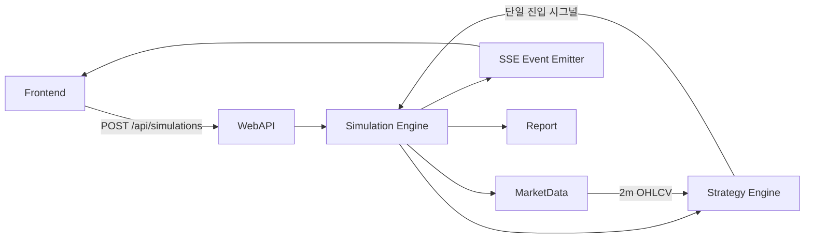

# 고수준 설계 문서 (HLD)
# High-Level Design Document

| 항목 | 내용 |
|------|------|
| **문서 버전** | 1.3.0 |
| **작성일** | 2026-02-16 |
| **기반 문서** | SRS v1.3.0, 유저스토리 v1.3.0, 사용자 인터뷰 (2026-02-15, 2026-02-16) |
| **티켓** | TICKET-085 |

---

## v1.3.0 버전 증가 근거 (Minor: 1.2.0 → 1.3.0)

- v1.2.0 아키텍처(전략 1/2/3/A/B/C)를 유지하면서 전략D(다중 종목 동시 모니터링) 기능을 증분 확장했다.
- 기존 계약을 최대한 유지하되, 전략D 입력/실행 경로에 필요한 인터페이스 확장을 추가했다.
- 신규 기능 추가(Feature Addition)에 해당하므로 Minor 버전으로 증가했다.

---

## v1.3.0 변경 로그 (요약)

- 전략D(2분봉, 09:03 기준가, 다중 종목 1~20 동시 모니터링) 아키텍처 흐름 반영
- Strategy/Simulation/WebAPI/Frontend 계약 영향 명시
- MarketData interval 확장(`2m`) 및 전략D 후보 종목 선택 규칙(동시 후보 시 우선순위 1건) 반영
- Module Decomposition 섹션에 영향 모듈, 의존성, LLD 티켓 분할 순서 명시
- SRS v1.3.0 추적 매트릭스(FR-019, CON-009~011, BR-011) 반영

---

## 1. 서론

### 1.1 목적

본 문서는 SRS v1.3.0의 신규 요구사항 `FR-019`(전략D)을 충족하기 위한 고수준 아키텍처 변경점을 정의한다. 특히 전략D 도입에 따른 모듈 경계, 모듈 간 계약, LLD 분할 가능 단위를 명확히 제시한다.

### 1.2 범위

- **계승 범위**: v1.2.0 HLD의 아키텍처 원칙, 기존 전략(1/2/3/A/B/C), 배포 구조
- **신규 범위**: 전략D 실행 흐름, 다중 종목 입력 계약, 2분봉 데이터 흐름, 모듈 인터페이스 확장
- **비범위**: 구현 세부 알고리즘/클래스 내부 로직(LLD에서 정의)

### 1.3 참조 문서

| 문서 | 경로 | 설명 |
|------|------|------|
| SRS v1.3.0 | docs/srs/srs-v1.3.0.md | 전략D 요구사항(FR-019), 제약(CON-009~011), 규칙(BR-011) |
| HLD v1.2.0 | docs/hld/hld-v1.2.0.md | 직전 아키텍처 기준선 |
| 유저스토리 v1.3.0 | docs/userstory/userstory-v1.3.0.md | US-021 포함 |

---

## 2. 전략D 아키텍처 개요

### 2.1 전략D 핵심 실행 흐름

1. 사용자는 전략D와 모니터링 종목 목록(1~20개)을 입력한다.
2. 시뮬레이션 엔진은 종목별 2분 분봉(`2m`) 데이터를 조회한다.
3. 전략D는 종목별 09:03 기준가를 초기화하고, 기준가 대비 1% 하락 이후 전저점 추적을 시작한다.
4. 종목별 전저점 대비 0.2% 반등 후보를 판정한다.
5. 동일 시점 복수 후보 시 우선순위상 첫 번째 종목 1건만 매수한다.
6. 매수 후 매도는 기존 이익보전 매도 계약(수익 1% 이후 이익보전율 80% 이하)을 재사용한다.

### 2.2 상위 모듈 흐름 (전략D)



---

## 3. 모듈 구조 (Module Decomposition)

### 3.1 영향 모듈 요약

| 모듈 | 영향도 | 전략D 반영 포인트 | 주요 의존 |
|------|--------|------------------|----------|
| Strategy | **High** | 전략D 클래스 추가, 다중 종목 후보 평가, 우선순위 1건 선택 | MarketData, Simulation 상태 |
| Simulation | **High** | 다중 종목 루프, 단일 포지션/매수-매도 교대 제약 집행 | Strategy, MarketData, EventEmitter |
| MarketData | **Medium** | `interval=2m` 조회 계약 확장, 종목 목록 배치 조회 경로 | Yahoo Finance API |
| WebAPI | **Medium** | 전략D 입력 스키마 확장(`symbols`), 검증 규칙 확장 | Simulation |
| Frontend | **Medium** | 전략D 선택 시 종목 다중 입력 UI/요청 payload 분기 | WebAPI |
| Report | **Low** | 전략D 식별자/입력 종목 목록 메타 저장 및 조회 확장 | Simulation 결과 |

### 3.2 모듈 의존성 및 경계

| 순서 | 모듈 | 선행 의존성 | LLD 분할 단위 |
|------|------|-------------|---------------|
| 1 | Strategy | 없음(도메인 규칙 정의 기준) | 전략D 규칙/상태 모델/후보선택 규칙 |
| 2 | MarketData | 없음(외부 API 계약) | `2m` 조회/종목 목록 조회 인터페이스 |
| 3 | Simulation | Strategy, MarketData | 거래일 루프/포지션 제약/단일 체결 선택 |
| 4 | WebAPI | Simulation | 요청 스키마/검증/에러 계약 |
| 5 | Frontend | WebAPI | 전략D 입력 UX/요청 매핑/모니터링 표시 |
| 6 | Report | Simulation | 전략D 메타(종목 목록/실행전략) 표시 |

### 3.3 LLD 티켓 분할용 의존성 체인

- **권장 순서**: `Strategy → MarketData → Simulation → WebAPI → Frontend → Report`
- **분할 이유**:
  - Strategy/MarketData가 전략D 판단 입력을 정의해야 Simulation 계약이 확정된다.
  - Simulation 입력/출력 계약이 확정되어야 WebAPI 스키마가 고정된다.
  - WebAPI 스키마가 고정되어야 Frontend 폼/검증/요청 매핑이 안정화된다.
  - Report는 Simulation 산출 메타를 소비하므로 마지막 분할이 위험이 가장 낮다.

---

## 4. 모듈 간 인터페이스/계약 영향

### 4.1 Strategy 모듈 계약 영향 (필수)

| 항목 | v1.2.0 | v1.3.0 (전략D) | 호환성 |
|------|--------|---------------|--------|
| 전략 식별자 | 6종 (1/2/3/A/B/C) | 7종 (+ `two_minute_multi_symbol_buy_trailing_then_sell_trailing`) | 확장(비파괴) |
| 입력 캔들 | 단일 종목 5m/3m 중심 | 다중 종목 2m 캔들 집합 지원 | 확장 |
| 매수 판정 | 전략별 단일 종목 판정 | 종목별 후보 계산 후 우선순위 1건 선택 | 의미 확장 |
| 운용 제약 | A/B/C 손절 미적용, 교대 매매 | D에도 동일 적용(손절 미적용, 교대 매매) | 재사용 |

**계약 원칙**:
- 전략D는 "다중 입력 → 단일 매수 시그널(또는 미체결)" 계약을 반환한다.
- 매도 계약은 기존 Trailing Stop 계약을 재사용하여 공통성을 유지한다.

### 4.2 Simulation 모듈 계약 영향 (필수)

| 항목 | v1.2.0 | v1.3.0 (전략D) | 비고 |
|------|--------|---------------|------|
| 실행 입력 | `symbol`, `strategy` | `strategy`, `symbol`(기존) 또는 `symbols[1..20]`(전략D) | 전략별 분기 |
| 데이터 단위 | 단일 종목/거래일 루프 | 다중 종목 동시 스캔 + 단일 포지션 집행 | FR-019 대응 |
| 체결 정책 | 전략별 시그널 그대로 체결 | 동시 후보 중 1건만 체결 | CON-010 대응 |
| 제약 집행 | 연속 매수 방지 일부 전략 적용 | 전략D 포함 공통 집행 | CON-006,007 계승 |

### 4.3 WebAPI 모듈 계약 영향 (필수)

#### 요청 계약 (`POST /api/simulations`)

```json
{
  "strategy": "two_minute_multi_symbol_buy_trailing_then_sell_trailing",
  "symbols": ["005930.KS", "000660.KS", "035420.KS"]
}
```

| 필드 | 타입 | 필수 | 검증 |
|------|------|------|------|
| `strategy` | string | Y | 전략 enum 포함 여부 |
| `symbol` | string | 조건부 | 전략 1/2/3/A/B/C에서 필수 |
| `symbols` | string[] | 조건부 | 전략D에서 필수, 길이 1~20, 각 원소는 `^[0-9]{6}\\.KS$` |

**응답/에러 계약 영향**:
- 기존 응답 형식 유지 + 전략D 실행 시 입력 종목 목록 메타를 상태 조회/결과 조회에 포함한다.
- 신규 검증 에러 코드 예시: `INVALID_SYMBOLS_COUNT`, `INVALID_SYMBOLS_FORMAT`, `SYMBOLS_REQUIRED_FOR_STRATEGY_D`.

### 4.4 Frontend 모듈 계약 영향 (필수)

| 항목 | v1.2.0 | v1.3.0 (전략D) |
|------|--------|---------------|
| 전략 선택 옵션 | 1/2/3/A/B/C | 1/2/3/A/B/C/D |
| 입력 컴포넌트 | 단일 종목 입력 | 전략D 선택 시 다중 종목 입력(최대 20) |
| 요청 payload | `{symbol, strategy}` | 전략D는 `{symbols, strategy}` |
| 유효성 메시지 | 단일 종목 포맷 중심 | 종목 수(1~20), 종목 포맷, 중복 입력 검증 추가 |

### 4.5 기타 영향 모듈 계약

| 모듈 | 계약 영향 |
|------|-----------|
| MarketData | `fetch_market_data`가 `interval=2m` 및 다중 종목 조회 경로를 지원해야 한다. |
| Report | 보고서 메타에 `strategy=D`, `input_symbols[]`, `selected_symbol`(실체결 종목) 저장/노출 계약이 필요하다. |

---

## 5. 데이터/이벤트 흐름 변경점

### 5.1 전략D 이벤트 추가

| 이벤트 | 설명 | 소비 모듈 |
|--------|------|----------|
| `candidate_detected` | 종목별 매수 후보 조건 충족 감지 | Frontend 모니터링 |
| `candidate_selected` | 동시 후보 중 최종 선택된 1건 | Frontend 모니터링 |
| `trade` | 최종 매수/매도 체결 | Frontend/Report |

### 5.2 상태 모델 영향

- 종목별 상태: `reference_price_0903`, `drop_triggered`, `lowest_price_since_trigger`
- 포지션 전역 상태: `has_open_position`, `last_trade_side`
- 스케줄 제약: 전략D는 당일 손절 스케줄을 사용하지 않는다.

---

## 6. SRS v1.3.0 요구사항 추적 매트릭스

### 6.1 신규/변경 요구사항 매핑

| SRS 항목 | HLD 반영 위치 | 반영 내용 |
|----------|---------------|-----------|
| FR-019 | 2장, 3장, 4장, 5장 | 전략D 다중 종목 2분봉 아키텍처, 모듈/계약 영향 정의 |
| CON-009 | 3.1, 4.3, 4.4 | 모니터링 종목 수 1~20 검증/입력 계약 반영 |
| CON-010 | 2.1, 4.1, 4.2, 5.1 | 동시 후보 시 1건 선택 체결 규칙 반영 |
| CON-011 | 2.1, 4.5 | 2분봉·09:03 기준가 강제 규칙 반영 |
| BR-011 | 2.1, 4.1, 4.2 | 전략D 매수/매도 규칙을 Strategy/Simulation 계약으로 매핑 |

### 6.2 계승 요구사항 처리

- FR-001~FR-018, NFR-001~NFR-008의 기존 HLD 매핑은 `hld-v1.2.0`을 기준선으로 계승한다.
- 본 문서는 전략D 증분(Delta) 중심으로 기술하며, 계승 요구사항은 변경 없는 범위에서 유효하다.

---

## 변경 이력

| 버전 | 날짜 | 변경 내용 | 작성자 |
|------|------|----------|--------|
| 1.3.0 | 2026-02-16 | SRS v1.3.0 반영(전략D, 2분봉/다중 종목, 모듈 분해·의존성·계약 영향·LLD 분할 순서 정의) | HLD 담당 에이전트 |
| 1.2.0 | 2026-02-16 | SRS v1.2.0 반영(전략C, 3분봉/09:03 기준가 흐름, StrategyRegistry·WebAPI·Frontend 계약 영향) | HLD 담당 에이전트 |
| 1.1.0 | 2026-02-16 | SRS v1.1.0 반영(전략A/B, 전략 확장 인터페이스 영향) | HLD 담당 에이전트 |
| 1.0.0 | 2026-02-15 | 최초 작성 | HLD 담당 에이전트 |
