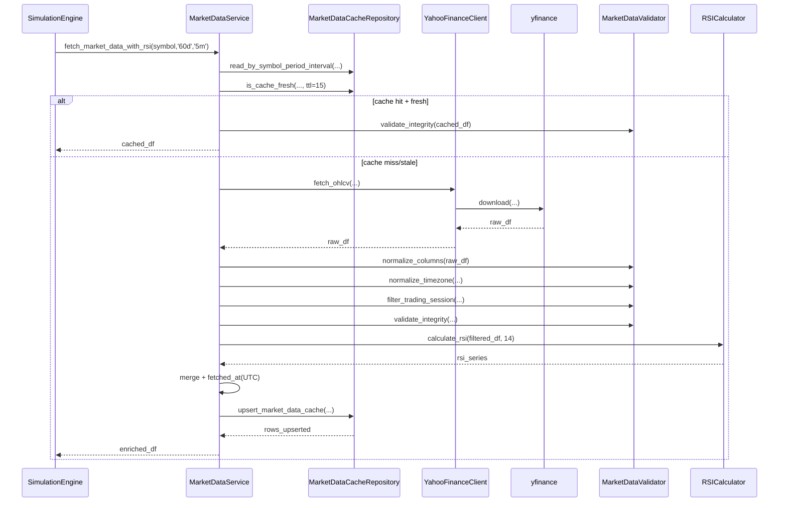
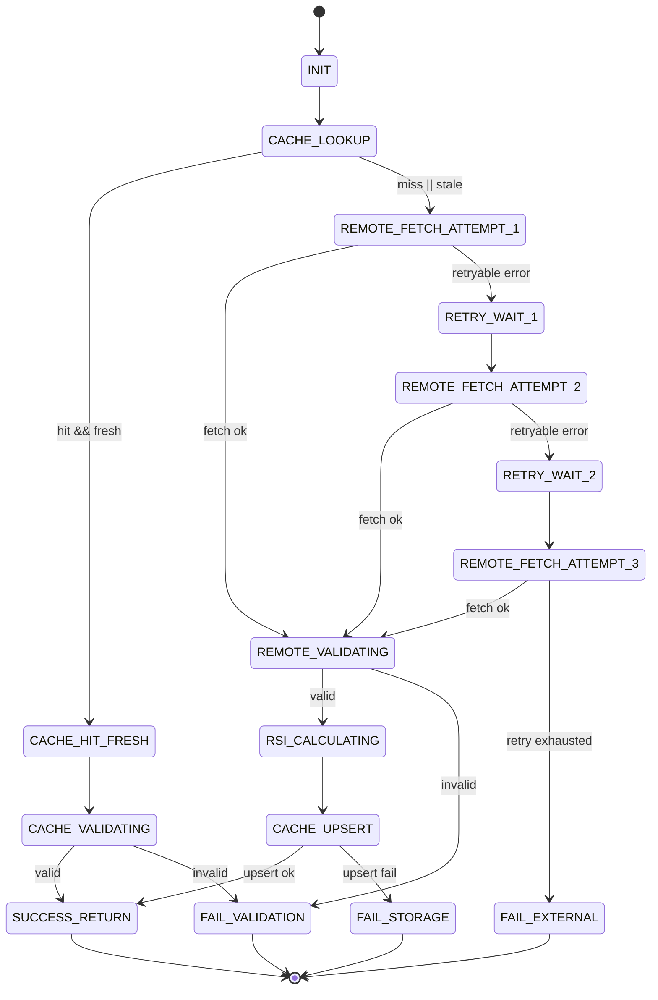

# 구현수준 설계 문서 (ILD)
# Implementation-Level Design Document - MARKETDATA

| 항목 | 내용 |
|------|------|
| **문서 버전** | 1.0.0 |
| **작성일** | 2026-02-16 |
| **대상 모듈** | MARKETDATA (시세 데이터 수집 모듈) |
| **기반 문서** | LLD MARKETDATA v1.0.0, HLD v1.0.0 (4.2, 5.1, 8.2.3), SRS v1.0.0 (FR-001, FR-002) |
| **관련 티켓** | TICKET-010-ILD-MARKETDATA |

---

## 목차

1. [목적 및 범위](#1-목적-및-범위)
2. [구현 단위/파일 구조](#2-구현-단위파일-구조)
3. [외부 의존성 호출 명세 (함수/파라미터/반환)](#3-외부-의존성-호출-명세-함수파라미터반환)
4. [컴포넌트 구현 계약 (클래스/함수 레벨)](#4-컴포넌트-구현-계약-클래스함수-레벨)
5. [정상 처리 시퀀스 (내부 호출 순서)](#5-정상-처리-시퀀스-내부-호출-순서)
6. [상태 전이 상세](#6-상태-전이-상세)
7. [에러 코드/예외 매핑 및 복구 시나리오](#7-에러-코드예외-매핑-및-복구-시나리오)
8. [데이터 정규화/검증 구현 규칙](#8-데이터-정규화검증-구현-규칙)
9. [캐시 저장소 구현 상세 (SQLite)](#9-캐시-저장소-구현-상세-sqlite)
10. [실행 가능한 언어 중립 수도코드](#10-실행-가능한-언어-중립-수도코드)
11. [요구사항/설계 추적성 매트릭스 (SRS + LLD)](#11-요구사항설계-추적성-매트릭스-srs--lld)
12. [구현 체크리스트 (주니어 개발자용)](#12-구현-체크리스트-주니어-개발자용)

---

## 1. 목적 및 범위

### 1.1 목적

본 문서는 `lld-marketdata-v1.0.0.md`를 코드로 구현하기 위한 **구현 수준(ILD)** 명세를 제공한다. 특히 `YahooFinanceClient`, `RSICalculator`, `MarketDataService`, `MarketDataCacheRepository`의 함수 시그니처, 예외 모델, 상태 전이, SQL 실행 순서를 명시하여 초급 개발자가 공식 문서 없이도 구현 가능하도록 한다.

### 1.2 범위 (In-Scope)

- Yahoo Finance 5분 분봉 조회 구현 (`period='60d'`, `interval='5m'`)
- OHLCV 정규화/검증/거래시간 필터 구현
- RSI(14, Wilder EWM) 계산 구현
- `market_data_cache` 조회/Upsert/최신성(TTL 15분) 구현
- 재시도(최대 3회)/백오프(1s, 2s, 4s)/타임아웃 처리
- 예외 코드 표준화 및 상위 모듈 전달 규칙

### 1.3 비범위 (Out-of-Scope)

- 전략 매수/매도 판단 로직
- 시뮬레이션 루프 제어
- REST/SSE API 라우팅
- 다중 종목 병렬 튜닝

---

## 2. 구현 단위/파일 구조

다음 구조를 기준으로 구현한다.

```text
src/
  marketdata/
    __init__.py
    constants.py
    errors.py
    models.py
    yahoo_finance_client.py
    rsi_calculator.py
    market_data_validator.py
    market_data_service.py
    market_data_cache_repository.py
```

### 2.1 파일별 책임

| 파일 | 주요 책임 |
|------|-----------|
| `constants.py` | 기본 파라미터 (`DEFAULT_PERIOD`, `DEFAULT_INTERVAL`, `DEFAULT_TIMEOUT_SEC`, `CACHE_TTL_MIN`) |
| `errors.py` | 도메인 예외 및 에러코드 상수 정의 |
| `models.py` | 입력/출력 DTO, 타입 힌트 (`MarketDataRequest`, `CacheFreshness`) |
| `yahoo_finance_client.py` | yfinance 호출 캡슐화 + 원격 오류 표준화 |
| `rsi_calculator.py` | RSI(14) 계산 및 범위 보정 |
| `market_data_validator.py` | 필수 컬럼/무결성/거래시간 필터 검증 |
| `market_data_cache_repository.py` | SQLite read/upsert/is_fresh 쿼리 실행 |
| `market_data_service.py` | 캐시/원격 조회 오케스트레이션 + 재시도/백오프 |

---

## 3. 외부 의존성 호출 명세 (함수/파라미터/반환)

### 3.1 `yfinance` 호출 계약

| 호출 함수 | 파라미터 | 반환 | 예외 변환 규칙 |
|----------|----------|------|----------------|
| `yfinance.download(...)` | `tickers: str`, `period: str='60d'`, `interval: str='5m'`, `auto_adjust: bool=True`, `threads: bool=False`, `progress: bool=False`, `timeout: int=10` | `pandas.DataFrame` (`Open,High,Low,Close,Volume`) | Timeout/네트워크 → `ExternalAPIError(code='E-MD-006')`, 빈 DF → `NoDataError(code='E-MD-005')` |

### 3.2 `pandas`/`numpy` 사용 계약

| 라이브러리 함수 | 사용 위치 | 입력 | 반환 | 구현 규칙 |
|----------------|-----------|------|------|-----------|
| `DataFrame.rename(columns=...)` | 정규화 | Yahoo 원본 DF | 내부 표준 컬럼 DF | `Open→open` 등 소문자 매핑 |
| `DatetimeIndex.tz_convert('Asia/Seoul')` | 타임존 변환 | tz-aware index | tz-aware index | 원본 tz-aware인 경우만 사용 |
| `DatetimeIndex.tz_localize('Asia/Seoul')` | 타임존 보정 | tz-naive index | tz-aware index | tz-naive인 경우만 사용 |
| `DataFrame.between_time('09:00', '15:30')` | 거래시간 필터 | KST index DF | 필터된 DF | 분 경계(`minute % 5 == 0`) 추가 검증 필요 |
| `Series.diff()` | RSI | 종가 시리즈 | 변동폭 시리즈 | 첫 값 NaN 허용 |
| `Series.clip(lower=0)` | RSI gain/loss | delta 시리즈 | gain/loss 시리즈 | 음수/양수 분리 |
| `Series.ewm(alpha=1/period, adjust=False).mean()` | RSI | gain/loss 시리즈 | avg_gain/avg_loss | Wilder 방식 고정 |
| `Series.clip(0, 100)` | RSI 보정 | RSI 시리즈 | 0~100 시리즈 | 부동소수 오차 보정 |

### 3.3 `sqlite3` 호출 계약

| 호출 함수 | 파라미터 | 반환 | 실패 시 |
|----------|----------|------|---------|
| `Connection.execute(sql, params)` | 단건 select/insert/update | `Cursor` | `StorageError(code='E-MD-011')` |
| `Connection.executemany(sql, seq_of_params)` | 대량 upsert | `Cursor` | `StorageError(code='E-MD-011')` |
| `Connection.commit()` | - | `None` | commit 실패 시 rollback 후 `StorageError` |
| `Connection.rollback()` | - | `None` | rollback 실패는 로그만 남기고 원 예외 유지 |

### 3.4 표준 라이브러리 호출 계약

| 호출 함수 | 목적 | 규칙 |
|----------|------|------|
| `time.sleep(seconds)` | 백오프 대기 | 재시도 실패 시 `1,2,4`초 적용 |
| `datetime.now(ZoneInfo('Asia/Seoul'))` | 최신성 판단 | `is_cache_fresh` 입력 시각 |
| `datetime.now(timezone.utc)` | `fetched_at` 기록 | UTC ISO8601 문자열 저장 |

---

## 4. 컴포넌트 구현 계약 (클래스/함수 레벨)

### 4.1 `YahooFinanceClient`

#### 4.1.1 공개 메서드

| 메서드 | 파라미터 | 반환 | 발생 예외 |
|--------|----------|------|-----------|
| `fetch_ohlcv(symbol, period='60d', interval='5m', auto_adjust=True, timeout_sec=10)` | `symbol: str`, `period: str`, `interval: str`, `auto_adjust: bool`, `timeout_sec: int` | `DataFrame` (index=`timestamp`) | `ValidationError`, `NoDataError`, `ExternalAPIError` |

#### 4.1.2 내부 구현 포인트

1. 심볼 형식 검증: `^[0-9]{6}\.KS$` 미충족 시 `ValidationError(E-MD-001)`.
2. `yfinance.download` 호출은 `threads=False`, `progress=False` 고정.
3. MultiIndex 컬럼 수신 시 단일 레벨로 평탄화 후 표준 컬럼만 유지.
4. 결과 DF가 비어 있으면 즉시 `NoDataError(E-MD-005)`.

### 4.2 `RSICalculator`

#### 4.2.1 공개 메서드

| 메서드 | 파라미터 | 반환 | 발생 예외 |
|--------|----------|------|-----------|
| `calculate_rsi(candles_df, period=14)` | `candles_df: DataFrame`, `period: int` | `Series[float]` | `ValidationError`, `CalculationError` |

#### 4.2.2 내부 구현 포인트

1. `close` 컬럼 누락 시 `ValidationError(E-MD-003)`.
2. `len(candles_df) < period + 1`이면 길이 동일 NaN 시리즈 반환(예외 아님).
3. `avg_gain=avg_loss=0` 구간은 RSI=50, `avg_loss=0`은 RSI=100.
4. 최종 결과 `clip(0, 100)`.

### 4.3 `MarketDataValidator`

| 메서드 | 역할 | 실패 예외 |
|--------|------|-----------|
| `normalize_columns(df)` | 컬럼 소문자 표준화 + timestamp index 보장 | `ValidationError(E-MD-003)` |
| `normalize_timezone(df)` | KST tz-aware 변환 | `ValidationError(E-MD-010)` |
| `filter_trading_session(df)` | 평일/장시간/5분 경계 필터 | 필터 후 0건 시 `NoDataError(E-MD-005)` |
| `validate_integrity(df)` | NaN/가격범위/거래량/정렬 검증 | `ValidationError(E-MD-004)`, `DataIntegrityError(E-MD-009)` |

### 4.4 `MarketDataCacheRepository`

| 메서드 | 파라미터 | 반환 | 발생 예외 |
|--------|----------|------|-----------|
| `read_by_symbol_period_interval(symbol, from_ts, to_ts)` | 심볼/기간 범위 | `DataFrame` | `StorageError(E-MD-011)` |
| `get_latest_timestamp(symbol)` | 심볼 | `datetime?` | `StorageError` |
| `is_cache_fresh(symbol, now_kst, ttl_min=15)` | 심볼/현재시각 | `bool` | `StorageError` |
| `upsert_market_data_cache(symbol, rows, fetched_at_utc)` | 심볼/레코드 리스트/수집시각 | `int`(rowcount) | `StorageError` |

### 4.5 `MarketDataService`

| 메서드 | 파라미터 | 반환 | 발생 예외 |
|--------|----------|------|-----------|
| `fetch_market_data_with_rsi(symbol, period='60d', interval='5m')` | 심볼/기간/간격 | `DataFrame` (`timestamp,open,high,low,close,volume,rsi,fetched_at`) | `ValidationError`, `NoDataError`, `ExternalAPIError`, `DataIntegrityError`, `StorageError` |

#### 4.5.1 처리 정책

1. 캐시 적중+최신이면 캐시 반환(검증 후).
2. 캐시 미스/오래됨이면 원격 조회.
3. 원격 성공 시 검증 → RSI 계산 → merge → upsert → 반환.
4. 원격 오류는 최대 3회 재시도(백오프 1/2/4초).
5. 재시도 종료 후 `ExternalAPIError(E-MD-008)`로 표준화.

---

## 5. 정상 처리 시퀀스 (내부 호출 순서)



---

## 6. 상태 전이 상세

### 6.1 서비스 상태 머신



### 6.2 상태별 불변 조건

| 상태 | 불변 조건 |
|------|-----------|
| `CACHE_HIT_FRESH` | 캐시 데이터 존재 + `max(timestamp) >= now_kst - 15분` |
| `REMOTE_VALIDATING` | 표준 컬럼(`open~volume`)과 KST index 보유 |
| `RSI_CALCULATING` | `close` 컬럼 존재, 길이 확인 완료 |
| `CACHE_UPSERT` | `rsi`, `fetched_at` 포함 레코드 준비 완료 |

---

## 7. 에러 코드/예외 매핑 및 복구 시나리오

### 7.1 에러 코드 매핑

| 코드 | 예외 타입 | 발생 지점 | 상위 전달 메시지 키 | 재시도 |
|------|-----------|-----------|---------------------|--------|
| `E-MD-001` | `ValidationError` | 심볼 형식 오류 | `invalid_symbol_format` | 아니오 |
| `E-MD-002` | `ValidationError` | period/interval 미지원 | `invalid_period_or_interval` | 아니오 |
| `E-MD-003` | `ValidationError` | 필수 컬럼 누락 | `missing_required_columns` | 아니오 |
| `E-MD-004` | `ValidationError` | NaN/정렬/중복 timestamp 위반 | `invalid_market_data_structure` | 아니오 |
| `E-MD-005` | `NoDataError` | 빈 DF 또는 필터 후 0건 | `no_market_data` | 아니오 |
| `E-MD-006` | `ExternalAPIError` | timeout/network 일시 장애 | `yahoo_api_temporary_failure` | 예 (최대 3회) |
| `E-MD-007` | `ExternalAPIError` | Yahoo 응답 포맷 불일치 | `yahoo_api_unexpected_payload` | 예 (최대 3회) |
| `E-MD-008` | `ExternalAPIError` | 재시도 소진 | `yahoo_api_retry_exhausted` | 아니오 |
| `E-MD-009` | `DataIntegrityError` | `high<low`, 음수 volume, 범위 위반 | `market_data_integrity_violation` | 아니오 |
| `E-MD-010` | `ValidationError` | 타임존 변환 실패 | `timezone_normalization_failed` | 아니오 |
| `E-MD-011` | `StorageError` | SQLite 읽기/쓰기 실패 | `market_data_cache_storage_failed` | 조건부(쓰기 1회 재시도 가능) |
| `E-MD-012` | `CalculationError` | RSI 계산 실패 | `rsi_calculation_failed` | 아니오 |

### 7.2 복구 시나리오

| 시나리오 | 감지 조건 | 복구 동작 | 최종 결과 |
|----------|-----------|-----------|-----------|
| Yahoo timeout | `TimeoutError` | 백오프 후 재호출 (`1s→2s→4s`) | 성공 시 정상 반환, 실패 시 `E-MD-008` |
| 일시적 네트워크 장애 | 연결 실패/리셋 | timeout과 동일 재시도 정책 | 동일 |
| Yahoo 포맷 흔들림 | 필수 컬럼 미포함 | 같은 시도 내 표준화 재검사 후 실패 시 재시도 | 3회 실패 시 `E-MD-008` |
| 데이터 무결성 위반 | 가격/거래량 제약 위반 | 재시도 없이 즉시 실패 | `E-MD-009` 전파 |
| 캐시 upsert 실패 | SQLite write 예외 | 동일 트랜잭션 1회 재시도 후 rollback | 실패 시 `E-MD-011` |
| RSI 계산 실패 | 수치 계산 예외 | 해당 요청 실패 처리 | `E-MD-012` |

### 7.3 예외 전파 규칙

1. `MarketDataService`는 내부 저수준 예외를 도메인 예외로 통일해 던진다.
2. 동일 오류 코드(`code`)를 유지하여 WEBAPI 계층에서 메시지 매핑 가능하게 한다.
3. 재시도 종료 시 마지막 원인 예외를 `cause` 체인으로 보존한다.

---

## 8. 데이터 정규화/검증 구현 규칙

### 8.1 컬럼 정규화

| Yahoo 컬럼 | 내부 컬럼 | 타입 변환 |
|-----------|----------|-----------|
| `Open` | `open` | `float64` |
| `High` | `high` | `float64` |
| `Low` | `low` | `float64` |
| `Close` | `close` | `float64` |
| `Volume` | `volume` | `int64` |

### 8.2 타임존/시간 필터

1. 인덱스가 tz-aware: `tz_convert('Asia/Seoul')`.
2. 인덱스가 tz-naive: `tz_localize('Asia/Seoul')`.
3. 평일만 허용: `weekday in [0..4]`.
4. 시간대 허용: `09:00 <= time <= 15:30`.
5. 분 경계: `minute % 5 == 0`.

### 8.3 무결성 검증 조건

| 규칙 | 판정식 | 실패 예외 |
|------|--------|-----------|
| 빈 데이터 | `len(df)==0` | `NoDataError(E-MD-005)` |
| 필수 컬럼 | `open,high,low,close,volume` 포함 | `ValidationError(E-MD-003)` |
| NaN 금지 | 필수 컬럼 NaN 0건 | `ValidationError(E-MD-004)` |
| 가격 역전 금지 | `high >= low` | `DataIntegrityError(E-MD-009)` |
| open/close 범위 | `low <= open,close <= high` | `DataIntegrityError(E-MD-009)` |
| 거래량 음수 금지 | `volume >= 0` | `DataIntegrityError(E-MD-009)` |
| 시계열 정렬 | 단조 증가 + 중복 없음 | `ValidationError(E-MD-004)` |

---

## 9. 캐시 저장소 구현 상세 (SQLite)

### 9.1 테이블/키 정책

- 테이블: `market_data_cache`
- 기본키: `(symbol, timestamp)`
- 조회 인덱스: `(symbol, timestamp)`
- 최신성: `max(timestamp) >= now_kst - 15분`

### 9.2 핵심 SQL

#### 9.2.1 범위 조회

```sql
SELECT symbol, timestamp, open, high, low, close, volume, rsi, fetched_at
FROM market_data_cache
WHERE symbol = ?
  AND timestamp BETWEEN ? AND ?
ORDER BY timestamp ASC;
```

#### 9.2.2 최신 시각 조회

```sql
SELECT MAX(timestamp) AS max_ts
FROM market_data_cache
WHERE symbol = ?;
```

#### 9.2.3 Upsert

```sql
INSERT INTO market_data_cache (
  symbol, timestamp, open, high, low, close, volume, rsi, fetched_at
) VALUES (?, ?, ?, ?, ?, ?, ?, ?, ?)
ON CONFLICT(symbol, timestamp) DO UPDATE SET
  open = excluded.open,
  high = excluded.high,
  low = excluded.low,
  close = excluded.close,
  volume = excluded.volume,
  rsi = excluded.rsi,
  fetched_at = excluded.fetched_at;
```

### 9.3 트랜잭션 규칙

1. `upsert_market_data_cache`는 단일 트랜잭션으로 처리한다.
2. `executemany` 성공 후 `commit`.
3. 예외 발생 시 `rollback` 후 `StorageError(E-MD-011)`.

---

## 10. 실행 가능한 언어 중립 수도코드

```text
function fetch_market_data_with_rsi(symbol, period='60d', interval='5m'):
    validate_symbol(symbol)                       # E-MD-001
    validate_query_params(period, interval)       # E-MD-002

    now_kst = now('Asia/Seoul')
    from_ts, to_ts = resolve_range(now_kst, period, interval)

    cached_df = cache_repo.read_by_symbol_period_interval(symbol, from_ts, to_ts)
    if not cached_df.empty and cache_repo.is_cache_fresh(symbol, now_kst, ttl_min=15):
        validator.validate_integrity(cached_df)
        return cached_df

    max_attempts = 3
    backoff = [1, 2, 4]
    last_error = null

    for attempt in 1..max_attempts:
        try:
            raw_df = yahoo_client.fetch_ohlcv(symbol, period, interval, auto_adjust=true, timeout_sec=10)

            normalized_df = validator.normalize_columns(raw_df)
            normalized_df = validator.normalize_timezone(normalized_df)
            filtered_df = validator.filter_trading_session(normalized_df)
            validator.validate_integrity(filtered_df)

            rsi_series = rsi_calculator.calculate_rsi(filtered_df, period=14)
            enriched_df = merge(filtered_df, rsi_series as 'rsi')
            enriched_df['fetched_at'] = now_utc_iso8601()

            rows = to_cache_rows(symbol, enriched_df)
            cache_repo.upsert_market_data_cache(symbol, rows, enriched_df.fetched_at[0])

            return enriched_df

        except ExternalAPIError as e where e.code in ['E-MD-006', 'E-MD-007']:
            last_error = e
            if attempt < max_attempts:
                sleep(backoff[attempt - 1])
                continue
            raise ExternalAPIError(code='E-MD-008', cause=last_error)

        except (ValidationError, NoDataError, DataIntegrityError, CalculationError, StorageError) as e:
            raise e

    raise ExternalAPIError(code='E-MD-008', cause=last_error)
```

---

## 11. 요구사항/설계 추적성 매트릭스 (SRS + LLD)

| 추적 ID | SRS 요구사항 | LLD 반영 | ILD 구현 반영 | 충족 근거 |
|--------|---------------|----------|---------------|-----------|
| T-MD-001 | FR-001 코스피 5분 분봉 60일 조회 | LLD 2.1, 4.2, 7, 9 | ILD 3.1, 4.1, 8, 10 | `yfinance.download(period='60d', interval='5m')`, 컬럼/시간/무결성 검증 파이프라인 |
| T-MD-002 | FR-001 조회 실패 시 오류 처리 | LLD 6.1 | ILD 7.1~7.3, 10 | 에러코드 표준화(`E-MD-006~008`), 3회 재시도/백오프/최종 전파 |
| T-MD-003 | FR-002 RSI 14 산출 | LLD 2.2, 5.1~5.3 | ILD 3.2, 4.2, 10 | Wilder EWM, `period=14`, 경계값 처리(50/100), 범위 보정 |
| T-MD-004 | FR-002 RSI 전략 활용 가능한 형식 | LLD 4.4, 5.3 | ILD 4.5, 8.1, 10 | 반환 스키마에 `rsi` 컬럼 포함, timestamp align 보장 |
| T-MD-005 | 캐시/성능 보완 | LLD 8.2~8.4 | ILD 4.4, 9.1~9.3 | TTL(15분), `(symbol,timestamp)` PK 기반 범위 조회/Upsert |

---

## 12. 구현 체크리스트 (주니어 개발자용)

### 12.1 구현 순서

1. `errors.py`에 예외 타입 + 코드 정의 (`E-MD-001`~`E-MD-012`).
2. `constants.py`에 기본 파라미터 정의 (`60d`, `5m`, `10`, `15`).
3. `yahoo_finance_client.py` 구현 후 단위 테스트 작성.
4. `market_data_validator.py` 구현 후 실패 케이스 우선 테스트.
5. `rsi_calculator.py` 구현 후 경계 케이스(길이 부족/단조 상승/횡보) 테스트.
6. `market_data_cache_repository.py` SQL + 트랜잭션 구현.
7. `market_data_service.py` 오케스트레이션 + 재시도 로직 구현.
8. 서비스 통합 테스트로 전체 시퀀스 검증.

### 12.2 구현 완료 기준 (Definition of Done)

- 반환 스키마가 항상 `timestamp, open, high, low, close, volume, rsi, fetched_at` 포함
- 재시도 정책(3회, 1/2/4초)이 로그/테스트로 검증됨
- 오류 코드 매핑표 100% 구현됨
- FR-001/FR-002 추적 항목별 테스트 케이스 존재
- 캐시 hit/miss/stale 경로 모두 통과
