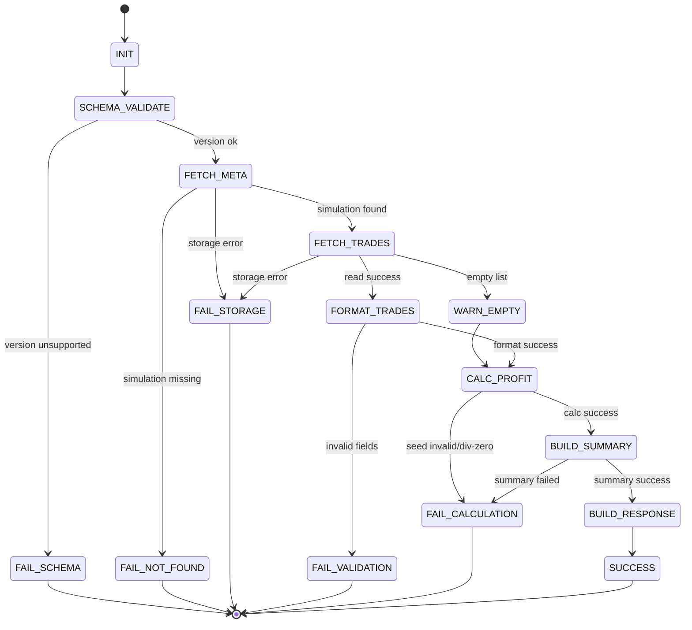

# 구현수준 설계 문서 (ILD)
# Implementation-Level Design Document - REPORT

| 항목 | 내용 |
|------|------|
| **문서 버전** | 1.0.0 |
| **작성일** | 2026-02-16 |
| **대상 모듈** | REPORT (결과 보고서 모듈) |
| **기반 문서** | LLD REPORT v1.0.0, HLD v1.0.0 (4.6, 5.1, 6.2, 8.2), SRS v1.0.0 (FR-013, FR-014, FR-015) |
| **관련 티켓** | TICKET-014-ILD-REPORT |

---

## 목차

1. [목적 및 범위](#1-목적-및-범위)
2. [구현 단위/파일 구조](#2-구현-단위파일-구조)
3. [API 연동 스키마 및 버전 호환 규칙](#3-api-연동-스키마-및-버전-호환-규칙)
4. [컴포넌트 구현 계약 (클래스/함수 레벨)](#4-컴포넌트-구현-계약-클래스함수-레벨)
5. [저장소 조회/영속성/트랜잭션 상세](#5-저장소-조회영속성트랜잭션-상세)
6. [정상 처리 시퀀스 (조회 → 포맷 → 집계 → 응답)](#6-정상-처리-시퀀스-조회--포맷--집계--응답)
7. [상태 전이 상세 (리포트 생성 상태 머신)](#7-상태-전이-상세-리포트-생성-상태-머신)
8. [에러 코드/예외 매핑 및 복구 시나리오](#8-에러-코드예외-매핑-및-복구-시나리오)
9. [실행 가능한 언어 중립 수도코드](#9-실행-가능한-언어-중립-수도코드)
10. [요구사항/설계 추적성 매트릭스 (SRS + LLD)](#10-요구사항설계-추적성-매트릭스-srs--lld)
11. [구현 체크리스트 (주니어 개발자용)](#11-구현-체크리스트-주니어-개발자용)

---

## 1. 목적 및 범위

### 1.1 목적

본 문서는 `lld-report-v1.0.0.md`를 실제 코드로 구현하기 위한 **구현 수준(ILD)** 명세를 제공한다. 특히 `ProfitCalculator`, `TradeHistoryFormatter`, `SummaryReportGenerator`, `ReportRepository`의 함수 단위 계약, 저장소 쿼리/트랜잭션 경계, API 응답 스키마 버전 호환, 오류 매핑/복구 정책을 코드 관점으로 고정하여 초급 개발자가 문서만으로 구현 가능하도록 한다.

### 1.2 범위 (In-Scope)

- FR-013 총 수익금/총 수익률 계산 및 표시 규칙 구현
- FR-014 거래내역 정렬/순번/표시 스키마 변환 구현
- FR-015 수익/손해/승률/거래통계 집계 및 종합 보고서 생성 구현
- SQLite 저장소 조회/필터/정렬/트랜잭션 경계 구현
- 빈 데이터/부분 누락/정합성 위반 데이터의 오류 전파 및 복구 정책 정의
- API 응답 버전(`schema_version`) 호환 정책 정의

### 1.3 비범위 (Out-of-Scope)

- 전략 신호 생성 및 체결 로직
- 시세 수집 및 RSI 계산 로직
- REST 라우터/HTTP 미들웨어 구현
- 프론트엔드 렌더링 구현

---

## 2. 구현 단위/파일 구조

다음 구조를 기준으로 구현한다.

```text
src/
  report/
    __init__.py
    constants.py
    errors.py
    models.py
    schema.py
    profit_calculator.py
    trade_history_formatter.py
    summary_report_generator.py
    report_repository.py
    report_service.py
```

### 2.1 파일별 책임

| 파일 | 주요 책임 |
|------|-----------|
| `constants.py` | 기본 시드값, 정밀도/절사/반올림 정책, 스키마 버전 상수 |
| `errors.py` | REPORT 도메인 예외 및 표준 에러코드 정의 |
| `models.py` | `ProfitSummary`, `TradeDetail`, `ReportSummary`, `ComprehensiveReport`, `ReportWarning` DTO |
| `schema.py` | API 응답 직렬화/역직렬화 계약, 버전 호환 검증 |
| `profit_calculator.py` | FR-013 금액/수익률 계산 및 검증 |
| `trade_history_formatter.py` | FR-014 정렬/순번/한글 사유 매핑/표시 포맷팅 |
| `summary_report_generator.py` | FR-015 통계 집계 및 보고서 조립 |
| `report_repository.py` | SQLite 조회/갱신/삭제, 트랜잭션 제어 |
| `report_service.py` | 리포트 생성 오케스트레이션, 오류 매핑, warning 수집 |

---

## 3. API 연동 스키마 및 버전 호환 규칙

### 3.1 API 응답 스키마 계약

#### 3.1.1 `ComprehensiveReportResponseV1`

| 필드 | 타입 | 필수 | 설명 |
|------|------|------|------|
| `schema_version` | string | Y | 고정값 `1.0` |
| `simulation_id` | string | Y | 시뮬레이션 ID |
| `symbol` | string | Y | 종목 심볼 |
| `strategy` | string | Y | 전략 식별자 |
| `period.start_date` | date | Y | 시작일 |
| `period.end_date` | date | Y | 종료일 |
| `profit_summary` | object | Y | FR-013 수익 요약 |
| `summary` | object | Y | FR-015 통계 |
| `trades` | list[TradeDetail] | Y | FR-014 거래 내역 |
| `warnings` | list[ReportWarning] | N | 부분 누락/정합성 경고 |

#### 3.1.2 `profit_summary`

| 필드 | 타입 | 규칙 |
|------|------|------|
| `initial_seed` | string(decimal) | 원 단위 정수 문자열 |
| `final_seed` | string(decimal) | 원 단위 정수 문자열 |
| `total_profit` | string(decimal) | `final_seed - initial_seed`, 원 단위 절사 |
| `total_profit_rate` | string(decimal) | 소수점 둘째 자리 반올림 |

#### 3.1.3 `summary`

| 필드 | 타입 | 규칙 |
|------|------|------|
| `total_trades` | int | 실거래 기준 |
| `profit_trades` | int | `net_profit > 0` |
| `loss_trades` | int | `net_profit < 0` |
| `flat_trades` | int | `net_profit = 0` |
| `no_trade_days` | int | `sell_reason in ('no_trade', 'error_skip')` |
| `total_profit_amount` | string(decimal) | 수익 거래 합계 |
| `total_loss_amount` | string(decimal) | 손해 거래 절대값 합계 |
| `win_rate` | string(decimal) | 소수점 둘째 자리 반올림 |

### 3.2 스키마 버전 호환 정책

| 정책 | 규칙 |
|------|------|
| 하위 호환 | `1.x` 범위에서 **필드 추가만 허용**, 기존 필드 삭제/타입 변경 금지 |
| 상위 호환 | 서버가 지원하지 않는 `schema_version` 요청 시 `406 REPORT_SCHEMA_NOT_SUPPORTED` |
| 기본 버전 | 요청 버전 미지정 시 `1.0` 적용 |
| 역직렬화 엄격도 | 필수 필드 누락은 실패, 알 수 없는 필드는 무시(로그 경고) |
| 정밀도 호환 | 금액/비율은 문자열 Decimal 직렬화 고정 (`float` 금지) |

### 3.3 API 오류 응답 매핑 규칙

| 내부 예외 | API 코드 | HTTP | 메시지 |
|----------|----------|------|--------|
| `ReportNotFoundError` | `SIMULATION_NOT_FOUND` | 404 | 시뮬레이션 결과를 찾을 수 없습니다 |
| `ReportValidationError` | `REPORT_VALIDATION_ERROR` | 422 | 보고서 입력 데이터가 유효하지 않습니다 |
| `ReportCalculationError` | `REPORT_CALCULATION_ERROR` | 500 | 보고서 계산 중 오류가 발생했습니다 |
| `StorageError` | `STORAGE_ERROR` | 500 | 저장소 처리 중 오류가 발생했습니다 |
| `SchemaVersionError` | `REPORT_SCHEMA_NOT_SUPPORTED` | 406 | 지원하지 않는 스키마 버전입니다 |

---

## 4. 컴포넌트 구현 계약 (클래스/함수 레벨)

### 4.1 `ProfitCalculator`

#### 4.1.1 공개 인터페이스

| 메서드 | 파라미터 | 반환 | 예외 |
|--------|----------|------|------|
| `calculate_profit_summary(initial_seed, final_seed)` | `Decimal, Decimal` | `ProfitSummary` | `ReportValidationError`, `ReportCalculationError` |
| `calculate_total_profit(initial_seed, final_seed)` | `Decimal, Decimal` | `Decimal` | `ReportValidationError` |
| `calculate_total_profit_rate(initial_seed, final_seed)` | `Decimal, Decimal` | `Decimal` | `ReportValidationError`, `ReportCalculationError` |
| `validate_seed_values(initial_seed, final_seed)` | `Decimal, Decimal` | `None` | `ReportValidationError` |

#### 4.1.2 함수 레벨 계약

| 함수 | 사전 조건 | 사후 조건 | 불변 조건 |
|------|-----------|-----------|-----------|
| `calculate_total_profit` | `initial_seed > 0`, `final_seed >= 0` | `result = final - initial` | Decimal 연산만 사용 |
| `calculate_total_profit_rate` | `initial_seed > 0` | `result = ((final-initial)/initial)*100` | 결과 scale=2 |
| `calculate_profit_summary` | seed 검증 통과 | `ProfitSummary` 필드 모두 채움 | 금액 절사/비율 반올림 규칙 준수 |

#### 4.1.3 정밀도 규칙

1. 내부 연산은 Decimal `prec >= 28`.
2. 금액은 `ROUND_DOWN`으로 원 단위 절사.
3. 비율은 `ROUND_HALF_UP`으로 소수점 둘째 자리 반올림.
4. `initial_seed <= 0`이면 즉시 `ReportValidationError(E-RP-001)`.

### 4.2 `TradeHistoryFormatter`

#### 4.2.1 공개 인터페이스

| 메서드 | 파라미터 | 반환 | 예외 |
|--------|----------|------|------|
| `format_trade_history(trades, include_no_trade=True, sort_order='asc')` | `list[TradeRecord], bool, str` | `list[TradeDetail]` | `ReportValidationError` |
| `sort_trade_records(records, sort_order='asc')` | `list[TradeRecord], str` | `list[TradeRecord]` | `ReportValidationError` |
| `assign_trade_sequence(sorted_records)` | `list[TradeRecord]` | `list[TradeRecord]` | - |
| `map_sell_reason(reason_code)` | `str` | `str` | `ReportValidationError` |
| `normalize_trade_record(record)` | `TradeRecord` | `TradeRecord` | `ReportValidationError` |

#### 4.2.2 함수 레벨 계약

| 함수 | 사전 조건 | 사후 조건 | 불변 조건 |
|------|-----------|-----------|-----------|
| `sort_trade_records` | `sort_order ∈ {'asc','desc'}` | 결정적 정렬 보장 | tie-break key 고정 |
| `assign_trade_sequence` | 정렬 완료된 입력 | `trade_id=1..N` 재부여 | 결측 없이 연속 증가 |
| `normalize_trade_record` | 필수 수치 필드 존재 | datetime/금액 포맷 정규화 | 원본 값 의미 보존 |
| `format_trade_history` | trades 목록(빈 목록 허용) | API 표준 스키마 `TradeDetail` 생성 | `buy_datetime NULL`은 끝으로 배치 |

#### 4.2.3 정렬 규칙

1. 기본 키: `(is_null(buy_datetime), buy_datetime, trade_date, trade_id)`.
2. `buy_datetime` 결측(`no_trade`, `error_skip`)은 ASC에서 마지막.
3. `sort_order='desc'` 시 datetime 키 역순, `trade_date/trade_id`는 결정성 유지를 위해 ASC 고정.
4. 날짜 표시는 `YYYY-MM-DD HH:mm` (KST).

### 4.3 `SummaryReportGenerator`

#### 4.3.1 공개 인터페이스

| 메서드 | 파라미터 | 반환 | 예외 |
|--------|----------|------|------|
| `generate_summary(trade_details, initial_seed, final_seed)` | `list[TradeDetail], Decimal, Decimal` | `ReportSummary` | `ReportValidationError`, `ReportCalculationError` |
| `calculate_trade_counters(trade_details)` | `list[TradeDetail]` | `dict` | `ReportValidationError` |
| `calculate_profit_loss_totals(trade_details)` | `list[TradeDetail]` | `dict` | `ReportCalculationError` |
| `calculate_win_rate(profit_trades, total_trades)` | `int, int` | `Decimal` | `ReportValidationError` |
| `build_comprehensive_report(meta, profit_summary, summary, trade_details, warnings)` | `SimulationMeta, ProfitSummary, ReportSummary, list[TradeDetail], list[ReportWarning]` | `ComprehensiveReport` | `ReportValidationError` |

#### 4.3.2 함수 레벨 계약

| 함수 | 사전 조건 | 사후 조건 | 불변 조건 |
|------|-----------|-----------|-----------|
| `calculate_trade_counters` | `sell_reason` 유효 | 카운트 필드 완전 생성 | 합계 일관성 유지 |
| `calculate_profit_loss_totals` | `net_profit` Decimal | 수익/손해 총액 산출 | 손해 총액은 절대값 |
| `calculate_win_rate` | `profit_trades >=0`, `total_trades >=0` | total=0이면 `0.00` | scale=2 |
| `generate_summary` | 입력 리스트 검증 완료 | FR-015 통계 일괄 생성 | NFR-005 합산 일치 |

#### 4.3.3 통계 계산 규칙

- `total_trades = profit_trades + loss_trades + flat_trades`
- `profit_trades = count(net_profit > 0 and real_trade)`
- `loss_trades = count(net_profit < 0 and real_trade)`
- `flat_trades = count(net_profit = 0 and real_trade)`
- `no_trade_days = count(sell_reason in ['no_trade','error_skip'])`
- `total_profit_amount = Σ(net_profit where net_profit > 0)`
- `total_loss_amount = Σ(abs(net_profit) where net_profit < 0)`
- `win_rate = 0.00 if total_trades == 0 else (profit_trades/total_trades)*100`

### 4.4 `ReportRepository`

#### 4.4.1 공개 인터페이스

| 메서드 | 파라미터 | 반환 | 예외 |
|--------|----------|------|------|
| `read_simulation_result(simulation_id)` | `str` | `SimulationResult?` | `StorageError` |
| `read_trade_records(simulation_id, include_no_trade=True, from_date=None, to_date=None, sort_order='asc')` | 조건 파라미터 | `list[TradeRecord]` | `StorageError` |
| `create_simulation_result(result)` | `SimulationResult` | `None` | `StorageError`, `DuplicateKeyError` |
| `create_trade_records(simulation_id, trades)` | `str, list[TradeRecord]` | `int` | `StorageError` |
| `update_simulation_summary(simulation_id, summary_fields)` | `str, dict` | `None` | `StorageError`, `NotFoundError` |
| `delete_simulation(simulation_id, hard_delete=False)` | `str, bool` | `int` | `StorageError` |
| `begin_transaction()` | - | `None` | `StorageError` |
| `commit()` | - | `None` | `StorageError` |
| `rollback()` | - | `None` | `StorageError` |

#### 4.4.2 함수 레벨 계약

| 함수 | 사전 조건 | 사후 조건 | 불변 조건 |
|------|-----------|-----------|-----------|
| `read_simulation_result` | simulation_id 비어있지 않음 | 결과 0/1건 | 단일키 조회 |
| `read_trade_records` | simulation_id 비어있지 않음 | 필터/정렬 적용 목록 | 결정적 정렬 |
| `create_trade_records` | 거래목록 스키마 유효 | rowcount 반환 | 동일 트랜잭션 원자성 |
| `update_simulation_summary` | 존재하는 simulation_id | 요약 필드 반영 | 부분갱신 허용 |
| `delete_simulation` | hard/soft 옵션 명시 | 삭제 건수 반환 | FK 무결성 유지 |

---

## 5. 저장소 조회/영속성/트랜잭션 상세

### 5.1 테이블 및 키

| 테이블 | 주요 필드 | 키 |
|--------|-----------|----|
| `simulations` | `simulation_id`, `symbol`, `strategy`, `start_date`, `end_date`, `initial_seed`, `final_seed`, `status`, `created_at`, `updated_at` | PK(`simulation_id`) |
| `trades` | `trade_id`, `simulation_id`, `trade_date`, `buy_datetime`, `sell_datetime`, `buy_amount`, `sell_amount`, `tax`, `fee`, `net_profit`, `profit_rate`, `sell_reason`, `seed_money_after` | PK(`trade_id`), FK(`simulation_id`) |

### 5.2 인덱스 정책

| 인덱스 | 정의 | 목적 |
|--------|------|------|
| `idx_trades_simulation_id` | `(simulation_id)` | 시뮬레이션별 기본 조회 |
| `idx_trades_sim_date` | `(simulation_id, trade_date)` | 기간 필터 최적화 |
| `idx_trades_sim_buydt` | `(simulation_id, buy_datetime)` | FR-014 시간순 정렬 최적화 |
| `idx_simulations_status` | `(status)` | 상태 기반 관리 조회 |

### 5.3 조회 SQL 규약

#### 5.3.1 시뮬레이션 메타 조회

```sql
SELECT
  simulation_id, symbol, strategy, start_date, end_date,
  initial_seed, final_seed, status
FROM simulations
WHERE simulation_id = :simulation_id
  AND deleted_at IS NULL;
```

#### 5.3.2 거래내역 조회(필터/정렬)

```sql
SELECT
  trade_id, simulation_id, trade_date,
  buy_datetime, buy_price, buy_quantity, buy_amount,
  sell_datetime, sell_price, sell_quantity, sell_amount,
  sell_reason, tax, fee, net_profit, profit_rate, seed_money_after
FROM trades
WHERE simulation_id = :simulation_id
  AND (:include_no_trade = 1 OR sell_reason NOT IN ('no_trade', 'error_skip'))
  AND (:from_date IS NULL OR trade_date >= :from_date)
  AND (:to_date   IS NULL OR trade_date <= :to_date)
ORDER BY
  CASE WHEN buy_datetime IS NULL THEN 1 ELSE 0 END ASC,
  CASE WHEN :sort_order = 'asc'  THEN buy_datetime END ASC,
  CASE WHEN :sort_order = 'desc' THEN buy_datetime END DESC,
  trade_date ASC,
  trade_id ASC;
```

### 5.4 영속성/트랜잭션 정책

1. `create_simulation_result` + `create_trade_records`는 동일 트랜잭션에서 처리한다.
2. 부분 실패 시 `rollback()`으로 전부 취소하고 `StorageError(E-RP-011)` 반환.
3. `update_simulation_summary`는 단일 트랜잭션으로 수행하며 rowcount=0이면 `NotFoundError(E-RP-012)`.
4. 조회는 읽기 전용 연결 사용, SQLite 기본 격리(`DEFERRED`) 기준.
5. 대량 insert는 `executemany` 배치 사용, 배치 크기 기본 500.

### 5.5 데이터 정합성 검증 규칙 (조회 후)

| 검증 항목 | 규칙 | 실패 처리 |
|----------|------|-----------|
| 거래수량 | `buy_quantity, sell_quantity >= 0` | 레코드 스킵 + warning |
| 금액 필드 | null 금지(실거래) | 레코드 스킵 + warning |
| 시간 순서 | `buy_datetime <= sell_datetime` | `error_skip` 변환 |
| 수익 계산 | `net_profit ≈ sell_amount - tax - fee - buy_amount` | warning 부여 후 원본 유지 |

---

## 6. 정상 처리 시퀀스 (조회 → 포맷 → 집계 → 응답)


### 6.1 처리 순서 고정 규칙

1. 스키마 버전 검증 실패 시 저장소 조회 금지.
2. 메타 조회 실패 시 거래 조회 금지.
3. 포맷팅 실패 시 집계/응답 생성 금지.
4. 집계 실패 시 부분 응답 금지(오류 응답).
5. warning은 실패 조건이 아니라 품질 신호로 응답에 포함.

---

## 7. 상태 전이 상세 (리포트 생성 상태 머신)



### 7.1 상태별 산출

| 상태 | 산출물 | 비고 |
|------|--------|------|
| `WARN_EMPTY` | `warnings += EMPTY_TRADES` | 통계는 0 기반 생성 |
| `FORMAT_TRADES` | `trade_details` | 부분 누락은 `PARTIAL_RECORD_SKIPPED` |
| `BUILD_SUMMARY` | `summary` | FR-015 지표 완성 |
| `SUCCESS` | `ComprehensiveReport` | `schema_version` 포함 |

---

## 8. 에러 코드/예외 매핑 및 복구 시나리오

### 8.1 표준 에러 코드

| 코드 | 예외 | 의미 |
|------|------|------|
| `E-RP-001` | `ReportValidationError` | 시드값/입력값 유효성 위반 |
| `E-RP-002` | `ReportValidationError` | 거래 레코드 필수 필드 누락 |
| `E-RP-003` | `ReportValidationError` | 잘못된 정렬 옵션 |
| `E-RP-004` | `ReportCalculationError` | 0 나누기/수익률 계산 실패 |
| `E-RP-005` | `ReportCalculationError` | 통계 합산 불일치 |
| `E-RP-006` | `SchemaVersionError` | 스키마 버전 미지원 |
| `E-RP-011` | `StorageError` | DB 조회/쓰기 실패 |
| `E-RP-012` | `NotFoundError` | 갱신 대상 없음 |

### 8.2 경고 코드

| 코드 | 조건 | 복구 정책 |
|------|------|-----------|
| `EMPTY_TRADES` | 거래내역 0건 | 200 응답 + 0 통계 |
| `ONLY_NO_TRADE_DAYS` | 모든 레코드가 `no_trade` | 200 응답 + `total_trades=0` |
| `PARTIAL_RECORD_SKIPPED` | 일부 레코드 필드 누락 | 문제 레코드 제외 후 집계 지속 |
| `INCONSISTENT_PROFIT_RETAINED` | `net_profit` 재검증 불일치 | 원본 유지 + 경고 플래그 |

### 8.3 시나리오별 복구 정책

| 시나리오 | 감지 조건 | 복구 | 최종 응답 |
|----------|-----------|------|-----------|
| 빈 결과 | `trades=[]` | 제로 통계 생성 | 200 |
| 부분 누락 | 일부 필드 null/역전 | 레코드 스킵 또는 `error_skip` 변환 | 200 + warning |
| 불일치 수익 | 계산식 불일치 | warning 기록, 원본 수치 우선 | 200 + warning |
| 초기시드 오류 | `initial_seed <= 0` | 복구 불가 | 500 |
| 저장소 장애 | SQL 예외 | 재시도 없음, 즉시 전파 | 500 |
| 스키마 미지원 | 요청 버전 미지원 | 기본버전 fallback 없음 | 406 |

### 8.4 에러 전파 규칙

1. Repository 예외는 Service에서 코드 매핑 후 API 계층으로 전파.
2. Formatter의 데이터 오류는 치명/비치명으로 분리:
   - 치명: 전체 레코드 포맷 불가 → 실패
   - 비치명: 일부 레코드 누락 → warning 후 계속
3. `EMPTY_TRADES`, `ONLY_NO_TRADE_DAYS`는 실패가 아니라 정상 도메인 결과로 처리.

---

## 9. 실행 가능한 언어 중립 수도코드

### 9.1 리포트 생성 진입점

```text
function generate_report(simulation_id, query):
    schema_version = query.schema_version or "1.0"
    validate_schema_version(schema_version)

    meta = repository.read_simulation_result(simulation_id)
    if meta is null:
        raise ReportNotFoundError("E-RP-012", "SIMULATION_NOT_FOUND")

    raw_trades = repository.read_trade_records(
        simulation_id=simulation_id,
        include_no_trade=query.include_no_trade,
        from_date=query.from_date,
        to_date=query.to_date,
        sort_order=query.sort_order
    )

    formatted = formatter.format_trade_history(
        trades=raw_trades,
        include_no_trade=query.include_no_trade,
        sort_order=query.sort_order
    )

    profit_summary = calculator.calculate_profit_summary(
        initial_seed=meta.initial_seed,
        final_seed=meta.final_seed
    )

    summary = generator.generate_summary(
        trade_details=formatted.trade_details,
        initial_seed=meta.initial_seed,
        final_seed=meta.final_seed
    )

    return generator.build_comprehensive_report(
        meta=meta,
        profit_summary=profit_summary,
        summary=summary,
        trade_details=formatted.trade_details,
        warnings=formatted.warnings
    )
```

### 9.2 거래 포맷팅(정렬/순번/경고)

```text
function format_trade_history(trades, include_no_trade=true, sort_order='asc'):
    warnings = []

    if sort_order not in ['asc', 'desc']:
        raise ReportValidationError('E-RP-003')

    filtered = []
    for record in trades:
        if include_no_trade is false and record.sell_reason in ['no_trade', 'error_skip']:
            continue

        if is_invalid_record(record):
            warnings.append(make_warning('PARTIAL_RECORD_SKIPPED', record.trade_date))
            continue

        normalized = normalize_trade_record(record)

        if is_inconsistent_profit(normalized):
            warnings.append(make_warning('INCONSISTENT_PROFIT_RETAINED', normalized.trade_date))

        filtered.append(normalized)

    if length(filtered) == 0:
        warnings.append(make_warning('EMPTY_TRADES', null))

    sorted_records = sort_with_null_last(filtered, sort_order)

    details = []
    seq = 1
    for record in sorted_records:
        detail = to_trade_detail(record)
        detail.trade_id = seq
        details.append(detail)
        seq = seq + 1

    return { trade_details: details, warnings: warnings }
```

### 9.3 통계 집계(손익/승률/거래수)

```text
function generate_summary(trade_details, initial_seed, final_seed):
    require initial_seed > 0

    profit_trades = 0
    loss_trades = 0
    flat_trades = 0
    no_trade_days = 0
    total_profit_amount = Decimal('0')
    total_loss_amount = Decimal('0')

    for t in trade_details:
        if t.sell_reason in ['no_trade', 'error_skip']:
            no_trade_days = no_trade_days + 1
            continue

        if t.net_profit > 0:
            profit_trades = profit_trades + 1
            total_profit_amount = total_profit_amount + t.net_profit
        else if t.net_profit < 0:
            loss_trades = loss_trades + 1
            total_loss_amount = total_loss_amount + abs(t.net_profit)
        else:
            flat_trades = flat_trades + 1

    total_trades = profit_trades + loss_trades + flat_trades

    if total_trades == 0:
        win_rate = Decimal('0.00')
    else:
        win_rate = quantize((Decimal(profit_trades) / Decimal(total_trades)) * Decimal('100'), 2, 'ROUND_HALF_UP')

    return {
        total_trades: total_trades,
        profit_trades: profit_trades,
        loss_trades: loss_trades,
        flat_trades: flat_trades,
        no_trade_days: no_trade_days,
        total_profit_amount: floor_to_won(total_profit_amount),
        total_loss_amount: floor_to_won(total_loss_amount),
        win_rate: win_rate
    }
```

### 9.4 저장/갱신 트랜잭션

```text
function persist_report_artifacts(simulation_result, trade_records, summary_fields):
    repository.begin_transaction()
    try:
        repository.create_simulation_result(simulation_result)
        repository.create_trade_records(simulation_result.simulation_id, trade_records)
        repository.update_simulation_summary(simulation_result.simulation_id, summary_fields)
        repository.commit()
    catch ex:
        repository.rollback()
        raise StorageError('E-RP-011', ex)
```

---

## 10. 요구사항/설계 추적성 매트릭스 (SRS + LLD)

### 10.1 SRS 추적성

| 추적 ID | SRS 요구사항 | 구현 항목 | 반영 위치 |
|---------|-------------|-----------|-----------|
| `T-RP-001` | FR-013-1~5 총 수익률/수익금, 절사/표시 | `ProfitCalculator` 계산 계약 및 정밀도 | 4.1, 9.1 |
| `T-RP-002` | FR-014-1~3 거래내역 항목/정렬/미거래 처리 | `TradeHistoryFormatter` 정렬/순번/사유 매핑 | 4.2, 6장, 9.2 |
| `T-RP-003` | FR-015-1~6 수익/손해 총액, 승률, 거래 통계 | `SummaryReportGenerator` 집계 규칙 | 4.3, 9.3 |
| `T-RP-004` | NFR-005 합계 정합성 | 조회 후 정합성 검증 + warning 정책 | 5.5, 8.2 |
| `T-RP-005` | FR-012-3/4 결과 재조회 가능성 | `ReportRepository` 조회/트랜잭션 정책 | 5장 |

### 10.2 LLD 추적성

| LLD 항목 | ILD 반영 결과 |
|----------|---------------|
| 컴포넌트 상세 설계(LLD 2장) | 함수 레벨 계약 및 pre/post 조건 확정 (4장) |
| 계산/정밀도 정책(LLD 3장) | Decimal/절사/반올림 코드 규칙 고정 (4.1, 9.3) |
| 정렬/조회 시퀀스(LLD 4장) | 구현 시퀀스/상태 머신으로 세분화 (6장, 7장) |
| 저장소 CRUD/인덱스(LLD 5장) | SQL/인덱스/트랜잭션 절차 상세화 (5장) |
| 오류/빈데이터 처리(LLD 6장) | 치명/비치명 매핑 및 복구 정책 확정 (8장) |

---

## 11. 구현 체크리스트 (주니어 개발자용)

### 11.1 필수 구현

- [ ] `ProfitCalculator`에서 Decimal-only 연산 강제 및 `initial_seed` 검증 구현
- [ ] `TradeHistoryFormatter`에서 `buy_datetime NULL last` 정렬 및 순번 재부여 구현
- [ ] `SummaryReportGenerator`에서 FR-015 통계 필드 전부 계산 구현
- [ ] `ReportRepository`에서 필터/정렬 SQL과 트랜잭션 메서드 구현
- [ ] API 응답에 `schema_version` 필수 포함 및 미지원 버전 406 처리

### 11.2 검증 포인트

- [ ] 빈 거래내역 응답이 200 + 빈 리스트 + 제로 통계인지 확인
- [ ] 미거래만 존재할 때 `total_trades=0`, `no_trade_days=N`, `win_rate=0.00` 확인
- [ ] 손해 거래만 존재할 때 `total_loss_amount>0`, `win_rate=0.00` 확인
- [ ] `total_profit_amount + (-total_loss_amount)`와 거래 합계가 정합한지 확인
- [ ] `include_no_trade=false` 필터가 `no_trade/error_skip`을 제외하는지 확인

### 11.3 금지 사항

- [ ] 금액/비율 계산에 `float` 사용 금지
- [ ] `schema_version` 누락 상태로 응답 반환 금지
- [ ] 정렬 키 임의 변경 금지(결정성 손실)
- [ ] 부분 저장 실패 후 commit 금지(반드시 rollback)
