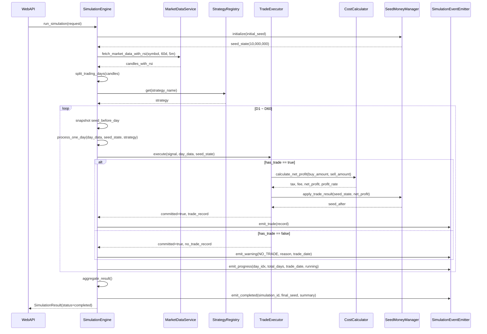
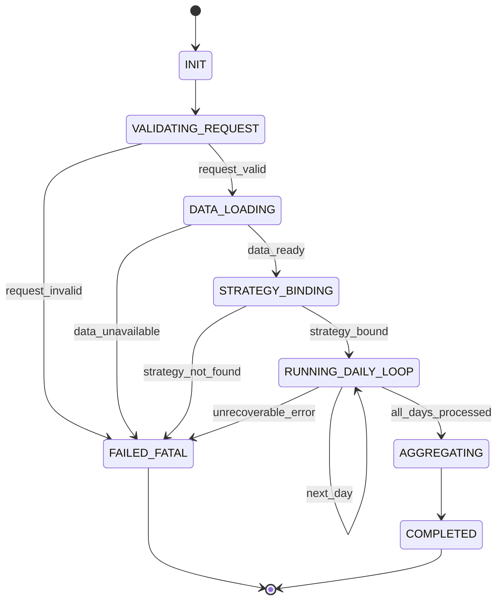
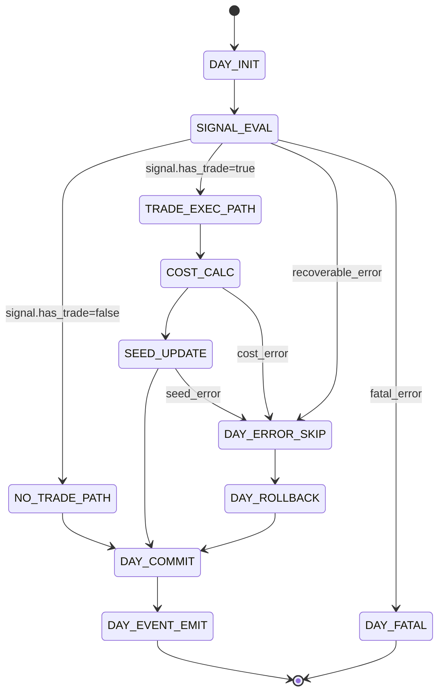

# 구현수준 설계 문서 (ILD)
# Implementation-Level Design Document - SIMULATION

| 항목 | 내용 |
|------|------|
| **문서 버전** | 1.0.0 |
| **작성일** | 2026-02-16 |
| **대상 모듈** | SIMULATION (시뮬레이션 엔진 모듈) |
| **기반 문서** | LLD SIMULATION v1.0.0, HLD v1.0.0 (4.4, 5.1, 6.2, 8.2.5), SRS v1.0.0 (FR-007, FR-008, FR-009) |
| **관련 티켓** | TICKET-012-ILD-SIMULATION |

---

## 목차

1. [목적 및 범위](#1-목적-및-범위)
2. [구현 단위/파일 구조](#2-구현-단위파일-구조)
3. [외부/상위 모듈 계약 및 데이터 포맷](#3-외부상위-모듈-계약-및-데이터-포맷)
4. [컴포넌트 구현 계약 (클래스/함수 레벨)](#4-컴포넌트-구현-계약-클래스함수-레벨)
5. [60일 루프 정상 처리 시퀀스 (내부 호출 순서)](#5-60일-루프-정상-처리-시퀀스-내부-호출-순서)
6. [상태 전이 상세 (시뮬레이션 + 거래일)](#6-상태-전이-상세-시뮬레이션--거래일)
7. [Decimal/비용 계산/세금·수수료 구현 규칙](#7-decimal비용-계산세금수수료-구현-규칙)
8. [실패/중단/롤백 정책 및 복구 시나리오](#8-실패중단롤백-정책-및-복구-시나리오)
9. [에러 코드/예외 매핑 및 회복 전략](#9-에러-코드예외-매핑-및-회복-전략)
10. [실행 가능한 언어 중립 수도코드](#10-실행-가능한-언어-중립-수도코드)
11. [요구사항/설계 추적성 매트릭스 (SRS + LLD)](#11-요구사항설계-추적성-매트릭스-srs--lld)
12. [구현 체크리스트 (주니어 개발자용)](#12-구현-체크리스트-주니어-개발자용)

---

## 1. 목적 및 범위

### 1.1 목적

본 문서는 `lld-simulation-v1.0.0.md`를 실제 코드로 구현하기 위한 **구현 수준(ILD)** 명세를 제공한다. 특히 `SimulationEngine`, `CostCalculator`, `SeedMoneyManager`, `TradeExecutor`, `SimulationEventEmitter`의 함수 단위 계약, 상태 전이, Decimal 정밀도, 실패/롤백/복구 정책을 코드 관점으로 고정하여 초급 개발자가 문서만으로 구현할 수 있게 한다.

### 1.2 범위 (In-Scope)

- 최근 60일 거래일 반복 루프 제어와 거래일 단위 처리 원자성
- 전략 시그널 실행(`TradeExecutor`) 및 시드머니 누적 반영
- 매도 세금/수수료 계산(0.2%, 0.011%)과 절사 규칙
- 이벤트 발행 수명주기(진행/거래/경고/오류/완료)와 비치명 전파 실패 처리
- 치명/비치명 오류 분류, 거래일 단위 롤백 경계, 재시도 정책
- FR-007~FR-009 구현 추적성 확보

### 1.3 비범위 (Out-of-Scope)

- Yahoo Finance 조회/RSI 계산 구현
- 전략별 매수·매도 조건 알고리즘 구현
- REST/SSE 라우터 및 네트워크 스트림 구현
- 결과 보고서 집계/화면 렌더링 구현

---

## 2. 구현 단위/파일 구조

다음 구조를 기준으로 구현한다.

```text
src/
  simulation/
    __init__.py
    constants.py
    errors.py
    models.py
    precision.py
    cost_calculator.py
    seed_money_manager.py
    trade_executor.py
    simulation_event_emitter.py
    simulation_engine.py
```

### 2.1 파일별 책임

| 파일 | 주요 책임 |
|------|-----------|
| `constants.py` | 시드머니 기본값, 세율/수수료율, 라운딩 정책, 에러 코드 상수 |
| `errors.py` | 도메인 예외(`Simulation*Error`) 및 치명/비치명 분류 |
| `models.py` | `SimulationRequest`, `SeedState`, `TradeRecord`, `SimulationResult`, `DayProcessResult` |
| `precision.py` | Decimal 생성/절사/백분율 계산 유틸 |
| `cost_calculator.py` | 세금/수수료/순수익 계산 |
| `seed_money_manager.py` | 시드 초기화/수량 계산/거래 반영 |
| `trade_executor.py` | 시그널 → 거래 레코드 변환 및 거래일 원자 처리 |
| `simulation_event_emitter.py` | 이벤트 타입/페이로드 표준화 및 발행 인터페이스 |
| `simulation_engine.py` | 60일 루프 오케스트레이션, 상태 전이/오류 제어 |

---

## 3. 외부/상위 모듈 계약 및 데이터 포맷

### 3.1 상위 호출 계약 (`WebAPI` → `SimulationEngine`)

| 호출 함수 | 파라미터 | 반환 | 실패 시 |
|----------|----------|------|---------|
| `run_simulation(request)` | `SimulationRequest(symbol, strategy_name, initial_seed?)` | `SimulationResult` | `SimulationValidationError`, `SimulationFatalError` |

### 3.2 하위 호출 계약 (`SimulationEngine` → 의존 모듈)

| 대상 모듈 | 호출 함수 | 입력 | 출력 | 실패 시 |
|-----------|----------|------|------|---------|
| MarketDataService | `fetch_market_data_with_rsi(symbol, '60d', '5m')` | `symbol` | 분봉+RSI DataFrame | `DataUnavailableError`, `DataIntegrityError` |
| StrategyEngine/Registry | `get(strategy_name)` + `evaluate(day_candles, day_rsi, seed_balance)` | 전략명, 거래일 데이터, 잔액 | `TradeSignal` | `StrategyNotFoundError`, `StrategyExecutionError` |
| EventEmitter | `emit_*` | 이벤트 DTO | `None` | `EventDispatchError` (비치명 기본) |

### 3.3 핵심 데이터 계약

#### 3.3.1 `SimulationRequest`

| 필드 | 타입 | 필수 | 제약 |
|------|------|------|------|
| `symbol` | string | Y | `NNNNNN.KS` |
| `strategy_name` | string | Y | 등록 전략 중 하나 |
| `initial_seed` | Decimal | N | 생략 시 `10000000` |

#### 3.3.2 `TradeSignal` (전략 모듈 입력 계약)

| 필드 | 타입 | 필수 | 설명 |
|------|------|------|------|
| `has_trade` | bool | Y | 거래 발생 여부 |
| `trade_date` | date | Y | 거래일 |
| `buy_datetime` | datetime? | N | 매수 시각 |
| `buy_price` | Decimal? | N | 매수 단가 |
| `buy_quantity` | int | Y | 매수 수량 |
| `sell_datetime` | datetime? | N | 매도 시각 |
| `sell_price` | Decimal? | N | 매도 단가 |
| `sell_reason` | string | Y | `profit_preserve`, `stop_loss`, `no_trade` |
| `meta` | dict | N | 추적 메타데이터 |

#### 3.3.3 `TradeRecord` (시뮬레이션 표준 결과)

| 필드 | 타입 | 제약 |
|------|------|------|
| `trade_date` | date | 거래일 고정 |
| `buy_datetime` | datetime? | no-trade 시 null |
| `buy_price` | Decimal? | no-trade 시 null |
| `buy_quantity` | int | 음수 금지 |
| `buy_amount` | Decimal | 원 단위 정수 Decimal |
| `sell_datetime` | datetime? | no-trade 시 null |
| `sell_price` | Decimal? | no-trade 시 null |
| `sell_quantity` | int | 음수 금지 |
| `sell_amount` | Decimal | 원 단위 정수 Decimal |
| `tax` | Decimal | 매도 시만 >0 가능 |
| `fee` | Decimal | 매도 시만 >0 가능 |
| `net_profit` | Decimal | 음수 허용 |
| `profit_rate` | Decimal | 소수점 둘째 자리 표시용 |
| `sell_reason` | string | `profit_preserve`/`stop_loss`/`no_trade`/`error_skip` |
| `seed_money_after` | Decimal | 원 단위 정수 Decimal |

---

## 4. 컴포넌트 구현 계약 (클래스/함수 레벨)

### 4.1 `SimulationEngine`

#### 4.1.1 공개 인터페이스

| 메서드 | 파라미터 | 반환 | 예외 |
|--------|----------|------|------|
| `run_simulation(request)` | `SimulationRequest` | `SimulationResult` | `SimulationValidationError`, `SimulationFatalError` |
| `split_trading_days(candles_df)` | DataFrame | `list[DailyCandles]` | `DataIntegrityError(E-SIM-004)` |
| `process_one_day(day_data, seed_state, strategy)` | 거래일 데이터, 시드상태, 전략 | `DayProcessResult` | `DayProcessingError(E-SIM-007)` |

#### 4.1.2 `run_simulation` 단계 규칙

1. 입력 검증(심볼/전략/시드) 실패 시 즉시 종료.
2. 시장 데이터 조회 후 거래일 분리(`D1..Dn`, 최대 60).
3. 전략 인스턴스 확보 실패 시 치명 종료.
4. 각 거래일마다 `process_one_day` 호출.
5. `DayProcessResult.commit == true`일 때만 결과 배열에 append.
6. 거래일 종료마다 `emit_progress` 호출.
7. 루프 완료 시 결과 집계 후 `emit_completed` 호출.

#### 4.1.3 거래일 처리 원자성

- 거래일 단위 원자성 경계: `seed_state`, `trade_record`, `daily_counter`.
- 커밋 조건: 거래 레코드/시드 반영이 모두 성공.
- 실패 시 롤백: `seed_state`를 `seed_before_day`로 복구, `trade_record` append 취소.

### 4.2 `CostCalculator`

#### 4.2.1 공개 인터페이스

| 메서드 | 파라미터 | 반환 | 예외 |
|--------|----------|------|------|
| `calculate_sell_costs(sell_amount)` | `Decimal` | `SellCosts(tax, fee, net_sell_amount)` | `CostCalculationError(E-SIM-011)` |
| `calculate_net_profit(buy_amount, sell_amount)` | `Decimal, Decimal` | `ProfitResult(tax, fee, net_profit, profit_rate)` | `CostCalculationError(E-SIM-011)` |

#### 4.2.2 계산 불변 조건

1. `sell_amount >= 0`, `buy_amount >= 0`.
2. 세금/수수료는 각각 독립적으로 절사 후 사용.
3. 순수익은 절사된 비용 기준으로 산출.
4. 매수 수수료는 항상 0.

### 4.3 `SeedMoneyManager`

#### 4.3.1 공개 인터페이스

| 메서드 | 파라미터 | 반환 | 예외 |
|--------|----------|------|------|
| `initialize(initial_seed=Decimal('10000000'))` | `Decimal` | `SeedState(balance, initial, last_updated)` | `ValidationError(E-SIM-002)` |
| `calculate_buy_quantity(seed_balance, buy_price)` | `Decimal, Decimal` | `int` | `ValidationError(E-SIM-012)` |
| `apply_trade_result(seed_state, net_profit)` | `SeedState, Decimal` | `SeedState` | `ValidationError(E-SIM-012)` |

#### 4.3.2 갱신 규칙

- `buy_qty = floor(seed_balance / buy_price)`
- `seed_after = seed_before + net_profit`
- `buy_qty == 0`이면 매수 미실행(no-trade)

### 4.4 `TradeExecutor`

#### 4.4.1 공개 인터페이스

| 메서드 | 파라미터 | 반환 | 예외 |
|--------|----------|------|------|
| `execute(day_signal, day_data, seed_state)` | `TradeSignal, DailyCandles, SeedState` | `TradeExecutionResult(trade_record, seed_after, committed)` | `TradeExecutionError(E-SIM-013)` |
| `build_no_trade_record(trade_date, reason, seed_after)` | `date, string, Decimal` | `TradeRecord` | - |
| `validate_signal(signal)` | `TradeSignal` | `None` | `TradeExecutionError(E-SIM-013)` |

#### 4.4.2 실행 규칙

1. `has_trade=false` → `no_trade` 레코드 생성, 시드 유지.
2. `has_trade=true`면 신호 필수 필드 검증(`buy/sell price`, `qty`, `datetime`).
3. 매수금액 계산: `buy_amount = buy_price * buy_qty`.
4. 매도금액 계산: `sell_amount = sell_price * sell_qty`.
5. 비용 계산은 반드시 `CostCalculator` 위임.
6. `seed_after` 반영 전 검증 실패 시 커밋 금지.

### 4.5 `SimulationEventEmitter`

#### 4.5.1 공개 인터페이스

| 메서드 | 파라미터 | 반환 | 실패 정책 |
|--------|----------|------|-----------|
| `emit_progress(current_day, total_days, trading_date, status)` | 진행 정보 | `None` | 1회 재시도 후 경고 로그 |
| `emit_trade(trade_record)` | 거래 내역 | `None` | 1회 재시도 후 경고 로그 |
| `emit_warning(code, message, trading_date)` | 경고 정보 | `None` | 즉시 비치명 처리 |
| `emit_error(code, message, detail=None)` | 오류 정보 | `None` | 치명 오류 직전 최종 시도 |
| `emit_completed(simulation_id, final_seed, summary)` | 완료 정보 | `None` | 실패해도 결과 반환은 유지 |

#### 4.5.2 이벤트 수명주기

1. `progress`: 거래일 루프 후반에 1회 이상.
2. `trade`: 당일 거래 확정 직후.
3. `warning`: 비치명 오류/데이터 누락.
4. `error`: 치명 종료 직전.
5. `completed`: 정상 종료 시 1회.

---

## 5. 60일 루프 정상 처리 시퀀스 (내부 호출 순서)



### 5.1 거래일 루프 상세 (D1~D60)

| 단계 | 설명 | 커밋/롤백 경계 |
|------|------|----------------|
| `Dk-1` 준비 | `seed_before_day` 스냅샷 | 롤백 기준점 생성 |
| `Dk-2` 신호 평가 | 전략 평가 및 신호 획득 | 아직 커밋 없음 |
| `Dk-3` 거래 실행 | 금액/비용/순손익 계산 | 실패 시 당일 롤백 |
| `Dk-4` 시드 갱신 | `seed_after` 반영 | 커밋 후보 |
| `Dk-5` 이벤트 발행 | trade/warning/progress | 실패해도 데이터 커밋 유지 |
| `Dk-6` 결과 반영 | 거래목록 append, 카운터 증가 | 당일 커밋 확정 |

### 5.2 진행률 계산 규칙

- `progress_pct = (current_day / total_days) * 100`
- 내부 계산 타입: Decimal
- 이벤트 표시: 소수점 한 자리까지 직렬화 가능

---

## 6. 상태 전이 상세 (시뮬레이션 + 거래일)

### 6.1 시뮬레이션 상태 머신



### 6.2 거래일 상태 머신



### 6.3 상태별 불변 조건

| 상태 | 불변 조건 |
|------|-----------|
| `RUNNING_DAILY_LOOP` | `1 <= current_day <= total_days` |
| `TRADE_EXEC_PATH` | `signal.has_trade == true` |
| `COST_CALC` | `sell_amount >= 0`, `buy_amount >= 0` |
| `SEED_UPDATE` | `seed_after = seed_before + net_profit` |
| `DAY_ROLLBACK` | `seed_state == seed_before_day` |
| `COMPLETED` | `status='completed'`, `final_seed` 계산 완료 |

---

## 7. Decimal/비용 계산/세금·수수료 구현 규칙

### 7.1 Decimal 기본 정책

1. 금액/비율 연산은 모두 Decimal 사용 (`float` 금지).
2. 내부 Decimal 컨텍스트 권장 정밀도: 28자리.
3. 금액 필드는 원 단위 정수 Decimal로 저장.
4. 수익률 표시는 소수점 둘째 자리 반올림(표시용) 가능, 내부 계산은 고정밀 유지.

### 7.2 비용 계산식 (FR-007 고정)

- `tax_raw = sell_amount * Decimal('0.002')`
- `fee_raw = sell_amount * Decimal('0.00011')`
- `tax = floor_to_won(tax_raw)`
- `fee = floor_to_won(fee_raw)`
- `net_sell_amount = sell_amount - tax - fee`
- `net_profit = net_sell_amount - buy_amount`
- `profit_rate = (net_profit / buy_amount) * 100` (`buy_amount == 0`이면 0)

### 7.3 절사/반올림 순서

1. `sell_amount` 산출
2. `tax_raw`, `fee_raw` 계산
3. 각각 원 단위 이하 절사
4. 절사값으로 `net_sell_amount` 계산
5. `net_profit` 계산
6. `seed_after` 반영

### 7.4 검증 예시 (테스트 기준)

| 입력 | 계산 | 결과 |
|------|------|------|
| `buy_amount=9,940,000`, `sell_amount=10,052,000` | `tax=20,104`, `fee=1,105`, `net_sell=10,030,791` | `net_profit=90,791` |
| `buy_amount=10,000,000`, `sell_amount=9,800,000` | `tax=19,600`, `fee=1,078`, `net_sell=9,779,322` | `net_profit=-220,678` |

---

## 8. 실패/중단/롤백 정책 및 복구 시나리오

### 8.1 실패 분류

| 분류 | 예시 | 처리 | 루프 지속 |
|------|------|------|-----------|
| 비치명 거래일 오류 | 필수 캔들 누락, 시그널 필드 누락, 비용 계산 실패 | 당일 `error_skip` 또는 `no_trade` 기록 + 롤백 | 예 |
| 이벤트 발행 실패 | `emit_trade` 전송 실패 | 1회 재시도 후 로깅 | 예 |
| 치명 오류 | 전략 미등록, 전체 데이터 없음, 요청 검증 실패 | `status='error'` 종료 | 아니오 |

### 8.2 롤백 범위

- 롤백 대상: 당일 시드 상태, 당일 임시 거래 레코드, 당일 집계 카운터 증가분.
- 롤백 비대상: 이미 완료된 이전 거래일 결과, 시뮬레이션 시작 메타데이터.
- 롤백 트리거:
  - `TradeExecutionError`
  - `CostCalculationError`
  - `SeedUpdateError`

### 8.3 복구 시나리오

| 시나리오 | 감지 조건 | 복구 동작 | 최종 결과 |
|----------|-----------|-----------|-----------|
| 필수 시각 캔들 누락 | 09:05/15:00/15:05 부재 | `build_no_trade_record(reason='MISSING_MANDATORY_CANDLE')` | 당일 미거래, 루프 지속 |
| 시드 부족 | `buy_qty == 0` | `no_trade(reason='INSUFFICIENT_SEED')` | 당일 미거래 |
| 거래 계산 예외 | 음수 가격/수량, 필드 불일치 | 당일 롤백 + `error_skip` 기록 | 루프 지속 |
| 이벤트 전파 실패 | emitter 예외 | 1회 재시도 후 경고 | 결과 계산 지속 |
| 전략 조회 실패 | registry miss | 치명 오류 이벤트 후 중단 | `status='error'` |

### 8.4 재시도 정책

| 대상 | 재시도 횟수 | 간격 | 실패 후 |
|------|-------------|------|--------|
| 이벤트 발행 | 1회 | 즉시 | 경고 로그 후 진행 |
| 거래 실행 | 재시도 없음 | - | 당일 롤백 후 `error_skip` |
| 전략 평가 | 재시도 없음 | - | 오류 유형별 당일 스킵 또는 중단 |

---

## 9. 에러 코드/예외 매핑 및 회복 전략

### 9.1 에러 코드 표준

| 코드 | 예외 타입 | 발생 지점 | 치명도 | 기본 회복 |
|------|-----------|-----------|--------|-----------|
| `E-SIM-001` | `SimulationValidationError` | 요청 검증 | 치명 | 즉시 종료 |
| `E-SIM-002` | `SimulationValidationError` | 초기 시드값 검증 | 치명 | 즉시 종료 |
| `E-SIM-003` | `DataUnavailableError` | 60일 데이터 조회 | 치명 | 즉시 종료 |
| `E-SIM-004` | `DataIntegrityError` | 거래일 분리/정합성 | 치명 | 즉시 종료 |
| `E-SIM-005` | `StrategyNotFoundError` | 전략 조회 | 치명 | 즉시 종료 |
| `E-SIM-006` | `StrategyExecutionError` | 전략 평가 | 비치명(기본) | 당일 `error_skip` |
| `E-SIM-007` | `DayProcessingError` | 거래일 처리 파이프라인 | 비치명(기본) | 당일 롤백 |
| `E-SIM-008` | `EventDispatchError` | 이벤트 발행 | 비치명 | 재시도 후 로그 |
| `E-SIM-009` | `MissingMandatoryCandleError` | 필수 시각 확인 | 비치명 | 당일 `no_trade` |
| `E-SIM-010` | `InsufficientSeedError` | 수량 계산 | 비치명 | 당일 `no_trade` |
| `E-SIM-011` | `CostCalculationError` | 세금/수수료 계산 | 비치명 | 당일 롤백 |
| `E-SIM-012` | `SeedUpdateError` | 시드 갱신 | 비치명 | 당일 롤백 |
| `E-SIM-013` | `TradeExecutionError` | 신호 검증/거래 변환 | 비치명 | 당일 롤백 |
| `E-SIM-014` | `SimulationFatalError` | 루프 상위 제어 | 치명 | `status=error` 종료 |

### 9.2 예외 전파 규칙

1. 컴포넌트 내부 예외는 `E-SIM-xxx` 도메인 예외로 변환 후 상위 전달.
2. 비치명 예외는 `trade_record.sell_reason='error_skip'` 또는 `no_trade`로 변환.
3. 치명 예외는 즉시 루프 중단 후 `emit_error` 1회 발행.
4. 최종 결과 상태:
   - 정상 종료: `completed`
   - 치명 종료: `error`

### 9.3 오류 코드 ↔ 사용자 메시지 키

| 코드 | 메시지 키 | 기본 한국어 메시지 |
|------|-----------|-------------------|
| `E-SIM-003` | `simulation.no_data` | 최근 60일 거래 데이터가 없습니다. |
| `E-SIM-005` | `simulation.strategy_not_found` | 선택한 전략을 찾을 수 없습니다. |
| `E-SIM-009` | `simulation.mandatory_candle_missing` | 필수 시각 분봉이 누락되었습니다. |
| `E-SIM-010` | `simulation.insufficient_seed` | 시드머니가 1주 매수 금액보다 작습니다. |
| `E-SIM-011` | `simulation.cost_calculation_failed` | 비용 계산 중 오류가 발생했습니다. |
| `E-SIM-014` | `simulation.fatal_error` | 시뮬레이션 실행 중 치명 오류가 발생했습니다. |

---

## 10. 실행 가능한 언어 중립 수도코드

### 10.1 메인 루프 (`SimulationEngine.run_simulation`)

```text
function run_simulation(request):
    validate_request(request)                                 # E-SIM-001

    emitter = SimulationEventEmitter()
    cost_calculator = CostCalculator()
    seed_manager = SeedMoneyManager()
    executor = TradeExecutor(cost_calculator, seed_manager)

    seed_state = seed_manager.initialize(
        request.initial_seed or Decimal('10000000')
    )                                                         # E-SIM-002

    candles = market_data_service.fetch_market_data_with_rsi(
        symbol=request.symbol,
        period='60d',
        interval='5m'
    )                                                         # E-SIM-003

    days = split_trading_days(candles)                        # E-SIM-004
    if days.length == 0:
        emitter.emit_error('E-SIM-003', '최근 60일 거래 데이터가 없습니다.')
        raise SimulationFatalError('E-SIM-003')

    strategy = strategy_registry.get(request.strategy_name)   # E-SIM-005

    trades = []
    no_trade_days = 0
    error_skip_days = 0

    for index from 0 to days.length - 1:
        day = days[index]
        seed_before_day = seed_state.clone()

        try:
            signal = strategy.evaluate(
                daily_candles=day.candles,
                rsi_data=day.rsi,
                seed_money=seed_state.balance
            )                                                 # E-SIM-006

            execution = executor.execute(
                day_signal=signal,
                day_data=day,
                seed_state=seed_state
            )                                                 # E-SIM-013

            if execution.committed == true:
                seed_state = execution.seed_state_after
                trades.append(execution.trade_record)

                if execution.trade_record.sell_reason == 'no_trade':
                    no_trade_days += 1
                    emitter.emit_warning('NO_TRADE', '해당 거래일 거래 없음', day.trade_date)
                elif execution.trade_record.sell_reason == 'error_skip':
                    error_skip_days += 1
                    emitter.emit_warning('E-SIM-007', '당일 오류로 건너뜀', day.trade_date)
                else:
                    emitter.emit_trade(execution.trade_record)

        except MissingMandatoryCandleError as e:              # E-SIM-009
            seed_state = seed_before_day
            record = executor.build_no_trade_record(day.trade_date, 'MISSING_MANDATORY_CANDLE', seed_state.balance)
            trades.append(record)
            no_trade_days += 1
            emitter.emit_warning('E-SIM-009', e.message, day.trade_date)

        except InsufficientSeedError as e:                    # E-SIM-010
            seed_state = seed_before_day
            record = executor.build_no_trade_record(day.trade_date, 'INSUFFICIENT_SEED', seed_state.balance)
            trades.append(record)
            no_trade_days += 1
            emitter.emit_warning('E-SIM-010', e.message, day.trade_date)

        except (TradeExecutionError, CostCalculationError, SeedUpdateError, DayProcessingError) as e:
            seed_state = seed_before_day
            record = executor.build_no_trade_record(day.trade_date, 'error_skip', seed_state.balance)
            trades.append(record)
            error_skip_days += 1
            emitter.emit_warning('E-SIM-007', e.message, day.trade_date)

        progress = ((index + 1) / days.length) * 100
        emitter.emit_progress(index + 1, days.length, day.trade_date, status='running')

    result = aggregate_simulation_result(
        request=request,
        trades=trades,
        initial_seed=seed_state.initial,
        final_seed=seed_state.balance,
        no_trade_days=no_trade_days,
        error_skip_days=error_skip_days,
        status='completed'
    )

    emitter.emit_completed(result.simulation_id, result.final_seed, summary={
        'total_trades': result.total_trades,
        'no_trade_days': result.no_trade_days,
        'error_skip_days': error_skip_days
    })

    return result
```

### 10.2 거래 실행 (`TradeExecutor.execute`)

```text
function execute(day_signal, day_data, seed_state):
    validate_signal(day_signal)                               # E-SIM-013

    if day_signal.has_trade == false:
        record = build_no_trade_record(day_data.date, 'no_trade', seed_state.balance)
        return TradeExecutionResult(record, seed_state, committed=true)

    buy_price = to_decimal(day_signal.buy_price)
    sell_price = to_decimal(day_signal.sell_price)
    buy_qty = day_signal.buy_quantity
    sell_qty = day_signal.buy_quantity

    if buy_qty <= 0 or buy_price <= 0 or sell_price <= 0:
        raise TradeExecutionError('E-SIM-013', '거래 시그널 값이 유효하지 않습니다.')

    buy_amount = floor_to_won(buy_price * buy_qty)
    sell_amount = floor_to_won(sell_price * sell_qty)

    profit = cost_calculator.calculate_net_profit(buy_amount, sell_amount)  # E-SIM-011

    seed_after = seed_manager.apply_trade_result(seed_state, profit.net_profit)  # E-SIM-012

    record = TradeRecord(
        trade_date=day_data.date,
        buy_datetime=day_signal.buy_datetime,
        buy_price=buy_price,
        buy_quantity=buy_qty,
        buy_amount=buy_amount,
        sell_datetime=day_signal.sell_datetime,
        sell_price=sell_price,
        sell_quantity=sell_qty,
        sell_amount=sell_amount,
        tax=profit.tax,
        fee=profit.fee,
        net_profit=profit.net_profit,
        profit_rate=round_display_percent(profit.profit_rate, 2),
        sell_reason=day_signal.sell_reason,
        seed_money_after=seed_after.balance
    )

    return TradeExecutionResult(record, seed_after, committed=true)
```

### 10.3 비용 계산 (`CostCalculator.calculate_net_profit`)

```text
function calculate_net_profit(buy_amount, sell_amount):
    if buy_amount < 0 or sell_amount < 0:
        raise CostCalculationError('E-SIM-011', '금액은 음수일 수 없습니다.')

    tax_raw = sell_amount * Decimal('0.002')
    fee_raw = sell_amount * Decimal('0.00011')

    tax = floor_to_won(tax_raw)
    fee = floor_to_won(fee_raw)

    net_sell_amount = sell_amount - tax - fee
    net_profit = net_sell_amount - buy_amount

    if buy_amount == 0:
        profit_rate = Decimal('0')
    else:
        profit_rate = (net_profit / buy_amount) * Decimal('100')

    return ProfitResult(tax, fee, net_sell_amount, net_profit, profit_rate)
```

---

## 11. 요구사항/설계 추적성 매트릭스 (SRS + LLD)

| 추적 ID | SRS 요구사항 | LLD 반영 | ILD 구현 반영 | 충족 근거 |
|--------|---------------|----------|---------------|-----------|
| `T-SIM-001` | FR-007 매도 비용 반영 | LLD 2.3, 4장, 5장 | ILD 4.2, 7장, 10.3 | 세금 0.2%, 수수료 0.011%, 절사 후 순수익 계산 |
| `T-SIM-002` | FR-008 시드머니 누적 관리 | LLD 2.4, 5장 | ILD 4.3, 4.4, 7장, 10.2 | 초기 10,000,000원, floor 수량, 거래 후 시드 갱신 |
| `T-SIM-003` | FR-009 단일 종목 60일 반복 | LLD 2.2, 3장 | ILD 4.1, 5장, 6장, 10.1 | 단일 심볼 60일 루프, 거래일 단위 처리 |
| `T-SIM-004` | FR-009 진행/종료 결과 생성 | LLD 3장, 8장 | ILD 4.5, 5장, 10.1 | progress/trade/completed 이벤트 및 결과 집계 |
| `T-SIM-005` | FR-007~009 실패 처리 정합성 | LLD 6장, 7장 | ILD 8장, 9장 | 비치명 스킵·롤백, 치명 중단, 코드 매핑 표준화 |

---

## 12. 구현 체크리스트 (주니어 개발자용)

### 12.1 구현 순서

1. `errors.py`에 `E-SIM-001`~`E-SIM-014` 정의.
2. `precision.py`에서 Decimal 유틸(`to_decimal`, `floor_to_won`, `round_display_percent`) 구현.
3. `cost_calculator.py` 구현 + 계산 단위 테스트 작성.
4. `seed_money_manager.py` 구현 + 시드 부족 케이스 테스트.
5. `trade_executor.py` 구현 + 정상/무신호/오류 스킵 테스트.
6. `simulation_event_emitter.py` 구현 + 이벤트 페이로드 스키마 검증.
7. `simulation_engine.py` 구현 + 60일 루프 통합 테스트.
8. 치명/비치명 예외 경로(롤백 포함) 통합 검증.

### 12.2 완료 기준 (Definition of Done)

- FR-007 비용 계산식/절사 규칙 테스트 통과
- FR-008 시드머니 누적/수량 floor/1주 미만 미매수 테스트 통과
- FR-009 60일 루프/단일 심볼/거래일 상태 전이 테스트 통과
- 비치명 오류 시 당일 롤백 + 루프 지속 동작 검증
- 치명 오류 시 `status=error` 종료 및 에러 이벤트 검증
- 결과 스키마(`SimulationResult`, `TradeRecord`) 필수 필드 누락 없음
