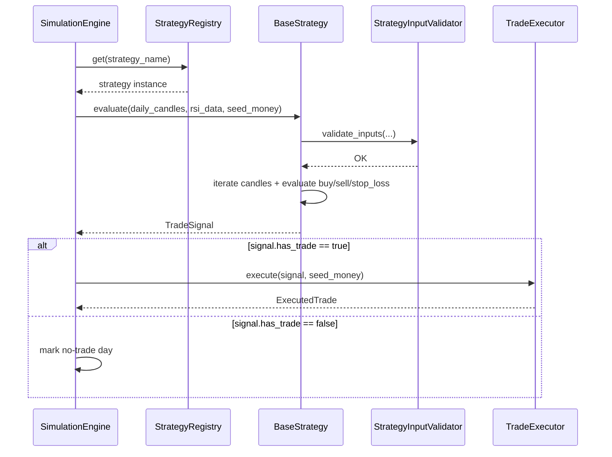
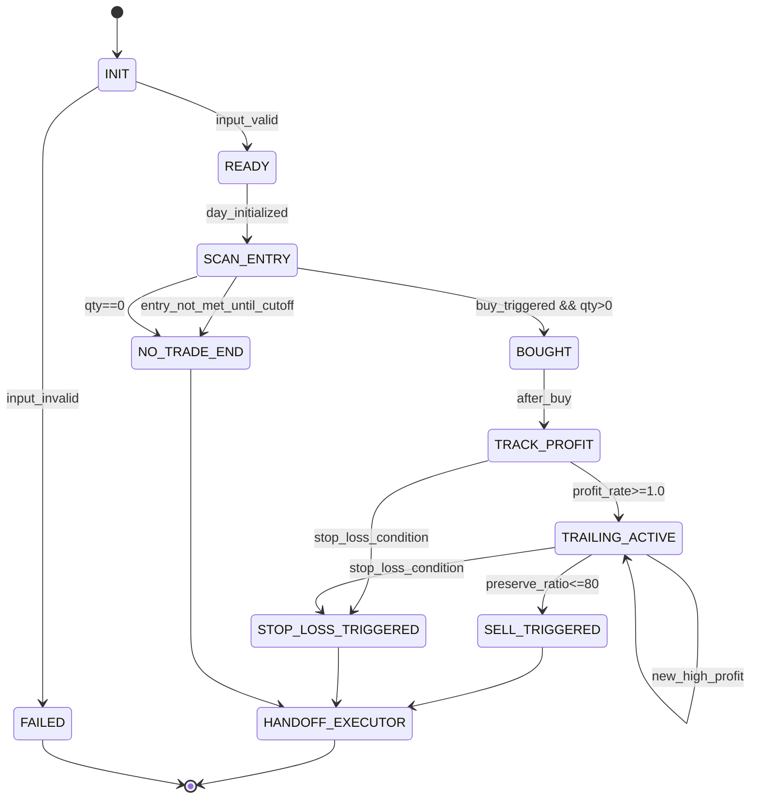

# 구현수준 설계 문서 (ILD)
# Implementation-Level Design Document - STRATEGY

| 항목 | 내용 |
|------|------|
| **문서 버전** | 1.0.0 |
| **작성일** | 2026-02-16 |
| **대상 모듈** | STRATEGY (전략 엔진 모듈) |
| **기반 문서** | LLD STRATEGY v1.0.0, HLD v1.0.0 (4.3, 5.1, 6.2, 7.x), SRS v1.0.0 (FR-003, FR-004, FR-005, FR-006, NFR-008) |
| **관련 티켓** | TICKET-011-ILD-STRATEGY |

---

## 목차

1. [목적 및 범위](#1-목적-및-범위)
2. [구현 단위/파일 구조](#2-구현-단위파일-구조)
3. [외부/상위 모듈 계약 및 데이터 포맷](#3-외부상위-모듈-계약-및-데이터-포맷)
4. [컴포넌트 구현 계약 (클래스/함수 레벨)](#4-컴포넌트-구현-계약-클래스함수-레벨)
5. [정상 처리 시퀀스 (신호 생성 → 실행 위임)](#5-정상-처리-시퀀스-신호-생성--실행-위임)
6. [상태 전이 상세 (전략 내부 + 실행 핸드오프)](#6-상태-전이-상세-전략-내부--실행-핸드오프)
7. [에러 코드/예외 매핑 및 복구 시나리오](#7-에러-코드예외-매핑-및-복구-시나리오)
8. [전략별 핵심 규칙 구현 기준](#8-전략별-핵심-규칙-구현-기준)
9. [실행 가능한 언어 중립 수도코드](#9-실행-가능한-언어-중립-수도코드)
10. [요구사항/설계 추적성 매트릭스 (SRS + LLD)](#10-요구사항설계-추적성-매트릭스-srs--lld)
11. [구현 체크리스트 (주니어 개발자용)](#11-구현-체크리스트-주니어-개발자용)

---

## 1. 목적 및 범위

### 1.1 목적

본 문서는 `lld-strategy-v1.0.0.md`를 실제 코드로 구현하기 위한 **구현 수준(ILD)** 명세를 제공한다. 특히 `BaseStrategy`, 전략 구현체 3종, `StrategyRegistry`의 함수 시그니처/상태 전이/예외 모델/복구 정책을 코드 단위로 명확화하여 초급 개발자가 외부 문서 없이 구현 가능하도록 한다.

### 1.2 범위 (In-Scope)

- 전략 공통 템플릿 메서드(`evaluate`)와 상태 객체(`TradeContext`) 구현
- 전략 1/2/3의 매수·매도·손절 조건 구현 기준
- `StrategyRegistry` 등록/조회/중복 방지 정책
- `TradeSignal` 생성 및 `SimulationEngine`/`TradeExecutor` 실행 핸드오프 계약
- 에러 코드/예외 매핑, 재시도 불가·복구 가능 시나리오 정의
- FR-003~FR-006 및 NFR-008 구현 추적성 확보

### 1.3 비범위 (Out-of-Scope)

- Yahoo Finance 조회 및 RSI 계산 알고리즘 자체 구현
- 매매 비용 계산 및 시드머니 정산 상세 구현
- REST/SSE 라우팅 계층 구현
- 결과 보고서 포맷팅 구현

---

## 2. 구현 단위/파일 구조

다음 구조를 기준으로 구현한다.

```text
src/
  strategy/
    __init__.py
    constants.py
    errors.py
    models.py
    strategy_input_validator.py
    base_strategy.py
    sell_trailing_stop_strategy.py
    buy_sell_trailing_stop_strategy.py
    rsi_buy_sell_trailing_stop_strategy.py
    strategy_registry.py
```

### 2.1 파일별 책임

| 파일 | 주요 책임 |
|------|-----------|
| `constants.py` | 임계값/시각/전략명 상수 (`PROFIT_TRIGGER_RATE`, `PRESERVE_RATIO_THRESHOLD`, `ENTRY_DROP_RATE`, `REBOUND_RATE`, `RSI_BUY_THRESHOLD`) |
| `errors.py` | 전략 계층 도메인 예외와 에러코드 정의 |
| `models.py` | `TradeContext`, `TradeSignal`, `SellReason`, `StrategyExecutionResult` 정의 |
| `strategy_input_validator.py` | 캔들/RSI 정합성 및 필수 시점 검증 |
| `base_strategy.py` | 공통 템플릿 실행 흐름(`evaluate`)과 공통 계산 함수 |
| `sell_trailing_stop_strategy.py` | 전략1 로직 구현 |
| `buy_sell_trailing_stop_strategy.py` | 전략2 로직 구현 |
| `rsi_buy_sell_trailing_stop_strategy.py` | 전략3 로직 구현 |
| `strategy_registry.py` | 전략 등록/조회/목록/중복 방지 |

---

## 3. 외부/상위 모듈 계약 및 데이터 포맷

### 3.1 상위 호출 계약 (`SimulationEngine` → `Strategy`)

| 호출 함수 | 파라미터 | 반환 | 실패 시 |
|----------|----------|------|---------|
| `strategy.evaluate(daily_candles, rsi_data, seed_money)` | `daily_candles: DataFrame`, `rsi_data: DataFrame|None`, `seed_money: Decimal` | `TradeSignal` | `StrategyInputError`, `StrategyExecutionError` |

### 3.2 실행 핸드오프 계약 (`Strategy` → `TradeExecutor`)

전략은 직접 체결하지 않고 아래 스키마를 만족하는 `TradeSignal`을 반환한다.

| 필드 | 타입 | 필수 | 설명 |
|------|------|------|------|
| `has_trade` | bool | Y | 거래 발생 여부 |
| `trade_date` | date | Y | 거래일 |
| `buy_datetime` | datetime? | N | 매수 시각 |
| `buy_price` | Decimal? | N | 매수 가격 |
| `buy_quantity` | int | Y | 매수 수량 (0 가능) |
| `sell_datetime` | datetime? | N | 매도 시각 |
| `sell_price` | Decimal? | N | 매도 가격 |
| `sell_reason` | SellReason | Y | `PROFIT_PRESERVE`, `STOP_LOSS`, `NO_TRADE` |
| `meta` | dict[str, Any] | Y | 추적 정보 (`highest_profit_rate`, `preserve_ratio`, `rsi_at_entry`, `error_code`) |

### 3.3 입력 데이터 계약 (`daily_candles`, `rsi_data`)

#### 3.3.1 `daily_candles`

| 필드 | 타입 | 제약 |
|------|------|------|
| `timestamp` | datetime(tz-aware) | KST, 5분 경계, 오름차순, 중복 없음 |
| `open/high/low/close` | Decimal/float | `high >= low`, `open/close ∈ [low, high]` |
| `volume` | int | `>= 0` |

#### 3.3.2 `rsi_data`

| 필드 | 타입 | 제약 |
|------|------|------|
| `timestamp` | datetime(tz-aware) | `daily_candles.timestamp`와 동일 정렬 |
| `rsi` | float | `0 <= rsi <= 100` 또는 NaN |

### 3.4 필수 시점 캔들 계약

| 전략 | 필수 캔들 | 이유 |
|------|-----------|------|
| 전략1 | 09:05, 15:05 | 09:05 매수, 15:05 손절가격 산출 |
| 전략2 | 09:05, 15:00 | 기준가 및 손절 컷오프 |
| 전략3 | 09:05, 15:00 | 기준가 및 손절 컷오프 |

---

## 4. 컴포넌트 구현 계약 (클래스/함수 레벨)

### 4.1 `BaseStrategy`

#### 4.1.1 공개 인터페이스

| 메서드 | 파라미터 | 반환 | 예외 |
|--------|----------|------|------|
| `evaluate(daily_candles, rsi_data, seed_money)` | `DataFrame, DataFrame|None, Decimal` | `TradeSignal` | `StrategyInputError`, `StrategyExecutionError` |
| `initialize_day(candle_0905, seed_money)` | `Series, Decimal` | `TradeContext` | `StrategyInputError` |
| `should_buy(candle, context, rsi_value=None)` | `Series, TradeContext, float|None` | `bool` | - |
| `should_sell(candle, context)` | `Series, TradeContext` | `bool` | - |
| `should_stop_loss(candle, context)` | `Series, TradeContext` | `bool` | - |

#### 4.1.2 `evaluate` 내부 단계 (반드시 준수)

1. `validate_inputs` 수행.
2. 09:05 캔들 조회 후 `initialize_day` 호출.
3. 캔들 시간순 순회.
4. 미매수 상태면 `should_buy` 평가.
5. 매수 시 수량 `floor(seed_money / buy_price)` 계산.
6. `buy_quantity == 0`이면 `NO_TRADE(E-ST-007)` 반환.
7. 매수 후 매 캔들마다 수익률/최고수익률/보전율 갱신.
8. `should_sell` True 시 즉시 `PROFIT_PRESERVE` 반환.
9. `should_stop_loss` True 시 전략별 손절 시각/가격으로 `STOP_LOSS` 반환.
10. 장 종료까지 미체결이면 `NO_TRADE` 반환.

#### 4.1.3 내부 보조 함수 계약

| 함수 | 입력 | 출력 | 규칙 |
|------|------|------|------|
| `_calc_profit_rate(buy_price, now_price)` | Decimal, Decimal | Decimal(%) | 소수점 비교 오차 방지를 위해 Decimal 사용 |
| `_calc_preserve_ratio(current_profit, highest_profit)` | Decimal, Decimal | Decimal(%) | `highest_profit <= 0`이면 0 반환 |
| `_lookup_rsi(rsi_data, ts)` | DataFrame|None, datetime | float|None | 미존재/NaN은 None 반환 |
| `_build_signal(context, sell_ts, sell_price, reason)` | context + 체결정보 | TradeSignal | `meta`에 추적값 포함 |

### 4.2 `SellTrailingStopStrategy` (전략1)

| 메서드 | 구현 규칙 |
|--------|-----------|
| `name()` | `sell_trailing_stop` 고정 |
| `initialize_day` | `reference_price=None`, `is_bought=False`, `is_trailing_started=False` |
| `should_buy` | `candle.time == 09:05` 일 때만 True |
| `should_sell` | trailing 시작 후 `preserve_ratio <= 80`이면 True |
| `should_stop_loss` | `candle.time == 15:00` AND trailing 미시작 |
| `resolve_stop_loss_fill` | 체결 시각 `15:05`, 가격 `close@15:05` |

### 4.3 `BuySellTrailingStopStrategy` (전략2)

| 메서드 | 구현 규칙 |
|--------|-----------|
| `name()` | `buy_sell_trailing_stop` 고정 |
| `initialize_day` | `reference_price=close@09:05`, `low_point=None` |
| `should_buy` | 1.0% 하락 시작 후 전저점 대비 0.2% 반등이면 True |
| `should_sell` | 전략1과 동일 |
| `should_stop_loss` | `candle.time == 15:00` AND trailing 미시작 |
| `resolve_stop_loss_fill` | 체결 시각 `15:00`, 가격 `close@15:00` |

### 4.4 `RSIBuySellTrailingStopStrategy` (전략3)

| 메서드 | 구현 규칙 |
|--------|-----------|
| `name()` | `rsi_buy_sell_trailing_stop` 고정 |
| `initialize_day` | 전략2와 동일 |
| `should_buy` | 전략2 매수조건 AND `rsi <= 30` |
| `should_sell` | 전략1과 동일 |
| `should_stop_loss` | 전략2와 동일 |
| `resolve_stop_loss_fill` | 전략2와 동일 |

### 4.5 `StrategyRegistry`

#### 4.5.1 공개 인터페이스

| 메서드 | 파라미터 | 반환 | 예외 |
|--------|----------|------|------|
| `register(strategy)` | `BaseStrategy` | `None` | `DuplicateStrategyError(E-ST-002)` |
| `get(name)` | `str` | `BaseStrategy` | `StrategyNotFoundError(E-ST-001)` |
| `list_all()` | - | `list[str]` | - |
| `register_defaults()` | - | `None` | `DuplicateStrategyError` |

#### 4.5.2 기본 등록 정책

1. `sell_trailing_stop`
2. `buy_sell_trailing_stop`
3. `rsi_buy_sell_trailing_stop`

---

## 5. 정상 처리 시퀀스 (신호 생성 → 실행 위임)



### 5.1 내부 호출 순서 고정 규칙

1. 입력 검증 실패 시 전략 판단 로직 호출 금지.
2. `should_buy`는 미보유 상태에서만 호출.
3. `should_sell`/`should_stop_loss`는 보유 상태에서만 호출.
4. 매도 시그널이 생성된 캔들 이후 추가 평가 금지(즉시 반환).
5. `TradeSignal`은 `TradeExecutor`가 비용 계산 가능한 필드를 모두 포함해야 한다.

---

## 6. 상태 전이 상세 (전략 내부 + 실행 핸드오프)

### 6.1 전략 상태 머신



### 6.2 상태별 불변조건

| 상태 | 불변 조건 |
|------|-----------|
| `SCAN_ENTRY` | `context.is_bought == False` |
| `BOUGHT` | `buy_price > 0`, `buy_quantity > 0`, `buy_datetime != None` |
| `TRAILING_ACTIVE` | `highest_profit_rate >= 1.0`, `is_trailing_started == True` |
| `SELL_TRIGGERED` | `sell_reason == PROFIT_PRESERVE` |
| `STOP_LOSS_TRIGGERED` | `sell_reason == STOP_LOSS` |
| `NO_TRADE_END` | `has_trade == False`, `sell_reason == NO_TRADE` |

### 6.3 실행 핸드오프 상태

| 전략 결과 | SimulationEngine 동작 | 후속 상태 |
|-----------|-----------------------|-----------|
| `TradeSignal(has_trade=true)` | `TradeExecutor.execute` 호출 | `EXECUTED` |
| `TradeSignal(has_trade=false)` | 거래 미발생 기록 | `SKIPPED` |
| 예외 발생 | 오류 이벤트 기록, 정책에 따라 중단/계속 | `ERROR` |

---

## 7. 에러 코드/예외 매핑 및 복구 시나리오

### 7.1 에러 코드 매핑

| 코드 | 예외 타입 | 발생 지점 | 상위 전달 메시지 키 | 복구 방식 |
|------|-----------|-----------|----------------------|-----------|
| `E-ST-001` | `StrategyNotFoundError` | `StrategyRegistry.get` | `strategy_not_found` | 시뮬레이션 시작 실패(즉시 반환) |
| `E-ST-002` | `DuplicateStrategyError` | `StrategyRegistry.register` | `strategy_duplicate_registration` | 앱 기동 실패 또는 경고 후 중복 무시(정책 선택) |
| `E-ST-003` | `StrategyInputError` | 필수 컬럼 누락 | `strategy_input_missing_columns` | 당일 실패 처리, 다음 거래일 진행 가능 |
| `E-ST-004` | `StrategyInputError` | 필수 시각 캔들 누락(09:05/15:00/15:05) | `strategy_input_missing_mandatory_candle` | 당일 NO_TRADE 또는 오류(설정 기반) |
| `E-ST-005` | `StrategyInputError` | timestamp 정렬/세션/타임존 오류 | `strategy_input_invalid_timestamp` | 당일 실패 처리 |
| `E-ST-006` | `RSIDataMissingError` | 전략3 매수 시점 RSI 누락/NaN | `strategy_rsi_missing` | 해당 캔들 매수 스킵, 다음 캔들 재평가 |
| `E-ST-007` | `InsufficientSeedMoneyError` | `buy_quantity == 0` | `strategy_insufficient_seed` | 당일 NO_TRADE 반환 |
| `E-ST-008` | `StrategyExecutionError` | 수치 연산/상태 전이 불일치 | `strategy_execution_failed` | 해당 거래일 실패, 상세 로그 기록 |

### 7.2 복구 시나리오

| 시나리오 | 감지 조건 | 복구 동작 | 최종 결과 |
|----------|-----------|-----------|-----------|
| RSI 누락 (전략3) | `rsi_value is None/NaN` | 매수 스킵, `meta.skipped_reason='RSI_MISSING'` 기록 | 동일 거래일 평가 지속 |
| 시드머니 부족 | `floor(seed_money/buy_price)==0` | 즉시 `NO_TRADE` 신호 반환 | 다음 거래일 진행 |
| 15:05 캔들 누락(전략1) | 손절 시점 조회 실패 | `E-ST-004` 발생, 상위 정책에 따라 당일 실패/건너뜀 | 시뮬레이션 정책 의존 |
| 비정상 상태 전이 | `is_bought=False` 상태에서 매도 로직 진입 등 | `E-ST-008`으로 강제 중단 | 해당 거래일 오류 처리 |

### 7.3 예외 전파 규칙

1. 전략 내부 저수준 예외는 `Strategy*Error` 도메인 예외로 변환한다.
2. 에러코드(`E-ST-xxx`)를 `meta.error_code`에 포함하여 상위 계층 로깅·메시지 매핑에 사용한다.
3. 복구 가능한 오류(`E-ST-006`, `E-ST-007`)는 예외 대신 `NO_TRADE` 또는 스킵 흐름을 우선 사용한다.

---

## 8. 전략별 핵심 규칙 구현 기준

### 8.1 공통 계산식

- 수익률(%) = `((현재가 - 매수가) / 매수가) * 100`
- 하락률(%) = `((기준가 - 현재가) / 기준가) * 100`
- 반등률(%) = `((현재가 - 전저점) / 전저점) * 100`
- 이익보전율(%) = `(현재 수익률 / 당일 최고 수익률) * 100`

### 8.2 전략1 구현 기준 (FR-003)

1. 09:05 종가로 1회 매수.
2. 수익률 최초 1.0% 도달 시 trailing 시작.
3. trailing 시작 이후 `preserve_ratio <= 80`이면 즉시 매도.
4. 15:00까지 trailing 미시작이면 15:05 종가 손절.

### 8.3 전략2 구현 기준 (FR-004)

1. 기준가 = 09:05 종가.
2. 1.0% 이상 하락 시 전저점 추적 시작.
3. 전저점 갱신 중 0.2% 이상 반등하면 매수.
4. 15:00까지 매수 조건 미충족이면 `NO_TRADE`.
5. 매수 후 매도/손절 규칙은 전략1과 동일하되 손절 체결은 15:00.

### 8.4 전략3 구현 기준 (FR-005)

1. 전략2의 매수 트리거 성립 시 RSI 조건 추가 확인.
2. `RSI <= 30`이면 매수, `RSI > 30` 또는 누락이면 스킵.
3. RSI 스킵은 오류가 아니라 재평가 가능한 정상 분기.
4. 매도/손절은 전략2와 동일.

### 8.5 확장성 구현 기준 (FR-006, NFR-008)

1. 신규 전략은 `BaseStrategy` 하위 클래스로만 추가한다.
2. 기존 전략 1/2/3 및 엔진 분기문 수정 없이 `StrategyRegistry.register`로 연결한다.
3. `TradeSignal` 스키마 하위호환성 유지.
4. 확장 시 회귀 테스트는 기존 전략 결과 불변을 포함한다.

---

## 9. 실행 가능한 언어 중립 수도코드

### 9.1 공통 템플릿 (`BaseStrategy.evaluate`)

```text
function evaluate(daily_candles, rsi_data, seed_money):
    validate_inputs(daily_candles, rsi_data, strategy_name)

    candle_0905 = must_find_candle(daily_candles, "09:05")
    context = initialize_day(candle_0905, seed_money)

    for candle in daily_candles ordered by timestamp:
        if context.is_bought == false:
            rsi_value = lookup_rsi(rsi_data, candle.timestamp)

            if should_buy(candle, context, rsi_value):
                buy_price = to_decimal(candle.close)
                qty = floor(seed_money / buy_price)
                if qty <= 0:
                    return make_no_trade_signal(context.trade_date, "E-ST-007")

                context.is_bought = true
                context.buy_datetime = candle.timestamp
                context.buy_price = buy_price
                context.buy_quantity = qty
                continue

        if context.is_bought == true:
            profit_rate = calc_profit_rate(context.buy_price, candle.close)
            context.latest_profit_rate = profit_rate

            if profit_rate >= 1.0:
                context.is_trailing_started = true
                context.highest_profit_rate = max(context.highest_profit_rate, profit_rate)

            if should_sell(candle, context):
                return make_trade_signal(
                    has_trade=true,
                    buy_datetime=context.buy_datetime,
                    buy_price=context.buy_price,
                    buy_quantity=context.buy_quantity,
                    sell_datetime=candle.timestamp,
                    sell_price=candle.close,
                    sell_reason="PROFIT_PRESERVE",
                    meta=build_meta(context)
                )

            if should_stop_loss(candle, context):
                stop_ts, stop_price = resolve_stop_loss_fill(daily_candles)
                return make_trade_signal(
                    has_trade=true,
                    buy_datetime=context.buy_datetime,
                    buy_price=context.buy_price,
                    buy_quantity=context.buy_quantity,
                    sell_datetime=stop_ts,
                    sell_price=stop_price,
                    sell_reason="STOP_LOSS",
                    meta=build_meta(context)
                )

    return make_no_trade_signal(context.trade_date, "NO_ENTRY_OR_EXIT")
```

### 9.2 전략1 (`SellTrailingStopStrategy`)

```text
function should_buy(candle, context, _):
    return candle.time == "09:05"

function should_sell(candle, context):
    if context.is_trailing_started == false:
        return false

    preserve_ratio = calc_preserve_ratio(context.latest_profit_rate, context.highest_profit_rate)
    context.meta.preserve_ratio = preserve_ratio
    return preserve_ratio <= 80

function should_stop_loss(candle, context):
    return candle.time == "15:00" and context.is_trailing_started == false

function resolve_stop_loss_fill(daily_candles):
    candle_1505 = must_find_candle(daily_candles, "15:05")
    return candle_1505.timestamp, candle_1505.close
```

### 9.3 전략2 (`BuySellTrailingStopStrategy`)

```text
function initialize_day(candle_0905, seed_money):
    context = build_default_context(candle_0905.date, seed_money)
    context.reference_price = candle_0905.close
    context.low_point = null
    return context

function should_buy(candle, context, _):
    if candle.time <= "09:05":
        return false

    drop_rate = ((context.reference_price - candle.close) / context.reference_price) * 100

    if context.low_point is null:
        if drop_rate >= 1.0:
            context.low_point = candle.close
        return false

    context.low_point = min(context.low_point, candle.close)
    rebound_rate = ((candle.close - context.low_point) / context.low_point) * 100
    return rebound_rate >= 0.2

function should_sell(candle, context):
    return strategy1_should_sell(candle, context)

function should_stop_loss(candle, context):
    return candle.time == "15:00" and context.is_trailing_started == false

function resolve_stop_loss_fill(daily_candles):
    candle_1500 = must_find_candle(daily_candles, "15:00")
    return candle_1500.timestamp, candle_1500.close
```

### 9.4 전략3 (`RSIBuySellTrailingStopStrategy`)

```text
function should_buy(candle, context, rsi_value):
    if strategy2_should_buy(candle, context, null) == false:
        return false

    if rsi_value is null or isNaN(rsi_value):
        context.meta.last_skip_reason = "E-ST-006"
        return false

    return rsi_value <= 30

function should_sell(candle, context):
    return strategy1_should_sell(candle, context)

function should_stop_loss(candle, context):
    return candle.time == "15:00" and context.is_trailing_started == false
```

### 9.5 `StrategyRegistry`

```text
function register(strategy):
    name = strategy.name()
    if name in registry:
        raise DuplicateStrategyError(code="E-ST-002")
    registry[name] = strategy

function get(name):
    if name not in registry:
        raise StrategyNotFoundError(code="E-ST-001")
    return registry[name]

function register_defaults():
    register(SellTrailingStopStrategy())
    register(BuySellTrailingStopStrategy())
    register(RSIBuySellTrailingStopStrategy())
```

---

## 10. 요구사항/설계 추적성 매트릭스 (SRS + LLD)

| 추적 ID | SRS 요구사항 | LLD 반영 절 | ILD 반영 절 | 충족 근거 |
|--------|---------------|-------------|-------------|-----------|
| T-ST-001 | FR-003 전략1 매수/매도/손절 규칙 | LLD 2.3, 4.2, 8.2 | ILD 4.2, 8.2, 9.2 | 09:05 매수, 1.0%/80% trailing, 15:05 손절 체결 |
| T-ST-002 | FR-004 전략2 하락·반등 매수 + 전략1 매도 | LLD 2.4, 4.3, 8.3 | ILD 4.3, 8.3, 9.3 | 기준가/전저점/반등 계산 및 15:00 손절 |
| T-ST-003 | FR-005 전략3 RSI<=30 게이트 | LLD 2.5, 4.4, 6.3, 8.4 | ILD 4.4, 7.1, 8.4, 9.4 | RSI 누락 스킵, 임계값 30 포함 |
| T-ST-004 | FR-006 전략 확장성 | LLD 2.6, 7.1~7.3 | ILD 4.1, 4.5, 8.5, 9.5 | BaseStrategy 추상화 + Registry 등록으로 OCP 달성 |
| T-ST-005 | NFR-008 유지보수/확장성 | LLD 7.1~7.3, 9 | ILD 2, 4, 10 | 컴포넌트 책임 분리, 예외 표준화, 추적성 확보 |

---

## 11. 구현 체크리스트 (주니어 개발자용)

### 11.1 구현 순서

1. `errors.py`, `constants.py`, `models.py`를 먼저 작성한다.
2. `strategy_input_validator.py`에 컬럼/시간/필수캔들 검증을 구현한다.
3. `BaseStrategy.evaluate` 템플릿을 먼저 완성한다.
4. 전략1 구현 후 경계값 테스트(1.0%, 80%, 15:00/15:05)를 작성한다.
5. 전략2에 하락/반등 추적 상태(`low_point`)를 추가한다.
6. 전략3에 RSI 게이트와 스킵 메타 기록을 추가한다.
7. `StrategyRegistry` 기본 등록 및 중복/미등록 예외를 구현한다.
8. `SimulationEngine` 연동 테스트로 신호 핸드오프를 검증한다.

### 11.2 구현 완료 기준 (Definition of Done)

- 전략 1/2/3 모두 동일 입력에 대해 결정적(`deterministic`) 결과를 반환한다.
- `TradeSignal` 필드가 실행 계층에서 바로 사용 가능한 수준으로 완결된다.
- 에러코드 `E-ST-001~008`이 예외·로그·메타에 일관되게 반영된다.
- FR-003~FR-006, NFR-008 추적 항목별 테스트 케이스가 존재한다.
- 경계 시각(09:05/15:00/15:05), 경계 임계값(1.0/0.2/80/RSI30) 테스트가 통과한다.
