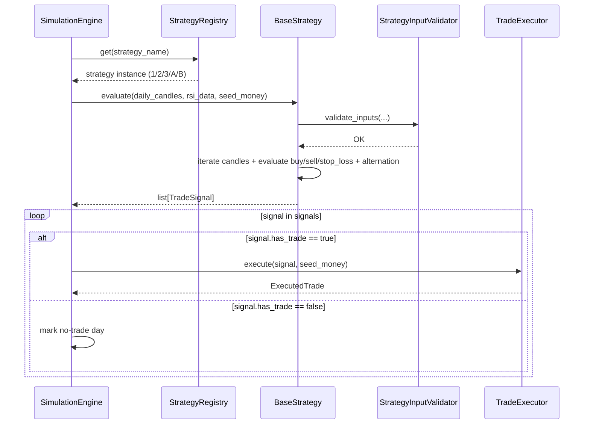
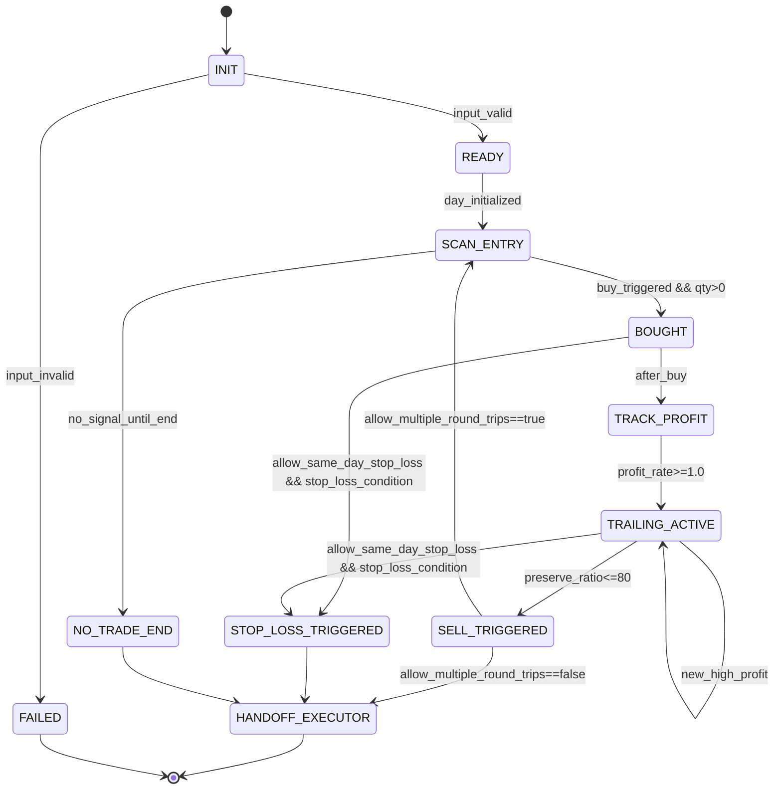

# 구현수준 설계 문서 (ILD)
# Implementation-Level Design Document - STRATEGY

| 항목 | 내용 |
|------|------|
| **문서 버전** | 1.1.0 |
| **작성일** | 2026-02-16 |
| **대상 모듈** | STRATEGY (전략 엔진 모듈) |
| **기반 문서** | LLD STRATEGY v1.1.0, HLD v1.1.0 (4.3, 5.x, 6.x, 7.x), SRS v1.1.0 (FR-003, FR-004, FR-005, FR-006, FR-016, FR-017, CON-006, CON-007, NFR-008) |
| **관련 티켓** | TICKET-070-ILD-STRATEGY |

---

## v1.1.0 변경 로그 (요약)

- 전략 A/B 구현 절차(클래스/메서드/반환 계약) 추가
- 전략 A/B 제약 반영: 당일 손절 미적용, 매수/매도 교대 강제
- `StrategyRegistry` 5전략 통합 계약 및 WebAPI/Frontend 전략 ID 계약 추가
- LLD v1.1.0 기준 LLD→ILD 추적성 테이블 추가

---

## 목차

1. [목적 및 범위](#1-목적-및-범위)
2. [구현 단위/파일 구조](#2-구현-단위파일-구조)
3. [외부/상위 모듈 계약 및 데이터 포맷](#3-외부상위-모듈-계약-및-데이터-포맷)
4. [컴포넌트 구현 계약 (클래스/함수 레벨)](#4-컴포넌트-구현-계약-클래스함수-레벨)
5. [정상 처리 시퀀스 (전략 선택 → 신호 생성)](#5-정상-처리-시퀀스-전략-선택--신호-생성)
6. [상태 전이 상세 (전략 내부 + 제약 불변식)](#6-상태-전이-상세-전략-내부--제약-불변식)
7. [에러 코드/예외 매핑 및 복구 시나리오](#7-에러-코드예외-매핑-및-복구-시나리오)
8. [전략별 핵심 규칙 구현 기준](#8-전략별-핵심-규칙-구현-기준)
9. [실행 가능한 언어 중립 수도코드](#9-실행-가능한-언어-중립-수도코드)
10. [LLD→ILD 추적성 매트릭스](#10-lldild-추적성-매트릭스)
11. [구현 체크리스트 (주니어 개발자용)](#11-구현-체크리스트-주니어-개발자용)

---

## 1. 목적 및 범위

### 1.1 목적

본 문서는 `lld-strategy-v1.1.0.md`를 실제 코드로 구현하기 위한 **구현 수준(ILD)** 명세를 제공한다. 특히 `BaseStrategy`, 기존 전략 1/2/3, 신규 전략 A/B, `StrategyRegistry`의 함수 시그니처/반환 계약/상태 전이/예외 모델을 코드 단위로 명확화하여 초급 개발자가 외부 문서 없이 구현 가능하도록 한다.

### 1.2 범위 (In-Scope)

- 전략 공통 템플릿 메서드(`evaluate`)와 상태 객체(`TradeContext`) 구현
- 전략 1/2/3/A/B의 매수·매도·손절 규칙 구현
- 전략 A/B 공통 제약 구현: **당일 손절 미적용(CON-006)**, **매수/매도 교대(CON-007)**
- `StrategyRegistry` 등록/조회/기본 등록 5전략 계약
- WebAPI/Frontend 전략 ID와 StrategyRegistry 이름의 통합 계약
- `TradeSignal` 생성 및 `SimulationEngine`/`TradeExecutor` 실행 핸드오프 계약
- LLD v1.1.0 항목에 대한 구현 추적성 확보

### 1.3 비범위 (Out-of-Scope)

- Yahoo Finance 조회 및 RSI 계산 알고리즘 자체 구현
- 매매 비용 계산 및 시드머니 정산 상세 구현
- REST/SSE 라우팅 계층 구현
- 결과 보고서 포맷팅 구현

---

## 2. 구현 단위/파일 구조

다음 구조를 기준으로 구현한다.

```text
src/
  strategy/
    __init__.py
    constants.py
    errors.py
    models.py
    strategy_input_validator.py
    base_strategy.py
    sell_trailing_stop_strategy.py
    buy_sell_trailing_stop_strategy.py
    rsi_buy_sell_trailing_stop_strategy.py
    rsi_only_trailing_stop_strategy.py
    buy_trailing_then_sell_trailing_strategy.py
    strategy_registry.py
```

### 2.1 파일별 책임

| 파일 | 주요 책임 |
|------|-----------|
| `constants.py` | 임계값/전략명/에러코드 상수 (`PROFIT_TRIGGER_RATE`, `PRESERVE_RATIO_THRESHOLD`, `ENTRY_DROP_RATE`, `REBOUND_RATE`, `RSI_BUY_THRESHOLD`) |
| `errors.py` | 전략 계층 도메인 예외와 에러코드 정의 |
| `models.py` | `TradeContext`, `TradeSignal`, `SellReason`, `ActionType` 정의 |
| `strategy_input_validator.py` | 캔들/RSI 정합성 및 필수 시점 검증 |
| `base_strategy.py` | 공통 템플릿 실행 흐름(`evaluate`)과 공통 계산 함수 |
| `sell_trailing_stop_strategy.py` | 전략1 로직 구현 |
| `buy_sell_trailing_stop_strategy.py` | 전략2 로직 구현 |
| `rsi_buy_sell_trailing_stop_strategy.py` | 전략3 로직 구현 |
| `rsi_only_trailing_stop_strategy.py` | 전략A 로직 구현 |
| `buy_trailing_then_sell_trailing_strategy.py` | 전략B 로직 구현 |
| `strategy_registry.py` | 전략 등록/조회/목록/중복 방지 |

---

## 3. 외부/상위 모듈 계약 및 데이터 포맷

### 3.1 상위 호출 계약 (`SimulationEngine` → `Strategy`)

| 호출 함수 | 파라미터 | 반환 | 실패 시 |
|----------|----------|------|---------|
| `strategy.evaluate(daily_candles, rsi_data, seed_money)` | `daily_candles: DataFrame`, `rsi_data: DataFrame|None`, `seed_money: Decimal` | `list[TradeSignal]` | `StrategyInputError`, `StrategyExecutionError` |

> 구현 계약: 기존 전략 1/2/3은 최대 1건 신호를 반환하고, 전략 A/B는 당일 복수 사이클에 따라 0..N건을 반환할 수 있다.

### 3.2 실행 핸드오프 계약 (`Strategy` → `TradeExecutor`)

전략은 직접 체결하지 않고 아래 스키마를 만족하는 `TradeSignal` 목록을 반환한다.

| 필드 | 타입 | 필수 | 설명 |
|------|------|------|------|
| `has_trade` | bool | Y | 거래 발생 여부 |
| `trade_date` | date | Y | 거래일 |
| `buy_datetime` | datetime? | N | 매수 시각 |
| `buy_price` | Decimal? | N | 매수 가격 |
| `buy_quantity` | int | Y | 매수 수량 (0 가능) |
| `sell_datetime` | datetime? | N | 매도 시각 |
| `sell_price` | Decimal? | N | 매도 가격 |
| `sell_reason` | SellReason | Y | `PROFIT_PRESERVE`, `STOP_LOSS`, `MARKET_CLOSE`, `NO_TRADE` |
| `meta` | dict[str, Any] | Y | 추적 정보 (`highest_profit_rate`, `preserve_ratio`, `rsi_at_entry`, `trade_cycles`, `alternation_blocked`) |

### 3.3 입력 데이터 계약 (`daily_candles`, `rsi_data`)

#### 3.3.1 `daily_candles`

| 필드 | 타입 | 제약 |
|------|------|------|
| `timestamp` | datetime(tz-aware) | KST, 5분 경계, 오름차순, 중복 없음 |
| `open/high/low/close` | Decimal/float | `high >= low`, `open/close ∈ [low, high]` |
| `volume` | int | `>= 0` |

#### 3.3.2 `rsi_data`

| 필드 | 타입 | 제약 |
|------|------|------|
| `timestamp` | datetime(tz-aware) | `daily_candles.timestamp`와 동일 정렬 |
| `rsi` | float | `0 <= rsi <= 100` 또는 NaN |

### 3.4 필수 시점 캔들 계약

| 전략 | 필수 캔들 | 이유 |
|------|-----------|------|
| 전략1 | 09:05, 15:05 | 09:05 매수, 15:05 손절가격 산출 |
| 전략2 | 09:05, 15:00 | 기준가 및 손절 컷오프 |
| 전략3 | 09:05, 15:00 | 기준가 및 손절 컷오프 |
| 전략A | 09:05 | 일중 순회 기준 시점 검증 |
| 전략B | 09:05 | 기준가 설정 |

### 3.5 StrategyRegistry 통합 계약

| 메서드 | 파라미터 | 반환 | 계약 |
|--------|----------|------|------|
| `register(strategy)` | `BaseStrategy` | `None` | 동일 이름 중복 등록 금지 (`E-ST-002`) |
| `get(name)` | `str` | `BaseStrategy` | 미등록 이름 조회 시 `E-ST-001` |
| `list_all()` | 없음 | `list[str]` | UI/API 허용 전략과 동일 집합 반환 |
| `register_defaults()` | 없음 | `None` | 기본 5전략 모두 등록 |

기본 등록 이름은 아래와 같아야 한다.

1. `sell_trailing_stop`
2. `buy_sell_trailing_stop`
3. `rsi_buy_sell_trailing_stop`
4. `rsi_only_trailing_stop` (전략 A)
5. `buy_trailing_then_sell_trailing` (전략 B)

### 3.6 WebAPI/Frontend 전략 ID 통합 계약

| 계층 | 필드/타입 | 허용 ID |
|------|-----------|---------|
| WebAPI 요청 바디 | `strategy: string` | 5전략 ID 전체 허용 |
| Frontend 도메인 타입 | `StrategyId` | 5전략 ID 전체 허용 |
| Frontend validator | `ALLOWED_STRATEGIES` | 5전략 ID와 일치 |
| StrategyRegistry | `get(name)` 인자 | 동일 문자열로 조회 가능 |

#### 3.6.1 ID 매핑 규칙

| Strategy ID | 클래스명 |
|-------------|----------|
| `sell_trailing_stop` | `SellTrailingStopStrategy` |
| `buy_sell_trailing_stop` | `BuySellTrailingStopStrategy` |
| `rsi_buy_sell_trailing_stop` | `RSIBuySellTrailingStopStrategy` |
| `rsi_only_trailing_stop` | `RSIOnlyTrailingStopStrategy` |
| `buy_trailing_then_sell_trailing` | `BuyTrailingThenSellTrailingStrategy` |

---

## 4. 컴포넌트 구현 계약 (클래스/함수 레벨)

### 4.1 `BaseStrategy`

#### 4.1.1 공개 인터페이스

| 메서드 | 시그니처 | 반환 계약 | 예외 |
|--------|----------|-----------|------|
| `evaluate` | `(daily_candles: DataFrame, rsi_data: DataFrame|None, seed_money: Decimal) -> list[TradeSignal]` | 시간순 순회 후 `TradeSignal` 목록 반환 (`[]` 금지, 미체결 시 `NO_TRADE` 1건 반환) | `StrategyInputError`, `StrategyExecutionError` |
| `initialize_day` | `(candle_0905: Series, seed_money: Decimal) -> TradeContext` | 전략별 초기 상태 구성 | `StrategyInputError` |
| `should_buy` | `(candle: Series, context: TradeContext, rsi_value: float|None = None) -> bool` | True면 신규 포지션 진입 시도 | - |
| `should_sell` | `(candle: Series, context: TradeContext) -> bool` | True면 `PROFIT_PRESERVE` 매도 | - |
| `should_stop_loss` | `(candle: Series, context: TradeContext) -> bool` | True면 `STOP_LOSS` 분기 | - |
| `can_open_new_position` | `(context: TradeContext) -> bool` | A/B의 교대 제약 평가에 사용 | `AlternationRuleViolationError` |

#### 4.1.2 `evaluate` 내부 단계 (반드시 준수)

1. `validate_inputs` 수행.
2. 09:05 캔들 조회 후 `initialize_day` 호출.
3. 캔들 시간순 순회.
4. 미보유 상태면 `should_buy`와 `can_open_new_position` 평가.
5. 매수 시 수량 `floor(seed_money / buy_price)` 계산.
6. `buy_quantity == 0`이면 해당 시도 스킵(`meta.insufficient_seed=true`) 후 다음 캔들 진행.
7. 보유 중 매 캔들마다 수익률/최고수익률/보전율 갱신.
8. `should_sell` True 시 `PROFIT_PRESERVE` 신호를 append.
9. `allow_same_day_stop_loss=True`인 경우에만 `should_stop_loss` 분기 허용.
10. `allow_multiple_round_trips=False`인 전략은 첫 매도 후 루프 종료.
11. 결과 신호가 없으면 `NO_TRADE` 1건 반환.

#### 4.1.3 내부 보조 함수 계약

| 함수 | 입력 | 출력 | 규칙 |
|------|------|------|------|
| `_calc_profit_rate(buy_price, now_price)` | Decimal, Decimal | Decimal(%) | Decimal 연산 사용 |
| `_calc_preserve_ratio(current_profit, highest_profit)` | Decimal, Decimal | Decimal(%) | `highest_profit <= 0`이면 0 |
| `_lookup_rsi(rsi_data, ts)` | DataFrame|None, datetime | float|None | 미존재/NaN은 None |
| `_build_signal(context, sell_ts, sell_price, reason)` | 컨텍스트 + 체결정보 | TradeSignal | `meta`에 추적값 포함 |

### 4.2 `SellTrailingStopStrategy` (전략1)

| 메서드 | 구현 규칙 |
|--------|-----------|
| `name() -> str` | `sell_trailing_stop` 고정 |
| `initialize_day(...) -> TradeContext` | `allow_same_day_stop_loss=True`, `allow_multiple_round_trips=False` |
| `should_buy(...) -> bool` | `candle.time == 09:05`일 때만 True |
| `should_sell(...) -> bool` | trailing 시작 후 `preserve_ratio <= 80`이면 True |
| `should_stop_loss(...) -> bool` | `candle.time == 15:00` AND trailing 미시작 |
| `resolve_stop_loss_fill(...) -> tuple[datetime, Decimal]` | 체결 시각 `15:05`, 가격 `close@15:05` |

### 4.3 `BuySellTrailingStopStrategy` (전략2)

| 메서드 | 구현 규칙 |
|--------|-----------|
| `name() -> str` | `buy_sell_trailing_stop` 고정 |
| `initialize_day(...) -> TradeContext` | `reference_price=close@09:05`, `low_point=None`, 손절 허용 |
| `should_buy(...) -> bool` | 1.0% 하락 시작 후 전저점 대비 0.2% 반등이면 True |
| `should_sell(...) -> bool` | 전략1과 동일 |
| `should_stop_loss(...) -> bool` | `candle.time == 15:00` AND trailing 미시작 |
| `resolve_stop_loss_fill(...) -> tuple[datetime, Decimal]` | 체결 시각 `15:00`, 가격 `close@15:00` |

### 4.4 `RSIBuySellTrailingStopStrategy` (전략3)

| 메서드 | 구현 규칙 |
|--------|-----------|
| `name() -> str` | `rsi_buy_sell_trailing_stop` 고정 |
| `initialize_day(...) -> TradeContext` | 전략2와 동일 |
| `should_buy(...) -> bool` | 전략2 매수조건 AND `rsi <= 30` |
| `should_sell(...) -> bool` | 전략1과 동일 |
| `should_stop_loss(...) -> bool` | 전략2와 동일 |
| `resolve_stop_loss_fill(...) -> tuple[datetime, Decimal]` | 전략2와 동일 |

### 4.5 `RSIOnlyTrailingStopStrategy` (전략A)

#### 4.5.1 클래스/메서드 시그니처 및 반환 계약

| 메서드 | 시그니처 | 반환 계약 |
|--------|----------|-----------|
| `name` | `() -> str` | 항상 `rsi_only_trailing_stop` |
| `initialize_day` | `(candle_0905: Series, seed_money: Decimal) -> TradeContext` | `allow_same_day_stop_loss=False`, `allow_multiple_round_trips=True`, `last_action=NONE` |
| `should_buy` | `(candle: Series, context: TradeContext, rsi_value: float|None=None) -> bool` | `rsi_value <= 30`이고 교대 규칙 통과 시 True |
| `should_sell` | `(candle: Series, context: TradeContext) -> bool` | trailing 시작 후 `preserve_ratio <= 80`이면 True |
| `should_stop_loss` | `(candle: Series, context: TradeContext) -> bool` | **항상 False (당일 손절 미적용)** |
| `can_open_new_position` | `(context: TradeContext) -> bool` | `is_bought=False` AND `last_action != BUY`일 때 True |

#### 4.5.2 구현 절차

1. `initialize_day`에서 `allow_same_day_stop_loss=False`를 명시 설정한다.
2. `should_buy`는 RSI 값 누락/NaN이면 False 반환하고 `meta.rsi_missing=true`를 기록한다.
3. `can_open_new_position`에서 `last_action == BUY`인 경우 신규 BUY를 차단한다.
4. BUY 체결 시 `last_action=BUY`, SELL 체결 시 `last_action=SELL`, `trade_cycles += 1`로 상태 전이한다.
5. `should_stop_loss`는 모든 캔들에서 False를 반환해야 하며, 손절 분기 코드를 호출하지 않는다.

### 4.6 `BuyTrailingThenSellTrailingStrategy` (전략B)

#### 4.6.1 클래스/메서드 시그니처 및 반환 계약

| 메서드 | 시그니처 | 반환 계약 |
|--------|----------|-----------|
| `name` | `() -> str` | 항상 `buy_trailing_then_sell_trailing` |
| `initialize_day` | `(candle_0905: Series, seed_money: Decimal) -> TradeContext` | `reference_price=close@09:05`, `allow_same_day_stop_loss=False`, `allow_multiple_round_trips=True` |
| `should_buy` | `(candle: Series, context: TradeContext, rsi_value: float|None=None) -> bool` | 전략2 하락/반등 충족 + 교대 규칙 통과 시 True |
| `should_sell` | `(candle: Series, context: TradeContext) -> bool` | trailing 시작 후 `preserve_ratio <= 80`이면 True |
| `should_stop_loss` | `(candle: Series, context: TradeContext) -> bool` | **항상 False (당일 손절 미적용)** |
| `can_open_new_position` | `(context: TradeContext) -> bool` | `is_bought=False` AND `last_action != BUY`일 때 True |

#### 4.6.2 구현 절차

1. `initialize_day`에서 기준가(`reference_price`)를 09:05 종가로 설정한다.
2. `should_buy`는 하락률 1.0% 진입 후 전저점 갱신, 반등률 0.2% 조건을 평가한다.
3. 교대 제약은 `can_open_new_position`으로 강제하고 위반 시 매수 시도를 스킵한다.
4. BUY/SELL 체결 시 `last_action`과 `trade_cycles`를 일관되게 업데이트한다.
5. `should_stop_loss`는 항상 False를 반환하고 15:00 손절 분기를 비활성화한다.

### 4.7 `StrategyRegistry`

#### 4.7.1 공개 인터페이스

| 메서드 | 파라미터 | 반환 | 예외 |
|--------|----------|------|------|
| `register(strategy)` | `BaseStrategy` | `None` | `DuplicateStrategyError(E-ST-002)` |
| `get(name)` | `str` | `BaseStrategy` | `StrategyNotFoundError(E-ST-001)` |
| `list_all()` | - | `list[str]` | - |
| `register_defaults()` | - | `None` | `DuplicateStrategyError` |

#### 4.7.2 기본 등록 정책 (5전략)

1. `sell_trailing_stop`
2. `buy_sell_trailing_stop`
3. `rsi_buy_sell_trailing_stop`
4. `rsi_only_trailing_stop`
5. `buy_trailing_then_sell_trailing`

---

## 5. 정상 처리 시퀀스 (전략 선택 → 신호 생성)



### 5.1 내부 호출 순서 고정 규칙

1. 입력 검증 실패 시 전략 판단 로직 호출 금지.
2. `should_buy`는 미보유 상태에서만 호출.
3. `should_sell`/`should_stop_loss`는 보유 상태에서만 호출.
4. 전략 A/B는 `allow_same_day_stop_loss=False`이므로 손절 분기 호출 금지.
5. 전략 A/B는 `BUY->SELL->BUY->SELL` 교대 외 거래 순서 금지.
6. `TradeSignal`은 `TradeExecutor`가 비용 계산 가능한 필드를 모두 포함해야 한다.

---

## 6. 상태 전이 상세 (전략 내부 + 제약 불변식)

### 6.1 전략 상태 머신



### 6.2 상태별 불변조건

| 상태 | 불변 조건 |
|------|-----------|
| `SCAN_ENTRY` | `context.is_bought == False` |
| `BOUGHT` | `buy_price > 0`, `buy_quantity > 0`, `buy_datetime != None` |
| `TRAILING_ACTIVE` | `highest_profit_rate >= 1.0`, `is_trailing_started == True` |
| `SELL_TRIGGERED` | `sell_reason == PROFIT_PRESERVE`, `last_action == SELL` |
| `STOP_LOSS_TRIGGERED` | `sell_reason == STOP_LOSS`, `allow_same_day_stop_loss == True` |
| `NO_TRADE_END` | `has_trade == False`, `sell_reason == NO_TRADE` |

### 6.3 전략 A/B 제약 불변식

| 제약 | 구현 불변식 | 위반 처리 |
|------|-------------|-----------|
| CON-006 무손절 | `allow_same_day_stop_loss=False`, `should_stop_loss()` 항상 False | 손절 분기 미실행 |
| CON-007 교대 강제 | `last_action==BUY` 상태에서 BUY 금지 | 매수 시도 스킵 또는 `AlternationRuleViolationError` |
| 보유 중 재매수 금지 | `is_bought=True`면 `should_buy=False` | 매수 스킵 |

---

## 7. 에러 코드/예외 매핑 및 복구 시나리오

### 7.1 에러 코드 매핑

| 코드 | 예외 타입 | 발생 지점 | 상위 전달 메시지 키 | 복구 방식 |
|------|-----------|-----------|----------------------|-----------|
| `E-ST-001` | `StrategyNotFoundError` | `StrategyRegistry.get` | `strategy_not_found` | 시뮬레이션 시작 실패 |
| `E-ST-002` | `DuplicateStrategyError` | `StrategyRegistry.register` | `strategy_duplicate_registration` | 앱 기동 실패/중복 무시 정책 |
| `E-ST-003` | `StrategyInputError` | 필수 컬럼 누락 | `strategy_input_missing_columns` | 당일 실패 처리 |
| `E-ST-004` | `StrategyInputError` | 필수 시각 캔들 누락 | `strategy_input_missing_mandatory_candle` | 당일 NO_TRADE/오류 정책 |
| `E-ST-005` | `StrategyInputError` | timestamp 정렬/타임존 오류 | `strategy_input_invalid_timestamp` | 당일 실패 처리 |
| `E-ST-006` | `RSIDataMissingError` | 전략3/A 매수 시점 RSI 누락/NaN | `strategy_rsi_missing` | 해당 캔들 매수 스킵 |
| `E-ST-007` | `InsufficientSeedMoneyError` | `buy_quantity == 0` | `strategy_insufficient_seed` | 해당 시점 매수 스킵 |
| `E-ST-008` | `StrategyExecutionError` | 수치 연산/상태 전이 불일치 | `strategy_execution_failed` | 해당 거래일 오류 처리 |
| `E-ST-009` | `AlternationRuleViolationError` | A/B에서 `BUY->BUY` 시도 | `strategy_alternation_violation` | 시도 거절 후 계속 진행 |

### 7.2 복구 시나리오

| 시나리오 | 감지 조건 | 복구 동작 | 최종 결과 |
|----------|-----------|-----------|-----------|
| RSI 누락 (전략3/A) | `rsi_value is None/NaN` | 매수 스킵, `meta.rsi_missing=true` | 동일 거래일 평가 지속 |
| 시드머니 부족 | `floor(seed_money/buy_price)==0` | 해당 시점 BUY 포기, 다음 캔들 진행 | 해당 거래일 계속 평가 |
| 교대 규칙 위반 (A/B) | `last_action==BUY` 상태 BUY 시도 | `meta.alternation_blocked=true` 기록 | 동일 거래일 평가 지속 |
| 필수 캔들 누락 | 09:05/15:00/15:05 조회 실패 | `E-ST-004` 발생 | 상위 정책 의존 |

### 7.3 예외 전파 규칙

1. 전략 내부 저수준 예외는 `Strategy*Error` 도메인 예외로 변환한다.
2. 에러코드(`E-ST-xxx`)를 `meta.error_code`에 포함하여 상위 로깅·메시지 매핑에 사용한다.
3. 복구 가능한 오류(`E-ST-006`, `E-ST-007`, `E-ST-009`)는 예외 대신 스킵 흐름을 우선 사용한다.

---

## 8. 전략별 핵심 규칙 구현 기준

### 8.1 공통 계산식

- 수익률(%) = `((현재가 - 매수가) / 매수가) * 100`
- 하락률(%) = `((기준가 - 현재가) / 기준가) * 100`
- 반등률(%) = `((현재가 - 전저점) / 전저점) * 100`
- 이익보전율(%) = `(현재 수익률 / 당일 최고 수익률) * 100`

### 8.2 전략1 구현 기준 (FR-003)

1. 09:05 종가로 1회 매수.
2. 수익률 최초 1.0% 도달 시 trailing 시작.
3. trailing 시작 이후 `preserve_ratio <= 80`이면 즉시 매도.
4. 15:00까지 trailing 미시작이면 15:05 종가 손절.

### 8.3 전략2 구현 기준 (FR-004)

1. 기준가 = 09:05 종가.
2. 1.0% 이상 하락 시 전저점 추적 시작.
3. 전저점 갱신 중 0.2% 이상 반등하면 매수.
4. 15:00까지 매수 조건 미충족이면 `NO_TRADE`.
5. 매수 후 매도/손절 규칙은 전략1과 동일하되 손절 체결은 15:00.

### 8.4 전략3 구현 기준 (FR-005)

1. 전략2 매수 트리거 성립 시 RSI 조건 추가 확인.
2. `RSI <= 30`이면 매수, `RSI > 30` 또는 누락이면 스킵.
3. RSI 스킵은 오류가 아니라 재평가 가능한 정상 분기.
4. 매도/손절은 전략2와 동일.

### 8.5 전략A 구현 기준 (FR-016, CON-006, CON-007)

1. RSI 값이 `<= 30`이고 미보유 상태일 때만 매수 가능.
2. `last_action == BUY` 상태에서는 매수 시도를 차단한다(교대 강제).
3. 매수 후 수익률 1.0% 도달 시 trailing 시작.
4. trailing 시작 후 `preserve_ratio <= 80`이면 매도.
5. **당일 손절(15:00 강제 손절)을 적용하지 않는다.**
6. 체결 시마다 `last_action`과 `trade_cycles`를 갱신한다.

### 8.6 전략B 구현 기준 (FR-017, CON-006, CON-007)

1. 기준가 = 09:05 종가.
2. 1.0% 하락 구간에서 전저점 추적, 0.2% 반등 시 매수 후보.
3. `last_action == BUY` 또는 보유 중이면 매수 금지.
4. 매수 후 수익률 1.0% 도달 시 trailing 시작.
5. trailing 시작 후 `preserve_ratio <= 80`이면 매도.
6. **당일 손절(15:00 강제 손절)을 적용하지 않는다.**

### 8.7 확장성 구현 기준 (FR-006, NFR-008)

1. 신규 전략은 `BaseStrategy` 하위 클래스로만 추가한다.
2. 기존 전략 분기문 수정 없이 `StrategyRegistry.register`로 연결한다.
3. `TradeSignal` 기본 스키마는 유지하고 신규 정보는 `meta`에만 추가한다.
4. 확장 시 기존 전략 1/2/3 결과 불변 회귀를 포함한다.

---

## 9. 실행 가능한 언어 중립 수도코드

### 9.1 공통 템플릿 (`BaseStrategy.evaluate`)

```text
function evaluate(daily_candles, rsi_data, seed_money):
    validate_inputs(daily_candles, rsi_data, strategy_name)

    candle_0905 = must_find_candle(daily_candles, "09:05")
    context = initialize_day(candle_0905, seed_money)
    signals = []

    for candle in daily_candles ordered by timestamp:
        if context.is_bought == false:
            rsi_value = lookup_rsi(rsi_data, candle.timestamp)

            if should_buy(candle, context, rsi_value):
                if can_open_new_position(context) == false:
                    context.meta.alternation_blocked = true
                    continue

                buy_price = to_decimal(candle.close)
                qty = floor(seed_money / buy_price)
                if qty <= 0:
                    context.meta.insufficient_seed = true
                    continue

                context = mark_buy(context, candle.timestamp, buy_price, qty)
                context.last_action = BUY
                continue

        if context.is_bought == true:
            update_profit_state(context, candle.close)

            if should_sell(candle, context):
                signals.append(make_trade_signal(context, candle.timestamp, candle.close, "PROFIT_PRESERVE"))
                context = mark_sell(context)
                context.last_action = SELL
                context.trade_cycles += 1

                if context.allow_multiple_round_trips == false:
                    break
                else:
                    continue

            if context.allow_same_day_stop_loss and should_stop_loss(candle, context):
                stop_ts, stop_price = resolve_stop_loss_fill(daily_candles)
                signals.append(make_trade_signal(context, stop_ts, stop_price, "STOP_LOSS"))
                context = mark_sell(context)
                context.last_action = SELL
                context.trade_cycles += 1
                break

    if signals is empty:
        return [make_no_trade_signal(context.trade_date, "NO_ENTRY_OR_EXIT")]

    return signals
```

### 9.2 전략A (`RSIOnlyTrailingStopStrategy`) 구현 수도코드

```text
class RSIOnlyTrailingStopStrategy(BaseStrategy):

    function name() -> str:
        return "rsi_only_trailing_stop"

    function initialize_day(candle_0905, seed_money) -> TradeContext:
        context = build_default_context(candle_0905.date, seed_money)
        context.allow_same_day_stop_loss = false
        context.allow_multiple_round_trips = true
        context.last_action = NONE
        return context

    function can_open_new_position(context) -> bool:
        if context.is_bought:
            return false
        if context.last_action == BUY:
            raise AlternationRuleViolationError(code="E-ST-009")
        return true

    function should_buy(candle, context, rsi_value=None) -> bool:
        if rsi_value is null or isNaN(rsi_value):
            context.meta.rsi_missing = true
            return false
        if rsi_value <= 30 and can_open_new_position(context):
            return true
        return false

    function should_sell(candle, context) -> bool:
        return should_sell_by_trailing_rule(context, candle.close)

    function should_stop_loss(candle, context) -> bool:
        return false
```

### 9.3 전략B (`BuyTrailingThenSellTrailingStrategy`) 구현 수도코드

```text
class BuyTrailingThenSellTrailingStrategy(BaseStrategy):

    function name() -> str:
        return "buy_trailing_then_sell_trailing"

    function initialize_day(candle_0905, seed_money) -> TradeContext:
        context = build_default_context(candle_0905.date, seed_money)
        context.reference_price = candle_0905.close
        context.low_point = null
        context.allow_same_day_stop_loss = false
        context.allow_multiple_round_trips = true
        context.last_action = NONE
        return context

    function can_open_new_position(context) -> bool:
        if context.is_bought:
            return false
        if context.last_action == BUY:
            raise AlternationRuleViolationError(code="E-ST-009")
        return true

    function should_buy(candle, context, _=None) -> bool:
        if candle.time <= "09:05":
            return false

        drop_rate = ((context.reference_price - candle.close) / context.reference_price) * 100

        if context.low_point is null and drop_rate >= 1.0:
            context.low_point = candle.close
            return false

        if context.low_point is not null:
            context.low_point = min(context.low_point, candle.close)
            rebound_rate = ((candle.close - context.low_point) / context.low_point) * 100
            if rebound_rate >= 0.2 and can_open_new_position(context):
                return true

        return false

    function should_sell(candle, context) -> bool:
        return should_sell_by_trailing_rule(context, candle.close)

    function should_stop_loss(candle, context) -> bool:
        return false
```

### 9.4 `StrategyRegistry` 구현 수도코드

```text
function register(strategy):
    name = strategy.name()
    if name in registry:
        raise DuplicateStrategyError(code="E-ST-002")
    registry[name] = strategy

function get(name):
    if name not in registry:
        raise StrategyNotFoundError(code="E-ST-001")
    return registry[name]

function register_defaults():
    register(SellTrailingStopStrategy())
    register(BuySellTrailingStopStrategy())
    register(RSIBuySellTrailingStopStrategy())
    register(RSIOnlyTrailingStopStrategy())
    register(BuyTrailingThenSellTrailingStrategy())
```

---

## 10. LLD→ILD 추적성 매트릭스

| LLD 항목 | LLD 내용 요약 | ILD 반영 절 | 구현 산출물/계약 |
|----------|---------------|-------------|------------------|
| 2.2 | `BaseStrategy.evaluate -> list[TradeSignal]` 및 제약 플래그 | 4.1, 9.1 | 공통 템플릿, 다중 시그널 반환 계약 |
| 2.6 | 전략 A(`RSIOnlyTrailingStopStrategy`) 인터페이스 | 4.5, 8.5, 9.2 | RSI<=30 진입, 무손절, 교대 제약 |
| 2.7 | 전략 B(`BuyTrailingThenSellTrailingStrategy`) 인터페이스 | 4.6, 8.6, 9.3 | 하락/반등 진입, 무손절, 교대 제약 |
| 2.8 | `StrategyRegistry` 5전략 기본 등록 | 3.5, 4.7, 9.4 | 5전략 ID 등록/조회/중복 방지 |
| 4.7 | A/B 공통 제약(CON-006/007) | 6.3, 7.1, 8.5, 8.6 | 손절 비활성, `BUY->SELL` 교대 강제 |
| 5.1 | 교대 위반 비치명 처리 | 7.1, 7.2 | `E-ST-009` + 스킵/계속 진행 |
| 6.2/6.3 | 필수 캔들/RSI 검증 규칙 | 3.3, 3.4, 7.1 | 입력 검증 및 누락 복구 정책 |
| 7.4 | 기존 전략 1/2/3 하위 호환 | 4.2~4.4, 8.2~8.4 | 기존 손절/단일 사이클 규칙 유지 |
| 9 | 요구사항 추적(FR-016/017, CON-006/007) | 8.5, 8.6, 10 | A/B 구현 및 제약 근거 연결 |
| 3.1/3.2/3.3 | 전략 식별자 기반 실행 시퀀스 | 3.5, 3.6, 5 | Registry↔WebAPI↔Frontend ID 통합 계약 |

---

## 11. 구현 체크리스트 (주니어 개발자용)

### 11.1 구현 순서

1. `errors.py`, `constants.py`, `models.py`에 A/B 관련 enum/플래그/에러코드를 추가한다.
2. `BaseStrategy.evaluate`를 `list[TradeSignal]` 반환 계약에 맞게 정리한다.
3. 전략 A/B 클래스 파일을 생성하고 `name`, `initialize_day`, `should_buy`, `should_sell`, `should_stop_loss`, `can_open_new_position`를 구현한다.
4. `StrategyRegistry.register_defaults`에 5전략 기본 등록을 반영한다.
5. WebAPI `strategy` 허용값과 Frontend `StrategyId`/validator/options를 5전략으로 확장한다.
6. 기존 전략 1/2/3 회귀 확인(동일 입력/동일 출력)을 수행한다.
7. A/B 제약 시나리오(무손절, 교대 위반, RSI 누락)를 단위 테스트로 검증한다.

### 11.2 구현 완료 기준 (Definition of Done)

- 전략 A/B 클래스가 문서 시그니처와 동일한 반환 계약을 충족한다.
- 전략 A/B에서 `should_stop_loss()`는 항상 False를 반환한다.
- 전략 A/B에서 연속 BUY가 발생하지 않고 `BUY->SELL` 교대가 보장된다.
- `StrategyRegistry.list_all()`과 WebAPI/Frontend 허용 전략 ID 집합이 100% 일치한다.
- LLD→ILD 추적성 항목이 누락 없이 연결되어 검토 PASS를 획득한다.

---

## 변경 이력

| 버전 | 날짜 | 변경 내용 | 작성자 |
|------|------|----------|--------|
| 1.0.0 | 2026-02-16 | 최초 작성 (전략 1/2/3) | ILD 담당 에이전트 |
| 1.1.0 | 2026-02-16 | 전략 A/B 구현 절차, 무손절/교대 제약, Registry/WebAPI/Frontend ID 통합 계약, LLD→ILD 추적성 추가 | ILD 담당 에이전트 |
