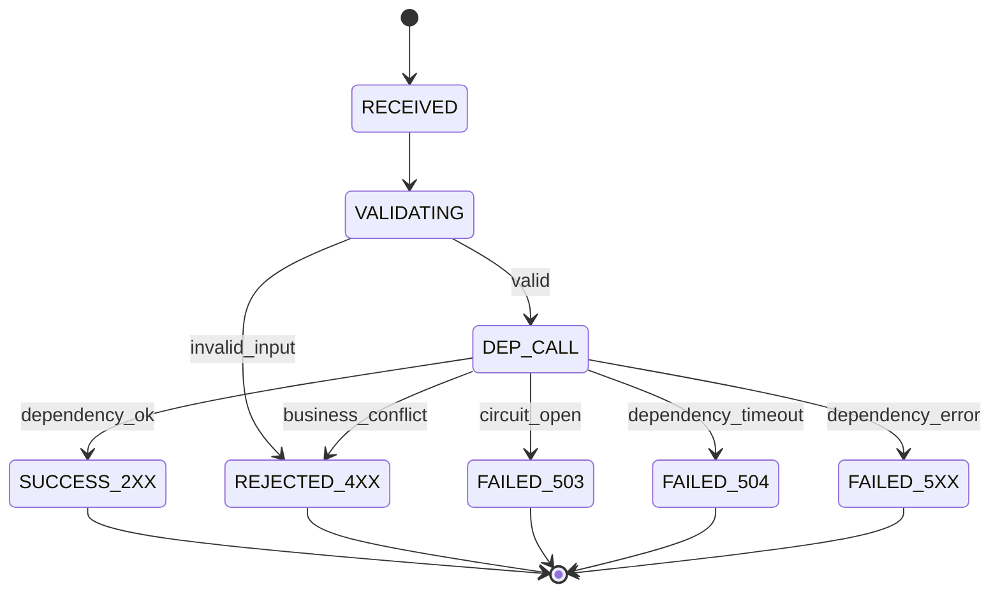
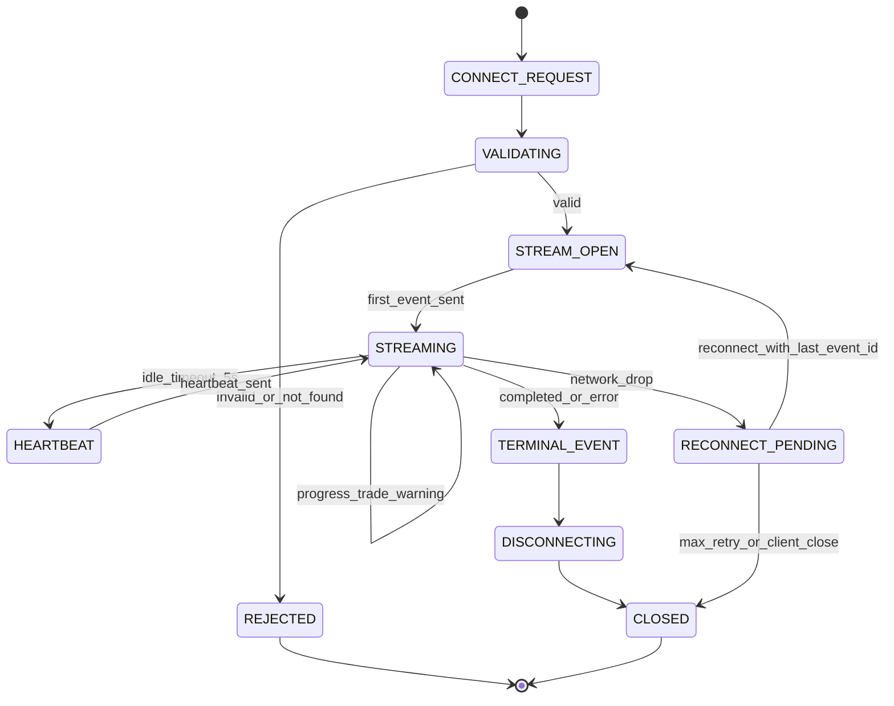

# 구현수준 설계 문서 (ILD)
# Implementation-Level Design Document - WEBAPI

| 항목 | 내용 |
|------|------|
| **문서 버전** | 1.0.0 |
| **작성일** | 2026-02-16 |
| **대상 모듈** | WEBAPI (웹 API 모듈) |
| **기반 문서** | LLD WEBAPI v1.0.0, HLD v1.0.0 (4.5, 5.1~5.3, 6.2, 9.x), SRS v1.0.0 (FR-010, FR-011, FR-012), ILD SIMULATION/REPORT v1.0.0 |
| **관련 티켓** | TICKET-013-ILD-WEBAPI |

---

## 목차

1. [목적 및 범위](#1-목적-및-범위)
2. [구현 단위/파일 구조](#2-구현-단위파일-구조)
3. [의존 모듈 호출 계약 (Simulation/Report)](#3-의존-모듈-호출-계약-simulationreport)
4. [핸들러 레벨 REST 계약 (요청/검증/응답)](#4-핸들러-레벨-rest-계약-요청검증응답)
5. [SSE 연결 수명주기/재연결/순서·멱등 규칙](#5-sse-연결-수명주기재연결순서멱등-규칙)
6. [예외→HTTP 매핑 및 타임아웃/서킷브레이커 정책](#6-예외http-매핑-및-타임아웃서킷브레이커-정책)
7. [상태 전이 상세 (REST + SSE)](#7-상태-전이-상세-rest--sse)
8. [실행 가능한 언어 중립 수도코드](#8-실행-가능한-언어-중립-수도코드)
9. [요구사항/설계 추적성 매트릭스 (SRS + LLD)](#9-요구사항설계-추적성-매트릭스-srs--lld)
10. [구현 체크리스트 (주니어 개발자용)](#10-구현-체크리스트-주니어-개발자용)

---

## 1. 목적 및 범위

### 1.1 목적

본 문서는 `lld-webapi-v1.0.0.md`를 실제 코드로 구현하기 위한 **구현 수준(ILD)** 명세를 제공한다. 특히 REST/SSE 핸들러 함수 계약, 요청 검증 규칙, 표준 응답 스키마, 예외 매핑, 타임아웃/서킷브레이커, 이벤트 수명주기/재연결/순서·멱등 규칙을 코드 관점으로 고정하여 초급 개발자가 문서만으로 구현할 수 있게 한다.

### 1.2 범위 (In-Scope)

- `POST /api/simulations`, `GET /api/simulations`, `GET /api/simulations/{id}`, `GET /api/simulations/{id}/report` 구현 계약
- `GET /api/simulations/{id}/stream` SSE 연결 생명주기 및 이벤트 직렬화 규칙
- RequestValidator/ResponseFormatter/ErrorHandler/CORSMiddleware 구현 규칙
- Simulation/Report 의존 호출 계약 및 실패 전파 규칙
- FR-010~FR-012 구현 추적성 확보

### 1.3 비범위 (Out-of-Scope)

- 시세 조회/RSI 산출 구현
- 전략 실행 로직 구현
- 60일 시뮬레이션 루프/비용 계산 구현
- 보고서 내부 집계 계산 구현

---

## 2. 구현 단위/파일 구조

다음 구조를 기준으로 구현한다.

```text
src/
  webapi/
    __init__.py
    constants.py
    errors.py
    models.py
    validators.py
    response_formatter.py
    error_handler.py
    middleware/
      cors.py
      request_context.py
    routers/
      simulation_router.py
      sse_router.py
    services/
      simulation_facade.py
      report_facade.py
      stream_session_manager.py
      circuit_breaker.py
      timeout_policy.py
```

### 2.1 파일별 책임

| 파일 | 주요 책임 |
|------|-----------|
| `constants.py` | API 경로/헤더/타임아웃/하트비트/재시도 상수 |
| `errors.py` | WEBAPI 예외 + 표준 에러코드 열거 |
| `models.py` | 요청/응답 DTO, SSE 이벤트 DTO, 공통 Envelope 스키마 |
| `validators.py` | path/query/body 유효성 검증 및 에러 변환 |
| `response_formatter.py` | `ApiEnvelope` 성공/실패 응답 생성 |
| `error_handler.py` | 예외→HTTP 상태코드/에러코드 변환 |
| `middleware/cors.py` | 환경별 CORS 허용 정책 |
| `middleware/request_context.py` | `request_id`, 타임스탬프, 로깅 컨텍스트 |
| `routers/simulation_router.py` | REST 엔드포인트 핸들러 |
| `routers/sse_router.py` | SSE 스트림 핸들러 |
| `services/simulation_facade.py` | Simulation 모듈 호출 어댑터 |
| `services/report_facade.py` | Report 모듈 호출 어댑터 |
| `services/stream_session_manager.py` | SSE 세션/버퍼/Last-Event-ID 관리 |
| `services/circuit_breaker.py` | 의존 모듈 장애 격리/복구 |
| `services/timeout_policy.py` | 엔드포인트별 시간 예산 적용 |

---

## 3. 의존 모듈 호출 계약 (Simulation/Report)

### 3.1 WEBAPI → SIMULATION 계약

`ild-simulation-v1.0.0.md` 3.1/4.1을 준수한다.

| WEBAPI 호출 | 하위 모듈 호출 | 입력 | 출력 | 실패 시 |
|------------|---------------|------|------|---------|
| 시뮬레이션 시작 | `SimulationEngine.run_simulation(request)` (비동기 워커 enqueue/dispatch) | `SimulationRequest(symbol, strategy_name, initial_seed=10000000)` | `simulation_id`, `status=queued|running` | `SimulationValidationError`, `SimulationFatalError` |
| 상태 조회 | `SimulationQueryService.get_status(simulation_id)` | `simulation_id` | `SimulationStatus` | `SimulationNotFoundError` |
| 목록 조회 | `SimulationQueryService.list_status(filters)` | `status?`, `offset`, `limit` | `list[SimulationStatus]` | `StorageError` |
| 이벤트 구독 | `SimulationEventEmitter` 저장 이벤트 조회/구독 | `simulation_id`, `last_event_id?` | `SimulationEvent` stream | `StreamUnavailableError` |

### 3.2 WEBAPI → REPORT 계약

`ild-report-v1.0.0.md` 6장/9.1의 `generate_report` 계약을 준수한다.

| WEBAPI 호출 | 하위 모듈 호출 | 입력 | 출력 | 실패 시 |
|------------|---------------|------|------|---------|
| 결과 조회 | `ReportService.generate_report(simulation_id, query)` | `simulation_id`, `schema_version='1.0'`, `include_no_trade=true`, `sort_order='asc'` | `ComprehensiveReport` | `ReportNotFoundError`, `SchemaVersionError`, `ReportCalculationError` |

### 3.3 호출 순서/타임박스 규칙

1. `POST /api/simulations`: 검증 완료 후 `start_simulation` 호출, **1.5초 내** 수락 응답 반환.
2. `GET /api/simulations/{id}`: 저장소/쿼리 호출 **1.0초 내** 완료.
3. `GET /api/simulations/{id}/report`: `generate_report` **2.0초 내** 완료 목표, 초과 시 타임아웃 매핑.
4. `GET /stream`: 구독 준비 완료 후 즉시 헤더 송신, 최초 이벤트는 연결 후 **1초 이내** `progress` 또는 `heartbeat` 보장.

---

## 4. 핸들러 레벨 REST 계약 (요청/검증/응답)

### 4.1 공통 응답 스키마 (`ApiEnvelope<T>`)

#### 4.1.1 성공

```json
{
  "success": true,
  "data": {},
  "meta": {
    "request_id": "REQ-20260216-000123",
    "timestamp": "2026-02-16T10:12:33+09:00"
  }
}
```

#### 4.1.2 실패

```json
{
  "success": false,
  "error": {
    "code": "INVALID_SYMBOL",
    "message": "유효하지 않은 종목 심볼입니다",
    "details": {
      "field": "symbol",
      "rule": "^[0-9]{6}\\.KS$"
    }
  },
  "meta": {
    "request_id": "REQ-20260216-000124",
    "timestamp": "2026-02-16T10:12:35+09:00"
  }
}
```

### 4.2 `POST /api/simulations`

#### 4.2.1 요청 계약

| 필드 | 타입 | 필수 | 검증 규칙 |
|------|------|------|-----------|
| `symbol` | string | Y | `^[0-9]{6}\.KS$`, 공백 불가 |
| `strategy` | string | Y | `sell_trailing_stop`, `buy_sell_trailing_stop`, `rsi_buy_sell_trailing_stop` |
| `idempotency_key` | string | N | 8~64자, URL-safe (`^[A-Za-z0-9_-]+$`) |

#### 4.2.2 처리 규칙

1. `RequestValidator.validate_start_request(payload)` 선호출.
2. `idempotency_key`가 같은 요청이 10분 내 재수신되면 기존 `simulation_id` 재반환(중복 실행 금지).
3. 초기 상태는 `queued` 또는 `running`이며 HTTP `202 Accepted` 반환.
4. 시뮬레이션 실행 상세는 REST 본문이 아닌 SSE에서 수신.

#### 4.2.3 응답 계약

| 상태 | body.data |
|------|-----------|
| `202` | `simulation_id`, `status`, `symbol`, `strategy`, `created_at`, `updated_at` |
| `400` | `INVALID_REQUEST`, `INVALID_SYMBOL`, `INVALID_STRATEGY` |
| `409` | `DUPLICATE_REQUEST_IN_FLIGHT` (동일 키 요청 처리 중) |
| `502/504/500` | 의존 장애/타임아웃/미처리 예외 |

### 4.3 `GET /api/simulations/{simulation_id}`

#### 4.3.1 요청 검증

- `simulation_id`: 1~64자 URL-safe (`^[A-Za-z0-9:_-]{1,64}$`)

#### 4.3.2 응답 스키마 (`SimulationStatusResponse`)

| 필드 | 타입 | 설명 |
|------|------|------|
| `simulation_id` | string | 시뮬레이션 ID |
| `status` | string | `queued`, `running`, `completed`, `error` |
| `symbol` | string | 종목 심볼 |
| `strategy` | string | 전략 식별자 |
| `created_at` | string(datetime) | ISO 8601(+09:00) |
| `updated_at` | string(datetime) | ISO 8601(+09:00) |
| `error_code` | string? | 상태가 `error`일 때만 |
| `error_message` | string? | 상태가 `error`일 때만 |

### 4.4 `GET /api/simulations`

#### 4.4.1 Query 계약

| 파라미터 | 타입 | 기본값 | 규칙 |
|----------|------|--------|------|
| `status` | string? | null | `queued|running|completed|error` |
| `offset` | int | 0 | `0 <= offset <= 100000` |
| `limit` | int | 20 | `1 <= limit <= 100` |

#### 4.4.2 응답

- `200`: `list[SimulationStatusResponse]`
- `400`: 잘못된 query
- `500`: 내부 오류

### 4.5 `GET /api/simulations/{simulation_id}/report`

#### 4.5.1 Query 계약

| 파라미터 | 타입 | 기본값 | 규칙 |
|----------|------|--------|------|
| `schema_version` | string | `1.0` | `1.x`만 허용 |
| `include_no_trade` | bool | `true` | - |
| `sort_order` | string | `asc` | `asc` 또는 `desc` |

#### 4.5.2 처리 규칙

1. 시뮬레이션 상태 확인 후 `completed`가 아니면 `409 REPORT_NOT_READY`.
2. 완료 상태에서 `ReportService.generate_report` 호출.
3. Report 모듈 warning은 그대로 `data.warnings`에 전달.

#### 4.5.3 응답

- `200`: `ComprehensiveReport`
- `404`: `SIMULATION_NOT_FOUND`
- `406`: `REPORT_SCHEMA_NOT_SUPPORTED`
- `409`: `REPORT_NOT_READY`
- `500/504`: 계산 오류/타임아웃

### 4.6 요청 검증기 함수 계약

| 함수 | 입력 | 반환 | 예외 |
|------|------|------|------|
| `validate_start_request(payload)` | dict | `SimulationStartRequest` | `RequestValidationError` |
| `validate_simulation_id(simulation_id)` | str | str | `RequestValidationError` |
| `validate_list_query(query)` | dict | `SimulationListQuery` | `RequestValidationError` |
| `validate_report_query(query)` | dict | `ReportQuery` | `RequestValidationError` |

---

## 5. SSE 연결 수명주기/재연결/순서·멱등 규칙

### 5.1 SSE 엔드포인트 계약

- 경로: `GET /api/simulations/{simulation_id}/stream`
- 헤더:
  - `Content-Type: text/event-stream`
  - `Cache-Control: no-cache`
  - `Connection: keep-alive`
  - `X-Accel-Buffering: no` (프록시 버퍼링 방지)
- 요청 헤더:
  - `Last-Event-ID` (선택)

### 5.2 이벤트 타입/필수 필드

| event | 필수 필드 |
|------|-----------|
| `progress` | `simulation_id`, `status`, `current_day`, `total_days`, `progress_pct`, `trading_date` |
| `trade` | `simulation_id`, `trade_type`, `trade_datetime`, `price`, `quantity`, `sell_reason?` |
| `warning` | `simulation_id`, `code`, `message`, `trading_date?` |
| `completed` | `simulation_id`, `status`, `final_seed`, `total_profit_rate` |
| `error` | `simulation_id`, `status`, `code`, `message` |
| `heartbeat` | `simulation_id`, `server_time` |

### 5.3 연결 생명주기

1. **Connect**: 검증 성공 시 즉시 HTTP 200 + SSE 헤더 반환.
2. **Warm-up**: 1초 내 `progress` 또는 `heartbeat` 1건 송신.
3. **Streaming**: 이벤트 큐 poll(`1s`) + heartbeat(`<=5s`) 병행.
4. **Terminate**: `completed` 또는 `error` 송신 직후 `disconnect`.
5. **Disconnect Cleanup**: 구독 해제, 세션 메트릭 반영, 리소스 반환.

### 5.4 재연결 규칙

1. 모든 프레임에 `retry: 3000` 포함.
2. 클라이언트가 `Last-Event-ID = N`으로 재접속하면 `id > N` 이벤트부터 재전송.
3. 버퍼 만료/유실 시 `warning` 이벤트(`STREAM_REPLAY_GAP`) 후 최신 `progress` 스냅샷 송신.
4. 재연결 중 시뮬레이션이 이미 종료된 경우 마지막 `completed|error` 이벤트 1회 재전송 후 종료.

### 5.5 순서 보장 규칙 (Ordering)

1. 같은 `simulation_id` 내 이벤트 `id`는 엄격 단조 증가(1,2,3...).
2. `trade` 이벤트는 해당 거래일 `progress` 이후에만 송신.
3. 종료 이벤트(`completed|error`)는 해당 스트림에서 항상 마지막 비-heartbeat 이벤트.
4. 서버 재시작 시 이벤트 ID는 시뮬레이션 단위로 복구 가능한 저장소/스냅샷 기반 재개.

### 5.6 멱등성 규칙 (Idempotency)

1. 클라이언트는 `event.id` 기준 중복 수신을 제거해야 한다.
2. 서버는 동일 이벤트를 재연결 구간에서 **중복 송신 가능**하나, payload는 동일해야 한다.
3. `completed` 이벤트는 동일 `simulation_id`에서 의미적으로 단일 종단 이벤트이며 재전송은 동일 결과값으로 제한한다.
4. SSE 소비자(프론트)는 `last_applied_event_id`보다 작은/같은 ID를 무시한다.

### 5.7 SSE 프레임 예시

```text
id: 87
event: progress
retry: 3000
data: {"simulation_id":"SIM-20260216-0001","status":"running","current_day":15,"total_days":42,"progress_pct":35.7,"trading_date":"2026-01-15"}

id: 88
event: heartbeat
retry: 3000
data: {"simulation_id":"SIM-20260216-0001","server_time":"2026-02-16T10:22:31+09:00"}
```

---

## 6. 예외→HTTP 매핑 및 타임아웃/서킷브레이커 정책

### 6.1 표준 예외 매핑

| 내부 예외 | HTTP | 에러 코드 | 메시지 |
|----------|------|-----------|--------|
| `RequestValidationError` | 400 | `INVALID_REQUEST` | 요청 형식이 올바르지 않습니다 |
| `InvalidSymbolError` | 400 | `INVALID_SYMBOL` | 유효하지 않은 종목 심볼입니다 |
| `InvalidStrategyError` | 400 | `INVALID_STRATEGY` | 유효하지 않은 전략입니다 |
| `SimulationNotFoundError` | 404 | `SIMULATION_NOT_FOUND` | 시뮬레이션을 찾을 수 없습니다 |
| `ReportNotReadyError` | 409 | `REPORT_NOT_READY` | 시뮬레이션이 아직 완료되지 않았습니다 |
| `SchemaVersionError` | 406 | `REPORT_SCHEMA_NOT_SUPPORTED` | 지원하지 않는 스키마 버전입니다 |
| `ExternalAPIError` | 502 | `YAHOO_API_ERROR` | 시세 데이터 조회에 실패했습니다 |
| `DependencyTimeoutError` | 504 | `DEPENDENCY_TIMEOUT` | 의존 모듈 응답이 지연되었습니다 |
| `CircuitOpenError` | 503 | `DEPENDENCY_CIRCUIT_OPEN` | 일시적으로 요청을 처리할 수 없습니다 |
| 미처리 예외 | 500 | `INTERNAL_SERVER_ERROR` | 서버 내부 오류가 발생했습니다 |

### 6.2 엔드포인트별 타임아웃 정책

| 엔드포인트 | 총 타임아웃 | 의존 호출 예산 |
|-----------|------------|----------------|
| `POST /api/simulations` | 2.0s | Simulation 수락 1.5s |
| `GET /api/simulations/{id}` | 1.2s | 상태 조회 1.0s |
| `GET /api/simulations` | 1.5s | 목록 조회 1.2s |
| `GET /api/simulations/{id}/report` | 2.5s | Report 생성 2.0s |
| `GET /stream` | 연결 1.0s / poll 1.0s | heartbeat 5.0s 상한 |

타임아웃 초과 시 즉시 `DependencyTimeoutError`로 변환하고 표준 에러 envelope 반환한다.

### 6.3 서킷브레이커 정책

| 대상 | 실패 판정 | Open 조건 | Open 유지 | Half-Open |
|------|-----------|-----------|-----------|-----------|
| `SimulationFacade` | `5xx`, timeout, 연결오류 | 최근 30초 내 5회 연속 실패 | 30초 | 1건 probe 성공 시 Closed |
| `ReportFacade` | `5xx`, timeout, 저장소오류 | 최근 30초 내 5회 연속 실패 | 30초 | 1건 probe 성공 시 Closed |

규칙:
1. Open 상태에서는 하위 호출 없이 즉시 `503 DEPENDENCY_CIRCUIT_OPEN` 반환.
2. Half-Open probe 실패 시 Open으로 즉시 복귀.
3. 상태 전이는 메트릭/로그(`request_id`, dependency, state_change_reason) 기록 필수.

### 6.4 공통 에러 포맷 강제 규칙

1. 모든 실패 응답은 `ApiEnvelope.success=false`를 사용한다.
2. `meta.request_id`는 성공/실패 모두 필수.
3. `5xx` 응답은 내부 stacktrace 비노출.
4. 한국어 기본 메시지 + 선택적 `details` 제공.

---

## 7. 상태 전이 상세 (REST + SSE)

### 7.1 REST 요청 상태 머신



### 7.2 SSE 세션 상태 머신



### 7.3 상태별 불변 조건

| 상태 | 불변 조건 |
|------|-----------|
| `VALIDATING` | request_id 생성 완료, 입력 원문 보존 |
| `DEP_CALL` | timeout budget/circuit state 체크 완료 |
| `STREAMING` | 최근 heartbeat 송신 시각 추적, `event_id` 단조 증가 |
| `TERMINAL_EVENT` | `completed|error` 중 하나만 송신 |
| `CLOSED` | 구독 세션/리소스 해제 완료 |

---

## 8. 실행 가능한 언어 중립 수도코드

### 8.1 `POST /api/simulations` 핸들러

```text
function post_simulations(request_json, headers, request_id):
    try:
        dto = validator.validate_start_request(request_json)
        idem_key = normalize_idempotency_key(headers.get('Idempotency-Key') or request_json.idempotency_key)

        existing = idempotency_store.find(idem_key)
        if existing is not null and existing.state in ['accepted', 'running', 'completed']:
            return HTTP 202, formatter.ok(existing.response_data, request_id)

        with timeout_policy('POST_SIMULATIONS'):
            result = circuit_breaker('simulation').execute(
                lambda: simulation_facade.start_simulation(
                    symbol=dto.symbol,
                    strategy=dto.strategy,
                    initial_seed=10000000,
                    idempotency_key=idem_key
                )
            )

        idempotency_store.save(idem_key, result, ttl_minutes=10)

        response_data = {
            simulation_id: result.simulation_id,
            status: result.status,
            symbol: dto.symbol,
            strategy: dto.strategy,
            created_at: result.created_at,
            updated_at: result.updated_at
        }
        return HTTP 202, formatter.ok(response_data, request_id)

    except Exception as e:
        status, envelope = error_handler.to_http_error(e, request_id)
        return HTTP status, envelope
```

### 8.2 `GET /api/simulations/{id}/report` 핸들러

```text
function get_simulation_report(simulation_id, query, request_id):
    try:
        valid_id = validator.validate_simulation_id(simulation_id)
        q = validator.validate_report_query(query)

        with timeout_policy('GET_REPORT'):
            status_info = circuit_breaker('simulation').execute(
                lambda: simulation_facade.get_status(valid_id)
            )

        if status_info.status != 'completed':
            raise ReportNotReadyError('REPORT_NOT_READY')

        with timeout_policy('GET_REPORT_DEP_REPORT'):
            report = circuit_breaker('report').execute(
                lambda: report_facade.generate_report(valid_id, q)
            )

        return HTTP 200, formatter.ok(report, request_id)

    except Exception as e:
        status, envelope = error_handler.to_http_error(e, request_id)
        return HTTP status, envelope
```

### 8.3 SSE 스트림 핸들러

```text
function get_simulation_stream(simulation_id, headers, request_id):
    valid_id = validator.validate_simulation_id(simulation_id)

    if not simulation_facade.exists(valid_id):
        raise SimulationNotFoundError('SIMULATION_NOT_FOUND')

    last_event_id = parse_last_event_id(headers.get('Last-Event-ID'))
    session = stream_session_manager.open(simulation_id=valid_id, last_event_id=last_event_id)

    generator stream_generator:
        next_heartbeat_deadline = now() + 5 seconds

        first = stream_session_manager.get_bootstrap_event(session)
        if first is not null:
            yield to_sse_frame(first)
        else:
            yield to_sse_frame(make_heartbeat(valid_id))

        while true:
            event = stream_session_manager.poll(session, timeout=1 second)

            if event is not null:
                frame = to_sse_frame(event, retry_ms=3000)
                yield frame

                if event.type in ['completed', 'error']:
                    break

                next_heartbeat_deadline = now() + 5 seconds
                continue

            if now() >= next_heartbeat_deadline:
                hb = make_heartbeat(valid_id)
                yield to_sse_frame(hb, retry_ms=3000)
                next_heartbeat_deadline = now() + 5 seconds

    return StreamingResponse(
        stream_generator,
        media_type='text/event-stream',
        headers={
            'Cache-Control': 'no-cache',
            'Connection': 'keep-alive',
            'X-Accel-Buffering': 'no'
        }
    )
finally:
    stream_session_manager.close(session)
```

### 8.4 예외 매핑 함수

```text
function to_http_error(exception, request_id):
    mapping = {
        RequestValidationError: (400, 'INVALID_REQUEST', '요청 형식이 올바르지 않습니다'),
        InvalidSymbolError: (400, 'INVALID_SYMBOL', '유효하지 않은 종목 심볼입니다'),
        InvalidStrategyError: (400, 'INVALID_STRATEGY', '유효하지 않은 전략입니다'),
        SimulationNotFoundError: (404, 'SIMULATION_NOT_FOUND', '시뮬레이션을 찾을 수 없습니다'),
        ReportNotReadyError: (409, 'REPORT_NOT_READY', '시뮬레이션이 아직 완료되지 않았습니다'),
        SchemaVersionError: (406, 'REPORT_SCHEMA_NOT_SUPPORTED', '지원하지 않는 스키마 버전입니다'),
        CircuitOpenError: (503, 'DEPENDENCY_CIRCUIT_OPEN', '일시적으로 요청을 처리할 수 없습니다'),
        DependencyTimeoutError: (504, 'DEPENDENCY_TIMEOUT', '의존 모듈 응답이 지연되었습니다')
    }

    status, code, message = resolve_or_default(mapping, exception, default=(500, 'INTERNAL_SERVER_ERROR', '서버 내부 오류가 발생했습니다'))

    envelope = formatter.error(
        code=code,
        message_ko=message,
        request_id=request_id,
        details=extract_safe_details(exception)
    )
    return status, envelope
```

---

## 9. 요구사항/설계 추적성 매트릭스 (SRS + LLD)

### 9.1 SRS FR 추적성

| 추적 ID | SRS ID | 요구사항 요약 | WEBAPI ILD 반영 |
|--------|--------|---------------|-----------------|
| `T-WAPI-001` | FR-010 | 브라우저에서 시뮬레이션 시작/입력검증/상태표시 | 4.2, 4.3, 4.6, 8.1 |
| `T-WAPI-002` | FR-011 | 실시간 모니터링(진행률/이벤트 자동 갱신) | 5.1~5.7, 7.2, 8.3 |
| `T-WAPI-003` | FR-012 | 완료 결과 조회 및 재조회 | 4.5, 3.2, 8.2 |

### 9.2 LLD WEBAPI 추적성

| LLD 장/절 | ILD 반영 위치 |
|----------|---------------|
| 2장 컴포넌트 상세 설계 | 2장, 4장, 6장 |
| 3장 REST 엔드포인트 명세 | 4장 전체 |
| 4장 SSE 이벤트 설계 | 5장 전체 |
| 5장 라우터-서비스 호출 시퀀스 | 3.3, 8.1~8.3 |
| 6장 에러 처리 시퀀스 | 6장, 8.4 |
| 7장 실행 가능한 수도코드 | 8장 |
| 8장 SRS 추적성 매트릭스 | 9.1 |

### 9.3 NFR 정합성 포인트

| NFR ID | 요구사항 | 반영 위치 |
|--------|----------|-----------|
| NFR-002 | 시작 응답/실시간 갱신 시간 | 3.3, 5.3, 6.2 |
| NFR-003 | 브라우저 접근/호환(CORS/SSE) | 2장, 5.1, 6.4 |
| NFR-004 | 직관성/한국어 오류 메시지 | 4.1.2, 6.1, 6.4 |

---

## 10. 구현 체크리스트 (주니어 개발자용)

### 10.1 라우터 구현 체크

1. REST 4개 + SSE 1개 엔드포인트를 문서 스키마대로 생성한다.
2. 모든 핸들러 첫 단계에서 `request_id` 생성/주입을 수행한다.
3. validator 실패를 도메인 에러코드로 일관 변환한다.
4. 응답은 반드시 `ResponseFormatter`를 통해 envelope로 반환한다.

### 10.2 SSE 구현 체크

1. `id/event/data/retry` 프레임 포맷을 고정한다.
2. heartbeat 최대 간격 5초를 넘기지 않는다.
3. `Last-Event-ID` 재생 로직과 replay gap 경고를 구현한다.
4. 종료 이벤트 후 즉시 스트림을 닫고 구독을 해제한다.

### 10.3 장애 복원력 체크

1. endpoint별 timeout budget을 코드 상수로 분리한다.
2. Simulation/Report 호출에 circuit breaker를 적용한다.
3. Open/Half-Open/Closed 상태 전이 로그를 남긴다.
4. 5xx 응답에서 내부 예외 상세를 노출하지 않는다.

### 10.4 테스트 최소 항목

1. 입력 검증 실패(`INVALID_SYMBOL`, `INVALID_STRATEGY`) 단위 테스트.
2. `REPORT_NOT_READY`/`SIMULATION_NOT_FOUND`/`REPORT_SCHEMA_NOT_SUPPORTED` API 테스트.
3. SSE 이벤트 순서(`progress`→`trade`→`completed`) 및 heartbeat 간격 테스트.
4. 타임아웃(504)/서킷 오픈(503) 매핑 테스트.
5. 재연결(`Last-Event-ID`) 중복 제거 시나리오 테스트.
