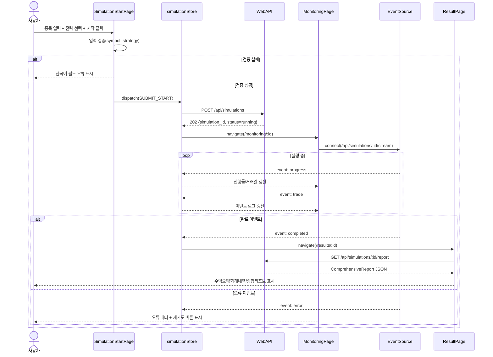

# 저수준 설계 문서 (LLD)
# Low-Level Design Document - FRONTEND

| 항목 | 내용 |
|------|------|
| **문서 버전** | 1.0.0 |
| **작성일** | 2026-02-15 |
| **대상 모듈** | FRONTEND (프론트엔드 UI 모듈) |
| **기반 문서** | HLD v1.0.0 (4.7, 5.x, 6.x), SRS v1.0.0 (FR-010, FR-011, FR-012, FR-013, FR-014, FR-015, NFR-003, NFR-004) |
| **관련 티켓** | TICKET-009-LLD-FRONTEND |

---

## 목차

1. [목적 및 범위](#1-목적-및-범위)
2. [프론트엔드 아키텍처 및 라우팅](#2-프론트엔드-아키텍처-및-라우팅)
3. [상태 관리 설계 (Store + State Machine)](#3-상태-관리-설계-store--state-machine)
4. [페이지/컴포넌트 인터페이스 상세](#4-페이지컴포넌트-인터페이스-상세)
5. [REST/SSE 인터페이스 및 데이터 플로우](#5-restsse-인터페이스-및-데이터-플로우)
6. [입력 검증 및 로딩/오류/완료 상태 전이](#6-입력-검증-및-로딩오류완료-상태-전이)
7. [성능/UX 제약 반영 설계 (NFR-003, NFR-004)](#7-성능ux-제약-반영-설계-nfr-003-nfr-004)
8. [시퀀스 다이어그램 (시작→모니터링→결과 조회)](#8-시퀀스-다이어그램-시작모니터링결과-조회)
9. [실행 가능한 언어 중립 수도코드](#9-실행-가능한-언어-중립-수도코드)
10. [SRS 요구사항 추적성 매트릭스](#10-srs-요구사항-추적성-매트릭스)
11. [테스트/검증 고려사항 (LLD 수준)](#11-테스트검증-고려사항-lld-수준)

---

## 1. 목적 및 범위

### 1.1 목적

본 문서는 HLD 4.7(프론트엔드 모듈), 5.x(모듈 간 인터페이스), 6.x(데이터 흐름)를 구현 가능한 수준으로 상세화한다. 대상은 `App`, `SimulationStartPage`, `MonitoringPage`, `ResultPage` 및 하위 UI 컴포넌트이며 SRS FR-010~FR-015, NFR-003, NFR-004를 직접 충족한다.

### 1.2 범위 (In-Scope)

- SPA 화면 흐름(시작→모니터링→결과 조회) 및 라우팅 규칙 정의
- HLD 4.7에 정의된 모든 UI 컴포넌트 인터페이스(props/state/event) 상세 정의
- REST 요청/응답과 SSE 스트림 수신 기반 상태 갱신 흐름 정의
- 입력 검증, 로딩/오류/완료 상태 전이(State Machine) 정의
- 브라우저 접근성/직관성 요구(NFR-003, NFR-004) 반영 UI 정책 정의
- 결과 화면의 수익 요약/거래내역/종합 리포트 렌더링 계약 정의

### 1.3 비범위 (Out-of-Scope)

- 백엔드 시뮬레이션 알고리즘, 전략 로직, 비용 계산 구현
- REST/SSE 서버 엔드포인트 구현
- DB 스키마 및 저장소 구현
- 시각화 라이브러리 고도화(차트 추가 등) 및 디자인 테마 확장

---

## 2. 프론트엔드 아키텍처 및 라우팅

### 2.1 화면 구조

| 화면 | 경로 | 주요 책임 | 관련 요구사항 |
|------|------|-----------|---------------|
| `SimulationStartPage` | `/` | 종목 입력, 전략 선택, 시작 요청 | FR-010, NFR-004 |
| `MonitoringPage` | `/monitoring/:simulationId` | 상태/진행률/실시간 이벤트 모니터링 | FR-011 |
| `ResultPage` | `/results/:simulationId` | 결과 요약, 거래 내역, 종합 통계 조회 | FR-012~FR-015 |

### 2.2 라우팅 정책

1. 최초 진입은 `/`로 고정한다.
2. 시뮬레이션 시작 성공(`202 Accepted`) 시 `simulation_id`를 포함해 `/monitoring/:id`로 이동한다.
3. SSE에서 `completed` 이벤트 수신 시 자동으로 `/results/:id`로 이동한다.
4. `error` 이벤트 수신 시 `MonitoringPage` 내 오류 상태로 유지하며 재시도 버튼을 노출한다.
5. 결과 조회 페이지는 새로고침/직접 URL 접근을 지원한다(FR-012-3,4).

### 2.3 레이어 구조

| 레이어 | 구성요소 | 책임 |
|--------|----------|------|
| View | 페이지/프리젠테이션 컴포넌트 | 렌더링 및 사용자 이벤트 수집 |
| Store | `simulationStore`, `reportStore`, `uiStore` | 서버 데이터/화면 상태 단일 원천 관리 |
| Service | `simulationApi`, `sseClient`, `reportApi` | REST/SSE 통신 캡슐화 |
| Utility | `validators`, `formatters`, `errorMapper` | 검증/표시/오류 메시지 표준화 |

---

## 3. 상태 관리 설계 (Store + State Machine)

### 3.1 전역 Store 모델

#### 3.1.1 `simulationStore`

| 필드 | 타입 | 설명 |
|------|------|------|
| `simulationId` | string? | 현재 시뮬레이션 ID |
| `symbol` | string | 입력/실행 종목 심볼 |
| `strategy` | string | 선택 전략 식별자 |
| `status` | enum | `idle`, `starting`, `running`, `completed`, `error` |
| `progress.currentDay` | int | 현재 처리 거래일 |
| `progress.totalDays` | int | 전체 거래일 |
| `progress.progressPct` | number | 진행률(0~100) |
| `progress.tradingDate` | string? | 처리 중 거래일 |
| `events` | list<EventItem> | 매수/매도/시스템 이벤트 로그 |
| `error` | UiError? | 현재 오류 정보 |

#### 3.1.2 `reportStore`

| 필드 | 타입 | 설명 |
|------|------|------|
| `isLoading` | bool | 결과 조회 로딩 상태 |
| `report` | ComprehensiveReport? | 보고서 원본 데이터 |
| `summary` | ReportSummary? | 요약 데이터 |
| `trades` | list<TradeRow> | 거래 내역 표시용 데이터 |
| `error` | UiError? | 조회 오류 |

#### 3.1.3 `uiStore`

| 필드 | 타입 | 설명 |
|------|------|------|
| `toastQueue` | list<UiToast> | 일시 메시지 큐 |
| `networkState` | enum | `online`, `offline`, `degraded` |
| `lastSseHeartbeatAt` | datetime? | SSE 헬스 체크 시각 |

### 3.2 전역 액션 정의

| 액션 | 입력 | 결과 |
|------|------|------|
| `startSimulation(payload)` | symbol, strategy | REST 시작 요청, 상태 `starting` |
| `attachMonitoring(simulationId)` | simulationId | SSE 연결 시작 |
| `onSseProgress(event)` | progress payload | 진행률/상태 갱신 |
| `onSseTrade(event)` | trade payload | 이벤트 로그 추가 |
| `onSseCompleted(event)` | completed payload | 상태 `completed`, 결과 페이지 이동 |
| `onSseError(error)` | 에러 객체 | 상태 `error`, 메시지 표시 |
| `fetchReport(simulationId)` | simulationId | 결과 데이터 로드 및 파싱 |
| `resetStartForm()` | - | 시작 화면 입력 초기화 |

### 3.3 상태 머신 정의

#### 3.3.1 시뮬레이션 실행 상태 머신

| 현재 상태 | 이벤트 | 가드 조건 | 다음 상태 | 부수효과 |
|-----------|--------|-----------|-----------|----------|
| `idle` | `SUBMIT_START` | 입력 유효 | `starting` | POST `/api/simulations` 호출 |
| `idle` | `SUBMIT_START` | 입력 무효 | `idle` | 필드 오류 표시 |
| `starting` | `START_ACCEPTED` | simulation_id 존재 | `running` | SSE 연결 + 모니터링 페이지 이동 |
| `starting` | `START_REJECTED` | - | `error` | 오류 배너 표시 |
| `running` | `SSE_PROGRESS` | - | `running` | 진행률 갱신 |
| `running` | `SSE_TRADE` | - | `running` | 이벤트 로그 append |
| `running` | `SSE_COMPLETED` | - | `completed` | 결과 페이지 이동 |
| `running` | `SSE_ERROR` | - | `error` | 연결 종료 + 재시도 버튼 활성 |
| `error` | `RETRY_MONITORING` | simulation_id 존재 | `running` | SSE 재연결 |
| `error` | `GO_START` | - | `idle` | 시작 화면으로 이동 |
| `completed` | `VIEW_RESULT` | simulation_id 존재 | `completed` | 결과 조회 실행 |

#### 3.3.2 결과 조회 상태 머신

| 현재 상태 | 이벤트 | 다음 상태 | 부수효과 |
|-----------|--------|-----------|----------|
| `idle` | `FETCH_REPORT` | `loading` | GET `/api/simulations/{id}/report` |
| `loading` | `FETCH_SUCCESS` | `ready` | 카드/테이블 데이터 파생 |
| `loading` | `FETCH_ERROR` | `error` | 한국어 오류 메시지 표시 |
| `error` | `RETRY_FETCH` | `loading` | 재요청 |
| `ready` | `REFRESH` | `loading` | 최신 결과 재조회 |

---

## 4. 페이지/컴포넌트 인터페이스 상세

### 4.1 HLD UI 컴포넌트 매핑

| 컴포넌트 | 부모 | 역할 |
|---------|------|------|
| `App` | 루트 | 라우팅/공통 레이아웃/글로벌 오류 바운더리 |
| `SimulationStartPage` | `App` | 시작 폼 컨테이너 |
| `SymbolInput` | `SimulationStartPage` | 종목 심볼 입력/검증 |
| `StrategySelector` | `SimulationStartPage` | 전략 선택 |
| `MonitoringPage` | `App` | 모니터링 컨테이너 |
| `ProgressBar` | `MonitoringPage` | 진행률 시각화 |
| `EventLog` | `MonitoringPage` | 실시간 이벤트 리스트 |
| `StatusBadge` | `MonitoringPage` | 상태 뱃지 표시 |
| `ResultPage` | `App` | 결과 컨테이너 |
| `ProfitSummaryCard` | `ResultPage` | 총 수익률/수익금 표시 |
| `TradeHistoryTable` | `ResultPage` | 거래 내역 테이블 |
| `ComprehensiveReport` | `ResultPage` | 종합 통계 표시 |

### 4.2 `App`

| 항목 | 정의 |
|------|------|
| Props | 없음 |
| Local State | `isGlobalErrorOpen: bool` |
| Events | `onRouteChange(path)`, `onUnhandledError(error)` |
| 인터페이스 계약 | 라우트별 페이지를 렌더링하고, 치명 오류 시 글로벌 오류 UI 표시 |

### 4.3 `SimulationStartPage`

| 항목 | 정의 |
|------|------|
| Props | 없음(스토어 구독) |
| Local State | `symbolInput: string`, `selectedStrategy: StrategyId`, `fieldErrors: map`, `isSubmitting: bool` |
| Events | `onSymbolChange(value)`, `onStrategyChange(value)`, `onSubmit()` |
| 인터페이스 계약 | `onSubmit` 시 검증 통과면 `startSimulation` 액션 호출 |

### 4.4 `SymbolInput`

| 항목 | 정의 |
|------|------|
| Props | `value: string`, `error: string?`, `disabled: bool`, `onChange(value)`, `onBlur()` |
| Local State | 없음(제어 컴포넌트) |
| Events | `input`, `blur`, `paste` |
| 검증 규칙 | `^[0-9]{6}\.KS$`, 공백 제거 후 대문자 `.KS` 강제 |

### 4.5 `StrategySelector`

| 항목 | 정의 |
|------|------|
| Props | `value: StrategyId`, `options: StrategyOption[]`, `error: string?`, `disabled: bool`, `onChange(id)` |
| Local State | 없음 |
| Events | `change` |
| 허용값 | `sell_trailing_stop`, `buy_sell_trailing_stop`, `rsi_buy_sell_trailing_stop` |

### 4.6 `MonitoringPage`

| 항목 | 정의 |
|------|------|
| Props | `simulationId: string` (라우트 파라미터) |
| Local State | `isSseConnected: bool`, `lastEventId: string?` |
| Events | `onMountAttachSse()`, `onRetrySse()`, `onGoResult()` |
| 인터페이스 계약 | SSE 이벤트를 구독하고 `StatusBadge`, `ProgressBar`, `EventLog`에 상태 전달 |

### 4.7 `ProgressBar`

| 항목 | 정의 |
|------|------|
| Props | `currentDay: int`, `totalDays: int`, `progressPct: number`, `tradingDate: string?` |
| Local State | 없음 |
| Events | 없음 |
| 표시 규칙 | `15/42일 완료 (35.7%)` 형태 텍스트 + 진행 바 |

### 4.8 `EventLog`

| 항목 | 정의 |
|------|------|
| Props | `items: EventItem[]`, `maxItems: int=500` |
| Local State | `isAutoScroll: bool` |
| Events | `onToggleAutoScroll()`, `onClearLog()` |
| 렌더링 규칙 | 이벤트 타입별 라벨(매수/매도/시스템), 최신순 또는 시간순 토글 가능 |

### 4.9 `StatusBadge`

| 항목 | 정의 |
|------|------|
| Props | `status: SimulationStatus`, `message: string?` |
| Local State | 없음 |
| Events | 없음 |
| 상태 매핑 | `running=실행 중`, `completed=완료`, `error=오류` |

### 4.10 `ResultPage`

| 항목 | 정의 |
|------|------|
| Props | `simulationId: string` |
| Local State | 없음(스토어 구독 중심) |
| Events | `onMountFetchReport()`, `onRetryFetch()` |
| 인터페이스 계약 | 보고서 로딩/오류/준비 상태를 분기 렌더링 |

### 4.11 `ProfitSummaryCard`

| 항목 | 정의 |
|------|------|
| Props | `initialSeed: number`, `finalSeed: number`, `totalProfit: number`, `totalProfitRate: number` |
| Local State | 없음 |
| Events | 없음 |
| 표시 규칙 | 금액 `#,###원`, 수익률 `0.00%` |

### 4.12 `TradeHistoryTable`

| 항목 | 정의 |
|------|------|
| Props | `rows: TradeRow[]`, `loading: bool`, `emptyText: string` |
| Local State | `sortKey: string='buy_datetime'`, `sortOrder: 'asc'|'desc'='asc'` |
| Events | `onSortChange(key, order)` |
| 컬럼 계약 | FR-014의 14개 항목(거래번호~수익률) 전체 표시 |

### 4.13 `ComprehensiveReport`

| 항목 | 정의 |
|------|------|
| Props | `summary: ReportSummary` |
| Local State | 없음 |
| Events | 없음 |
| 표시 항목 | 수익/손해 총액, 총 거래 수, 수익/손해 거래 수, 미거래일, 승률 |

---

## 5. REST/SSE 인터페이스 및 데이터 플로우

### 5.1 REST API 호출 계약

| API | 사용 시점 | 요청 | 성공 응답 처리 | 실패 응답 처리 |
|-----|-----------|------|----------------|----------------|
| `POST /api/simulations` | 시작 버튼 클릭 | `symbol`, `strategy` | `simulation_id` 저장 후 모니터링 이동 | 필드/도메인 오류 메시지 표시 |
| `GET /api/simulations/{id}` | 선택적 상태 동기화 | path `id` | 상태 보정 | 404 시 시작 화면 유도 |
| `GET /api/simulations/{id}/report` | 결과 페이지 진입 | path `id` | 카드/테이블/리포트 렌더링 | 재시도 버튼 + 오류 배너 |
| `GET /api/simulations/{id}/trades` | 거래내역 분리 조회(옵션) | path `id` | 테이블 데이터 갱신 | 경고 토스트, 기존 데이터 유지 |
| `GET /api/simulations` | 이력 조회(옵션) | 없음 | 이력 리스트 갱신 | 빈 목록 fallback |

### 5.2 SSE 이벤트 계약

| Event | 페이로드 핵심 필드 | Store 반영 |
|-------|---------------------|------------|
| `progress` | `current_day`, `total_days`, `progress_pct`, `trading_date` | 진행률/상태 갱신 |
| `trade` | `type`, `datetime`, `price`, `quantity`, `reason?`, `net_profit?` | 이벤트 로그 append |
| `heartbeat` | `timestamp` | `lastSseHeartbeatAt` 갱신 |
| `completed` | `simulation_id`, `status` | 상태 `completed`, 결과 페이지 이동 |
| `error` | `code`, `message` | 상태 `error`, 오류 배너 표시 |

### 5.3 데이터 플로우 (REST + SSE 결합)

```mermaid
flowchart LR
    U[사용자] --> A[SimulationStartPage]
    A -->|POST /api/simulations| B[Web API]
    B -->|202 Accepted + simulation_id| A
    A --> C[MonitoringPage]
    C -->|GET /api/simulations/{id}/stream| B
    B -->|SSE progress/trade| C
    C -->|store 갱신| D[ProgressBar/EventLog/StatusBadge]
    B -->|SSE completed| C
    C --> E[ResultPage]
    E -->|GET /api/simulations/{id}/report| B
    B -->|ComprehensiveReport| E
    E --> F[ProfitSummaryCard/TradeHistoryTable/ComprehensiveReport]
```

### 5.4 연결 복원/재시도 정책

1. SSE 연결 실패 시 클라이언트는 지수 백오프(1초, 2초, 4초, 최대 10초)로 최대 5회 재시도한다.
2. 마지막 이벤트 ID가 있으면 `Last-Event-ID` 헤더로 재연결해 중복/누락을 최소화한다.
3. 5회 초과 실패 시 상태를 `error`로 전환하고 수동 재연결 버튼을 노출한다.
4. 결과 조회 실패 시 자동 재시도는 1회만 수행하고 이후 사용자가 수동 재시도한다.

---

## 6. 입력 검증 및 로딩/오류/완료 상태 전이

### 6.1 입력 검증 규칙

| 입력 항목 | 규칙 | 실패 메시지 |
|-----------|------|------------|
| 종목 심볼 | 필수, 정규식 `^[0-9]{6}\.KS$` | `유효한 코스피 심볼을 입력하세요. 예: 005930.KS` |
| 전략 | 필수, 3개 중 1개 | `전략 1/2/3 중 하나를 선택하세요.` |
| simulationId(라우트) | 공백 금지, URL-safe | `시뮬레이션 ID가 올바르지 않습니다.` |

### 6.2 사용자 가시 상태 전이

| 단계 | 상태 | 사용자 표시 |
|------|------|------------|
| 시작 전 | `idle` | 입력 폼 활성화 |
| 시작 요청 중 | `starting` | 시작 버튼 비활성 + 로딩 인디케이터 |
| 모니터링 중 | `running` | 상태 배지(실행 중), 진행률/로그 실시간 갱신 |
| 완료 | `completed` | 완료 배지 + 결과 페이지 자동 이동 |
| 실패 | `error` | 한국어 오류 메시지 + 재시도 액션 |

### 6.3 오류 처리 정책

| 오류 유형 | 감지 지점 | 처리 |
|-----------|----------|------|
| 입력 오류(400) | 시작 요청 응답 | 필드 하단 인라인 오류 |
| 시뮬레이션 없음(404) | 모니터링/결과 조회 | 안내 메시지 후 시작 화면 이동 버튼 |
| 외부 데이터 오류(502) | 시작 또는 실행 중 | 오류 배너 + 재시도 제안 |
| 내부 서버 오류(500) | 전 구간 | 범용 한국어 오류 메시지 + 요청 ID 표시 |
| 네트워크 단절 | SSE/REST 공통 | 오프라인 배지 + 재연결 시도 |

### 6.4 로딩 정책

1. 시작 버튼 중복 클릭 방지를 위해 `starting` 동안 disable 처리한다.
2. 모니터링 화면은 초기 `skeleton` 1회 표시 후 데이터 수신 시 실제 값으로 치환한다.
3. 결과 페이지는 `summary`와 `trades`를 원자적으로 교체하여 부분 깜빡임을 방지한다.

---

## 7. 성능/UX 제약 반영 설계 (NFR-003, NFR-004)

### 7.1 NFR-003 (웹 브라우저 접근성) 반영

| 요구사항 | 설계 반영 |
|----------|----------|
| 브라우저 기반 사용 | SPA 단일 번들 + 표준 Web API(`fetch`, `EventSource`) 사용 |
| 무설치 | 플러그인/확장 의존 없음 |
| Chrome/Edge/Firefox 최신 버전 지원 | ES 표준 문법, 브라우저 호환 API만 사용 |
| 1280×720 이상 정상 표시 | 3단 레이아웃 기준 최소 폭 1280 정책, 테이블 수평 스크롤 대응 |

### 7.2 NFR-004 (UI 직관성) 반영

| 요구사항 | 설계 반영 |
|----------|----------|
| 3단계 시작 조작 | `종목 입력 → 전략 선택 → 시작` 단일 폼으로 강제 |
| 상태 시각 구분 | `StatusBadge`로 `실행 중/완료/오류` 명확 색상/텍스트 분리 |
| 한국어 오류 메시지 | `errorMapper`에서 코드별 한국어 메시지 표준화 |
| 금액 천 단위 구분 | `formatCurrencyKRW()`를 모든 금액 컴포넌트에 공통 적용 |

### 7.3 프론트엔드 성능 예산(운영 가이드)

| 지표 | 목표 |
|------|------|
| 시작 요청 응답 표시 | 2초 이내(백엔드 202 수신 기준) |
| 모니터링 UI 갱신 반영 | SSE 수신 후 300ms 이내 |
| 결과 화면 렌더링 | 응답 수신 후 1초 이내 |
| EventLog 렌더링 | 최대 500개 유지(초과 시 오래된 항목 제거) |

---

## 8. 시퀀스 다이어그램 (시작→모니터링→결과 조회)



---

## 9. 실행 가능한 언어 중립 수도코드

### 9.1 시작 화면 제출 및 검증

```text
FUNCTION submitStartForm(symbolInput, strategyInput):
    symbol <- normalizeSymbol(symbolInput)
    strategy <- strategyInput

    errors <- {}
    IF symbol IS EMPTY OR NOT matchRegex(symbol, "^[0-9]{6}\\.KS$"):
        errors["symbol"] <- "유효한 코스피 심볼을 입력하세요. 예: 005930.KS"
    ENDIF

    IF strategy NOT IN ["sell_trailing_stop", "buy_sell_trailing_stop", "rsi_buy_sell_trailing_stop"]:
        errors["strategy"] <- "전략 1/2/3 중 하나를 선택하세요."
    ENDIF

    IF size(errors) > 0:
        setFormErrors(errors)
        RETURN FAILURE
    ENDIF

    setSimulationStatus("starting")
    response <- httpPost("/api/simulations", {symbol: symbol, strategy: strategy})

    IF response.status == 202 AND response.data.simulation_id EXISTS:
        setSimulationId(response.data.simulation_id)
        setSimulationStatus("running")
        navigateTo("/monitoring/" + response.data.simulation_id)
        RETURN SUCCESS
    ELSE:
        mapAndShowError(response.error)
        setSimulationStatus("error")
        RETURN FAILURE
    ENDIF
END FUNCTION
```

### 9.2 SSE 모니터링 루프

```text
FUNCTION attachMonitoring(simulationId):
    retryCount <- 0
    maxRetry <- 5

    WHILE retryCount <= maxRetry:
        stream <- openEventSource("/api/simulations/" + simulationId + "/stream")

        ON stream.event("progress") AS payload:
            updateProgress(payload.current_day, payload.total_days, payload.progress_pct, payload.trading_date)
            setSimulationStatus("running")
        END ON

        ON stream.event("trade") AS payload:
            appendEventLog(payload)
        END ON

        ON stream.event("heartbeat") AS payload:
            setLastHeartbeat(payload.timestamp)
        END ON

        ON stream.event("completed") AS payload:
            setSimulationStatus("completed")
            close(stream)
            navigateTo("/results/" + payload.simulation_id)
            RETURN SUCCESS
        END ON

        ON stream.event("error") AS payload:
            close(stream)
            retryCount <- retryCount + 1
            IF retryCount > maxRetry:
                setSimulationStatus("error")
                showError("모니터링 연결이 끊어졌습니다. 다시 시도해 주세요.")
                RETURN FAILURE
            ENDIF
            wait(exponentialBackoffSeconds(retryCount))
        END ON
    END WHILE
END FUNCTION
```

### 9.3 결과 조회 및 화면 렌더링

```text
FUNCTION loadResult(simulationId):
    setReportLoading(TRUE)
    response <- httpGet("/api/simulations/" + simulationId + "/report")

    IF response.status == 200:
        report <- response.data
        summary <- {
            initialSeed: report.summary.initial_seed,
            finalSeed: report.summary.final_seed,
            totalProfit: report.summary.total_profit,
            totalProfitRate: report.summary.total_profit_rate
        }
        trades <- sortBy(report.trades, key="buy_datetime", order="asc")

        setReportData(summary, trades, report.summary)
        setReportLoading(FALSE)
        RETURN SUCCESS
    ELSE:
        setReportLoading(FALSE)
        setReportError(toKoreanError(response.error))
        RETURN FAILURE
    ENDIF
END FUNCTION
```

---

## 10. SRS 요구사항 추적성 매트릭스

| 요구사항 ID | 요구사항 요약 | 프론트엔드 반영 컴포넌트/설계 | LLD 위치 |
|-------------|---------------|-------------------------------|----------|
| FR-010 | 웹 브라우저 시뮬레이션 시작 | `SimulationStartPage`, `SymbolInput`, `StrategySelector`, 시작 상태머신 | 2.1, 3.3.1, 4.3~4.5, 6.1 |
| FR-011 | 실시간 모니터링 | `MonitoringPage`, `ProgressBar`, `EventLog`, `StatusBadge`, SSE 처리 | 3.1, 4.6~4.9, 5.2, 8 |
| FR-012 | 결과 조회 | `ResultPage`, report fetch 흐름 | 2.1, 3.3.2, 4.10, 5.1 |
| FR-013 | 수익률/수익금 표시 | `ProfitSummaryCard` 렌더링 계약/포맷 | 4.11, 6.4, 9.3 |
| FR-014 | 세부 거래 내역 표시 | `TradeHistoryTable` 컬럼 계약/정렬 | 4.12, 9.3 |
| FR-015 | 종합 결과 보고서 | `ComprehensiveReport` 통계 표시 계약 | 4.13, 9.3 |
| NFR-003 | 웹 브라우저 접근성 | 표준 브라우저 API/해상도 정책/무설치 | 7.1 |
| NFR-004 | UI 직관성 | 3단계 시작, 상태 시각화, 한국어 오류, 금액 포맷 | 6.2, 7.2 |

---

## 11. 테스트/검증 고려사항 (LLD 수준)

### 11.1 컴포넌트 단위 검증

| 대상 | 검증 포인트 |
|------|-------------|
| `SymbolInput` | 심볼 정규식 검증, blur 시 오류 노출 |
| `StrategySelector` | 전략 3종 선택/해제 및 오류 표시 |
| `StatusBadge` | 상태별 텍스트/스타일 매핑 |
| `TradeHistoryTable` | FR-014 컬럼 누락 여부, 정렬 동작 |

### 11.2 상태 관리/상태머신 검증

1. `idle → starting → running → completed` 정상 경로를 보장해야 한다.
2. 검증 실패 시 `idle` 유지 및 네트워크 요청 미발생을 보장해야 한다.
3. SSE 재연결 실패 초과 시 `error` 상태로 전이해야 한다.
4. `completed` 이후 결과 조회 실패 시 `reportStore.error`를 분리 관리해야 한다.

### 11.3 통합(REST/SSE) 검증

| 시나리오 | 기대 결과 |
|----------|-----------|
| 시작 요청 성공 + SSE progress | 모니터링 화면 진행률/이벤트 자동 갱신 |
| SSE completed 수신 | 결과 화면 자동 이동 |
| SSE error 수신 | 모니터링 오류 배너 + 재시도 |
| 결과 재조회(새로고침) | 동일 simulationId 결과 재표시 |

### 11.4 NFR 검증 포인트

- Chrome/Edge/Firefox 최신 버전에서 핵심 흐름(시작/모니터링/결과) 동작 확인
- 해상도 1280×720에서 레이아웃 깨짐/가독성 이슈 없음 확인
- 시작 단계가 정확히 3단계(입력→선택→시작)인지 UX 점검
- 오류 메시지가 한국어이며 사용자 행동(재시도/이동)을 유도하는지 확인
