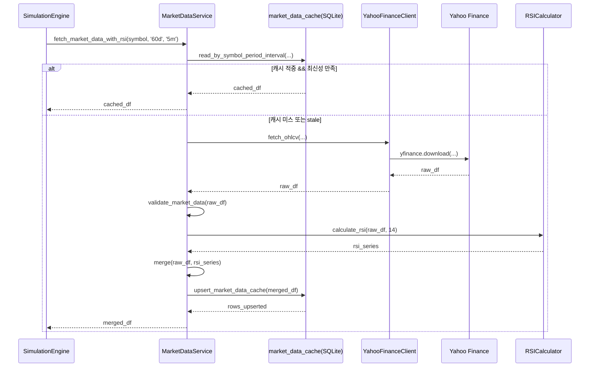
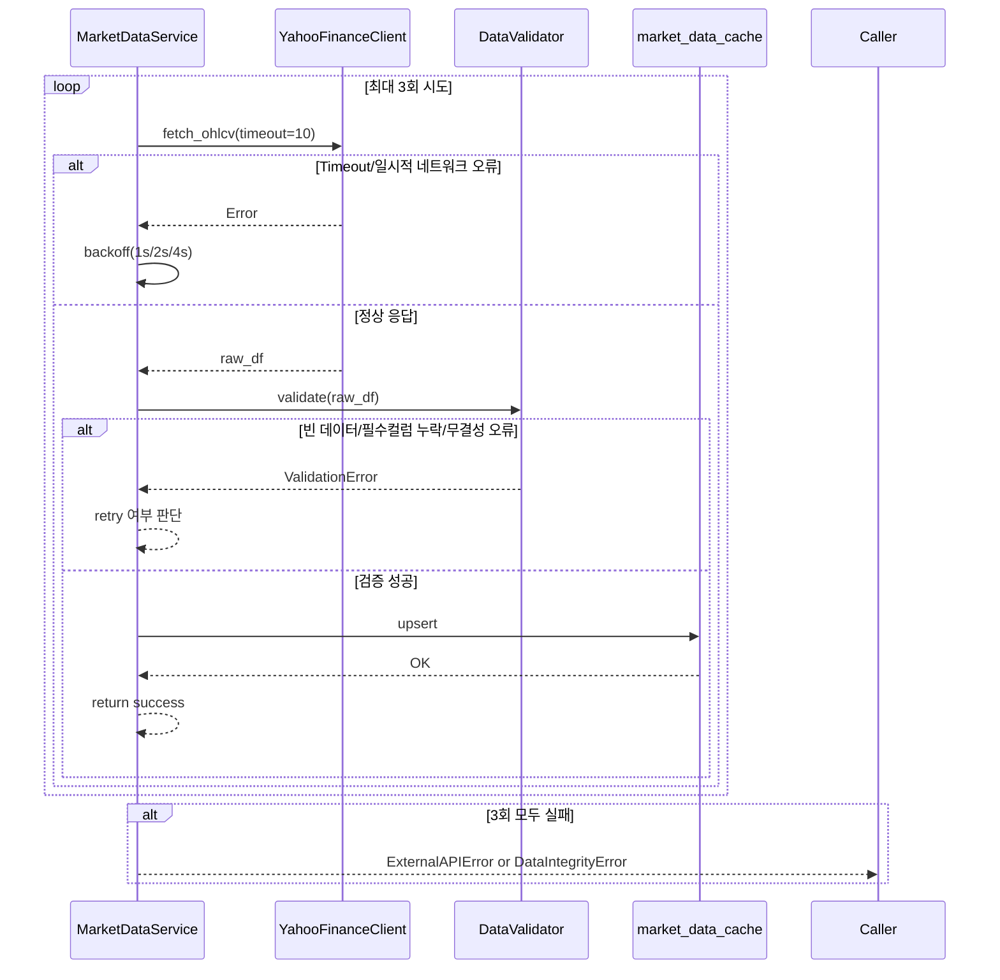

# 저수준 설계 문서 (LLD)
# Low-Level Design Document - MARKETDATA

| 항목 | 내용 |
|------|------|
| **문서 버전** | 1.0.0 |
| **작성일** | 2026-02-15 |
| **대상 모듈** | MARKETDATA (시세 데이터 수집 모듈) |
| **기반 문서** | HLD v1.0.0 (4.2, 5.1, 8.2.3), SRS v1.0.0 (FR-001, FR-002) |
| **관련 티켓** | TICKET-004-LLD-MARKETDATA |

---

## 목차

1. [목적 및 범위](#1-목적-및-범위)
2. [컴포넌트 상세 설계](#2-컴포넌트-상세-설계)
3. [컴포넌트 간 시퀀스](#3-컴포넌트-간-시퀀스)
4. [Yahoo Finance API 호출 상세](#4-yahoo-finance-api-호출-상세)
5. [RSI 계산 알고리즘](#5-rsi-계산-알고리즘)
6. [에러 처리 시퀀스](#6-에러-처리-시퀀스)
7. [데이터 검증 로직](#7-데이터-검증-로직)
8. [캐시 테이블 CRUD 설계](#8-캐시-테이블-crud-설계)
9. [실행 가능한 언어 중립 수도코드](#9-실행-가능한-언어-중립-수도코드)
10. [요구사항 추적성 매트릭스](#10-요구사항-추적성-매트릭스)
11. [테스트/검증 고려사항 (LLD 수준)](#11-테스트검증-고려사항-lld-수준)

---

## 1. 목적 및 범위

### 1.1 목적

본 문서는 HLD 4.2(시세 데이터 수집 모듈), 5.1(모듈 간 통신 방식), 8.2.3(`market_data_cache`)를 구현 가능한 수준으로 상세화한다. 대상은 `YahooFinanceClient`, `RSICalculator`, `MarketDataService`이며, FR-001/FR-002를 직접 충족한다.

### 1.2 범위 (In-Scope)

- Yahoo Finance 5분 분봉 OHLCV 조회 (`period='60d'`, `interval='5m'`)
- 조회 데이터 정합성 검증 및 거래시간 필터링
- 14기간 RSI 산출
- `market_data_cache` 저장/조회/갱신(Upsert) 및 최신성 판단
- 재시도(3회), 백오프, 타임아웃 기반 오류 처리

### 1.3 비범위 (Out-of-Scope)

- 전략 로직(전략 1/2/3)의 매수·매도 판단 구현
- 시뮬레이션 엔진 전체 루프 제어
- 웹 API 엔드포인트 및 SSE 구현
- 다중 종목 동시 병렬 처리 최적화

---

## 2. 컴포넌트 상세 설계

### 2.1 `YahooFinanceClient`

#### 2.1.1 책임

- yfinance 호출 캡슐화
- 원본 OHLCV DataFrame 수집
- 네트워크 레벨 예외 표준화

#### 2.1.2 인터페이스

| 메서드 시그니처 | 파라미터 | 반환값 | 예외 |
|----------------|----------|--------|------|
| `fetch_ohlcv(symbol: str, period: str = '60d', interval: str = '5m', auto_adjust: bool = True, timeout_sec: int = 10) -> DataFrame` | `symbol`: 코스피 심볼(예: `005930.KS`), `period`: 조회기간, `interval`: 봉간격, `auto_adjust`: 수정주가 반영 여부, `timeout_sec`: 요청 타임아웃(초) | 인덱스=`timestamp`, 컬럼=`Open, High, Low, Close, Volume` DataFrame | `ExternalAPIError`, `TimeoutError`, `NoDataError` |

#### 2.1.3 동작 규칙

1. `yfinance.download()` 단일 방식으로 호출한다.
2. `threads=False`, `progress=False`를 기본값으로 하여 결정적 동작을 유지한다.
3. 빈 DataFrame이면 `NoDataError`를 발생시킨다.
4. 네트워크/HTTP 오류는 `ExternalAPIError`로 래핑한다.

### 2.2 `RSICalculator`

#### 2.2.1 책임

- 종가(`Close`) 기반 RSI(14) 산출
- 계산 불가 구간 처리
- RSI 값 범위 보정

#### 2.2.2 인터페이스

| 메서드 시그니처 | 파라미터 | 반환값 | 예외 |
|----------------|----------|--------|------|
| `calculate_rsi(candles_df: DataFrame, period: int = 14) -> Series[float]` | `candles_df`: `Close` 컬럼 포함 DataFrame, `period`: RSI 기간(기본 14) | 인덱스=`timestamp`, 값 범위 `0.0~100.0` RSI 시리즈 | `ValidationError`, `CalculationError` |

#### 2.2.3 동작 규칙

1. `Close` 컬럼이 없으면 `ValidationError`.
2. 입력 길이가 `period + 1` 미만이면 전체 `NaN` RSI 반환(예외 아님).
3. 최종 RSI는 `clip(0, 100)`으로 보정한다.

### 2.3 `MarketDataService`

#### 2.3.1 책임

- 캐시 조회/미스 판정
- 원격 조회 + 데이터 검증 + RSI 계산 + 캐시 저장
- 재시도/백오프 및 오류 전파

#### 2.3.2 인터페이스

| 메서드 시그니처 | 파라미터 | 반환값 | 예외 |
|----------------|----------|--------|------|
| `fetch_market_data_with_rsi(symbol: str, period: str = '60d', interval: str = '5m') -> DataFrame` | `symbol`, `period`, `interval` | 컬럼=`timestamp, open, high, low, close, volume, rsi, fetched_at` DataFrame | `ValidationError`, `NoDataError`, `ExternalAPIError`, `DataIntegrityError` |
| `validate_market_data(df: DataFrame) -> None` | `df`: OHLCV 원본 DataFrame | 없음(검증 통과 시) | `ValidationError`, `DataIntegrityError` |
| `is_cache_fresh(symbol: str, period: str, interval: str, now_kst: datetime) -> bool` | 캐시 최신성 판단 입력 | bool | - |
| `upsert_market_data_cache(df: DataFrame, symbol: str, fetched_at: datetime) -> int` | 저장 대상 DataFrame, 심볼, 수집시각 | upsert row 수(int) | `StorageError` |

#### 2.3.3 의존성

- `YahooFinanceClient`
- `RSICalculator`
- `MarketDataCacheRepository` (SQLite)

---

## 3. 컴포넌트 간 시퀀스



---

## 4. Yahoo Finance API 호출 상세

### 4.1 호출 방식 선택

본 LLD는 `yfinance.download()` 방식만 사용한다. 이유는 다중/단일 심볼 모두 동일 API로 다룰 수 있고, `period`, `interval`, `auto_adjust`, `timeout` 파라미터를 일관되게 적용하기 쉽기 때문이다.

### 4.2 호출 파라미터 규약

| 파라미터 | 값 | 규칙 |
|----------|----|------|
| `tickers` | `symbol` | 코스피 심볼 (`.KS`) 필수 |
| `period` | `60d` | FR-001 요구사항 고정 기본값 |
| `interval` | `5m` | FR-001 요구사항 고정 기본값 |
| `auto_adjust` | `True` | 분할/배당 반영 가격 일관성 확보 |
| `timeout` | `10`초 | 요청 타임아웃 상한 |
| `threads` | `False` | 단일 호출 결정성 유지 |
| `progress` | `False` | 서버 로그 오염 방지 |

### 4.3 타임아웃/재시도 전략

- 총 시도 횟수: 최대 3회
- 각 시도 타임아웃: 10초
- 백오프: 지수 백오프 `1s → 2s → 4s` (최대 4초)
- 재시도 대상: `TimeoutError`, 일시적 네트워크 오류, 5xx 유사 응답
- 재시도 제외: 심볼 형식 오류, 영구적 데이터 없음(`NoDataError`)

### 4.4 반환 DataFrame 컬럼/스키마 정규화

Yahoo 원본 컬럼(`Open`, `High`, `Low`, `Close`, `Volume`)을 내부 표준 컬럼(`open`, `high`, `low`, `close`, `volume`)으로 소문자 매핑한다.

| 내부 컬럼 | 타입 | 설명 |
|----------|------|------|
| `timestamp` | datetime (tz-aware, Asia/Seoul) | 5분 봉 시작 시각 |
| `open` | float | 시가 |
| `high` | float | 고가 |
| `low` | float | 저가 |
| `close` | float | 종가 |
| `volume` | int | 거래량 |
| `rsi` | float(nullable) | RSI(14), 초기 구간 NaN 허용 |
| `fetched_at` | datetime (UTC ISO8601) | 수집 시각 |

### 4.5 타임존 처리 규칙

1. 인덱스가 tz-aware이면 `Asia/Seoul`로 변환한다.
2. 인덱스가 tz-naive이면 코스피 심볼 입력 조건을 전제로 `Asia/Seoul`로 localize한다.
3. DB 저장 시 `timestamp`는 ISO 8601 문자열(`+09:00`)로 저장한다.

---

## 5. RSI 계산 알고리즘

### 5.1 방식 선택

본 LLD는 **Wilder 방식의 EWM(지수 가중 이동 평균)** 기반 RSI를 사용한다.

선정 근거:
1. 금융권/차트 도구의 RSI 기본 구현과 정합성이 높다.
2. rolling 단순평균 대비 급격한 노이즈에 더 안정적으로 반응한다.
3. pandas `ewm(alpha=1/period, adjust=False)`로 구현이 단순하며 재현 가능하다.

### 5.2 14기간 RSI 수도코드 (언어 중립)

```text
INPUT: close_prices[0..n-1], period = 14
OUTPUT: rsi[0..n-1]

if n < period + 1:
    return array_of_nan(n)

delta[i] = close_prices[i] - close_prices[i-1] for i=1..n-1
gain[i]  = max(delta[i], 0)
loss[i]  = max(-delta[i], 0)

avg_gain = EWM(gain, alpha=1/period, adjust=false)
avg_loss = EWM(loss, alpha=1/period, adjust=false)

for each i:
    if avg_loss[i] == 0 and avg_gain[i] == 0:
        rsi[i] = 50
    else if avg_loss[i] == 0:
        rsi[i] = 100
    else:
        rs = avg_gain[i] / avg_loss[i]
        rsi[i] = 100 - (100 / (1 + rs))

rsi = clamp(rsi, min=0, max=100)
return rsi aligned to candle timestamps
```

### 5.3 RSI 범위 보정 로직

- 계산 결과가 부동소수 오차로 `0 미만` 또는 `100 초과`가 발생하면 `clip(0, 100)` 처리
- `avg_gain=avg_loss=0` 구간은 추세 없음으로 간주해 `RSI=50`
- `avg_loss=0`이고 `avg_gain>0`인 구간은 `RSI=100`

---

## 6. 에러 처리 시퀀스



### 6.1 오류 분류와 처리 정책

| 오류 유형 | 예시 | 재시도 | 사용자/상위 모듈 전달 |
|----------|------|--------|------------------------|
| 타임아웃 | 요청 10초 초과 | 예 (최대 3회) | `ExternalAPIError(timeout)` |
| 네트워크 일시 장애 | 연결 리셋, DNS 일시 실패 | 예 (최대 3회) | `ExternalAPIError(network)` |
| 데이터 없음 | 빈 DataFrame | 아니오 | `NoDataError` |
| 부분 누락 컬럼 | `Volume` 누락 등 | 아니오 | `ValidationError(missing_columns)` |
| 데이터 무결성 위반 | `high < low`, 음수 거래량 | 아니오 | `DataIntegrityError` |

---

## 7. 데이터 검증 로직

### 7.1 검증 체크리스트

| 검증 항목 | 조건 | 실패 시 |
|----------|------|---------|
| 빈 DataFrame | row 수 = 0 | `NoDataError` |
| 필수 컬럼 존재 | `Open, High, Low, Close, Volume` 모두 존재 | `ValidationError` |
| NaN 검증 | 필수 컬럼 NaN 비율 = 0% | `ValidationError` |
| 거래량 음수 | `Volume >= 0` | `DataIntegrityError` |
| 가격 역전 | 모든 행에서 `high >= low` | `DataIntegrityError` |
| 가격 범위 정합 | `open`/`close`는 `[low, high]` 범위 내 | `DataIntegrityError` |
| 인덱스 단조증가 | `timestamp` 오름차순/중복 없음 | `ValidationError` |
| 비거래시간 필터 | KST 기준 평일 `09:00~15:30` 및 `minute % 5 == 0` | 필터링 후 0건이면 `NoDataError` |

### 7.2 비거래시간 필터 기준

- 요일: 월~금만 허용 (`weekday in [0..4]`)
- 시간: 09:00 이상 15:30 이하
- 봉 경계: 분(minute)이 5의 배수
- 장마감 이후/개장 이전 데이터는 제거

---

## 8. 캐시 테이블 CRUD 설계

### 8.1 대상 테이블

HLD 8.2.3 기준 `market_data_cache(symbol, timestamp, open, high, low, close, volume, rsi, fetched_at)`를 사용한다.

### 8.2 키/인덱스/최신성 규칙

- 기본키: `(symbol, timestamp)` 복합키
- 조회 인덱스: `(symbol, timestamp)`
- 최신성(TTL) 규칙:
  - 기본 TTL = 15분
  - `max(timestamp)`가 `now_kst - 15분` 이내이면 최신으로 간주
  - 단, 요청 구간(`period=60d`, `interval=5m`)의 시작~종료 범위를 모두 커버해야 캐시 적중

### 8.3 CRUD 동작 상세

| 동작 | SQL/정책 | 설명 |
|------|----------|------|
| Create | 대량 insert | 신규 심볼 최초 수집 시 저장 |
| Read | `WHERE symbol=? AND timestamp BETWEEN ? AND ?` | 요청 범위 데이터 조회 |
| Update | PK 충돌 시 값 갱신 | 동일 봉 재수집 시 `open~rsi,fetched_at` 갱신 |
| Upsert | `INSERT ... ON CONFLICT(symbol,timestamp) DO UPDATE` | Create/Update 통합 전략 |

### 8.4 캐시 적중/미스 흐름

1. `symbol + 기간범위`로 캐시 조회
2. 결과가 비어 있으면 즉시 캐시 미스
3. 결과가 존재해도 최신성(TTL/범위커버) 미충족이면 미스
4. 미스 시 원격 조회 후 upsert
5. 적중 시 원격 호출 없이 즉시 반환

---

## 9. 실행 가능한 언어 중립 수도코드

```text
function fetch_market_data_with_rsi(symbol, period='60d', interval='5m'):
    assert symbol endsWith '.KS'

    now_kst = current_time_in('Asia/Seoul')
    cached_df = cache.read(symbol, period, interval)

    if cached_df is not empty and is_cache_fresh(symbol, period, interval, now_kst):
        validate_market_data(cached_df)
        return cached_df

    max_attempts = 3
    backoff_seconds = [1, 2, 4]
    last_error = null

    for attempt in 1..max_attempts:
        try:
            raw_df = yahoo_client.fetch_ohlcv(
                symbol=symbol,
                period=period,
                interval=interval,
                auto_adjust=true,
                timeout_sec=10
            )

            normalized_df = normalize_columns_and_timezone(raw_df, tz='Asia/Seoul')
            filtered_df = filter_trading_session(normalized_df, start='09:00', end='15:30')

            validate_market_data(filtered_df)

            rsi_series = rsi_calculator.calculate_rsi(filtered_df, period=14)
            enriched_df = merge_rsi(filtered_df, rsi_series)
            enriched_df.rsi = clamp(enriched_df.rsi, 0, 100)
            enriched_df.fetched_at = current_time_utc_iso8601()

            cache.upsert(symbol, enriched_df)
            return enriched_df

        except (TimeoutError, TemporaryNetworkError) as e:
            last_error = e
            if attempt < max_attempts:
                sleep(backoff_seconds[attempt-1])
                continue
            else:
                raise ExternalAPIError('yahoo_fetch_failed_after_retries', cause=e)

        except NoDataError as e:
            raise NoDataError('no_market_data_in_requested_range', cause=e)

        except ValidationError as e:
            raise DataIntegrityError('market_data_validation_failed', cause=e)

    raise ExternalAPIError('unexpected_retry_exit', cause=last_error)
```

---

## 10. 요구사항 추적성 매트릭스

| SRS 요구사항 | 요구사항 요약 | LLD 반영 절 | 담당 컴포넌트 | 충족 방식 |
|-------------|---------------|-------------|---------------|-----------|
| FR-001 | 코스피 종목 5분 분봉 최근 60일 조회 | 2.1, 3, 4, 7, 8, 9 | `YahooFinanceClient`, `MarketDataService` | `period=60d`, `interval=5m` 고정 규약, 검증/캐시/재시도 포함 조회 파이프라인 정의 |
| FR-002 | 14기간 RSI 산출 및 전략 활용 가능 데이터 제공 | 2.2, 3, 5, 9 | `RSICalculator`, `MarketDataService` | EWM 기반 RSI(14) 산출, 0~100 보정, `rsi` 컬럼 포함 반환 스키마 정의 |

---

## 11. 테스트/검증 고려사항 (LLD 수준)

### 11.1 단위 테스트 포인트

1. `YahooFinanceClient.fetch_ohlcv`
   - 정상 응답 시 필수 컬럼 반환
   - timeout 발생 시 재시도 트리거 가능 오류 타입 반환
   - 빈 DataFrame 시 `NoDataError`

2. `MarketDataService.validate_market_data`
   - 필수 컬럼 누락 검출
   - NaN 포함 데이터 차단
   - 음수 거래량/가격 역전(`high<low`)/범위 위반(`open,close` outside `[low,high]`) 검출
   - 비거래시간 필터 후 0건 처리

3. `RSICalculator.calculate_rsi`
   - 입력 길이 부족 시 NaN 시리즈
   - 상승만 존재하는 구간 RSI=100 수렴
   - 횡보 구간 RSI=50 처리
   - 결과값 `0~100` 범위 보장

4. 캐시 리포지토리
   - upsert 충돌 시 갱신 동작 검증
   - 동일 요청에서 cache hit/miss 분기 검증
   - TTL(15분) 경계값 검증

5. 통합 단위(서비스 레벨)
   - `fetch_market_data_with_rsi`가 retry→validate→rsi→cache 순서를 지키는지 검증
   - 3회 실패 시 최종 예외 타입/메시지 검증

### 11.2 검증 완료 기준

- FR-001/FR-002 추적 항목에 대해 테스트 케이스 100% 연결
- 주요 예외 경로(타임아웃/데이터무결성/데이터없음) 모두 재현 가능
- 반환 스키마가 `timestamp, open, high, low, close, volume, rsi, fetched_at`를 항상 포함
