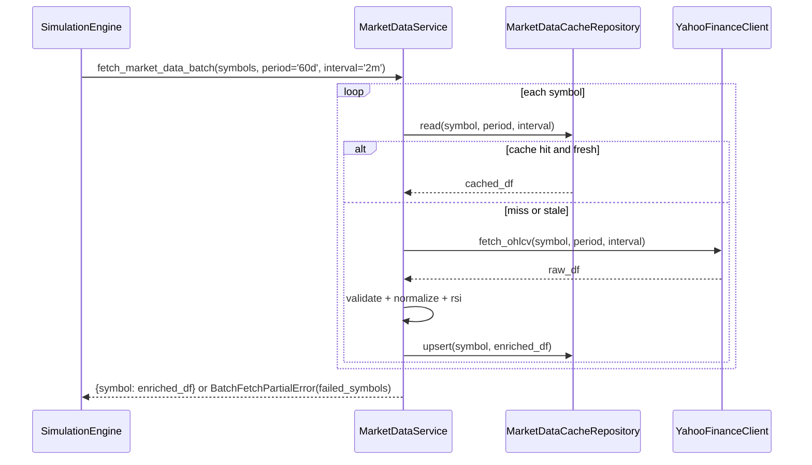

# 저수준 설계 문서 (LLD)
# Low-Level Design Document - MARKETDATA

| 항목 | 내용 |
|------|------|
| **문서 버전** | 1.3.0 |
| **작성일** | 2026-02-17 |
| **대상 모듈** | MARKETDATA (시세 데이터 수집 모듈) |
| **기반 문서** | HLD v1.3.0 (3.1, 3.2, 4.5), LLD MarketData v1.0.0 |
| **관련 티켓** | TICKET-087-LLD-MARKETDATA |

---

## v1.3.0 변경 로그 (요약)

- 전략D 요구사항에 맞춰 `interval=2m` 조회 계약을 명시적으로 추가했다.
- 단일 종목 조회 외에 다중 종목 조회 인터페이스(`symbols[1..20]`)를 정의했다.
- 전략D와 충돌하지 않도록 캐시 키/최신성/재시도 정책을 interval·symbols 조건까지 포함해 확장했다.
- 다중 종목 조회 시 부분 실패 처리 정책(실패 격리, 재시도, 상위 전파 규칙)을 명시했다.

---

## 1. 목적 및 범위

### 1.1 목적

본 문서는 HLD v1.3.0의 MarketData 모듈 변경사항을 구현 가능한 수준으로 상세화한다. 특히 전략D(다중 종목, 2분봉) 시나리오를 만족하는 인터페이스, 캐시 정책, 예외/재시도 정책을 정의한다.

### 1.2 범위 (In-Scope)

- Yahoo Finance 기반 2분봉/5분봉 조회 계약
- 단일/다중 종목 조회 인터페이스 및 반환 스키마
- 전략D 대응 캐시 정책(키, TTL, 범위 커버리지)
- 재시도/백오프/부분 실패 처리 및 오류 코드

### 1.3 비범위 (Out-of-Scope)

- 전략D 매수/매도 알고리즘 구현
- 시뮬레이션 루프 제어 및 체결 정책 구현
- WebAPI/Frontend 요청 검증 UI 구현

---

## 2. 인터페이스 설계

### 2.1 공개 인터페이스

| 메서드 시그니처 | 파라미터 | 반환값 | 예외 |
|----------------|----------|--------|------|
| `fetch_market_data_with_rsi(symbol: str, period: str='60d', interval: str='5m') -> DataFrame` | 기존 단일 종목 조회 | `timestamp, open, high, low, close, volume, rsi, fetched_at` | `ValidationError`, `ExternalAPIError`, `NoDataError`, `DataIntegrityError` |
| `fetch_market_data_batch(symbols: list[str], period: str='60d', interval: str='2m') -> dict[str, DataFrame]` | `symbols` 길이 1~20, 중복 불가, 전략D는 기본 `2m` | 심볼별 정규화/검증 완료 DataFrame 맵 | `InvalidSymbolsError`, `BatchFetchPartialError`, `ExternalAPIError` |
| `validate_interval_for_strategy(strategy: str, interval: str) -> None` | 전략 식별자, interval | 없음 | `IntervalConstraintError` |

### 2.2 전략D 전용 입력 계약

| 필드 | 타입 | 규칙 |
|------|------|------|
| `symbols` | list[string] | 길이 1~20, 중복 금지, 각 항목 `^[0-9]{6}\\.KS$` |
| `interval` | string | 전략D에서 `2m` 고정 |
| `period` | string | 기본 `60d` |

### 2.3 반환 데이터 계약

- 모든 DataFrame 필수 컬럼: `timestamp, open, high, low, close, volume, rsi, fetched_at`
- `timestamp`: KST(`Asia/Seoul`) 기준 정렬/중복 제거
- 전략D 경로에서 09:03 캔들을 반드시 포함해야 하며, 미포함 시 상위 모듈이 식별 가능한 오류를 반환한다.

---

## 3. 캐시 설계 (전략D 대응)

### 3.1 캐시 키 확장

- 기본 키: `(symbol, timestamp)` 유지
- 조회 컨텍스트 키: `(symbol, period, interval)`
- 배치 조회는 `symbols`를 개별 단위로 분해해 심볼별 캐시 hit/miss를 판정한다.

### 3.2 최신성(TTL) 정책

| interval | 기본 TTL | 비고 |
|----------|----------|------|
| `2m` | 6분 | 전략D 빠른 재평가 주기 대응 |
| `5m` | 15분 | 기존 정책 유지 |

- TTL 충족 + 요청 구간 범위 커버를 동시에 만족해야 cache hit로 판정한다.
- 배치 조회에서 일부 심볼만 stale이면 stale 심볼만 원격 재조회한다.

### 3.3 캐시 저장 정책

- 저장 방식: `INSERT ... ON CONFLICT(symbol, timestamp) DO UPDATE`
- 배치 조회 결과 저장은 심볼 단위 트랜잭션 경계로 분리(부분 실패 격리)
- `fetched_at`은 UTC ISO8601, `timestamp`는 `+09:00` 오프셋 문자열로 표준화

---

## 4. 외부 API 호출 및 재시도 정책

### 4.1 Yahoo Finance 호출 규약

- 호출 API: `yfinance.download()`
- 공통 파라미터: `auto_adjust=True`, `threads=False`, `progress=False`, `timeout=10`
- 전략D 경로 기본 interval은 `2m`

### 4.2 재시도/백오프

- 최대 시도: 3회
- 백오프: `1s -> 2s -> 4s`
- 재시도 대상: 타임아웃, 일시적 네트워크 오류
- 재시도 제외: 심볼 형식 오류, 영구적 데이터 없음

### 4.3 배치 조회 부분 실패 정책

1. 각 심볼은 독립적으로 원격 조회/검증/저장을 수행한다.
2. 일부 심볼 실패 시 성공 심볼 데이터는 반환 가능 상태로 유지한다.
3. 실패 심볼이 1개 이상이면 `BatchFetchPartialError`에 `failed_symbols[]`를 포함해 상위에 전달한다.
4. 상위 모듈(Simulation)은 실패 심볼 제외/중단 중 정책을 선택할 수 있어야 한다.

---

## 5. 검증 및 오류 처리

### 5.1 데이터 검증 규칙

- 필수 컬럼: `Open, High, Low, Close, Volume`
- 무결성: `high >= low`, `open/close`는 `[low, high]`, `volume >= 0`
- 세션 필터: 평일 KST `09:00~15:30`
- interval 경계:
  - `2m`: `minute % 2 == 1` (09:01, 09:03, ...)
  - `5m`: `minute % 5 == 0`

### 5.2 오류 코드

| 코드 | 조건 |
|------|------|
| `INVALID_SYMBOLS_COUNT` | `symbols` 길이 <1 또는 >20 |
| `INVALID_SYMBOL_FORMAT` | 심볼 정규식 불일치 |
| `DUPLICATE_SYMBOLS` | 입력 종목 중복 |
| `INTERVAL_2M_REQUIRED_FOR_STRATEGY_D` | 전략D에서 interval이 2m가 아님 |
| `REFERENCE_CANDLE_0903_MISSING` | 전략D 필수 기준 캔들 부재 |
| `BATCH_FETCH_PARTIAL_FAILURE` | 배치 조회 일부 심볼 실패 |

---

## 6. 시퀀스



---

## 7. 실행 가능한 언어 중립 수도코드

```text
function fetch_market_data_batch(symbols, period='60d', interval='2m'):
    validate_symbols(symbols, min=1, max=20, unique=true, regex='^[0-9]{6}\\.KS$')

    results = {}
    failed_symbols = []

    for symbol in symbols:
        try:
            cached = cache.read(symbol, period, interval)
            if cached not empty and is_cache_fresh(symbol, period, interval):
                validate_market_data(cached, interval)
                ensure_reference_candle_0903(cached, interval)
                results[symbol] = cached
                continue

            raw = fetch_with_retry(symbol, period, interval, timeout=10, retries=3)
            normalized = normalize_timezone_and_columns(raw, 'Asia/Seoul')
            filtered = filter_trading_session(normalized)
            validate_market_data(filtered, interval)
            ensure_reference_candle_0903(filtered, interval)
            enriched = attach_rsi(filtered, period=14)
            cache.upsert(symbol, enriched)
            results[symbol] = enriched

        except RecoverableExternalError:
            failed_symbols.append(symbol)
        except ValidationError:
            failed_symbols.append(symbol)

    if failed_symbols is not empty:
        raise BatchFetchPartialError(results=results, failed_symbols=failed_symbols)

    return results
```

---

## 8. 요구사항 추적성

| HLD/SRS 항목 | 반영 위치 | 반영 내용 |
|--------------|-----------|-----------|
| HLD 3.1 MarketData 영향 | 2장, 3장, 4장 | `2m`/다중 종목 조회 계약 확장 |
| HLD 3.2 모듈 의존성 | 2.1, 6장 | Simulation이 소비 가능한 배치 인터페이스 정의 |
| HLD 4.5 기타 영향 | 2.2, 5.2 | 전략D 입력 제약 및 오류 코드 구체화 |
| SRS FR-019 | 2장, 3장, 6장 | 다중 종목 동시 모니터링 데이터 공급 계약 |
| SRS CON-009~011 | 2.2, 5.1, 5.2 | 종목 수/형식, 단일 체결 지원을 위한 입력 보장, 2분봉·09:03 강제 |

---

## 9. 테스트/검증 고려사항

1. 배치 조회 20종목 입력 시 심볼별 cache hit/miss 혼합 시나리오 검증
2. `2m` interval에서 09:03 캔들 누락 시 오류 코드 일관성 검증
3. 부분 실패 시 `results`와 `failed_symbols` 무결성 검증
4. 재시도 경계(3회) 및 백오프 시간 순서(1,2,4초) 검증
5. TTL 경계값(`2m=6분`, `5m=15분`) 검증
