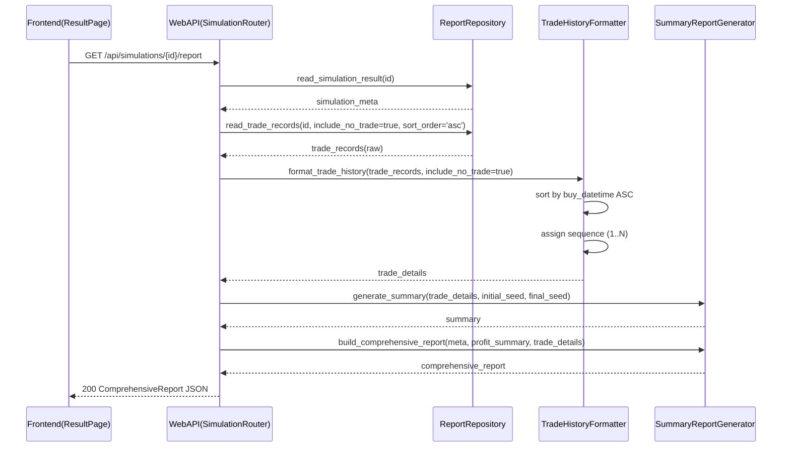
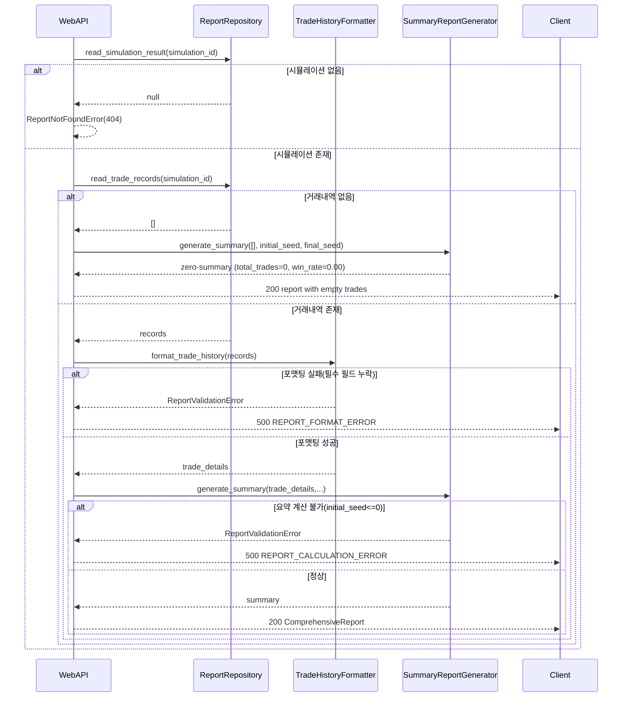

# 저수준 설계 문서 (LLD)
# Low-Level Design Document - REPORT

| 항목 | 내용 |
|------|------|
| **문서 버전** | 1.0.0 |
| **작성일** | 2026-02-15 |
| **대상 모듈** | REPORT (결과 보고서 모듈) |
| **기반 문서** | HLD v1.0.0 (4.6, 5.x, 6.x, 8.x), SRS v1.0.0 (FR-013, FR-014, FR-015) |
| **관련 티켓** | TICKET-008-LLD-REPORT |

---

## 목차

1. [목적 및 범위](#1-목적-및-범위)
2. [컴포넌트 상세 설계](#2-컴포넌트-상세-설계)
3. [계산 규칙 및 Decimal 정밀도/반올림 정책](#3-계산-규칙-및-decimal-정밀도반올림-정책)
4. [거래내역 정렬/포맷팅/조회 시퀀스](#4-거래내역-정렬포맷팅조회-시퀀스)
5. [저장소 CRUD 및 조회 인덱스/필터 정책](#5-저장소-crud-및-조회-인덱스필터-정책)
6. [오류/빈데이터 처리 시나리오](#6-오류빈데이터-처리-시나리오)
7. [실행 가능한 언어 중립 수도코드](#7-실행-가능한-언어-중립-수도코드)
8. [SRS 요구사항 추적성 매트릭스](#8-srs-요구사항-추적성-매트릭스)
9. [테스트/검증 고려사항 (LLD 수준)](#9-테스트검증-고려사항-lld-수준)

---

## 1. 목적 및 범위

### 1.1 목적

본 문서는 HLD 4.6(결과 보고서 모듈), 5.x(모듈 간 인터페이스), 6.x(데이터 흐름), 8.x(데이터 모델)을 구현 가능한 수준으로 상세화한다. 대상은 `ProfitCalculator`, `TradeHistoryFormatter`, `SummaryReportGenerator`, `ReportRepository`이며 SRS FR-013~FR-015를 직접 충족한다.

### 1.2 범위 (In-Scope)

- 시뮬레이션 결과(`SimulationResult + TradeRecord`) 기반 수익 요약/거래내역/종합 통계 산출
- 총 수익률(%), 총 수익금(원), 수익/손해 총액, 승률, 거래 횟수 계산 규칙 정의
- 거래내역 시간순 정렬, 순번 부여, 화면/API 표시용 포맷팅 규칙 정의
- 결과 조회용 저장소 계층 CRUD/인덱스/필터/정렬 정책 정의
- 오류/빈데이터/부분누락 데이터에 대한 처리 및 전파 규칙 정의
- 언어 중립 수도코드 및 SRS 추적성 매트릭스 제공

### 1.3 비범위 (Out-of-Scope)

- 매수/매도 시그널 생성 및 전략 판단 로직 (STRATEGY LLD 범위)
- 매도 세금/수수료 산출 구현 자체 (SIMULATION LLD 범위)
- REST 라우팅 및 SSE 송신 구현 (WEBAPI LLD 범위)
- 프론트엔드 컴포넌트 렌더링 구현 (`ProfitSummaryCard`, `TradeHistoryTable`, `ComprehensiveReport`)

---

## 2. 컴포넌트 상세 설계

### 2.1 공통 데이터 구조

#### 2.1.1 `ProfitSummary`

| 필드 | 타입 | 설명 |
|------|------|------|
| `initial_seed` | Decimal | 초기 시드머니 (기본 10,000,000) |
| `final_seed` | Decimal | 최종 시드머니 |
| `total_profit` | Decimal | 총 수익금(원) = `final_seed - initial_seed` |
| `total_profit_rate` | Decimal | 총 수익률(%) |

#### 2.1.2 `TradeDetail`

| 필드 | 타입 | 설명 |
|------|------|------|
| `trade_id` | int | 거래 순번 (1-base, 정렬 후 재부여) |
| `trade_date` | date | 거래일 |
| `buy_datetime` | datetime? | 매수 시각 |
| `buy_price` | Decimal? | 매수 단가(원) |
| `buy_quantity` | int | 매수 수량(주) |
| `buy_amount` | Decimal | 매수 금액(원) |
| `sell_datetime` | datetime? | 매도 시각 |
| `sell_price` | Decimal? | 매도 단가(원) |
| `sell_quantity` | int | 매도 수량(주) |
| `sell_amount` | Decimal | 매도 금액(원) |
| `sell_reason` | string | `profit_preserve`, `stop_loss`, `no_trade`, `error_skip` |
| `tax` | Decimal | 매도 세금(원) |
| `fee` | Decimal | 매도 수수료(원) |
| `net_profit` | Decimal | 순수익(원) |
| `profit_rate` | Decimal | 수익률(%) |
| `seed_money_after` | Decimal | 거래 후 시드머니 |

#### 2.1.3 `ComprehensiveReport`

| 필드 | 타입 | 설명 |
|------|------|------|
| `simulation_id` | string | 시뮬레이션 식별자 |
| `symbol` | string | 종목 심볼 |
| `strategy` | string | 전략 식별자 |
| `period.start_date` | date | 시뮬레이션 시작일 |
| `period.end_date` | date | 시뮬레이션 종료일 |
| `summary` | object | 수익/손해/승률/거래수 통계 |
| `trades` | list[TradeDetail] | 세부 거래 내역 |

### 2.2 `ProfitCalculator`

#### 2.2.1 책임

- FR-013 기준 총 수익금/총 수익률 계산
- Decimal 기반 정밀 계산 및 표시 스케일 정책 적용
- 초기/최종 시드머니 불일치 또는 결측 입력 검증

#### 2.2.2 인터페이스

| 메서드 시그니처 | 파라미터 | 반환값 | 예외 |
|----------------|----------|--------|------|
| `calculate_profit_summary(initial_seed: Decimal, final_seed: Decimal) -> ProfitSummary` | 초기/최종 시드머니 | `ProfitSummary` | `ReportValidationError`, `DecimalPrecisionError` |
| `calculate_total_profit(initial_seed: Decimal, final_seed: Decimal) -> Decimal` | 초기/최종 시드머니 | 총 수익금(원) | `ReportValidationError` |
| `calculate_total_profit_rate(initial_seed: Decimal, final_seed: Decimal) -> Decimal` | 초기/최종 시드머니 | 총 수익률(%) | `ReportValidationError`, `DivideByZeroError` |

#### 2.2.3 동작 규칙

1. `total_profit = final_seed - initial_seed`
2. `total_profit_rate = ((final_seed - initial_seed) / initial_seed) * 100`
3. 수익금 표시값은 원 단위 절사(`floor_to_won`)를 적용한다.
4. 수익률 표시값은 소수점 둘째 자리 `ROUND_HALF_UP`을 적용한다.

### 2.3 `TradeHistoryFormatter`

#### 2.3.1 책임

- FR-014 기준 거래내역 정렬/순번 부여/표시 포맷팅
- 미거래일 포함/생략 정책을 조회 옵션으로 제어
- API/프론트 공통 표현 스키마로 표준화

#### 2.3.2 인터페이스

| 메서드 시그니처 | 파라미터 | 반환값 | 예외 |
|----------------|----------|--------|------|
| `format_trade_history(trades: list[TradeRecord], include_no_trade: bool = True, sort_order: str = 'asc') -> list[TradeDetail]` | 거래레코드 목록, 미거래 포함 여부, 정렬 방향 | `TradeDetail` 목록 | `ReportValidationError` |
| `assign_trade_sequence(sorted_trades: list[TradeRecord]) -> list[TradeRecord]` | 정렬된 레코드 | 순번 부여된 레코드 | - |
| `normalize_datetime_fields(record: TradeRecord) -> TradeRecord` | 단일 거래 | 표준 datetime 포맷 레코드 | `ReportValidationError` |

#### 2.3.3 동작 규칙

1. 기본 정렬 키는 `buy_datetime ASC`, 보조 키는 `trade_date ASC`, `trade_id ASC`.
2. `buy_datetime`이 없는 레코드(`no_trade`, `error_skip`)는 정렬의 마지막으로 배치한다.
3. 표시 순번은 정렬 후 `1..N`으로 재부여한다.
4. 날짜/시각 표시는 `YYYY-MM-DD HH:mm` (KST)로 통일한다.

### 2.4 `SummaryReportGenerator`

#### 2.4.1 책임

- FR-015 기준 수익/손해 총액, 거래 통계, 승률 계산
- ProfitSummary + TradeDetails를 종합해 `ComprehensiveReport` 생성
- 부분누락/무거래 데이터에 대한 보수적 통계 정책 적용

#### 2.4.2 인터페이스

| 메서드 시그니처 | 파라미터 | 반환값 | 예외 |
|----------------|----------|--------|------|
| `generate_summary(trades: list[TradeDetail], initial_seed: Decimal, final_seed: Decimal) -> dict` | 거래내역, 초기/최종 시드 | 요약 통계 객체 | `ReportValidationError` |
| `calculate_win_rate(profit_trades: int, total_trades: int) -> Decimal` | 수익 거래 수, 총 거래 수 | 승률(%) | `ReportValidationError`, `DivideByZeroError` |
| `build_comprehensive_report(simulation_meta: SimulationMeta, profit_summary: ProfitSummary, trade_details: list[TradeDetail]) -> ComprehensiveReport` | 메타/요약/거래내역 | 종합 보고서 | `ReportValidationError` |

#### 2.4.3 동작 규칙

1. `profit_trades`: `net_profit > 0` 거래 수
2. `loss_trades`: `net_profit < 0` 거래 수
3. `flat_trades`: `net_profit = 0` 거래 수
4. `total_profit_amount = Σ(net_profit where net_profit > 0)`
5. `total_loss_amount = Σ(abs(net_profit) where net_profit < 0)`
6. `win_rate = (profit_trades / total_trades) * 100` (총거래 0이면 0.00)
7. `total_trades`는 실거래(`buy/sell 체결`)만 카운트하며 `no_trade`는 `no_trade_days`로 분리한다.

### 2.5 `ReportRepository`

#### 2.5.1 책임

- SQLite 기반 시뮬레이션 결과/거래내역 저장·조회·갱신
- `simulation_id` 단위 조회 일관성 보장
- 조회 인덱스 및 필터 정책 적용

#### 2.5.2 인터페이스

| 메서드 시그니처 | 파라미터 | 반환값 | 예외 |
|----------------|----------|--------|------|
| `create_simulation_result(result: SimulationResult) -> None` | 시뮬레이션 결과 | 없음 | `StorageError`, `DuplicateKeyError` |
| `create_trade_records(simulation_id: str, trades: list[TradeRecord]) -> int` | 시뮬레이션 ID, 거래목록 | 저장 건수 | `StorageError` |
| `read_simulation_result(simulation_id: str) -> SimulationResult?` | 시뮬레이션 ID | 결과 또는 null | `StorageError` |
| `read_trade_records(simulation_id: str, include_no_trade: bool = True, from_date: date? = None, to_date: date? = None, sort_order: str = 'asc') -> list[TradeRecord]` | 조회 조건 | 거래목록 | `StorageError` |
| `update_simulation_summary(simulation_id: str, summary_fields: map) -> None` | 요약 필드 | 없음 | `StorageError`, `NotFoundError` |
| `delete_simulation(simulation_id: str, hard_delete: bool = False) -> int` | 시뮬레이션 ID | 삭제 건수 | `StorageError` |

#### 2.5.3 의존성

- SQLite (`simulations`, `trades`) — HLD 8.2.1, 8.2.2
- Web API 조회 인터페이스 (`GET /api/simulations/{id}/report`, `GET /api/simulations/{id}/trades`)

---

## 3. 계산 규칙 및 Decimal 정밀도/반올림 정책

### 3.1 공통 계산식

- 총 수익금(원): `total_profit = final_seed - initial_seed`
- 총 수익률(%): `total_profit_rate = ((final_seed - initial_seed) / initial_seed) * 100`
- 거래 수익률(%): `profit_rate = (net_profit / buy_amount) * 100`
- 승률(%): `win_rate = (profit_trades / total_trades) * 100`
- 손해 총액(원): `total_loss_amount = Σ(abs(net_profit) for net_profit < 0)`

### 3.2 Decimal 정밀도 규칙 (필수)

| 항목 | 규칙 |
|------|------|
| 내부 계산 타입 | 모든 금액/비율 계산은 `Decimal` 사용 (`float` 금지) |
| 연산 컨텍스트 | 권장 정밀도 `prec >= 28` |
| 금액 기본 스케일 | 내부는 최소 소수점 4자리 유지 후 표시 시 변환 |
| 금액 표시 | 원 단위 절사 (`ROUND_DOWN`) |
| 비율 표시 | 소수점 둘째 자리 반올림 (`ROUND_HALF_UP`) |
| 음수 금액 절사 | 절대값 기준 절사 후 부호 재적용 |

### 3.3 반올림/절사 정책 상세

| 데이터 항목 | 내부 계산 | 표시 정책 | 근거 |
|------------|-----------|-----------|------|
| `tax`, `fee` | SIMULATION에서 절사 완료 입력 사용 | 원 단위 정수 표시 | FR-007 연계 |
| `total_profit` | Decimal 차감 | 원 단위 절사 | FR-013-4 |
| `total_profit_rate` | Decimal 비율 계산 | 소수점 둘째 자리 반올림 | FR-013-5 |
| `trade.net_profit` | 입력값 사용 | 원 단위 절사 | FR-014 |
| `trade.profit_rate` | 입력값 또는 재계산 | 소수점 둘째 자리 반올림 | FR-014 |
| `win_rate` | Decimal 비율 계산 | 소수점 둘째 자리 반올림 | FR-015-6 |

### 3.4 계산 경계값 정책

1. `initial_seed <= 0` 이면 보고서 생성 실패(`ReportValidationError`).
2. `total_trades = 0`이면 `win_rate = 0.00`으로 고정한다(0 나누기 방지).
3. `buy_amount = 0`인 비정상 거래는 `profit_rate`를 null 처리하고 `DATA_INTEGRITY_WARNING`을 남긴다.
4. 매우 큰 금액(10^15 이상) 입력 시에도 Decimal 오버플로 없이 처리 가능해야 한다.

---

## 4. 거래내역 정렬/포맷팅/조회 시퀀스

### 4.1 거래내역 조회 및 포맷팅 시퀀스



### 4.2 정렬 규칙

| 우선순위 | 정렬 키 | 방향 | 비고 |
|---------|---------|------|------|
| 1 | `buy_datetime` | ASC (기본) | FR-014-2 |
| 2 | `trade_date` | ASC | `buy_datetime` 동일/결측 보정 |
| 3 | `trade_id` | ASC | 결정성 보장 |

- `sort_order='desc'` 요청 시 1~3순위를 역순으로 적용한다.
- `no_trade` 레코드는 `buy_datetime = NULL`이므로 정렬 마지막(ASC 기준)으로 고정한다.

### 4.3 포맷팅 규칙

| 항목 | 규칙 |
|------|------|
| `buy_datetime`, `sell_datetime` | `YYYY-MM-DD HH:mm` (KST) |
| 금액 필드 | 원 단위 정수 문자열 또는 정수값 |
| 수익률/승률 | 소수점 둘째 자리까지 |
| 매도 사유 | `profit_preserve`→`이익보전 매도`, `stop_loss`→`손절매`, `no_trade`→`미거래`, `error_skip`→`오류 건너뜀` |

### 4.4 조회 필터 정책

| 필터 | 파라미터 | 기본값 | 동작 |
|------|----------|--------|------|
| 미거래 포함 | `include_no_trade` | `true` | `false`이면 `sell_reason in ('no_trade', 'error_skip')` 제외 |
| 기간 | `from_date`, `to_date` | null | `trade_date BETWEEN from_date AND to_date` |
| 정렬 | `sort_order` | `asc` | `buy_datetime` 기준 오름/내림차순 |
| 페이징 | `limit`, `offset` (확장) | 미사용 | 대용량 확장 지점으로 정의만 유지 |

---

## 5. 저장소 CRUD 및 조회 인덱스/필터 정책

### 5.1 대상 테이블 및 키

- `simulations` (PK: `simulation_id`) — HLD 8.2.1
- `trades` (PK: `trade_id`, FK: `simulation_id`) — HLD 8.2.2

### 5.2 인덱스 정책

| 인덱스 | 대상 | 용도 | 근거 |
|--------|------|------|------|
| `idx_simulations_status` | `simulations(status)` | 상태별 목록 조회 | HLD 8.2 |
| `idx_trades_simulation_id` | `trades(simulation_id)` | 시뮬레이션별 거래 조회 | HLD 8.2 |
| `idx_trades_simulation_date` (권장) | `trades(simulation_id, trade_date)` | 기간 필터 + 정렬 최적화 | REPORT 조회 패턴 |
| `idx_trades_simulation_buydt` (권장) | `trades(simulation_id, buy_datetime)` | FR-014 시간순 정렬 최적화 | REPORT 정렬 패턴 |

### 5.3 CRUD 동작 상세

| 동작 | 메서드 | SQL/정책 | 설명 |
|------|--------|----------|------|
| Create | `create_simulation_result` | `INSERT INTO simulations ...` | 시뮬레이션 완료 시 요약 저장 |
| Create | `create_trade_records` | 배치 `INSERT INTO trades ...` | 거래내역 일괄 저장 |
| Read | `read_simulation_result` | `SELECT * FROM simulations WHERE simulation_id=?` | 결과 메타 조회 |
| Read | `read_trade_records` | `WHERE simulation_id=?` + 필터/정렬 | 거래내역 조회 |
| Update | `update_simulation_summary` | `UPDATE simulations SET ... WHERE simulation_id=?` | 재집계/보정 |
| Delete | `delete_simulation` | soft/hard 정책 분리 | 기본은 soft delete 권장 |

### 5.4 조회 필터 SQL 규약

```text
SELECT *
FROM trades
WHERE simulation_id = :simulation_id
  AND (:include_no_trade = true OR sell_reason NOT IN ('no_trade', 'error_skip'))
  AND (:from_date IS NULL OR trade_date >= :from_date)
  AND (:to_date   IS NULL OR trade_date <= :to_date)
ORDER BY
  CASE WHEN :sort_order = 'asc'  THEN buy_datetime END ASC,
  CASE WHEN :sort_order = 'desc' THEN buy_datetime END DESC,
  trade_date ASC,
  trade_id ASC;
```

### 5.5 트랜잭션 정책

1. `simulations` + `trades` 저장은 동일 트랜잭션으로 커밋한다(원자성).
2. 부분 저장 실패 시 전체 롤백하고 `StorageError`를 반환한다.
3. 읽기 조회는 `READ COMMITTED` 수준을 기본으로 한다(SQLite 기본 트랜잭션 모델).

---

## 6. 오류/빈데이터 처리 시나리오

### 6.1 오류 처리 시퀀스



### 6.2 시나리오별 처리 정책

| 시나리오 | 조건 | 처리 정책 | 사용자/상위 전달 |
|----------|------|----------|------------------|
| 빈 거래내역 | `trades=[]` | 정상 응답 + 빈 리스트 + 제로 통계 | 200 |
| 미거래만 존재 | 모든 `sell_reason=no_trade` | `total_trades=0`, `no_trade_days=N` | 200 |
| 계산 불가 | `initial_seed<=0` 또는 필수금액 null | 보고서 생성 중단 | 500 `REPORT_CALCULATION_ERROR` |
| 시뮬레이션 ID 없음 | 메타 조회 null | 보고서 없음 | 404 `SIMULATION_NOT_FOUND` |
| 저장소 장애 | DB 연결/쿼리 실패 | 재시도 없이 실패 전파 | 500 `STORAGE_ERROR` |
| 부분 누락 레코드 | datetime/amount 일부 null | 해당 레코드 `error_skip` 변환 또는 제외(정책 선택) | 200 + warning meta |

### 6.3 경고 코드 표준

| 코드 | 의미 |
|------|------|
| `EMPTY_TRADES` | 거래내역이 없음 |
| `ONLY_NO_TRADE_DAYS` | 미거래일만 존재 |
| `PARTIAL_RECORD_SKIPPED` | 일부 필드 누락 레코드 제외 |
| `INVALID_PROFIT_RATE_RECALC` | 수익률 재계산 불가 |

---

## 7. 실행 가능한 언어 중립 수도코드

### 7.1 종합 보고서 생성

```text
function generate_comprehensive_report(simulation_id, include_no_trade=true, from_date=null, to_date=null, sort_order='asc'):
    simulation = report_repository.read_simulation_result(simulation_id)
    if simulation is null:
        raise ReportNotFoundError('SIMULATION_NOT_FOUND')

    trades = report_repository.read_trade_records(
        simulation_id=simulation_id,
        include_no_trade=include_no_trade,
        from_date=from_date,
        to_date=to_date,
        sort_order=sort_order
    )

    trade_details = trade_history_formatter.format_trade_history(
        trades=trades,
        include_no_trade=include_no_trade,
        sort_order=sort_order
    )

    profit_summary = profit_calculator.calculate_profit_summary(
        initial_seed=simulation.initial_seed,
        final_seed=simulation.final_seed
    )

    summary = summary_report_generator.generate_summary(
        trades=trade_details,
        initial_seed=simulation.initial_seed,
        final_seed=simulation.final_seed
    )

    report = summary_report_generator.build_comprehensive_report(
        simulation_meta=simulation,
        profit_summary=profit_summary,
        trade_details=trade_details
    )

    report.summary = merge(report.summary, summary)
    return report
```

### 7.2 수익률/손익/승률 계산

```text
function calculate_metrics(initial_seed, final_seed, trade_details):
    require initial_seed > 0

    total_profit = floor_to_won(final_seed - initial_seed)
    total_profit_rate = quantize(
        ((final_seed - initial_seed) / initial_seed) * Decimal('100'),
        scale=2,
        rounding='ROUND_HALF_UP'
    )

    profit_trades = count(t in trade_details where t.net_profit > 0 and t.sell_reason not in ['no_trade', 'error_skip'])
    loss_trades = count(t in trade_details where t.net_profit < 0 and t.sell_reason not in ['no_trade', 'error_skip'])
    no_trade_days = count(t in trade_details where t.sell_reason in ['no_trade', 'error_skip'])
    total_trades = profit_trades + loss_trades + count(t in trade_details where t.net_profit == 0 and t.sell_reason not in ['no_trade', 'error_skip'])

    total_profit_amount = floor_to_won(sum(t.net_profit for t in trade_details if t.net_profit > 0))
    total_loss_amount = floor_to_won(sum(abs(t.net_profit) for t in trade_details if t.net_profit < 0))

    if total_trades == 0:
        win_rate = Decimal('0.00')
    else:
        win_rate = quantize((Decimal(profit_trades) / Decimal(total_trades)) * Decimal('100'), scale=2, rounding='ROUND_HALF_UP')

    return {
        'total_profit': total_profit,
        'total_profit_rate': total_profit_rate,
        'total_trades': total_trades,
        'profit_trades': profit_trades,
        'loss_trades': loss_trades,
        'no_trade_days': no_trade_days,
        'total_profit_amount': total_profit_amount,
        'total_loss_amount': total_loss_amount,
        'win_rate': win_rate
    }
```

### 7.3 거래내역 정렬/포맷팅

```text
function format_trade_history(trades, include_no_trade=true, sort_order='asc'):
    filtered = []
    for record in trades:
        if not include_no_trade and record.sell_reason in ['no_trade', 'error_skip']:
            continue
        filtered.append(record)

    # buy_datetime null 은 마지막으로 보낸다
    sorted_trades = sort(
        filtered,
        key=(is_null(record.buy_datetime), record.buy_datetime, record.trade_date, record.trade_id),
        order=sort_order
    )

    result = []
    seq = 1
    for record in sorted_trades:
        detail = to_trade_detail(record)
        detail.trade_id = seq
        detail.buy_datetime = format_kst(record.buy_datetime, 'YYYY-MM-DD HH:mm')
        detail.sell_datetime = format_kst(record.sell_datetime, 'YYYY-MM-DD HH:mm')
        detail.buy_amount = floor_to_won(record.buy_amount)
        detail.sell_amount = floor_to_won(record.sell_amount)
        detail.net_profit = floor_to_won(record.net_profit)
        detail.profit_rate = quantize(record.profit_rate, scale=2, rounding='ROUND_HALF_UP')
        result.append(detail)
        seq = seq + 1

    return result
```

---

## 8. SRS 요구사항 추적성 매트릭스

| SRS ID | 요구사항 요약 | REPORT LLD 반영 컴포넌트 | 반영 위치 |
|--------|---------------|--------------------------|-----------|
| FR-013 | 총 수익률/총 수익금 표시, 비용 반영 순수익 기준, 수익금 절사/수익률 소수점 둘째 자리 | `ProfitCalculator`, `SummaryReportGenerator` | 2.2, 2.4, 3.1~3.4, 7.2 |
| FR-014 | 거래번호/일시/금액/세금/수수료/순수익/수익률 표시, 시간순 정렬, 미거래 처리 | `TradeHistoryFormatter`, `ReportRepository` | 2.3, 2.5, 4.2~4.4, 5.3~5.4, 7.3 |
| FR-015 | 수익/손해 총액, 총 수익액/수익률, 총거래/수익거래/손해거래/미거래일/승률 통계 | `SummaryReportGenerator`, `ProfitCalculator`, `ReportRepository` | 2.4, 3.1~3.4, 6.2, 7.1~7.2 |

### 8.1 HLD 컴포넌트 정합성 매핑

| HLD 4.6 컴포넌트 | LLD 상세화 결과 |
|------------------|-----------------|
| `ProfitCalculator` | 수익금/수익률 계산 API, Decimal/표시정책, 경계값 처리 정의 |
| `TradeHistoryFormatter` | 정렬/순번/포맷/미거래 필터/한글 사유 매핑 규칙 정의 |
| `SummaryReportGenerator` | FR-015 통계 집계 규칙 및 종합보고서 생성 절차 정의 |
| `ReportRepository` | simulations/trades CRUD, 인덱스/필터/트랜잭션 정책 정의 |

---

## 9. 테스트/검증 고려사항 (LLD 수준)

### 9.1 단위 테스트 관점

| 대상 | 테스트 항목 | 기대 결과 |
|------|-------------|-----------|
| `ProfitCalculator` | `final_seed > initial_seed`, `<`, `=` 케이스 | 수익금/수익률 계산 정확 |
| `ProfitCalculator` | `initial_seed <= 0` | `ReportValidationError` 발생 |
| `TradeHistoryFormatter` | 정렬 기준(ASC/DESC), `buy_datetime null` 포함 | 규칙대로 정렬/순번 부여 |
| `SummaryReportGenerator` | 수익/손해/무변동 혼합 데이터 | 총액/승률/카운트 정확 |
| `SummaryReportGenerator` | `total_trades=0` | `win_rate=0.00` |
| `ReportRepository` | 필터(`include_no_trade`, 기간), 정렬 | 예상 레코드만 조회 |

### 9.2 통합 테스트 관점

1. `GET /api/simulations/{id}/report` 호출 시 DB 저장값과 보고서 집계값 일치 검증
2. `GET /api/simulations/{id}/trades`와 보고서 `trades` 정렬/순번 일치 검증
3. 빈 거래내역 시나리오에서 200 + 빈배열 + 제로 통계 반환 검증
4. 손해 거래만 존재하는 시나리오에서 `win_rate=0.00`, `total_loss_amount>0` 검증

### 9.3 수치 검증 기준 (샘플)

- 입력: `initial_seed=10,000,000`, `final_seed=10,345,000`
  - 기대: `total_profit=345,000`, `total_profit_rate=3.45`
- 거래 샘플 순수익: `[100,000, -40,000, 0]`
  - 기대: `profit_trades=1`, `loss_trades=1`, `total_trades=3`, `win_rate=33.33`
  - 기대: `total_profit_amount=100,000`, `total_loss_amount=40,000`

### 9.4 비기능/NFR 연계 고려

- 계산 일관성: Decimal 고정으로 NFR-005(데이터 정확성) 충족
- 조회 응답성: 인덱스 기반 조회로 NFR-002(결과 조회 응답성) 지원
- 유지보수성: 컴포넌트 분리(`Calculator`/`Formatter`/`Generator`/`Repository`)로 NFR-008 지원
