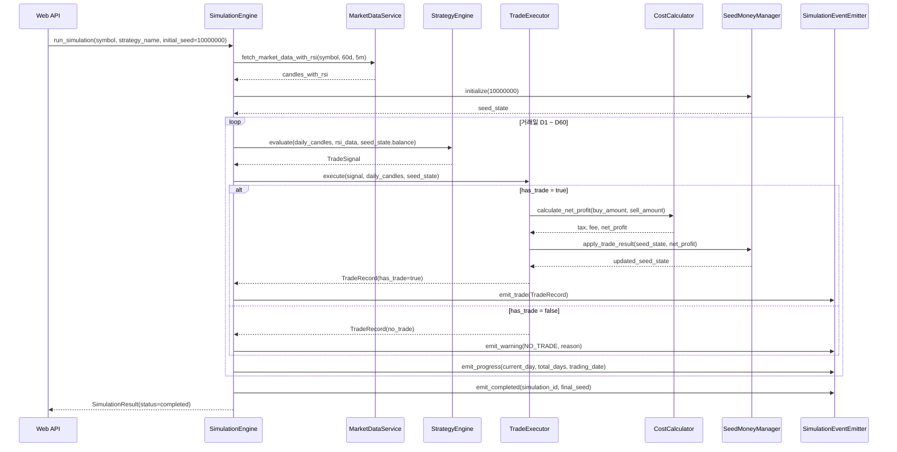
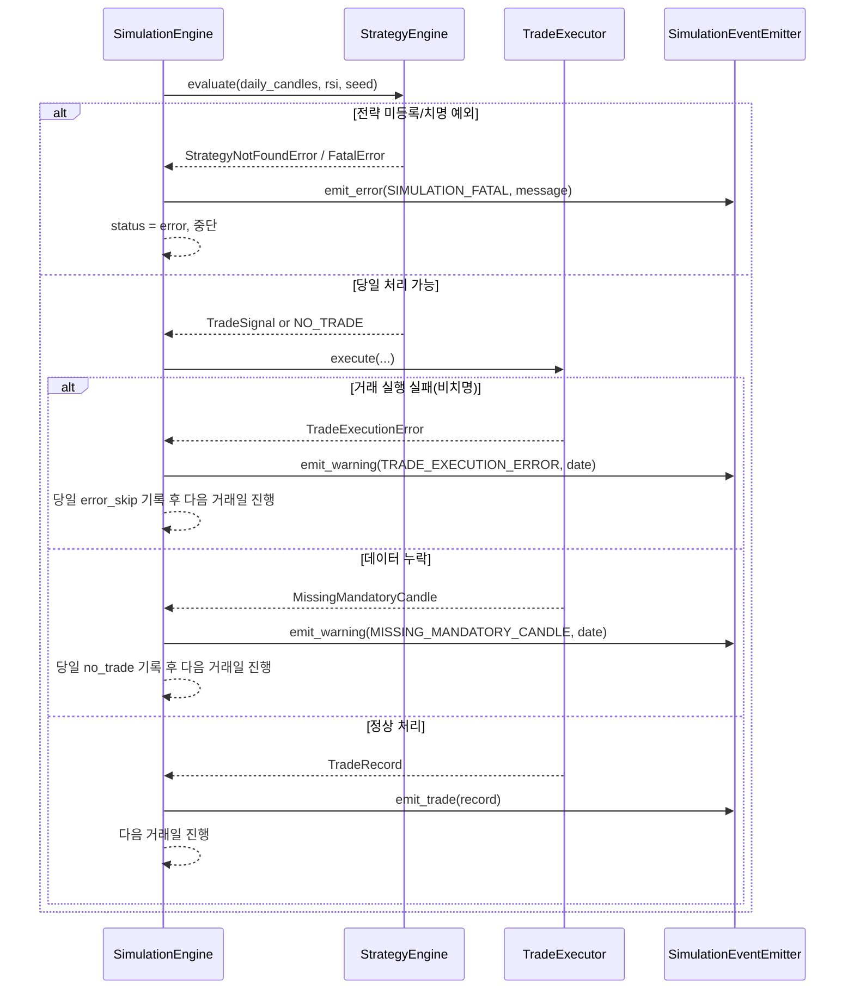

# 저수준 설계 문서 (LLD)
# Low-Level Design Document - SIMULATION

| 항목 | 내용 |
|------|------|
| **문서 버전** | 1.0.0 |
| **작성일** | 2026-02-15 |
| **대상 모듈** | SIMULATION (시뮬레이션 엔진 모듈) |
| **기반 문서** | HLD v1.0.0 (4.4, 5.x, 6.x, 8.x), SRS v1.0.0 (FR-007, FR-008, FR-009, BR-001~BR-004) |
| **관련 티켓** | TICKET-006-LLD-SIMULATION |

---

## 목차

1. [목적 및 범위](#1-목적-및-범위)
2. [컴포넌트 상세 설계](#2-컴포넌트-상세-설계)
3. [60일 반복 시뮬레이션 시퀀스](#3-60일-반복-시뮬레이션-시퀀스)
4. [비용 계산 및 Decimal 정밀도 규칙](#4-비용-계산-및-decimal-정밀도-규칙)
5. [거래 실행/시드머니 갱신 규칙](#5-거래-실행시드머니-갱신-규칙)
6. [실패/누락/무신호 처리 정책](#6-실패누락무신호-처리-정책)
7. [에러 처리 시퀀스](#7-에러-처리-시퀀스)
8. [이벤트 발행(SSE 연계) 설계](#8-이벤트-발행sse-연계-설계)
9. [실행 가능한 언어 중립 수도코드](#9-실행-가능한-언어-중립-수도코드)
10. [요구사항 추적성 매트릭스](#10-요구사항-추적성-매트릭스)
11. [테스트/검증 고려사항 (LLD 수준)](#11-테스트검증-고려사항-lld-수준)

---

## 1. 목적 및 범위

### 1.1 목적

본 문서는 HLD 4.4(시뮬레이션 엔진 모듈), 5.x(모듈 간 인터페이스), 6.x(데이터 흐름), 8.x(시뮬레이션/거래 데이터 모델)을 구현 가능한 수준으로 상세화한다. 대상은 `SimulationEngine`, `CostCalculator`, `SeedMoneyManager`, `TradeExecutor`, `SimulationEventEmitter`이며 SRS FR-007~FR-009를 직접 충족한다.

### 1.2 범위 (In-Scope)

- 단일 종목 대상 최근 60일 거래일 반복 시뮬레이션 루프 제어
- 전략 엔진 `TradeSignal` 기반 거래 실행(매수/매도/미거래)
- 매도 세금 0.2%, 매도 수수료 0.011% 비용 계산 및 차감
- 시드머니(초기 10,000,000원) 누적 관리 및 잔여 현금 보존
- 시뮬레이션 진행/거래/완료/오류 이벤트 발행(SSE 전달용)
- 거래 결과를 `SimulationResult`, `TradeRecord` 구조로 반환

### 1.3 비범위 (Out-of-Scope)

- Yahoo Finance 호출/RSI 계산 로직 구현 (MARKETDATA LLD 범위)
- 전략별 매수/매도 조건 판단 상세 구현 (STRATEGY LLD 범위)
- REST API 라우팅, SSE 엔드포인트 구현 (WEBAPI LLD 범위)
- 결과 보고서 집계/포맷팅 UI 구현 (REPORT/FRONTEND LLD 범위)

---

## 2. 컴포넌트 상세 설계

### 2.1 공통 데이터 구조

#### 2.1.1 `SimulationRequest`

| 필드 | 타입 | 설명 |
|------|------|------|
| `symbol` | string | 코스피 종목 심볼 (예: `005930.KS`) |
| `strategy_name` | string | 전략 식별자 (`sell_trailing_stop`, `buy_sell_trailing_stop`, `rsi_buy_sell_trailing_stop`) |
| `initial_seed` | Decimal | 초기 시드머니. 기본값 `10000000` |

#### 2.1.2 `TradeRecord`

| 필드 | 타입 | 설명 |
|------|------|------|
| `trade_date` | date | 거래일 |
| `buy_datetime` | datetime? | 매수 일시 |
| `buy_price` | Decimal? | 매수 단가(원) |
| `buy_quantity` | int | 매수 수량(주) |
| `buy_amount` | Decimal | 매수 총액(원) |
| `sell_datetime` | datetime? | 매도 일시 |
| `sell_price` | Decimal? | 매도 단가(원) |
| `sell_quantity` | int | 매도 수량(주) |
| `sell_amount` | Decimal | 매도 총액(원) |
| `tax` | Decimal | 매도 세금(원) |
| `fee` | Decimal | 매도 수수료(원) |
| `net_profit` | Decimal | 순수익(원) |
| `profit_rate` | Decimal | 수익률(%) |
| `sell_reason` | string | `profit_preserve`, `stop_loss`, `no_trade`, `error_skip` |
| `seed_money_after` | Decimal | 거래 후 시드머니 잔액(원) |

#### 2.1.3 `SimulationResult`

| 필드 | 타입 | 설명 |
|------|------|------|
| `simulation_id` | string | 시뮬레이션 식별자 |
| `symbol` | string | 종목 심볼 |
| `strategy` | string | 전략 식별자 |
| `start_date` | date | 시작일 |
| `end_date` | date | 종료일 |
| `initial_seed` | Decimal | 초기 시드머니 |
| `final_seed` | Decimal | 최종 시드머니 |
| `total_profit` | Decimal | 총 수익금 |
| `total_profit_rate` | Decimal | 총 수익률 |
| `total_trades` | int | 총 거래 횟수 |
| `no_trade_days` | int | 미거래일 수 |
| `status` | string | `running`, `completed`, `error` |
| `trades` | list[TradeRecord] | 거래 내역 |

### 2.2 `SimulationEngine`

#### 2.2.1 책임

- 시뮬레이션 전체 실행 제어 (`D1~D60` 거래일 순회)
- 시장 데이터/전략 엔진/거래 실행기 오케스트레이션
- 거래일별 진행률 계산 및 이벤트 발행
- 실행 결과 집계 및 종료 상태 결정

#### 2.2.2 인터페이스

| 메서드 시그니처 | 파라미터 | 반환값 | 예외 |
|----------------|----------|--------|------|
| `run_simulation(request: SimulationRequest) -> SimulationResult` | symbol, strategy_name, initial_seed | 시뮬레이션 결과 | `SimulationExecutionError`, `DataUnavailableError`, `StrategyNotFoundError` |
| `split_trading_days(candles_df) -> list[DailyCandles]` | 60일 OHLCV(+RSI) | 거래일 단위 캔들 목록 | `DataIntegrityError` |
| `process_one_day(day_data, seed_state) -> DayProcessResult` | 당일 분봉, 시드 상태 | 당일 처리 결과 | `DayProcessingError` |

#### 2.2.3 동작 규칙

1. 입력 종목은 1개만 허용한다(FR-009-1).
2. 시뮬레이션 데이터 구간은 최근 60일 거래일 기준으로 고정한다(FR-009-2).
3. 거래일 루프는 시간 오름차순으로 실행한다.
4. 각 거래일 종료 시 이벤트(`progress`)를 1회 이상 발행한다.
5. `status=completed`는 전체 거래일 처리 종료 시점에만 설정한다.

### 2.3 `CostCalculator`

#### 2.3.1 책임

- 매도 세금/수수료 계산
- 순매도금액/순수익 계산
- Decimal 정밀도 및 절사 정책 적용

#### 2.3.2 인터페이스

| 메서드 시그니처 | 파라미터 | 반환값 | 예외 |
|----------------|----------|--------|------|
| `calculate_sell_costs(sell_amount: Decimal) -> SellCosts` | 매도 총액(원) | `tax`, `fee`, `net_sell_amount` | `ValidationError` |
| `calculate_net_profit(buy_amount: Decimal, sell_amount: Decimal) -> ProfitResult` | 매수 총액, 매도 총액 | `tax`, `fee`, `net_profit`, `profit_rate` | `ValidationError` |

#### 2.3.3 동작 규칙

1. 세금 = `sell_amount * 0.002` (BR-001).
2. 수수료 = `sell_amount * 0.00011` (BR-002).
3. 세금/수수료는 각각 원 단위 이하 절사한다(BR-001/BR-002).
4. 매수 수수료는 계산하지 않는다(FR-007-7).

### 2.4 `SeedMoneyManager`

#### 2.4.1 책임

- 시드머니 상태 유지/갱신
- 매수 가능 수량 산출 (`floor`)
- 잔여 현금 보존 및 다음 거래 반영

#### 2.4.2 인터페이스

| 메서드 시그니처 | 파라미터 | 반환값 | 예외 |
|----------------|----------|--------|------|
| `initialize(initial_seed: Decimal = 10000000) -> SeedState` | 초기 시드머니 | 초기 상태 | `ValidationError` |
| `calculate_buy_quantity(seed_balance: Decimal, buy_price: Decimal) -> int` | 잔액, 매수가 | 최대 정수 수량 | `ValidationError` |
| `apply_trade_result(seed_state: SeedState, net_profit: Decimal) -> SeedState` | 기존 상태, 순손익 | 갱신 상태 | - |

#### 2.4.3 동작 규칙

1. 초기 시드머니 기본값은 `10000000`원이다(FR-008-1, BR-003).
2. 매수 수량 = `floor(seed_balance / buy_price)` (FR-008-4).
3. `buy_quantity == 0`이면 당일 매수하지 않는다(FR-008-7).
4. 잔여 현금은 거래 후에도 상태에 보존된다(FR-008-5).

### 2.5 `TradeExecutor`

#### 2.5.1 책임

- 전략 시그널을 실제 거래 내역(`TradeRecord`)으로 변환
- 매수/매도 금액, 비용, 순손익 산출
- 시드머니 매니저와 연계하여 거래 후 잔액 반영

#### 2.5.2 인터페이스

| 메서드 시그니처 | 파라미터 | 반환값 | 예외 |
|----------------|----------|--------|------|
| `execute(day_signal, day_data, seed_state) -> TradeExecutionResult` | 당일 시그널, 캔들, 시드상태 | 거래기록 + 갱신 시드상태 | `TradeExecutionError` |
| `build_no_trade_record(trade_date, reason, seed_after) -> TradeRecord` | 거래일, 사유, 잔액 | 미거래 레코드 | - |

#### 2.5.3 동작 규칙

1. `has_trade=false` 시 `no_trade` 레코드를 생성한다.
2. `has_trade=true` 시 `buy_amount = buy_price * buy_quantity`.
3. 매도 발생 시 `sell_amount = sell_price * sell_quantity`.
4. 비용 계산은 `CostCalculator`에 위임한다.
5. `seed_money_after = seed_before + net_profit` (수익/손실 모두 동일 수식) (FR-008-2,3).

### 2.6 `SimulationEventEmitter`

#### 2.6.1 책임

- 시뮬레이션 이벤트 표준 포맷 생성
- 진행률/거래/경고/오류/완료 이벤트 발행
- SSE 전달 계층(Web API)과 결합 가능한 인터페이스 제공

#### 2.6.2 인터페이스

| 메서드 시그니처 | 파라미터 | 반환값 | 예외 |
|----------------|----------|--------|------|
| `emit_progress(current_day: int, total_days: int, trading_date: date) -> None` | 진행 정보 | 없음 | - |
| `emit_trade(event_trade: TradeRecord) -> None` | 거래 내역 | 없음 | - |
| `emit_warning(code: string, message: string, trading_date: date) -> None` | 경고 코드/메시지 | 없음 | - |
| `emit_error(code: string, message: string) -> None` | 오류 코드/메시지 | 없음 | - |
| `emit_completed(simulation_id: string, final_seed: Decimal) -> None` | 완료 정보 | 없음 | - |

---

## 3. 60일 반복 시뮬레이션 시퀀스

### 3.1 거래일 루프 및 이벤트 발행 시퀀스



### 3.2 진행률 계산 규칙

- `progress_pct = (current_day / total_days) * 100`
- `total_days`는 실제 수집 데이터에서 추출된 거래일 수를 사용한다.
- 표시용 퍼센트는 소수점 한 자리까지 노출 가능하나 내부 계산은 Decimal을 유지한다.

---

## 4. 비용 계산 및 Decimal 정밀도 규칙

### 4.1 비용 계산식 (SRS 고정 규칙)

- 매도 세금 = `매도 금액 × 0.002` (0.2%)
- 매도 수수료 = `매도 금액 × 0.00011` (0.011%)
- 순매도금액 = `매도 금액 - 매도 세금 - 매도 수수료`
- 순수익 = `순매도금액 - 매수 금액`
- 수익률(%) = `(순수익 / 매수 금액) × 100`

### 4.2 Decimal 정밀도 규칙

| 항목 | 규칙 |
|------|------|
| 내부 금액 타입 | 모든 금액 연산은 Decimal 사용 (`float` 금지) |
| 세금 절사 | `tax = floor_to_won(sell_amount * 0.002)` |
| 수수료 절사 | `fee = floor_to_won(sell_amount * 0.00011)` |
| 순매도/순수익 | 절사된 `tax`, `fee`를 사용해 계산 |
| 시드머니 누적 | 거래마다 `seed = seed + net_profit` 반영 |
| 표시 포맷 | 수익금은 원 단위, 수익률은 소수점 둘째 자리 표시(SRS FR-013 연계) |

### 4.3 절사 순서 규칙

1. `sell_amount` 계산
2. 세금 계산 후 원 단위 이하 절사
3. 수수료 계산 후 원 단위 이하 절사
4. 절사된 세금/수수료를 차감해 순매도금액 계산
5. 순수익 계산 및 시드머니 반영

### 4.4 예시 (검증 기준)

- 입력: `buy_amount=9,940,000`, `sell_amount=10,052,000`
- 세금: `10,052,000 × 0.002 = 20,104` → `20,104`
- 수수료: `10,052,000 × 0.00011 = 1,105.72` → `1,105`
- 순매도금액: `10,052,000 - 20,104 - 1,105 = 10,030,791`
- 순수익: `10,030,791 - 9,940,000 = 90,791`

---

## 5. 거래 실행/시드머니 갱신 규칙

### 5.1 거래 실행 결정 규칙

| 조건 | 처리 |
|------|------|
| 전략 시그널 `NO_TRADE` | 거래 미실행, 시드머니 유지 |
| 매수 수량 0주 | 거래 미실행, 사유=`INSUFFICIENT_SEED` |
| 매수/매도 정상 시그널 | `TradeExecutor`에서 비용 포함 거래 확정 |
| 매도 가격/수량 누락 | 당일 실패 처리, 오류 이벤트 발행 |

### 5.2 시드머니 갱신 규칙

- 수익 거래: `seed_after = seed_before + net_profit`
- 손실 거래: `seed_after = seed_before + net_profit` (`net_profit` 음수)
- 미거래: `seed_after = seed_before`
- 잔여 현금은 매수 시점에도 상태에 유지되어 다음 거래일에 합산 적용

### 5.3 1주 미만 잔액 처리

- 판단식: `seed_balance < buy_price`
- 처리: 해당 거래일 매수 미실행(`no_trade`), 경고 이벤트 발행
- 시드머니 변동 없음

---

## 6. 실패/누락/무신호 처리 정책

### 6.1 정책 분류

| 분류 | 조건 | 처리 정책 | 시뮬레이션 지속 여부 |
|------|------|----------|----------------------|
| 거래 실패 | 필수 필드 누락(매수가/매도가/수량), 비용 계산 예외 | 해당 거래일 `error_skip` 레코드 생성 + 오류 이벤트 | 지속 (다음 거래일 진행) |
| 데이터 누락 | 거래일 캔들 부족, 필수 시각(09:05/15:00) 부재 | 해당 거래일 `no_trade` + 경고 이벤트 | 지속 |
| 전략 신호 없음 | 전략 조건 미충족(`NO_TRADE`) | 정상 미거래 처리 + 진행 이벤트 | 지속 |
| 치명적 실패 | 전략 미등록, 60일 데이터 전체 조회 실패 | 시뮬레이션 상태 `error` 종료 | 중단 |

### 6.2 처리 원칙

1. **거래일 단위 격리**: 비치명 오류는 당일에 국한하고 전체 시뮬레이션은 계속 진행한다.
2. **가시성 보장**: 누락/실패는 이벤트와 거래 레코드에 사유 코드를 남긴다.
3. **데이터 보존**: 실패일도 결과 집계에서 `no_trade_days` 또는 오류 카운트로 추적 가능해야 한다.
4. **수치 일관성**: 실패/미거래일에는 시드머니를 변경하지 않는다.

### 6.3 사유 코드 표준

| 코드 | 의미 |
|------|------|
| `NO_SIGNAL` | 전략 조건 미충족 |
| `INSUFFICIENT_SEED` | 1주 미만 잔액 |
| `MISSING_MANDATORY_CANDLE` | 09:05 또는 15:00 캔들 누락 |
| `TRADE_EXECUTION_ERROR` | 거래 실행 중 내부 오류 |
| `DATA_INTEGRITY_ERROR` | 거래일 데이터 무결성 오류 |

---

## 7. 에러 처리 시퀀스



---

## 8. 이벤트 발행(SSE 연계) 설계

### 8.1 이벤트 타입

| 이벤트 | 설명 | 최소 필드 |
|--------|------|----------|
| `progress` | 거래일 진행률 | `current_day`, `total_days`, `progress_pct`, `trading_date` |
| `trade` | 매수/매도 또는 미거래 결과 | `type`, `trade_date`, `buy/sell 가격`, `quantity`, `reason` |
| `warning` | 비치명 오류/누락 | `code`, `message`, `trading_date` |
| `error` | 치명적 오류 | `code`, `message` |
| `completed` | 정상 종료 | `simulation_id`, `status`, `final_seed` |

### 8.2 페이로드 규약

- 이벤트 데이터는 JSON 직렬화 가능한 원시 타입으로 구성한다.
- 금액 필드는 원 단위 정수 또는 문자열 Decimal로 직렬화한다.
- `trade.reason`은 `profit_preserve`, `stop_loss`, `no_trade`, `error_skip` 중 하나를 사용한다.

---

## 9. 실행 가능한 언어 중립 수도코드

```text
function run_simulation(symbol, strategy_name, initial_seed = Decimal('10000000')):
    validate_symbol(symbol)
    validate_strategy_name(strategy_name)

    emitter = SimulationEventEmitter()
    seed_state = SeedMoneyManager.initialize(initial_seed)
    trades = []

    candles = MarketDataService.fetch_market_data_with_rsi(symbol, period='60d', interval='5m')
    days = split_into_trading_days(candles)  # 오름차순

    if days.length == 0:
        emitter.emit_error('NO_DATA_AVAILABLE', '최근 60일 거래 데이터가 없습니다.')
        raise DataUnavailableError()

    strategy = StrategyRegistry.get(strategy_name)

    for index from 0 to days.length - 1:
        day_data = days[index]
        trading_date = day_data.date

        try:
            ensure_mandatory_candles(day_data, required=['09:05', '15:00'])

            signal = strategy.evaluate(
                daily_candles = day_data.candles,
                rsi_data = day_data.rsi,
                seed_money = seed_state.balance
            )

            execution = TradeExecutor.execute(signal, day_data, seed_state)
            seed_state = execution.seed_state_after
            trades.append(execution.trade_record)

            if execution.trade_record.sell_reason == 'no_trade':
                emitter.emit_warning('NO_SIGNAL', '전략 신호 없음', trading_date)
            else:
                emitter.emit_trade(execution.trade_record)

        except MissingMandatoryCandleError as e:
            record = TradeExecutor.build_no_trade_record(trading_date, 'MISSING_MANDATORY_CANDLE', seed_state.balance)
            trades.append(record)
            emitter.emit_warning('MISSING_MANDATORY_CANDLE', e.message, trading_date)

        except TradeExecutionError as e:
            record = TradeExecutor.build_no_trade_record(trading_date, 'TRADE_EXECUTION_ERROR', seed_state.balance)
            trades.append(record)
            emitter.emit_warning('TRADE_EXECUTION_ERROR', e.message, trading_date)

        progress_pct = ((index + 1) / days.length) * 100
        emitter.emit_progress(index + 1, days.length, trading_date)

    result = build_simulation_result(
        symbol = symbol,
        strategy = strategy_name,
        initial_seed = initial_seed,
        final_seed = seed_state.balance,
        trades = trades,
        status = 'completed'
    )

    emitter.emit_completed(result.simulation_id, result.final_seed)
    return result


function execute_trade(signal, day_data, seed_state):
    if signal.has_trade == false:
        record = build_no_trade_record(day_data.date, 'no_trade', seed_state.balance)
        return TradeExecutionResult(record, seed_state)

    buy_price = Decimal(signal.buy_price)
    buy_qty = signal.buy_quantity

    if buy_qty <= 0:
        record = build_no_trade_record(day_data.date, 'INSUFFICIENT_SEED', seed_state.balance)
        return TradeExecutionResult(record, seed_state)

    buy_amount = buy_price * Decimal(buy_qty)
    sell_amount = Decimal(signal.sell_price) * Decimal(signal.sell_quantity)

    costs = CostCalculator.calculate_sell_costs(sell_amount)
    net_profit = costs.net_sell_amount - buy_amount

    profit_rate = Decimal('0')
    if buy_amount > Decimal('0'):
        profit_rate = (net_profit / buy_amount) * Decimal('100')

    next_seed = SeedMoneyManager.apply_trade_result(seed_state, net_profit)

    record = TradeRecord(
        trade_date = day_data.date,
        buy_datetime = signal.buy_datetime,
        buy_price = buy_price,
        buy_quantity = buy_qty,
        buy_amount = buy_amount,
        sell_datetime = signal.sell_datetime,
        sell_price = Decimal(signal.sell_price),
        sell_quantity = signal.sell_quantity,
        sell_amount = sell_amount,
        tax = costs.tax,
        fee = costs.fee,
        net_profit = net_profit,
        profit_rate = round_to_2_decimal(profit_rate),
        sell_reason = signal.sell_reason,
        seed_money_after = next_seed.balance
    )

    return TradeExecutionResult(record, next_seed)


function calculate_sell_costs(sell_amount):
    assert sell_amount >= Decimal('0')

    tax_raw = sell_amount * Decimal('0.002')
    fee_raw = sell_amount * Decimal('0.00011')

    tax = floor_to_won(tax_raw)
    fee = floor_to_won(fee_raw)

    net_sell_amount = sell_amount - tax - fee

    return SellCosts(tax, fee, net_sell_amount)
```

---

## 10. 요구사항 추적성 매트릭스

| SRS 요구사항 | LLD 반영 항목 | 반영 절 |
|--------------|---------------|---------|
| FR-007 매매 비용 반영 | `CostCalculator` 책임/인터페이스, 비용 계산식, 절사 규칙 | 2.3, 4.1~4.3, 9장 |
| FR-008 시드머니 기반 투자금 관리 | `SeedMoneyManager`, 수량 `floor`, 잔여 현금 보존, 1주 미만 매수 불가 | 2.4, 5.2~5.3, 9장 |
| FR-009 단일 종목 반복 매매 시뮬레이션 | `SimulationEngine` 60일 거래일 루프, 거래일 데이터 처리, 결과 생성 | 2.2, 3장, 9장 |
| BR-001 매도 세금 0.2% | 세금 계산식 및 절사 | 2.3, 4장, 9장 |
| BR-002 매도 수수료 0.011% | 수수료 계산식 및 절사 | 2.3, 4장, 9장 |
| BR-003 초기 투자금 10,000,000원 | 초기값 규칙 | 2.4, 9장 |
| BR-004 시드머니 누적 관리 | 순손익 기반 누적 수식 | 2.5, 5.2, 9장 |

---

## 11. 테스트/검증 고려사항 (LLD 수준)

### 11.1 단위 테스트 관점

| 대상 | 검증 항목 |
|------|----------|
| `CostCalculator` | 세금/수수료 비율, 절사 순서, 경계값(0원/대금 큰 경우) |
| `SeedMoneyManager` | 수량 floor, 1주 미만 매수 불가, 잔여 현금 보존 |
| `TradeExecutor` | 정상 거래/미거래/오류 거래 레코드 생성, 순손익 계산 |
| `SimulationEngine` | 60일 루프 완주, 진행률 계산, 이벤트 발행 횟수 |
| `SimulationEventEmitter` | 이벤트 타입별 필수 필드 존재/직렬화 가능성 |

### 11.2 통합 테스트 관점

1. 전략 엔진에서 `NO_TRADE` 연속 발생 시 시뮬레이션이 중단되지 않아야 한다.
2. 일부 거래일 데이터 누락(09:05/15:00 결측) 시 해당일만 건너뛰고 전체 결과가 생성되어야 한다.
3. 60일 전체 완료 시 `completed` 이벤트와 `status=completed` 결과가 일치해야 한다.
4. 거래 내역 금액 필드(`tax`, `fee`, `net_profit`, `seed_money_after`)가 SRS BR 규칙과 동일해야 한다.

### 11.3 성능/정확성 관점

- 60일 × 5분봉 처리에서 불필요한 부동소수 변환이 없어야 한다.
- 금액 계산은 전 구간 Decimal 유지, 저장 직전 포맷팅만 수행한다.
- 동일 입력 데이터에 대해 결정적(deterministic) 결과를 보장해야 한다.
