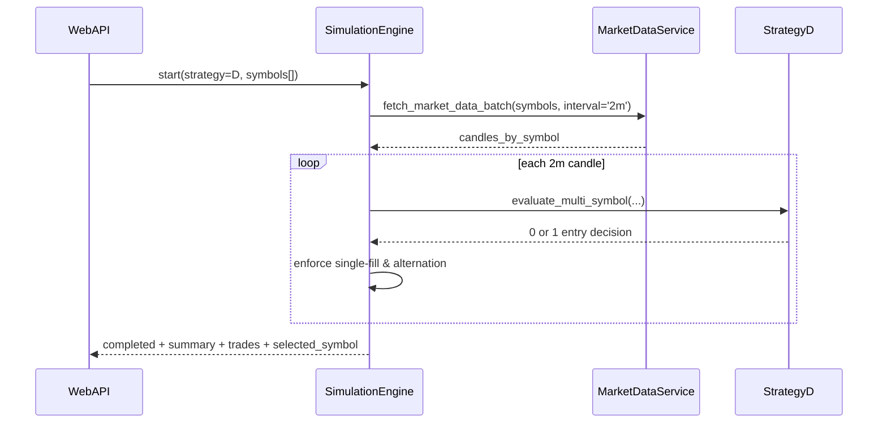

# 저수준 설계 문서 (LLD)
# Low-Level Design Document - SIMULATION

| 항목 | 내용 |
|------|------|
| 문서 버전 | 1.3.0 |
| 작성일 | 2026-02-17 |
| 대상 모듈 | SIMULATION |
| 기반 문서 | HLD v1.3.0 (3.1, 3.2, 4.2), LLD Simulation v1.0.0 |
| 관련 티켓 | TICKET-088-LLD-SIMULATION |

## 1. 목적
전략D 다중 종목 스캔과 단일 체결 정책을 시뮬레이션 계층에서 구현 가능한 수준으로 정의한다.

## 2. 요청 모델
- 공통: `strategy`, `start_date`, `end_date`, `seed_money`
- 기존 전략(1/2/3/A/B/C): `symbol` 필수, `symbols` 금지
- 전략D: `symbols`(1~20) 필수, `symbol` 선택
- 검증 오류 코드: `SYMBOL_REQUIRED`, `SYMBOLS_REQUIRED_FOR_STRATEGY_D`, `INVALID_SYMBOLS_COUNT`, `INVALID_SYMBOLS_FORMAT`

## 3. 상태 전이
- `IDLE -> RUNNING -> COMPLETED | FAILED`
- 거래 상태: `NO_POSITION -> HOLDING -> NO_POSITION`
- 불변식:
  1) `HOLDING` 중 신규 매수 금지
  2) `BUY` 이후 `SELL` 전 `BUY` 금지
  3) 동시 후보 다수여도 1건만 체결

## 4. 전략D 시퀀스

## 5. 오류 처리
- 데이터 누락/검증 실패: `SIMULATION_INPUT_ERROR`
- 전략 실행 실패: `SIMULATION_STRATEGY_ERROR`
- 외부 시세 실패: `SIMULATION_MARKETDATA_ERROR`
- 부분 실패 정책: `failed_symbols` 포함 후 중단(전략D는 일관성 우선)

## 6. 요구사항 추적
- FR-019: 다중 종목 스캔/단일 체결 정책
- CON-009: symbols 1~20
- CON-010: 동시 후보 1건 선택
- CON-011: 2분봉 + 09:03 기준가
