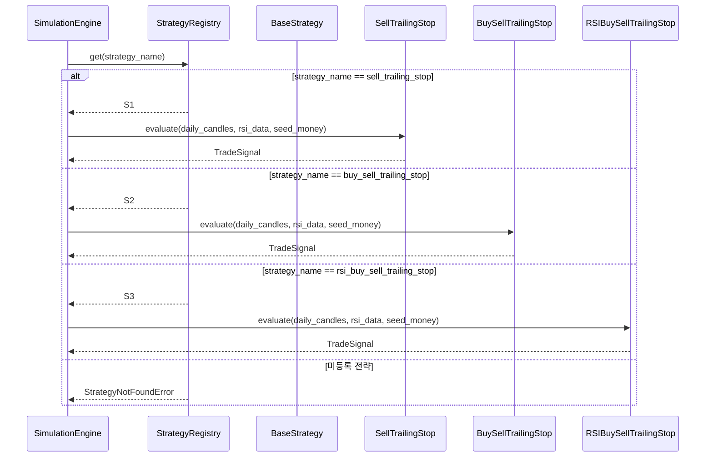
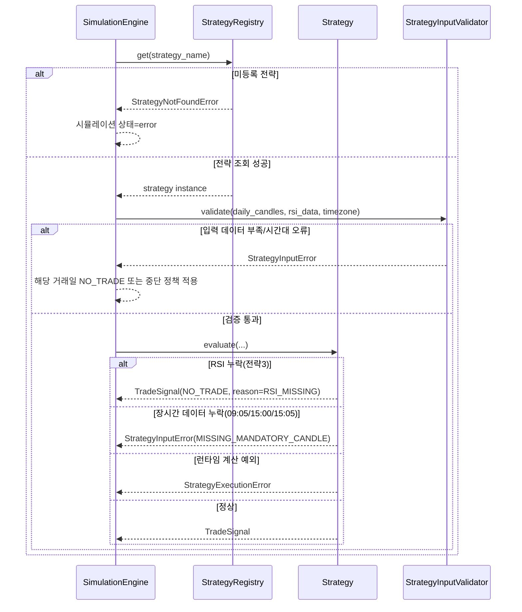

# 저수준 설계 문서 (LLD)
# Low-Level Design Document - STRATEGY

| 항목 | 내용 |
|------|------|
| **문서 버전** | 1.0.0 |
| **작성일** | 2026-02-15 |
| **대상 모듈** | STRATEGY (전략 엔진 모듈) |
| **기반 문서** | HLD v1.0.0 (4.3, 5.x, 6.x, 7.x, 8.x), SRS v1.0.0 (FR-003, FR-004, FR-005, FR-006, NFR-008) |
| **관련 티켓** | TICKET-005-LLD-STRATEGY |

---

## 목차

1. [목적 및 범위](#1-목적-및-범위)
2. [컴포넌트 상세 설계](#2-컴포넌트-상세-설계)
3. [전략 선택/실행 시퀀스](#3-전략-선택실행-시퀀스)
4. [전략별 매수/매도/손절 조건 상세 규칙](#4-전략별-매수매도손절-조건-상세-규칙)
5. [에러/예외 처리 시퀀스](#5-에러예외-처리-시퀀스)
6. [데이터 검증 규칙](#6-데이터-검증-규칙)
7. [Strategy Pattern 확장 절차](#7-strategy-pattern-확장-절차)
8. [실행 가능한 언어 중립 수도코드](#8-실행-가능한-언어-중립-수도코드)
9. [요구사항 추적성 매트릭스](#9-요구사항-추적성-매트릭스)
10. [테스트/검증 고려사항 (LLD 수준)](#10-테스트검증-고려사항-lld-수준)

---

## 1. 목적 및 범위

### 1.1 목적

본 문서는 HLD 4.3(전략 엔진 모듈), 5.x(모듈 간 인터페이스), 6.x(거래일 단위 데이터 흐름), 7.x(전략 확장 구조), 8.x(Trade 데이터 모델)를 구현 가능한 수준으로 상세화한다. 대상은 `BaseStrategy`, 전략 3종 구현체, `StrategyRegistry`이며 FR-003~FR-006 및 NFR-008을 직접 충족한다.

### 1.2 범위 (In-Scope)

- `BaseStrategy` 추상 인터페이스 및 템플릿 실행 흐름 정의
- `SellTrailingStopStrategy`(전략1), `BuySellTrailingStopStrategy`(전략2), `RSIBuySellTrailingStopStrategy`(전략3) 판단 규칙 상세화
- 전략 선택/실행 및 거래 시그널 생성 시퀀스 정의
- 전략 입력 데이터(캔들/RSI/시간대) 검증 규칙 정의
- 전략 계층 예외 모델 및 오류 전파 규칙 정의
- 신규 전략 추가 절차(기존 코드 수정 최소화) 정의

### 1.3 비범위 (Out-of-Scope)

- Yahoo Finance 호출, RSI 계산 알고리즘 자체 구현 (MARKETDATA LLD 범위)
- 매도 비용 계산(세금 0.2%, 수수료 0.011%) 상세 구현 (SIMULATION LLD 범위)
- REST API/SSE 엔드포인트 구현 (WEBAPI LLD 범위)
- UI 전략 선택 컴포넌트 구현 (FRONTEND LLD 범위)

---

## 2. 컴포넌트 상세 설계

### 2.1 공통 데이터 구조

#### 2.1.1 `TradeContext`

| 필드 | 타입 | 설명 |
|------|------|------|
| `trade_date` | date | 거래일 |
| `reference_price` | Decimal | 기준가(09:05 종가, 전략2/3 사용) |
| `low_point` | Decimal? | 하락 추적 중 전저점 |
| `buy_price` | Decimal? | 매수 단가 |
| `buy_quantity` | int | 매수 수량 |
| `buy_datetime` | datetime? | 매수 시각 |
| `is_bought` | bool | 당일 매수 여부 |
| `is_trailing_started` | bool | 이익보전 추적 시작 여부 |
| `highest_profit_rate` | Decimal | 당일 최고 수익률(%) |
| `latest_profit_rate` | Decimal | 최신 수익률(%) |
| `sell_reason` | SellReason? | 매도 사유 |

#### 2.1.2 `TradeSignal`

| 필드 | 타입 | 설명 |
|------|------|------|
| `has_trade` | bool | 당일 거래 발생 여부 |
| `buy_datetime` | datetime? | 매수 일시 |
| `buy_price` | Decimal? | 매수 단가 |
| `buy_quantity` | int | 매수 수량 |
| `sell_datetime` | datetime? | 매도 일시 |
| `sell_price` | Decimal? | 매도 단가 |
| `sell_reason` | SellReason | `PROFIT_PRESERVE`, `STOP_LOSS`, `MARKET_CLOSE`, `NO_TRADE` |
| `meta` | map<string, any> | 추적 지표(최고수익률, 이익보전율, RSI 등) |

#### 2.1.3 `SellReason` 열거형

- `PROFIT_PRESERVE`: 이익보전율 80% 이하 하락 매도
- `STOP_LOSS`: 15:00 조건 기반 손절매
- `MARKET_CLOSE`: 확장 전략에서 종가 청산이 필요한 경우의 일반화 슬롯
- `NO_TRADE`: 당일 미거래

### 2.2 `BaseStrategy` (ABC)

#### 2.2.1 책임

- 거래일 단위 실행 템플릿 제공
- 전략별 매수/매도/손절 판단 추상화
- 공통 상태(`TradeContext`) 생명주기 관리

#### 2.2.2 인터페이스

| 메서드 시그니처 | 파라미터 | 반환값 | 예외 |
|----------------|----------|--------|------|
| `evaluate(daily_candles, rsi_data, seed_money) -> TradeSignal` | 거래일 5분봉, RSI, 시드머니 | 당일 거래 시그널 | `StrategyInputError`, `StrategyExecutionError` |
| `initialize_day(candle_0905, seed_money) -> TradeContext` | 09:05 캔들, 시드머니 | 초기 컨텍스트 | `StrategyInputError` |
| `should_buy(candle, context, rsi_value=None) -> bool` | 현재 캔들/컨텍스트/RSI | 매수 여부 | - |
| `should_sell(candle, context) -> bool` | 현재 캔들/컨텍스트 | 이익보전 매도 여부 | - |
| `should_stop_loss(candle, context) -> bool` | 현재 캔들/컨텍스트 | 손절 조건 여부 | - |

#### 2.2.3 공통 동작 규칙

1. `evaluate()`는 캔들을 시간순(09:00→15:30)으로 순회한다.
2. 매수는 당일 1회, 매도도 당일 1회로 제한한다(FR-003 공통).
3. 매수 수량은 `floor(seed_money / buy_price)`로 계산한다(FR-003~005, FR-008 연계).
4. `buy_quantity == 0`이면 당일 `NO_TRADE`로 종료한다.
5. 매수 후 매도 없이 장 종료되는 흐름은 전략별 손절 규칙으로 종결한다.

### 2.3 `SellTrailingStopStrategy` (전략 1)

#### 2.3.1 책임

- 09:05 고정 매수
- 수익률 1.0% 도달 후 이익보전율 80% 이하 매도
- 15:00까지 1.0% 미도달 시 손절 처리

#### 2.3.2 인터페이스

| 메서드 | 구현 규칙 |
|--------|----------|
| `initialize_day()` | 09:05 매수 준비 상태 생성 |
| `should_buy()` | `timestamp == 09:05`이면 True |
| `should_sell()` | trailing 시작 후 `profit_preserve_ratio <= 80`이면 True |
| `should_stop_loss()` | 15:00 컷오프 시점까지 `is_trailing_started == False`이면 True |

### 2.4 `BuySellTrailingStopStrategy` (전략 2)

#### 2.4.1 책임

- 09:05 기준가 설정
- 기준가 대비 1.0% 이상 하락 시 전저점 추적 시작
- 전저점 대비 0.2% 이상 반등 시 매수
- 매도 규칙은 전략1과 동일

#### 2.4.2 인터페이스

| 메서드 | 구현 규칙 |
|--------|----------|
| `initialize_day()` | `reference_price = close@09:05`, `low_point = None` |
| `should_buy()` | 하락 조건 충족 이후 `rebound_rate >= 0.2`이면 True |
| `should_sell()` | 전략1과 동일 |
| `should_stop_loss()` | 전략1과 동일(전략별 시각 규칙은 4장 참조) |

### 2.5 `RSIBuySellTrailingStopStrategy` (전략 3)

#### 2.5.1 책임

- 전략2의 매수 트리거 + RSI 조건(`RSI <= 30`) 결합
- 매도 규칙은 전략1과 동일

#### 2.5.2 인터페이스

| 메서드 | 구현 규칙 |
|--------|----------|
| `should_buy()` | 전략2 매수 조건 AND `rsi_value <= 30` |
| `should_sell()` | 전략1과 동일 |
| `should_stop_loss()` | 전략1과 동일(전략별 시각 규칙은 4장 참조) |

### 2.6 `StrategyRegistry`

#### 2.6.1 책임

- 전략 이름 기반 조회
- 전략 등록/중복 방지/목록 제공
- 시뮬레이션 엔진의 전략 의존성 분리

#### 2.6.2 인터페이스

| 메서드 시그니처 | 설명 | 예외 |
|----------------|------|------|
| `register(strategy: BaseStrategy) -> None` | 전략 등록 | `DuplicateStrategyError` |
| `get(name: str) -> BaseStrategy` | 이름으로 전략 조회 | `StrategyNotFoundError` |
| `list_all() -> list[str]` | 등록 전략 목록 반환 | - |

#### 2.6.3 기본 등록 정책

- `sell_trailing_stop` → `SellTrailingStopStrategy`
- `buy_sell_trailing_stop` → `BuySellTrailingStopStrategy`
- `rsi_buy_sell_trailing_stop` → `RSIBuySellTrailingStopStrategy`

---

## 3. 전략 선택/실행 시퀀스

### 3.1 전략 선택 및 실행 시퀀스



### 3.2 거래 시그널 생성 흐름

```mermaid
flowchart TD
    A[입력 검증 완료] --> B[09:05 캔들 기반 initialize_day]
    B --> C{보유 여부}

    C -->|미보유| D[should_buy 평가]
    D -->|False| E[다음 5분봉]
    D -->|True| F[매수 체결 / 수량 계산]

    C -->|보유| G[수익률 계산]
    F --> G

    G --> H{수익률 >= 1.0% 최초 도달?}
    H -->|Yes| I[trailing 시작 + 최고수익률 갱신]
    H -->|No| J[손절 조건 평가]

    I --> K[이익보전율 계산]
    K --> L{이익보전율 <= 80%?}
    L -->|Yes| M[매도 시그널(PROFIT_PRESERVE)]
    L -->|No| J

    J --> N{15:00 손절 조건 충족?}
    N -->|Yes| O[매도 시그널(STOP_LOSS)]
    N -->|No| E

    E --> P{더 이상 캔들 없음?}
    P -->|No| C
    P -->|Yes| Q[NO_TRADE 또는 당일 미청산 예외]

    M --> R[TradeSignal 반환]
    O --> R
    Q --> R
```

---

## 4. 전략별 매수/매도/손절 조건 상세 규칙

### 4.1 공통 계산식

- 수익률(%) = `((현재가 - 매수가) / 매수가) * 100`
- 하락률(%) = `((기준가 - 현재가) / 기준가) * 100`
- 반등률(%) = `((현재가 - 전저점) / 전저점) * 100`
- 이익보전율(%) = `(현재 수익률 / 당일 최고 수익률) * 100`

### 4.2 전략 1: 매도 Trailing Stop (FR-003)

#### 매수 규칙

1. 09:05 5분봉 종가에서 매수한다.
2. 수량은 `floor(seed_money / buy_price)`.

#### 매도 규칙

1. 매수 후 5분봉 단위로 수익률 추적.
2. 수익률이 최초 1.0% 이상이면 trailing 시작.
3. trailing 시작 이후 매 캔들에서 이익보전율 계산.
4. 이익보전율이 80% 이하이면 즉시 매도.

#### 손절 규칙

1. 15:00까지 수익률 1.0% 미도달이면 손절.
2. 손절 매도 가격은 FR-003 원문에 따라 **15:05 5분봉 종가**를 사용.

### 4.3 전략 2: 매수+매도 Trailing Stop (FR-004)

#### 매수 규칙

1. 09:05 종가를 기준가로 설정.
2. 09:05 이후 하락률이 1.0% 이상이면 전저점 추적 시작.
3. 추적 구간에서 더 낮은 종가가 나오면 전저점 갱신.
4. 반등률이 0.2% 이상인 첫 시점에서 매수.
5. 15:00까지 매수 조건 미충족이면 당일 `NO_TRADE`.

#### 매도/손절 규칙

1. 매수 이후 이익보전 매도 규칙은 전략1과 동일.
2. FR-004 원문에 따라 15:00까지 수익률 1.0% 미도달이면 15:00 손절 조건으로 종료한다.

### 4.4 전략 3: RSI 매수 Trailing Stop (FR-005)

#### 매수 규칙

1. 전략2의 하락/반등 조건이 성립한 시점마다 매수 시도를 평가.
2. 매수 시도 시점 RSI가 `<= 30`이면 매수.
3. RSI가 `> 30`이면 해당 시점 매수는 건너뛰고 다음 캔들에서 재평가.
4. RSI 누락/NaN이면 해당 시점 매수 불가 처리(FR-002-6 연계).
5. 당일 종료까지 조건 미충족이면 `NO_TRADE`.

#### 매도/손절 규칙

1. 매수 이후 이익보전 매도 규칙은 전략1과 동일.
2. FR-005 원문에 따라 15:00까지 수익률 1.0% 미도달이면 15:00 손절 조건으로 종료한다.

### 4.5 전략별 규칙 비교표

| 항목 | 전략1 | 전략2 | 전략3 |
|------|------|------|------|
| 기준가(09:05) 사용 | 미사용 | 사용 | 사용 |
| 하락 1.0% 조건 | 미사용 | 사용 | 사용 |
| 반등 0.2% 조건 | 미사용 | 사용 | 사용 |
| RSI <= 30 조건 | 미사용 | 미사용 | 사용 |
| 이익보전 시작 | 수익률 >= 1.0% | 동일 | 동일 |
| 이익보전 매도 | 보전율 <= 80% | 동일 | 동일 |
| 1일 매수/매도 횟수 | 각 1회 제한 | 동일 | 동일 |

---

## 5. 에러/예외 처리 시퀀스



### 5.1 예외 분류 및 처리 정책

| 예외 타입 | 발생 조건 | 전략 계층 처리 | 상위 전달 |
|----------|----------|---------------|----------|
| `StrategyNotFoundError` | 미등록 전략명 요청 | 즉시 실패 | 시뮬레이션 중단 |
| `StrategyInputError` | 필수 캔들/컬럼/시간대 누락 | 당일 NO_TRADE 또는 실패 정책 | 정책 기반 전달 |
| `RSIDataMissingError` | 전략3 매수 시점 RSI 없음/NaN | 해당 시점 매수 스킵 | `meta`에 기록 |
| `InsufficientSeedMoneyError` | `buy_quantity == 0` | 당일 NO_TRADE | 비치명(계속 진행) |
| `StrategyExecutionError` | 0나눗셈/비정상 상태 전이 등 | 해당 거래일 실패 | 시뮬레이션 엔진에서 처리 |

---

## 6. 데이터 검증 규칙

### 6.1 입력 캔들 검증

| 검증 항목 | 조건 | 실패 시 |
|----------|------|---------|
| 데이터 비어있음 | row 수 > 0 | `StrategyInputError(EMPTY_CANDLES)` |
| 필수 컬럼 | `timestamp, open, high, low, close, volume` | `StrategyInputError(MISSING_COLUMNS)` |
| 정렬/중복 | `timestamp` 오름차순, 중복 없음 | `StrategyInputError(INVALID_TIMESTAMP_ORDER)` |
| 가격 무결성 | `high >= low`, `open/close ∈ [low, high]` | `StrategyInputError(INVALID_PRICE_RANGE)` |
| 거래시간 필터 | KST 평일 `09:00~15:30`, 5분 경계 | `StrategyInputError(INVALID_TRADING_SESSION)` |

### 6.2 필수 시점 캔들 검증

| 전략 | 필수 시점 | 규칙 |
|------|----------|------|
| 전략1 | 09:05, 15:05 | 09:05 매수/15:05 손절 가격 산출을 위해 필수 |
| 전략2 | 09:05, 15:00 | 기준가 설정 및 15:00 손절 컷오프를 위해 필수 |
| 전략3 | 09:05, 15:00 | 기준가 설정 및 15:00 손절 컷오프를 위해 필수 |

### 6.3 RSI 검증 (전략3)

| 검증 항목 | 조건 | 실패 시 |
|----------|------|---------|
| RSI 컬럼 존재 | `rsi` 존재 | `StrategyInputError(MISSING_RSI_COLUMN)` |
| RSI 범위 | `0 <= rsi <= 100` 또는 NaN | 범위 위반은 `StrategyInputError` |
| 시점 정렬 | 캔들과 동일 timestamp 정렬 | 불일치 시 `StrategyInputError(RSI_ALIGNMENT_ERROR)` |
| RSI NaN 처리 | 매수 시점 NaN은 매수 스킵 | `RSIDataMissingError`(비치명) |

### 6.4 시간대 규칙

1. 내부 기준 시간대는 `Asia/Seoul` 고정.
2. tz-naive timestamp 입력은 허용하지 않고 명시적으로 오류 처리.
3. 손절 컷오프 판정은 KST `15:00` 기준으로 수행.

---

## 7. Strategy Pattern 확장 절차

### 7.1 신규 전략 추가 절차 (기존 코드 수정 최소화)

1. `BaseStrategy`를 상속한 신규 클래스 생성
2. `initialize_day`, `should_buy`, `should_sell`, `should_stop_loss` 구현
3. 전략 고유 식별자(`name`)와 설명(`description`) 선언
4. `StrategyRegistry.register(new_strategy)`로 등록
5. 시뮬레이션 설정에서 전략 식별자만 주입(엔진 로직 수정 없음)

### 7.2 확장 제약사항

- 기존 전략 클래스(1/2/3) 코드 수정 금지
- `TradeSignal` 출력 스키마 변경 금지(하위 호환 유지)
- 매도 사유 enum 확장 시 기존 값 의미 변경 금지
- 기존 시뮬레이션 파이프라인(`SIM -> STRATEGY -> TradeSignal`) 유지

### 7.3 OCP 준수 체크포인트

| 체크 항목 | 기준 |
|----------|------|
| 신규 전략 추가 시 기존 전략 파일 수정 여부 | 없어야 함 |
| 시뮬레이션 엔진 분기문 추가 여부 | 없어야 함(레지스트리 조회 사용) |
| 보고서 모듈 변경 여부 | 없어야 함(`TradeSignal` 호환) |
| 회귀 영향 범위 | 신규 전략 테스트로 한정 |

---

## 8. 실행 가능한 언어 중립 수도코드

### 8.1 공통 템플릿 (`BaseStrategy.evaluate`)

```text
function evaluate(daily_candles, rsi_data, seed_money):
    validate_inputs(daily_candles, rsi_data)

    candle_0905 = find_candle(daily_candles, "09:05")
    context = initialize_day(candle_0905, seed_money)

    for candle in daily_candles ordered by timestamp:
        if not context.is_bought:
            rsi_value = lookup_rsi(rsi_data, candle.timestamp)   # 전략1/2는 null 허용
            if should_buy(candle, context, rsi_value):
                buy_price = candle.close
                qty = floor(seed_money / buy_price)
                if qty <= 0:
                    return make_no_trade("INSUFFICIENT_SEED")
                context = mark_buy(context, candle.timestamp, buy_price, qty)
                continue

        if context.is_bought:
            update_profit_state(context, candle.close)

            if should_sell(candle, context):
                return make_sell_signal(candle.timestamp, candle.close, "PROFIT_PRESERVE", context)

            if should_stop_loss(candle, context):
                stop_price = resolve_stop_loss_price(daily_candles, context.strategy_name)
                stop_time = resolve_stop_loss_time(daily_candles, context.strategy_name)
                return make_sell_signal(stop_time, stop_price, "STOP_LOSS", context)

    return make_no_trade("NO_ENTRY_OR_NO_EXIT")
```

### 8.2 전략1 수도코드

```text
function should_buy_strategy1(candle, context, _):
    return candle.time == "09:05"

function should_sell_strategy1(candle, context):
    profit_rate = percent(candle.close - context.buy_price, context.buy_price)

    if profit_rate >= 1.0 and not context.is_trailing_started:
        context.is_trailing_started = true
        context.highest_profit_rate = profit_rate

    if context.is_trailing_started:
        context.highest_profit_rate = max(context.highest_profit_rate, profit_rate)
        preserve_ratio = (profit_rate / context.highest_profit_rate) * 100
        if preserve_ratio <= 80:
            return true

    return false

function should_stop_loss_strategy1(candle, context):
    return candle.time == "15:00" and context.is_trailing_started == false

function resolve_stop_loss_price_strategy1(daily_candles):
    return find_candle(daily_candles, "15:05").close
```

### 8.3 전략2 수도코드

```text
function initialize_day_strategy2(candle_0905, seed_money):
    context.reference_price = candle_0905.close
    context.low_point = null
    return context

function should_buy_strategy2(candle, context, _):
    if candle.time <= "09:05":
        return false

    drop_rate = ((context.reference_price - candle.close) / context.reference_price) * 100

    if context.low_point is null and drop_rate >= 1.0:
        context.low_point = candle.close
        return false

    if context.low_point is not null:
        context.low_point = min(context.low_point, candle.close)
        rebound_rate = ((candle.close - context.low_point) / context.low_point) * 100
        if rebound_rate >= 0.2:
            return true

    return false

function should_sell_strategy2(candle, context):
    return should_sell_strategy1(candle, context)

function should_stop_loss_strategy2(candle, context):
    return candle.time == "15:00" and context.is_trailing_started == false

function end_of_day_rule_strategy2(context, now_time):
    if now_time >= "15:00" and context.is_bought == false:
        return make_no_trade("ENTRY_CONDITION_NOT_MET")
```

### 8.4 전략3 수도코드

```text
function should_buy_strategy3(candle, context, rsi_value):
    if should_buy_strategy2(candle, context, null) == false:
        return false

    if rsi_value is null or isNaN(rsi_value):
        record_meta("RSI_MISSING", candle.timestamp)
        return false

    if rsi_value <= 30:
        return true

    return false

function should_sell_strategy3(candle, context):
    return should_sell_strategy1(candle, context)

function should_stop_loss_strategy3(candle, context):
    return candle.time == "15:00" and context.is_trailing_started == false
```

---

## 9. 요구사항 추적성 매트릭스

| SRS 요구사항 | 요구사항 요약 | LLD 반영 절 | 담당 컴포넌트 | 충족 방식 |
|-------------|---------------|-------------|---------------|-----------|
| FR-003 | 전략1: 09:05 매수, 1.0%/80% 이익보전, 손절 | 2.3, 4.2, 8.2 | `SellTrailingStopStrategy` | 고정 시각 매수 + trailing + 손절 규칙 명세 |
| FR-004 | 전략2: 1.0% 하락 후 0.2% 반등 매수, 전략1 매도 동일 | 2.4, 4.3, 8.3 | `BuySellTrailingStopStrategy` | 기준가/전저점 추적 및 반등 매수 규칙 명세 |
| FR-005 | 전략3: 전략2 + RSI<=30 매수 | 2.5, 4.4, 6.3, 8.4 | `RSIBuySellTrailingStopStrategy` | RSI 게이트 조건 및 누락 처리 규칙 명세 |
| FR-006 | 신규 전략 확장성 | 2.6, 7 | `BaseStrategy`, `StrategyRegistry` | 추상 인터페이스 + 레지스트리 등록 절차 정의 |
| NFR-008 | 전략 확장 용이성 | 7.1~7.3 | `BaseStrategy`, `StrategyRegistry` | OCP 체크포인트와 확장 제약 명시 |

---

## 10. 테스트/검증 고려사항 (LLD 수준)

### 10.1 단위 테스트 포인트

1. `BaseStrategy.evaluate`
   - 캔들 정렬 순회 및 1일 1매수/1매도 불변식 검증
   - `buy_quantity==0` 시 `NO_TRADE` 반환 검증

2. `SellTrailingStopStrategy`
   - 09:05 매수 정확성 검증
   - `profit >= 1.0` 이후 `preserve_ratio <= 80` 매도 검증
   - 15:00 미도달/도달 경계값에서 손절 조건 검증

3. `BuySellTrailingStopStrategy`
   - 하락률 1.0% 시작점, 전저점 갱신, 반등률 0.2% 경계값 검증
   - 15:00까지 미진입 시 `NO_TRADE` 검증

4. `RSIBuySellTrailingStopStrategy`
   - `RSI=30` 허용, `RSI=30.01` 불허 검증
   - RSI NaN 시점 매수 스킵 및 이후 캔들 재평가 검증

5. `StrategyRegistry`
   - 중복 등록 방지, 미등록 조회 예외, 등록 목록 무결성 검증

### 10.2 통합 검증 포인트

- `SimulationEngine -> StrategyRegistry -> Strategy.evaluate` 경로의 전략 선택 정확성
- 동일 입력(종목/전략/캔들/RSI) 재실행 시 동일 `TradeSignal` 산출(결정성)
- 전략 추가 후 기존 전략 1/2/3 결과 비변경 회귀 검증

### 10.3 검증 완료 기준

- FR-003~FR-006, NFR-008 추적 항목별 테스트 케이스 연결 100%
- 경계값(1.0%, 80%, 0.2%, RSI 30, 09:05/15:00/15:05) 모두 검증
- 예외 시나리오(입력 부족, RSI 누락, 장시간 데이터 누락) 재현 가능

---

## 변경 이력

| 버전 | 날짜 | 변경 내용 | 작성자 |
|------|------|----------|--------|
| 1.0.0 | 2026-02-15 | 최초 작성 | LLD 담당 에이전트 |
