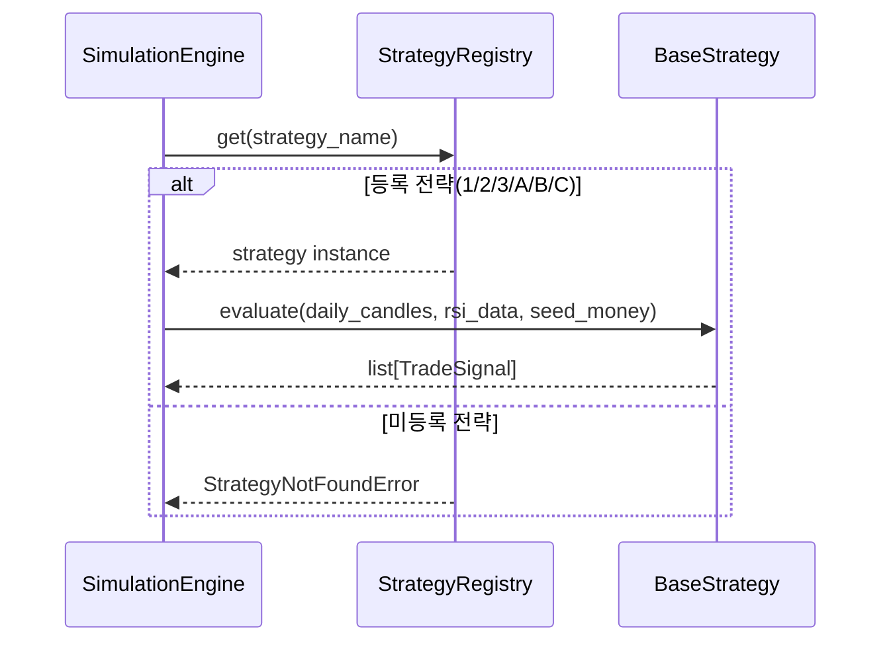
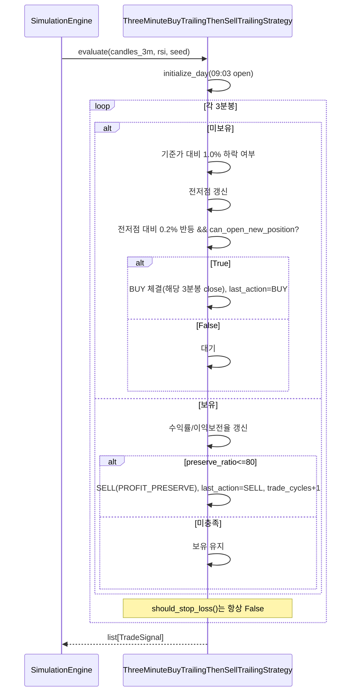
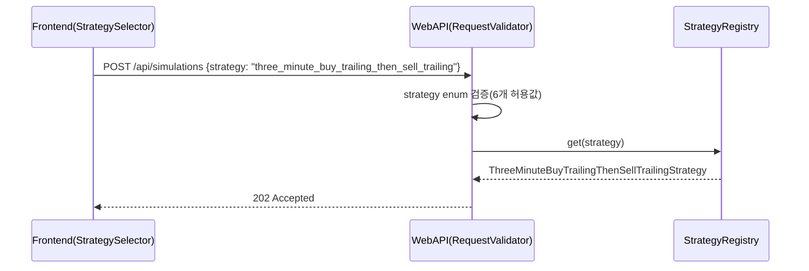
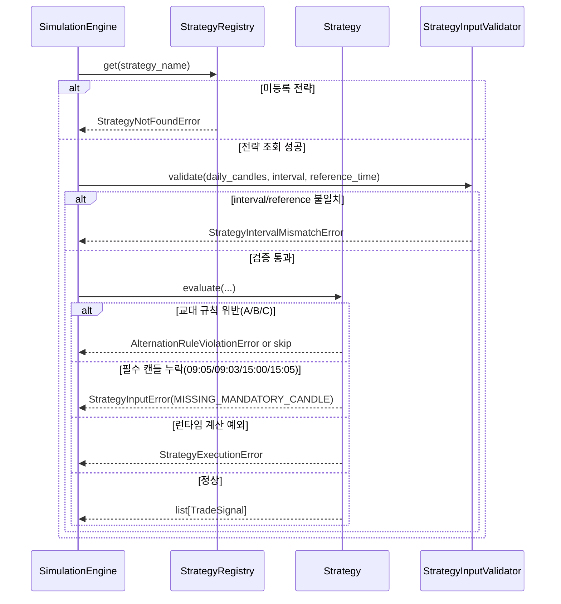

# 저수준 설계 문서 (LLD)
# Low-Level Design Document - STRATEGY

| 항목 | 내용 |
|------|------|
| **문서 버전** | 1.2.0 |
| **작성일** | 2026-02-16 |
| **대상 모듈** | STRATEGY (전략 엔진 모듈) |
| **기반 문서** | HLD v1.2.0 (4.3, 5.3.2, 6.3, 7.5), SRS v1.2.0 (FR-003, FR-004, FR-005, FR-006, FR-010, FR-016, FR-017, FR-018, CON-006, CON-007, CON-008, NFR-008), LLD Strategy v1.1.0 |
| **관련 티켓** | TICKET-076-LLD-STRATEGY |

---

## v1.2.0 변경 로그 (요약)

- 신규 전략 C(`ThreeMinuteBuyTrailingThenSellTrailingStrategy`) 상세 설계 추가
- 전략 C 핵심 규칙 반영: 3분봉, 09:03 기준가(3분봉 시가), 1.0% 하락 후 전저점 추적, 전저점 대비 0.2% 반등 시 해당 3분봉 종가 전액 매수
- 신규 전략 공통 제약 적용 대상을 A/B/C로 확대: 당일 손절 미적용, 매수/매도 교대 강제, 연속 매수 금지
- `StrategyRegistry`/WebAPI/Frontend 전략 ID 계약을 6개 전략 기준으로 정합화
- HLD/SRS 추적성 매트릭스를 FR-018, CON-008 포함 기준으로 갱신

---

## 목차

1. [목적 및 범위](#1-목적-및-범위)
2. [컴포넌트 상세 설계](#2-컴포넌트-상세-설계)
3. [전략 선택/실행 시퀀스](#3-전략-선택실행-시퀀스)
4. [전략별 매수/매도/손절 조건 상세 규칙](#4-전략별-매수매도손절-조건-상세-규칙)
5. [에러/예외 처리 시퀀스](#5-에러예외-처리-시퀀스)
6. [데이터 검증 규칙](#6-데이터-검증-규칙)
7. [Strategy Pattern 확장 절차](#7-strategy-pattern-확장-절차)
8. [실행 가능한 언어 중립 수도코드](#8-실행-가능한-언어-중립-수도코드)
9. [요구사항 추적성 매트릭스](#9-요구사항-추적성-매트릭스)
10. [테스트/검증 고려사항 (LLD 수준)](#10-테스트검증-고려사항-lld-수준)

---

## 1. 목적 및 범위

### 1.1 목적

본 문서는 HLD v1.2.0의 전략 엔진 설계를 구현 가능한 수준으로 상세화한다. 대상은 `BaseStrategy`, 전략 6종(1/2/3/A/B/C), `StrategyRegistry`, 전략 식별자 계약이며 FR-003~FR-006, FR-010, FR-016~FR-018, CON-006~CON-008, NFR-008을 직접 충족한다.

### 1.2 범위 (In-Scope)

- `BaseStrategy` 추상 인터페이스 및 거래일 실행 템플릿 정의
- 전략 1/2/3/A/B/C의 매수/매도/손절 규칙 상세화
- 전략 C(3분봉) 클래스 책임, 입출력, 상태 전이, 예외 처리 정의
- 신규 전략 공통 제약(A/B/C: 무손절, 교대, 연속 매수 금지) 상태 전이 규칙 정의
- `StrategyRegistry` 6전략 등록 정책 및 전략 ID 계약 정의
- WebAPI/Frontend와 연동되는 전략 ID 매핑 계약 명세
- 전략 계층 입력 검증/예외 모델/오류 전파 규칙 정의

### 1.3 비범위 (Out-of-Scope)

- Yahoo Finance 호출/분봉 집계/RSI 계산 알고리즘 구현 (MARKETDATA LLD)
- 세금·수수료 정산 로직 구현 (SIMULATION LLD)
- REST API 엔드포인트 구현 자체 (WEBAPI LLD)
- 프론트엔드 화면/컴포넌트 구현 자체 (FRONTEND LLD)

---

## 2. 컴포넌트 상세 설계

### 2.1 공통 데이터 구조

#### 2.1.1 `TradeContext`

| 필드 | 타입 | 설명 |
|------|------|------|
| `trade_date` | date | 거래일 |
| `strategy_name` | string | 전략 식별자 |
| `candle_interval` | string | 전략 분봉 단위 (`5m` 또는 `3m`) |
| `reference_time` | string | 기준 시각 (`09:05` 또는 `09:03`) |
| `reference_price` | Decimal? | 기준가(전략2/3/B/C) |
| `low_point` | Decimal? | 하락 추적 중 전저점 |
| `buy_price` | Decimal? | 현재 포지션 매수 단가 |
| `buy_quantity` | int | 현재 보유 수량 |
| `buy_datetime` | datetime? | 현재 포지션 매수 시각 |
| `is_bought` | bool | 현재 포지션 보유 여부 |
| `is_trailing_started` | bool | 이익보전 추적 시작 여부 |
| `highest_profit_rate` | Decimal | 현재 포지션 최고 수익률(%) |
| `latest_profit_rate` | Decimal | 최신 수익률(%) |
| `sell_reason` | SellReason? | 최근 매도 사유 |
| `last_action` | ActionType | 최근 체결 액션 (`NONE`,`BUY`,`SELL`) |
| `trade_cycles` | int | 당일 완료된 매수→매도 사이클 수 |
| `allow_same_day_stop_loss` | bool | 당일 손절 허용 여부 (1/2/3=True, A/B/C=False) |
| `allow_multiple_round_trips` | bool | 당일 복수 사이클 허용 여부 (1/2/3=False, A/B/C=True) |

#### 2.1.2 `TradeSignal`

| 필드 | 타입 | 설명 |
|------|------|------|
| `has_trade` | bool | 당일 거래 발생 여부 |
| `buy_datetime` | datetime? | 매수 일시 |
| `buy_price` | Decimal? | 매수 단가 |
| `buy_quantity` | int | 매수 수량 |
| `sell_datetime` | datetime? | 매도 일시 |
| `sell_price` | Decimal? | 매도 단가 |
| `sell_reason` | SellReason | `PROFIT_PRESERVE`, `STOP_LOSS`, `MARKET_CLOSE`, `NO_TRADE` |
| `meta` | map<string, any> | 추적 지표(최고수익률, 이익보전율, RSI, 저점, 제약 위반 플래그, interval 정보) |

#### 2.1.3 `SellReason` 열거형

- `PROFIT_PRESERVE`: 이익보전율 80% 이하 하락 매도
- `STOP_LOSS`: 15:00 조건 기반 손절(기존 전략 1/2/3 전용)
- `MARKET_CLOSE`: 종가 강제 청산 정책 확장 슬롯
- `NO_TRADE`: 당일 미거래

#### 2.1.4 `ActionType` 열거형

- `NONE`: 당일 체결 없음
- `BUY`: 직전 체결이 매수
- `SELL`: 직전 체결이 매도

### 2.2 `BaseStrategy` (ABC)

#### 2.2.1 책임

- 거래일 단위 실행 템플릿 제공
- 전략별 매수/매도/손절 판단 추상화
- 공통 상태(`TradeContext`) 생명주기 관리
- 제약(무손절/교대/연속 매수 금지) 불변식 검증

#### 2.2.2 인터페이스

| 메서드 시그니처 | 파라미터 | 반환값 | 예외 |
|----------------|----------|--------|------|
| `evaluate(daily_candles, rsi_data, seed_money) -> list[TradeSignal]` | 전략 분봉(5m/3m), RSI, 시드머니 | 당일 거래 시그널 목록 | `StrategyInputError`, `StrategyExecutionError` |
| `initialize_day(reference_candle, seed_money) -> TradeContext` | 기준 시각 캔들(09:05 또는 09:03), 시드머니 | 초기 컨텍스트 | `StrategyInputError` |
| `should_buy(candle, context, rsi_value=None) -> bool` | 현재 캔들/컨텍스트/RSI | 매수 여부 | - |
| `should_sell(candle, context) -> bool` | 현재 캔들/컨텍스트 | 이익보전 매도 여부 | - |
| `should_stop_loss(candle, context) -> bool` | 현재 캔들/컨텍스트 | 손절 조건 여부 | - |
| `required_interval() -> str` | - | `5m` 또는 `3m` | - |
| `required_reference_time() -> str` | - | `09:05` 또는 `09:03` | - |
| `can_open_new_position(context) -> bool` | 컨텍스트 | 신규 매수 허용 여부 | `AlternationRuleViolationError` |

#### 2.2.3 공통 동작 규칙

1. `evaluate()`는 캔들을 시간순으로 순회한다.
2. 보유 포지션이 있으면 추가 매수는 금지한다.
3. 전략 1/2/3은 당일 최대 1매수/1매도만 허용한다.
4. 전략 A/B/C는 `매수→매도→매수→매도` 교대만 허용한다.
5. 매수 수량은 `floor(seed_money / buy_price)`로 계산한다.
6. `buy_quantity == 0`이면 해당 매수 시도는 스킵하고 `meta`에 기록한다.
7. `allow_same_day_stop_loss=False`인 전략(A/B/C)은 `should_stop_loss()`가 항상 False여야 한다.

### 2.3 `SellTrailingStopStrategy` (전략 1)

| 메서드 | 구현 규칙 |
|--------|----------|
| `required_interval()` | `5m` |
| `required_reference_time()` | `09:05` |
| `initialize_day()` | `allow_same_day_stop_loss=True`, `allow_multiple_round_trips=False` |
| `should_buy()` | `timestamp == 09:05`이면 True |
| `should_sell()` | trailing 시작 후 `profit_preserve_ratio <= 80`이면 True |
| `should_stop_loss()` | 15:00 컷오프까지 trailing 미시작이면 True |

### 2.4 `BuySellTrailingStopStrategy` (전략 2)

| 메서드 | 구현 규칙 |
|--------|----------|
| `required_interval()` | `5m` |
| `required_reference_time()` | `09:05` |
| `initialize_day()` | `reference_price = close@09:05`, `low_point=None` |
| `should_buy()` | 기준가 대비 1.0% 하락 후 전저점 대비 반등률 `>= 0.2`이면 True |
| `should_sell()` | 전략 1과 동일 |
| `should_stop_loss()` | 전략 1과 동일 |

### 2.5 `RSIBuySellTrailingStopStrategy` (전략 3)

| 메서드 | 구현 규칙 |
|--------|----------|
| `required_interval()` | `5m` |
| `required_reference_time()` | `09:05` |
| `should_buy()` | 전략2 매수 조건 AND `rsi_value <= 30` |
| `should_sell()` | 전략 1과 동일 |
| `should_stop_loss()` | 전략 1과 동일 |

### 2.6 `RSIOnlyTrailingStopStrategy` (전략 A)

| 메서드 | 구현 규칙 |
|--------|----------|
| `required_interval()` | `5m` |
| `required_reference_time()` | `09:05` |
| `initialize_day()` | `allow_same_day_stop_loss=False`, `allow_multiple_round_trips=True`, `last_action=NONE` |
| `should_buy()` | `rsi_value <= 30` AND `can_open_new_position(context)` |
| `should_sell()` | 전략 1의 이익보전 매도와 동일 |
| `should_stop_loss()` | 항상 False |

### 2.7 `BuyTrailingThenSellTrailingStrategy` (전략 B)

| 메서드 | 구현 규칙 |
|--------|----------|
| `required_interval()` | `5m` |
| `required_reference_time()` | `09:05` |
| `initialize_day()` | `reference_price=close@09:05`, `allow_same_day_stop_loss=False`, `allow_multiple_round_trips=True` |
| `should_buy()` | 전략2 하락/반등 조건 AND `can_open_new_position(context)` |
| `should_sell()` | 전략 1의 이익보전 매도와 동일 |
| `should_stop_loss()` | 항상 False |

### 2.8 `ThreeMinuteBuyTrailingThenSellTrailingStrategy` (전략 C)

#### 2.8.1 책임

- 3분봉 기준 진입 전략 수행
- 09:03 3분봉 시가를 기준가로 설정
- 기준가 대비 1.0% 하락 후 전저점 추적 시작
- 전저점 대비 0.2% 반등 시 해당 3분봉 종가로 전액 매수
- 매수 후 매도는 전략 1과 동일한 이익보전 Trailing Stop 적용
- 당일 손절 미적용 + 매수/매도 교대 + 연속 매수 금지

#### 2.8.2 입력/출력 계약

| 항목 | 타입 | 규칙 |
|------|------|------|
| 입력 `daily_candles` | DataFrame | 3분봉(09:00~15:30), `timestamp/open/high/low/close/volume` 필수 |
| 입력 `rsi_data` | DataFrame? | 전략 C는 RSI 비필수(사용하지 않음) |
| 입력 `seed_money` | Decimal | 매수 수량 계산에 사용 |
| 출력 `TradeSignal` | list[TradeSignal] | 복수 사이클 가능, 각 사이클 `BUY->SELL` 교대 강제 |

#### 2.8.3 메서드 규칙

| 메서드 | 구현 규칙 |
|--------|----------|
| `required_interval()` | `3m` |
| `required_reference_time()` | `09:03` |
| `initialize_day()` | `reference_price=open@09:03`, `low_point=None`, `allow_same_day_stop_loss=False`, `allow_multiple_round_trips=True`, `last_action=NONE` |
| `should_buy()` | `time > 09:03` 구간에서 하락률 `>=1.0` 후 반등률 `>=0.2` AND `can_open_new_position(context)` |
| `should_sell()` | 전략 1의 이익보전 매도와 동일 |
| `should_stop_loss()` | 항상 False |
| `can_open_new_position()` | `is_bought=False` AND `last_action != BUY` |

### 2.9 `StrategyRegistry`

#### 2.9.1 책임

- 전략 이름 기반 조회/등록/목록 제공
- 중복 등록 방지
- 시뮬레이션 엔진의 전략 분기 로직 제거

#### 2.9.2 인터페이스

| 메서드 시그니처 | 설명 | 예외 |
|----------------|------|------|
| `register(strategy: BaseStrategy) -> None` | 전략 등록 | `DuplicateStrategyError` |
| `get(name: str) -> BaseStrategy` | 이름으로 전략 조회 | `StrategyNotFoundError` |
| `list_all() -> list[str]` | 등록 전략 목록 반환 | - |

#### 2.9.3 기본 등록 정책 (6개 전략)

- `sell_trailing_stop` → `SellTrailingStopStrategy`
- `buy_sell_trailing_stop` → `BuySellTrailingStopStrategy`
- `rsi_buy_sell_trailing_stop` → `RSIBuySellTrailingStopStrategy`
- `rsi_only_trailing_stop` → `RSIOnlyTrailingStopStrategy`
- `buy_trailing_then_sell_trailing` → `BuyTrailingThenSellTrailingStrategy`
- `three_minute_buy_trailing_then_sell_trailing` → `ThreeMinuteBuyTrailingThenSellTrailingStrategy`

### 2.10 전략 ID 계약 (StrategyRegistry/WebAPI/Frontend)

| 사용자 표시값 (Frontend) | API payload `strategy` (WebAPI) | Registry Key | 클래스 |
|--------------------------|---------------------------------|--------------|--------|
| 전략 1 | `sell_trailing_stop` | `sell_trailing_stop` | `SellTrailingStopStrategy` |
| 전략 2 | `buy_sell_trailing_stop` | `buy_sell_trailing_stop` | `BuySellTrailingStopStrategy` |
| 전략 3 | `rsi_buy_sell_trailing_stop` | `rsi_buy_sell_trailing_stop` | `RSIBuySellTrailingStopStrategy` |
| 전략 A | `rsi_only_trailing_stop` | `rsi_only_trailing_stop` | `RSIOnlyTrailingStopStrategy` |
| 전략 B | `buy_trailing_then_sell_trailing` | `buy_trailing_then_sell_trailing` | `BuyTrailingThenSellTrailingStrategy` |
| 전략 C | `three_minute_buy_trailing_then_sell_trailing` | `three_minute_buy_trailing_then_sell_trailing` | `ThreeMinuteBuyTrailingThenSellTrailingStrategy` |

**계약 규칙:**
1. Frontend는 1/2/3/A/B/C 표시값을 API 식별자로 1:1 매핑해야 한다.
2. WebAPI validator는 위 6개 식별자만 허용한다.
3. StrategyRegistry 기본 등록 목록은 WebAPI 허용값과 항상 동일해야 한다.
4. 전략 C 선택 시 WebAPI/Simulation은 시장데이터 interval을 `3m`로 고정해야 한다.

---

## 3. 전략 선택/실행 시퀀스

### 3.1 전략 선택 및 실행 시퀀스 (6전략)



### 3.2 전략 C 실행 시퀀스 (3분봉 + 무손절 + 교대)



### 3.3 전략 ID 계약 시퀀스 (Frontend → WebAPI → Registry)



---

## 4. 전략별 매수/매도/손절 조건 상세 규칙

### 4.1 공통 계산식

- 수익률(%) = `((현재가 - 매수가) / 매수가) * 100`
- 하락률(%) = `((기준가 - 현재가) / 기준가) * 100`
- 반등률(%) = `((현재가 - 전저점) / 전저점) * 100`
- 이익보전율(%) = `(현재 수익률 / 당일 최고 수익률) * 100`

### 4.2 기존 전략(1/2/3) 불변 규칙

1. 전략 1: 09:05 고정 매수 + 이익보전 매도 + 15:00/15:05 손절 규칙 유지
2. 전략 2: 09:05 기준가, 1.0% 하락 후 전저점 추적, 0.2% 반등 매수, 손절 규칙 유지
3. 전략 3: 전략 2 매수 + RSI<=30 게이트, 손절 규칙 유지

### 4.3 신규 전략 공통 제약(A/B/C)

1. **무손절(CON-006)**: 당일 15:00 강제 손절을 수행하지 않는다.
2. **교대(CON-007)**: 거래 순서는 `BUY -> SELL -> BUY -> SELL`만 허용한다.
3. **연속 매수 금지(CON-007)**: `last_action == BUY` 상태의 신규 BUY는 거부한다.
4. **보유 중 추가 매수 금지(CON-007)**: `is_bought=True`면 항상 `should_buy=False`.

### 4.4 전략 C 상세 규칙 (FR-018, CON-008)

#### 매수 규칙

1. 기준가는 09:03 3분봉 **시가(open)** 로 설정한다.
2. 09:03 이후 3분봉 종가가 기준가 대비 1.0% 이상 하락하면 전저점 추적을 시작한다.
3. 추적 구간에서 더 낮은 종가가 나오면 전저점을 갱신한다.
4. 전저점 대비 현재 3분봉 종가가 0.2% 이상 반등하면 해당 **3분봉 종가(close)** 로 전액 매수한다.
5. 매수 수량은 `floor(seed_money / buy_price)`를 사용한다.

#### 매도 규칙

1. 매수 후 수익률이 최초 1.0% 이상 도달하면 trailing 시작.
2. trailing 시작 후 이익보전율이 80% 이하이면 즉시 매도.
3. 매도 체결 시 `last_action=SELL`, `trade_cycles += 1`로 상태 전이.

#### 손절 규칙

1. 전략 C는 당일 손절을 적용하지 않는다.
2. `should_stop_loss()`는 모든 캔들에서 False를 반환해야 한다.

---

## 5. 에러/예외 처리 시퀀스



### 5.1 예외 분류 및 처리 정책

| 예외 타입 | 발생 조건 | 전략 계층 처리 | 상위 전달 |
|----------|----------|---------------|----------|
| `StrategyNotFoundError` | 미등록 전략명 요청 | 즉시 실패 | 시뮬레이션 중단 |
| `StrategyInputError` | 필수 캔들/컬럼/시간대 누락 | 당일 NO_TRADE 또는 실패 | 정책 기반 전달 |
| `StrategyIntervalMismatchError` | 전략 요구 interval과 입력 데이터 interval 불일치 | 즉시 실패 | 시뮬레이션 중단 |
| `StrategyReferenceCandleMissingError` | 전략별 기준 시각(09:05/09:03) 캔들 누락 | 즉시 실패 | 시뮬레이션 중단 |
| `RSIDataMissingError` | 전략3/A 매수 시점 RSI 없음/NaN | 해당 시점 매수 스킵 | `meta` 기록 |
| `AlternationRuleViolationError` | A/B/C에서 `BUY->BUY` 시도 | 시도 거절 + 다음 캔들 진행 | 비치명 |
| `InsufficientSeedMoneyError` | `buy_quantity == 0` | 해당 시점 매수 포기 | 비치명 |
| `StrategyExecutionError` | 비정상 상태 전이/수치 예외 | 해당 거래일 실패 | 엔진 처리 |

### 5.2 전략 C 엣지 케이스 노트

1. 09:03 캔들 누락 시 전략 C는 거래일 실행을 시작할 수 없다.
2. 3분봉 데이터에 5분봉이 혼입되면 interval 검증에서 실패 처리한다.
3. 급락/급반등 경계값이 같은 캔들에서 중첩될 수 있으므로 캔들당 체결 횟수는 1회로 제한한다.
4. 이익보전율 분모 안정성을 위해 `epsilon` 방어가 필요하다.

---

## 6. 데이터 검증 규칙

### 6.1 입력 캔들 검증

| 검증 항목 | 조건 | 실패 시 |
|----------|------|---------|
| 데이터 비어있음 | row 수 > 0 | `StrategyInputError(EMPTY_CANDLES)` |
| 필수 컬럼 | `timestamp, open, high, low, close, volume` | `StrategyInputError(MISSING_COLUMNS)` |
| 정렬/중복 | `timestamp` 오름차순, 중복 없음 | `StrategyInputError(INVALID_TIMESTAMP_ORDER)` |
| 가격 무결성 | `high >= low`, `open/close ∈ [low, high]` | `StrategyInputError(INVALID_PRICE_RANGE)` |
| 거래시간 필터 | KST 평일 `09:00~15:30` | `StrategyInputError(INVALID_TRADING_SESSION)` |
| 전략별 interval | 전략1/2/3/A/B=`5m`, 전략C=`3m` | `StrategyIntervalMismatchError` |

### 6.2 필수 시점 캔들 검증

| 전략 | 필수 시점 | 규칙 |
|------|----------|------|
| 전략1 | 09:05, 15:05 | 09:05 매수/15:05 손절 가격 산출 |
| 전략2 | 09:05, 15:00 | 기준가 설정/손절 컷오프 |
| 전략3 | 09:05, 15:00 | 기준가 설정/손절 컷오프 |
| 전략A | 09:05 | 5분봉 일중 순회 기준 정합성 |
| 전략B | 09:05 | 기준가 설정 |
| 전략C | 09:03 | 3분봉 기준가(open) 설정 |

### 6.3 RSI 검증 (전략3/A)

| 검증 항목 | 조건 | 실패 시 |
|----------|------|---------|
| RSI 컬럼 존재 | `rsi` 존재 | `StrategyInputError(MISSING_RSI_COLUMN)` |
| RSI 범위 | `0 <= rsi <= 100` 또는 NaN | 범위 위반은 `StrategyInputError` |
| 시점 정렬 | 캔들과 동일 timestamp 정렬 | 불일치 시 `StrategyInputError(RSI_ALIGNMENT_ERROR)` |
| RSI NaN 처리 | 매수 시점 NaN은 매수 스킵 | `RSIDataMissingError` |

### 6.4 전략 ID 계약 검증

1. WebAPI 요청 `strategy`는 6개 허용값 이외 입력을 거부한다.
2. Frontend 매핑 테이블에 없는 표시값(예: 전략D)은 전송 전에 차단한다.
3. Registry `list_all()` 결과 집합과 WebAPI enum 집합이 동일해야 한다.

---

## 7. Strategy Pattern 확장 절차

### 7.1 신규 전략 추가 절차

1. `BaseStrategy` 상속 클래스 생성
2. `required_interval()`, `required_reference_time()` 포함 메서드 구현
3. 전략 고유 식별자(`name`) 선언
4. `StrategyRegistry.register()` 등록
5. WebAPI validator enum 허용값 갱신
6. Frontend `StrategySelector` 표시값/매핑 갱신
7. 추적성 매트릭스(HLD/LLD/SRS) 갱신

### 7.2 확장 제약사항

- 기존 전략 1/2/3 코드 수정 금지
- `TradeSignal` 기본 스키마 변경 금지 (`meta` 확장만 허용)
- 기존 전략 식별자 문자열 변경 금지
- 엔진 분기문 직접 추가 금지(레지스트리 조회 유지)

### 7.3 OCP 준수 체크포인트

| 체크 항목 | 기준 |
|----------|------|
| 신규 전략 추가 시 기존 전략 파일 수정 여부 | 없어야 함 |
| 시뮬레이션 엔진 분기문 추가 여부 | 없어야 함 |
| WebAPI/Frontend 계약 영향 반영 여부 | 반드시 반영 |
| 회귀 영향 범위 | 신규 전략 + 계약 매핑 테스트로 한정 |

---

## 8. 실행 가능한 언어 중립 수도코드

### 8.1 공통 템플릿 (`BaseStrategy.evaluate`)

```text
function evaluate(daily_candles, rsi_data, seed_money):
    validate_inputs(daily_candles, required_interval(), required_reference_time())

    reference_candle = find_candle(daily_candles, required_reference_time())
    if reference_candle is null:
        raise StrategyReferenceCandleMissingError

    context = initialize_day(reference_candle, seed_money)
    signals = []

    for candle in daily_candles ordered by timestamp:
        if not context.is_bought:
            rsi_value = lookup_rsi(rsi_data, candle.timestamp)
            if should_buy(candle, context, rsi_value):
                if can_open_new_position(context) == false:
                    record_meta("ALTERNATION_BLOCKED", candle.timestamp)
                    continue

                buy_price = candle.close
                qty = floor(seed_money / buy_price)
                if qty <= 0:
                    record_meta("INSUFFICIENT_SEED", candle.timestamp)
                    continue

                context = mark_buy(context, candle.timestamp, buy_price, qty)
                context.last_action = BUY
                continue

        if context.is_bought:
            update_profit_state(context, candle.close)

            if should_sell(candle, context):
                signal = make_sell_signal(candle.timestamp, candle.close, "PROFIT_PRESERVE", context)
                signals.append(signal)
                context = mark_sell(context)
                context.last_action = SELL
                context.trade_cycles += 1
                if context.allow_multiple_round_trips == false:
                    break
                continue

            if context.allow_same_day_stop_loss and should_stop_loss(candle, context):
                stop_price = resolve_stop_loss_price(daily_candles, context.strategy_name)
                stop_time = resolve_stop_loss_time(daily_candles, context.strategy_name)
                signal = make_sell_signal(stop_time, stop_price, "STOP_LOSS", context)
                signals.append(signal)
                break

    if signals is empty:
        return [make_no_trade("NO_ENTRY_OR_NO_EXIT")]

    return signals
```

### 8.2 전략 C 수도코드

```text
function initialize_day_strategyC(candle_0903, seed_money):
    context.reference_price = candle_0903.open
    context.low_point = null
    context.allow_same_day_stop_loss = false
    context.allow_multiple_round_trips = true
    context.last_action = NONE
    context.candle_interval = "3m"
    context.reference_time = "09:03"
    return context

function can_open_new_position_strategyC(context):
    if context.is_bought:
        return false
    if context.last_action == BUY:
        raise AlternationRuleViolationError("BUY_AFTER_BUY_NOT_ALLOWED")
    return true

function should_buy_strategyC(candle, context, _):
    if candle.time <= "09:03":
        return false

    drop_rate = ((context.reference_price - candle.close) / context.reference_price) * 100

    if context.low_point is null and drop_rate >= 1.0:
        context.low_point = candle.close
        return false

    if context.low_point is not null:
        context.low_point = min(context.low_point, candle.close)
        rebound_rate = ((candle.close - context.low_point) / context.low_point) * 100
        if rebound_rate >= 0.2 and can_open_new_position_strategyC(context):
            return true

    return false

function should_sell_strategyC(candle, context):
    return should_sell_strategy1(candle, context)

function should_stop_loss_strategyC(candle, context):
    return false
```

---

## 9. 요구사항 추적성 매트릭스

| 요구사항 | 요약 | LLD 반영 절 | 담당 컴포넌트 | 상위 문서 정합 |
|---------|------|-------------|---------------|----------------|
| FR-003 | 전략1(09:05 매수, trailing, 손절) | 2.3, 4.2 | `SellTrailingStopStrategy` | SRS 3.2, HLD 4.3 |
| FR-004 | 전략2(1.0% 하락 후 0.2% 반등 매수) | 2.4, 4.2 | `BuySellTrailingStopStrategy` | SRS 3.2, HLD 4.3 |
| FR-005 | 전략3(전략2 + RSI<=30) | 2.5, 6.3 | `RSIBuySellTrailingStopStrategy` | SRS 3.2, HLD 4.3 |
| FR-016 | 전략A(RSI 진입 + 무손절 + 교대) | 2.6, 4.3 | `RSIOnlyTrailingStopStrategy` | SRS 3.2, HLD 4.3 |
| FR-017 | 전략B(하락/반등 진입 + 무손절 + 교대) | 2.7, 4.3 | `BuyTrailingThenSellTrailingStrategy` | SRS 3.2, HLD 4.3 |
| FR-018 | 전략C(3분봉, 09:03 기준가, 1% 하락/0.2% 반등, 종가 전액 매수) | 2.8, 3.2, 4.4, 8.2 | `ThreeMinuteBuyTrailingThenSellTrailingStrategy` | SRS FR-018/BR-010, HLD 4.3/6.3/7.5 |
| FR-006 | 전략 확장성 | 2.9, 7 | `BaseStrategy`, `StrategyRegistry` | SRS FR-006, HLD 7.x |
| FR-010 | 전략 선택 입력 인터페이스(1/2/3/A/B/C) | 2.10, 3.3, 6.4 | `StrategyRegistry`, WebAPI contract, Frontend contract | SRS FR-010, HLD 5.3.2/7.5 |
| CON-006 | 신규 전략(A/B/C) 당일 손절 미적용 | 2.6~2.8, 4.3 | 전략 A/B/C 구현체 | SRS CON-006 |
| CON-007 | 신규 전략(A/B/C) 교대/연속매수 금지 | 2.2, 2.6~2.8, 4.3, 5.1 | `BaseStrategy`, 전략 A/B/C | SRS CON-007 |
| CON-008 | 전략C 3분봉/09:03 기준가 고정 | 2.8, 6.1, 6.2, 8.2 | 전략 C 구현체/검증기 | SRS CON-008 |
| NFR-008 | 전략 확장 용이성 | 7.1~7.3 | `BaseStrategy`, `StrategyRegistry` | SRS NFR-008, HLD OCP 원칙 |

---

## 10. 테스트/검증 고려사항 (LLD 수준)

### 10.1 단위 테스트 포인트

1. 전략 C
   - 09:03 기준가(open) 설정 검증
   - 1.0% 하락 시작/전저점 갱신/0.2% 반등 진입 경계값 검증
   - 매수 가격이 해당 3분봉 close인지 검증
   - `should_stop_loss=False` 고정 검증
2. 신규 전략 공통(A/B/C)
   - `BUY->BUY` 시도 차단 검증
   - 보유 중 재매수 차단 검증
3. 기존 전략 1/2/3
   - 기존 손절 규칙 회귀 검증(15:00/15:05)
4. `StrategyRegistry`
   - 6전략 기본 등록/조회 무결성 검증

### 10.2 통합 검증 포인트

- `Frontend 표시값 -> WebAPI payload -> StrategyRegistry` 전략 ID 매핑 정합성(6개)
- 전략 C 선택 시 시장데이터 interval이 `3m`로 전달되는지 검증
- 동일 입력 재실행 시 동일 결과(결정성) 검증
- 전략 C 추가 후 기존 전략 1/2/3/A/B 결과 비변경 회귀 검증

### 10.3 검증 완료 기준

- FR-003~FR-006, FR-010, FR-016~FR-018, CON-006~CON-008, NFR-008 추적 항목별 테스트 케이스 연결 100%
- 경계값(1.0%, 0.2%, 80%, RSI 30, 09:03/09:05/15:00/15:05) 검증 완료
- 계약 검증(Registry/WebAPI/Frontend 6개 전략 ID) 통과

---

## 변경 이력

| 버전 | 날짜 | 변경 내용 | 작성자 |
|------|------|----------|--------|
| 1.0.0 | 2026-02-15 | 최초 작성 | LLD 담당 에이전트 |
| 1.1.0 | 2026-02-16 | 신규 전략 A/B(무손절·교대 제약) 상세 설계 추가, 5전략 인터페이스/시퀀스/추적성 갱신 | LLD 담당 에이전트 |
| 1.2.0 | 2026-02-16 | 신규 전략 C(3분봉/09:03 기준가/하락·반등 매수) 상세 설계 추가, A/B/C 공통 제약 확대, StrategyRegistry/WebAPI/Frontend 6개 전략 ID 계약 정합화, FR-018/CON-008 추적성 반영 | LLD 담당 에이전트 |
