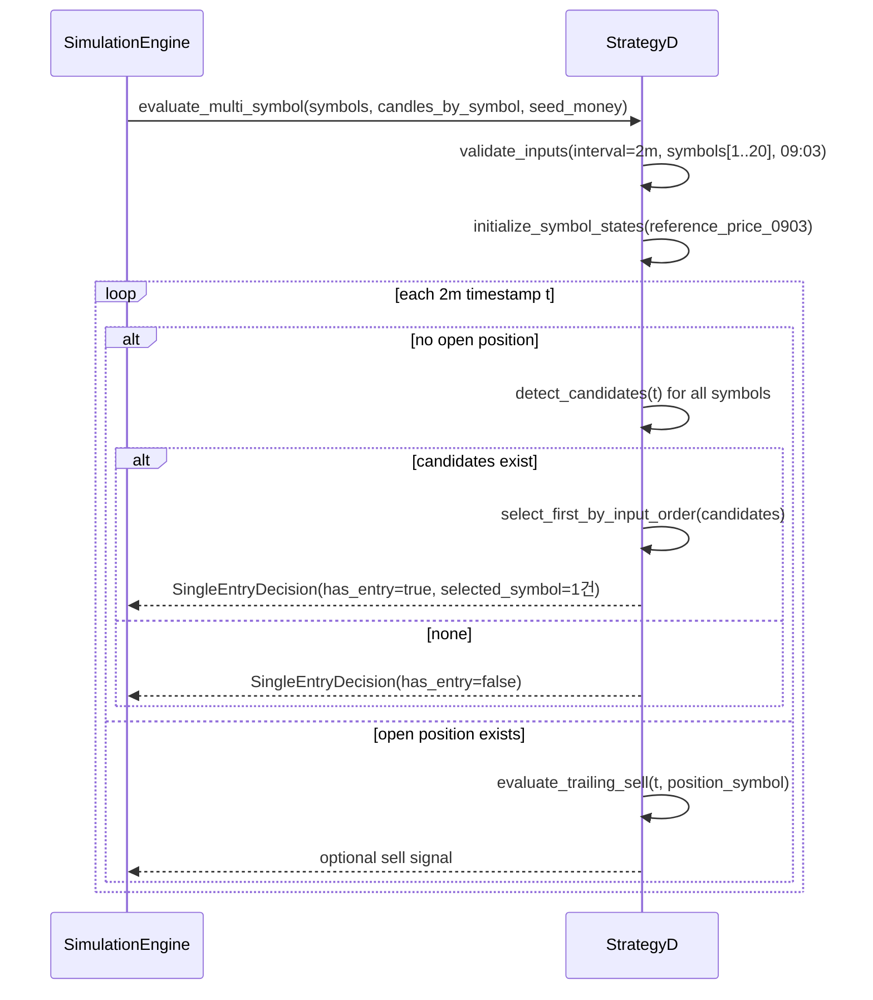

# 저수준 설계 문서 (LLD)
# Low-Level Design Document - STRATEGY

| 항목 | 내용 |
|------|------|
| **문서 버전** | 1.3.0 |
| **작성일** | 2026-02-16 |
| **대상 모듈** | STRATEGY (전략 엔진 모듈) |
| **기반 문서** | HLD v1.3.0 (3.1, 3.2, 4.1), LLD Strategy v1.2.0 |
| **관련 티켓** | TICKET-086-LLD-STRATEGY |

---

## v1.3.0 변경 로그 (요약)

- 신규 전략 D(`two_minute_multi_symbol_buy_trailing_then_sell_trailing`) 상세 설계 추가
- 다중 종목(1~20) 입력 대비 단일 매수 시그널 반환 계약 추가
- 종목별 후보 동시 발생 시 첫 후보 1건 선택 정책(입력 순서 기반) 명시
- 전략 D 제약(CON-009~011) 및 예외 코드/처리 정책 명시

---

## 1. 목적 및 범위

### 1.1 목적

본 문서는 HLD v1.3.0의 Strategy 모듈 변경사항을 구현 가능한 수준으로 상세화한다. 전략 D 식별자/입력/상태모델/후보선택 규칙을 인터페이스, 시퀀스, 수도코드 수준으로 정의한다.

### 1.2 범위 (In-Scope)

- 전략 D 클래스 책임, 입출력 계약, 상태 전이 규칙
- 다중 종목 입력(`symbols[1..20]`) 처리 및 단일 시그널 선택 정책
- 전략 D 매수/매도/손절(미적용) 규칙 및 제약 정의
- 전략 D 전용 오류 코드/예외 처리 정책 정의

### 1.3 비범위 (Out-of-Scope)

- MarketData 2분봉 수집 구현
- Simulation/WebAPI/Frontend 실제 코드 구현
- 수수료/세금/리포트 계산 로직

---

## 2. 전략 D 식별자 및 인터페이스 계약

### 2.1 전략 식별자

- `two_minute_multi_symbol_buy_trailing_then_sell_trailing`

### 2.2 입력 계약 (Strategy 계층)

#### 2.2.1 `StrategyDInput`

| 필드 | 타입 | 규칙 |
|------|------|------|
| `symbols` | list[string] | 길이 1~20, 입력 순서 보존, 각 원소 `^[0-9]{6}\\.KS$` |
| `candles_by_symbol` | map[string, DataFrame] | key는 `symbols`와 동일 집합, 값은 2분봉 OHLCV |
| `seed_money` | Decimal | `> 0` |
| `trade_date` | date | 거래일 |

#### 2.2.2 캔들 계약

- 각 종목 DataFrame 필수 컬럼: `timestamp, open, high, low, close, volume`
- 거래 세션: KST `09:00~15:30`
- 기준 시각 캔들: `09:03` 필수
- interval: `2m` 고정

### 2.3 출력 계약 (단일 시그널)

#### 2.3.1 `SingleEntryDecision`

| 필드 | 타입 | 설명 |
|------|------|------|
| `has_entry` | bool | 현재 평가 시점 진입 여부 |
| `selected_symbol` | string? | 선택된 종목(없으면 null) |
| `entry_price` | Decimal? | 선택 종목의 해당 2분봉 종가 |
| `entry_time` | datetime? | 체결 시각 |
| `reason` | string | `FIRST_CANDIDATE_SELECTED` 또는 `NO_CANDIDATE` |
| `meta` | map[string, any] | 후보 목록/우선순위 근거/저점 추적 상태 |

**계약 원칙:**
- 입력은 다중 종목이지만, 반환 진입 시그널은 항상 0건 또는 1건이다.
- 동일 시점 복수 후보여도 `selected_symbol`은 정확히 1개만 허용한다.

### 2.4 매도 계약

- 매도는 기존 Trailing Stop 규칙 재사용
- `sell_reason`: `PROFIT_PRESERVE`만 전략 D에서 실사용
- 전략 D는 당일 손절을 수행하지 않는다.

---

## 3. 상태 모델

### 3.1 전역 상태 (`StrategyDGlobalState`)

| 필드 | 타입 | 설명 |
|------|------|------|
| `is_bought` | bool | 포지션 보유 여부 |
| `position_symbol` | string? | 현재 보유 종목 |
| `buy_price` | Decimal? | 매수 단가 |
| `buy_quantity` | int | 매수 수량 |
| `last_action` | ActionType | `NONE`, `BUY`, `SELL` |
| `highest_profit_rate` | Decimal | 보유 중 최고 수익률 |
| `is_trailing_started` | bool | trailing 시작 여부 |

### 3.2 종목별 상태 (`StrategyDSymbolState`)

| 필드 | 타입 | 설명 |
|------|------|------|
| `symbol` | string | 종목 코드 |
| `reference_price_0903` | Decimal | 09:03 기준가 |
| `drop_triggered` | bool | 기준가 대비 1% 하락 트리거 여부 |
| `lowest_price_since_trigger` | Decimal? | 하락 구간 전저점 |
| `last_evaluated_time` | datetime | 마지막 평가 시각 |

### 3.3 상태 불변식

1. `is_bought=True`일 때 신규 매수 후보 선택을 수행하지 않는다.
2. `last_action=BUY` 상태에서 추가 BUY는 금지한다.
3. `position_symbol`은 보유 중 정확히 1개만 존재한다.
4. `symbols` 입력 순서는 후보 우선순위의 기준이며 실행 중 변경 불가다.

---

## 4. 후보 선택 정책 (First-Candidate)

### 4.1 정책 정의

- 이름: `FIRST_CANDIDATE_BY_INPUT_ORDER`
- 기준: 요청 `symbols` 배열의 인덱스 오름차순
- 적용 시점: 동일 2분봉 시각에 복수 종목이 매수 조건 충족한 경우

### 4.2 결정 규칙

1. 시각 `t`에서 후보 집합 `C_t`를 계산한다.
2. `C_t`를 입력 순서 인덱스로 정렬한다.
3. 정렬 결과의 첫 원소 1건을 최종 진입 종목으로 선택한다.
4. 미선택 후보는 해당 시각에서 소멸하며, 다음 시각에서 재평가한다.

### 4.3 정책 의도

- 결정성 보장: 동일 입력/동일 데이터에서 동일 결과
- 단일 포지션 제약 일관성 유지
- Simulation 체결 정책(CON-010)과 정합성 유지

---

## 5. 전략 D 실행 시퀀스

### 5.1 시퀀스 다이어그램



---

## 6. 매수/매도 규칙 및 제약

### 6.1 매수 규칙

1. 종목별 기준가는 09:03 2분봉 시가(`open`)를 사용한다.
2. 기준가 대비 1.0% 이상 하락 시 `drop_triggered=True` 전환.
3. 트리거 이후 더 낮은 가격이 나오면 `lowest_price_since_trigger` 갱신.
4. 전저점 대비 0.2% 이상 반등 시 해당 종목을 후보로 등록.
5. 후보 다수 시 첫 후보 선택 정책으로 1건만 매수.
6. 매수 가격은 선택 종목의 해당 2분봉 종가(`close`).

### 6.2 매도 규칙

1. 수익률 1.0% 이상 최초 도달 시 trailing 시작.
2. trailing 시작 후 이익보전율 80% 이하 시 매도.
3. 매도 완료 시 `last_action=SELL`로 전이.

### 6.3 제약(Constraints)

- CON-009: `symbols` 길이 1~20
- CON-010: 동시 후보 발생 시 1건만 선택/체결
- CON-011: 2분봉 + 09:03 기준가 강제
- 당일 손절 미적용 (`should_stop_loss=false`)
- 보유 중 추가 매수 금지, 연속 매수 금지(교대)

---

## 7. 오류 코드 및 예외 처리

### 7.1 오류 코드

| 코드 | 분류 | 조건 |
|------|------|------|
| `INVALID_SYMBOLS_COUNT` | 입력 검증 | `symbols` 길이 <1 또는 >20 |
| `INVALID_SYMBOL_FORMAT` | 입력 검증 | 종목 코드 포맷 불일치 |
| `DUPLICATE_SYMBOLS` | 입력 검증 | 중복 종목 존재 |
| `SYMBOL_CANDLES_MISSING` | 입력 검증 | 특정 종목 캔들 누락 |
| `INTERVAL_MISMATCH_2M_REQUIRED` | 입력 검증 | 2분봉 아님 |
| `REFERENCE_CANDLE_0903_MISSING` | 입력 검증 | 09:03 캔들 부재 |
| `INSUFFICIENT_SEED_MONEY` | 비치명 | `floor(seed/price)=0` |
| `ALTERNATION_RULE_VIOLATION` | 실행 제약 | `BUY->BUY` 시도 |
| `STRATEGY_D_EXECUTION_ERROR` | 실행 오류 | 상태 불일치/수치 예외 |

### 7.2 처리 정책

- 입력 검증 오류: 즉시 실패(치명)
- `INSUFFICIENT_SEED_MONEY`: 해당 시점만 스킵, 다음 캔들 진행
- 제약 위반(`ALTERNATION_RULE_VIOLATION`): 체결 거부 후 진행
- 실행 오류: 거래일 실패로 상위 전파

---

## 8. 실행 가능한 언어 중립 수도코드

### 8.1 진입 후보 계산 및 단일 선택

```text
function evaluate_entry_at_time(t, symbols, state_by_symbol, candles_by_symbol, global_state, seed_money):
    if global_state.is_bought:
        return SingleEntryDecision(false, null, null, null, "NO_CANDIDATE", {})

    candidates = []

    for symbol in symbols in input order:
        candle = candles_by_symbol[symbol][t]
        if candle is null:
            continue

        st = state_by_symbol[symbol]

        drop_rate = ((st.reference_price_0903 - candle.close) / st.reference_price_0903) * 100
        if st.drop_triggered == false and drop_rate >= 1.0:
            st.drop_triggered = true
            st.lowest_price_since_trigger = candle.close
            continue

        if st.drop_triggered:
            st.lowest_price_since_trigger = min(st.lowest_price_since_trigger, candle.close)
            rebound_rate = ((candle.close - st.lowest_price_since_trigger) / st.lowest_price_since_trigger) * 100
            if rebound_rate >= 0.2:
                candidates.append({symbol: symbol, price: candle.close, time: t})

    if candidates is empty:
        return SingleEntryDecision(false, null, null, null, "NO_CANDIDATE", {"candidate_count": 0})

    selected = candidates[0]

    qty = floor(seed_money / selected.price)
    if qty <= 0:
        return SingleEntryDecision(false, null, null, null, "NO_CANDIDATE", {"error": "INSUFFICIENT_SEED_MONEY"})

    return SingleEntryDecision(
        true,
        selected.symbol,
        selected.price,
        selected.time,
        "FIRST_CANDIDATE_SELECTED",
        {
            "candidate_count": len(candidates),
            "candidates": map(candidates, c -> c.symbol),
            "policy": "FIRST_CANDIDATE_BY_INPUT_ORDER"
        }
    )
```

### 8.2 매도 판단

```text
function should_sell_strategyD(current_price, global_state):
    profit_rate = ((current_price - global_state.buy_price) / global_state.buy_price) * 100

    if profit_rate >= 1.0 and global_state.is_trailing_started == false:
        global_state.is_trailing_started = true
        global_state.highest_profit_rate = profit_rate

    if global_state.is_trailing_started:
        global_state.highest_profit_rate = max(global_state.highest_profit_rate, profit_rate)
        preserve_ratio = (profit_rate / max(global_state.highest_profit_rate, epsilon)) * 100
        if preserve_ratio <= 80:
            return true

    return false
```

---

## 9. 요구사항 추적성 (전략 D)

| 요구사항 | LLD 반영 절 | 비고 |
|---------|-------------|------|
| FR-019 | 2, 3, 4, 5, 6, 8 | 전략D 다중 종목/2분봉/진입·청산 규칙 |
| CON-009 | 2.2, 6.3, 7.1 | 종목 수 1~20 |
| CON-010 | 2.3, 4, 6.3, 8.1 | 동시 후보 1건 선택 |
| CON-011 | 2.2, 6.3, 7.1 | 2분봉, 09:03 기준가 |
| BR-011 | 6.1, 6.2, 8 | 전략D 비즈니스 규칙 |

---

## 변경 이력

| 버전 | 날짜 | 변경 내용 | 작성자 |
|------|------|----------|--------|
| 1.3.0 | 2026-02-16 | 전략 D(다중 종목 2분봉) 인터페이스/시퀀스/수도코드/제약/예외 처리 추가 | LLD 담당 에이전트 |
| 1.2.0 | 2026-02-16 | 전략 C(3분봉/09:03) 반영 | LLD 담당 에이전트 |
