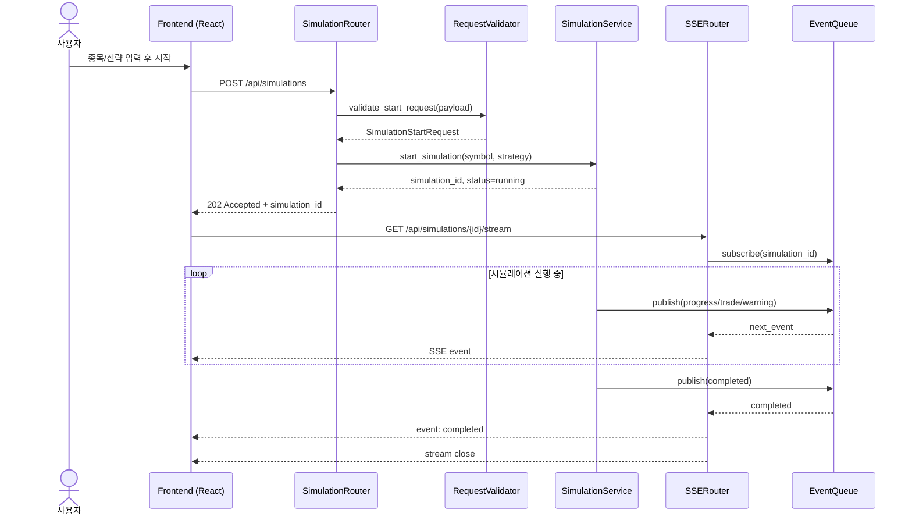
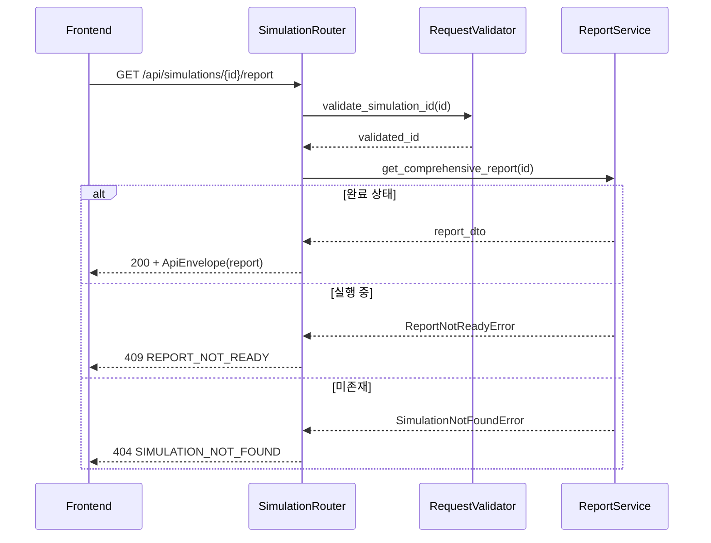
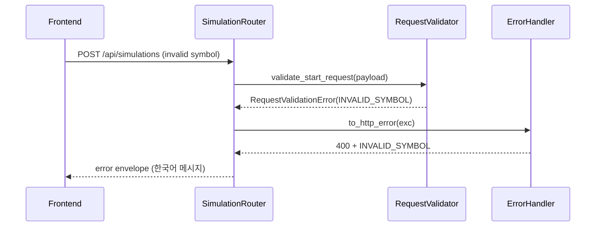
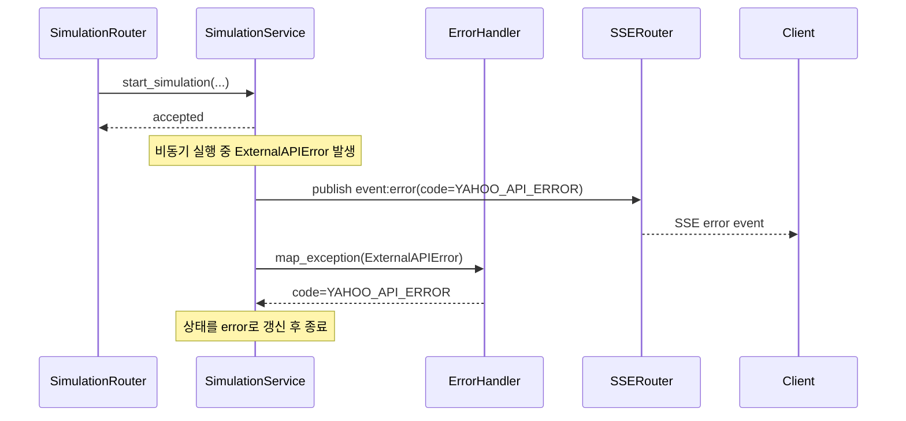

# 저수준 설계 문서 (LLD)
# Low-Level Design Document - WEBAPI

| 항목 | 내용 |
|------|------|
| **문서 버전** | 1.0.0 |
| **작성일** | 2026-02-15 |
| **대상 모듈** | WEBAPI (웹 API 모듈) |
| **기반 문서** | HLD v1.0.0 (4.5, 5.x, 6.x, 9.x), SRS v1.0.0 (FR-010, FR-011, FR-012, NFR-002, NFR-003, NFR-004) |
| **관련 티켓** | TICKET-007-LLD-WEBAPI |

---

## 목차

1. [목적 및 범위](#1-목적-및-범위)
2. [컴포넌트 상세 설계](#2-컴포넌트-상세-설계)
3. [REST 엔드포인트 상세 명세](#3-rest-엔드포인트-상세-명세)
4. [SSE 이벤트 설계](#4-sse-이벤트-설계)
5. [라우터-서비스 호출 시퀀스](#5-라우터-서비스-호출-시퀀스)
6. [에러 처리 시퀀스](#6-에러-처리-시퀀스)
7. [실행 가능한 언어 중립 수도코드](#7-실행-가능한-언어-중립-수도코드)
8. [SRS 요구사항 추적성 매트릭스](#8-srs-요구사항-추적성-매트릭스)
9. [테스트/검증 고려사항 (LLD 수준)](#9-테스트검증-고려사항-lld-수준)

---

## 1. 목적 및 범위

### 1.1 목적

본 문서는 HLD 4.5(웹 API 모듈), 5.x(모듈 간 인터페이스), 6.x(데이터 흐름), 9.x(배포 아키텍처)를 구현 가능한 수준으로 상세화한다. 대상은 `SimulationRouter`, `SSERouter`, `RequestValidator`, `ResponseFormatter`, `ErrorHandler`, `CORSMiddleware`이며, SRS FR-010~FR-012를 직접 충족한다.

### 1.2 범위 (In-Scope)

- 시뮬레이션 시작/상태/결과 조회 REST API 인터페이스 정의
- 시뮬레이션 실시간 모니터링 SSE 스트림 스키마 및 연결 정책 정의
- Pydantic 기반 요청/경로 파라미터 유효성 검증 규칙 정의
- 표준 성공/실패 응답 포맷(JSON Envelope) 정의
- 전역 예외 처리 및 도메인 예외→HTTP 에러 매핑 규칙 정의
- CORS 허용 정책(개발/운영) 정의

### 1.3 비범위 (Out-of-Scope)

- 시뮬레이션 알고리즘/거래 비용 계산 구현 (SIMULATION LLD 범위)
- 전략별 매수·매도 조건 구현 (STRATEGY LLD 범위)
- 시세 수집/RSI 계산 구현 (MARKETDATA LLD 범위)
- 프론트엔드 화면/컴포넌트 구현 (FRONTEND LLD 범위)

---

## 2. 컴포넌트 상세 설계

### 2.1 공통 API 데이터 모델

#### 2.1.1 `SimulationStartRequest`

| 필드 | 타입 | 필수 | 검증 규칙 |
|------|------|------|-----------|
| `symbol` | string | Y | 정규식 `^[0-9]{6}\\.KS$` |
| `strategy` | string | Y | `sell_trailing_stop`, `buy_sell_trailing_stop`, `rsi_buy_sell_trailing_stop` 중 1개 |

#### 2.1.2 `SimulationStatusResponse`

| 필드 | 타입 | 설명 |
|------|------|------|
| `simulation_id` | string | 시뮬레이션 식별자 |
| `status` | string | `queued`, `running`, `completed`, `error` |
| `symbol` | string | 종목 심볼 |
| `strategy` | string | 전략 식별자 |
| `created_at` | string(datetime) | 생성 시각 (ISO 8601, KST) |
| `updated_at` | string(datetime) | 최종 갱신 시각 (ISO 8601, KST) |

#### 2.1.3 `ApiEnvelope<T>`

```json
{
  "success": true,
  "data": {},
  "meta": {
    "request_id": "REQ-20260215-000001",
    "timestamp": "2026-02-15T14:20:31+09:00"
  }
}
```

- 성공 응답: `success=true`, `data` 존재
- 실패 응답: `success=false`, `error` 존재

### 2.2 `SimulationRouter`

#### 2.2.1 책임

- 시뮬레이션 시작/상태/결과 조회 REST 엔드포인트 제공
- `RequestValidator` 호출로 입력 검증 선행
- 시뮬레이션 서비스/리포트 서비스 호출 오케스트레이션
- `ResponseFormatter`를 통한 응답 포맷 일관화

#### 2.2.2 인터페이스

| 메서드 시그니처 | 요청 | 반환 | 예외 |
|----------------|------|------|------|
| `POST /api/simulations` | `SimulationStartRequest` | `202 + ApiEnvelope[SimulationStatusResponse]` | `ValidationError`, `ExternalAPIError`, `SimulationExecutionError` |
| `GET /api/simulations/{simulation_id}` | path param | `200 + ApiEnvelope[SimulationStatusResponse]` | `SimulationNotFoundError` |
| `GET /api/simulations/{simulation_id}/report` | path param | `200 + ApiEnvelope[ComprehensiveReport]` | `SimulationNotFoundError`, `ReportNotReadyError` |
| `GET /api/simulations` | query(optional) | `200 + ApiEnvelope[list[SimulationStatusResponse]]` | - |

#### 2.2.3 동작 규칙

1. `POST /api/simulations`는 비동기 실행 시작 확인으로 `202 Accepted`를 반환한다 (FR-010, NFR-002-2).
2. 시뮬레이션 시작 직후 `status=running`을 반환하고, 상세 진행 정보는 SSE로 제공한다 (FR-011).
3. 결과 조회는 `status=completed` 상태의 시뮬레이션에 대해서만 성공 응답을 반환한다.
4. 존재하지 않는 ID는 항상 동일한 404 에러 모델로 응답한다.

### 2.3 `SSERouter`

#### 2.3.1 책임

- `GET /api/simulations/{simulation_id}/stream` SSE 엔드포인트 제공
- 시뮬레이션 이벤트 큐 구독 및 SSE 프레임 직렬화
- 연결 heartbeat 및 종료 이벤트 관리

#### 2.3.2 인터페이스

| 메서드 시그니처 | 요청 | 반환 | 예외 |
|----------------|------|------|------|
| `GET /api/simulations/{simulation_id}/stream` | path param | `200 + text/event-stream` | `SimulationNotFoundError`, `StreamUnavailableError` |

#### 2.3.3 동작 규칙

1. 응답 헤더는 `Content-Type: text/event-stream`, `Cache-Control: no-cache`, `Connection: keep-alive`를 사용한다.
2. 이벤트 포맷은 `id`, `event`, `data`, `retry` 필드를 지원한다.
3. 최소 5초 이내 UI 갱신 보장을 위해 서버는 progress/heartbeat 이벤트를 5초를 넘기지 않고 전송한다 (NFR-002-3).
4. 시뮬레이션 종료(`completed` 또는 `error`) 이벤트 송신 후 스트림을 정상 종료한다.

### 2.4 `RequestValidator`

#### 2.4.1 책임

- Pydantic 모델 기반 본문/경로 파라미터 검증
- 비즈니스 규칙 유효성 검증(전략 식별자 허용 목록)
- 검증 실패를 표준 에러 코드로 변환

#### 2.4.2 인터페이스

| 메서드 시그니처 | 입력 | 반환 | 예외 |
|----------------|------|------|------|
| `validate_start_request(payload: dict) -> SimulationStartRequest` | JSON body | Pydantic DTO | `RequestValidationError` |
| `validate_simulation_id(simulation_id: str) -> str` | path param | 정규화된 ID | `RequestValidationError` |

#### 2.4.3 검증 규칙

- `symbol`
  - 필수, 공백 불가
  - 형식: 6자리 숫자 + `.KS` (예: `005930.KS`)
- `strategy`
  - 허용값 3종 고정
- `simulation_id`
  - 공백/빈값 불가
  - URL-safe 문자열만 허용 (길이 1~64)

### 2.5 `ResponseFormatter`

#### 2.5.1 책임

- API 성공/실패 응답 envelope 생성
- 금액/날짜 표기 일관성 보장
- 내부 도메인 객체를 외부 API 스키마로 매핑

#### 2.5.2 인터페이스

| 메서드 시그니처 | 입력 | 반환 |
|----------------|------|------|
| `ok(data: Any, request_id: str) -> ApiEnvelope` | 도메인 데이터 | `success=true` 응답 |
| `error(code: str, message_ko: str, request_id: str, details: dict?) -> ApiEnvelope` | 오류 정보 | `success=false` 응답 |
| `format_currency(value: Decimal) -> int` | 금액 | 원 단위 정수 |
| `format_datetime_kst(dt: datetime) -> str` | datetime | ISO 8601(+09:00) |

#### 2.5.3 포맷 정책

1. API 응답 수치는 프론트 렌더링 단순화를 위해 금액을 정수 원 단위로 반환한다.
2. 날짜/시각은 ISO 8601 문자열로 통일한다.
3. 오류 메시지는 한국어 기본값을 사용한다 (NFR-004-3).

### 2.6 `ErrorHandler`

#### 2.6.1 책임

- FastAPI 전역 예외 핸들러 등록
- 도메인 예외를 HTTP 상태코드/에러코드로 매핑
- 5xx 내부 오류의 사용자 노출 메시지 최소화

#### 2.6.2 인터페이스

| 메서드 시그니처 | 설명 |
|----------------|------|
| `register_exception_handlers(app: FastAPI) -> None` | 전역 핸들러 등록 |
| `to_http_error(exc: Exception) -> tuple[int, ApiEnvelope]` | 예외→HTTP 응답 변환 |

#### 2.6.3 예외 매핑 정책

- 검증 오류(`RequestValidationError`) → `400 INVALID_REQUEST`
- 종목 형식 오류 → `400 INVALID_SYMBOL`
- 전략 값 오류 → `400 INVALID_STRATEGY`
- 리소스 없음(`SimulationNotFoundError`) → `404 SIMULATION_NOT_FOUND`
- 결과 미준비(`ReportNotReadyError`) → `409 REPORT_NOT_READY`
- 외부 시세 오류(`ExternalAPIError`) → `502 YAHOO_API_ERROR`
- 미처리 예외 → `500 INTERNAL_SERVER_ERROR`

### 2.7 `CORSMiddleware`

#### 2.7.1 책임

- SPA(Browser)↔API 간 교차 출처 요청 허용
- 환경별 허용 Origin 제어

#### 2.7.2 정책

| 환경 | 허용 Origin | 허용 메서드 | 허용 헤더 |
|------|-------------|-------------|-----------|
| 개발 | `http://localhost:3000` | `GET, POST, OPTIONS` | `Authorization, Content-Type, Last-Event-ID` |
| 운영 | 배포 도메인 1개(예: `https://app.example.com`) | `GET, POST, OPTIONS` | 최소 필요 헤더만 허용 |

#### 2.7.3 보안 규칙

1. `allow_origins=['*']`는 금지한다.
2. 인증이 도입될 경우 `allow_credentials` 정책을 별도 검토한다.
3. SSE 연결에서도 CORS preflight가 실패하지 않도록 `Last-Event-ID`를 허용한다.

---

## 3. REST 엔드포인트 상세 명세

### 3.1 엔드포인트 요약

| 메서드 | 경로 | 설명 | 상태코드 |
|--------|------|------|---------|
| `POST` | `/api/simulations` | 시뮬레이션 시작 | `202`, `400`, `502`, `500` |
| `GET` | `/api/simulations/{simulation_id}` | 시뮬레이션 상태 조회 | `200`, `400`, `404`, `500` |
| `GET` | `/api/simulations/{simulation_id}/report` | 시뮬레이션 결과 조회 | `200`, `400`, `404`, `409`, `500` |
| `GET` | `/api/simulations` | 시뮬레이션 목록 조회 | `200`, `500` |

### 3.2 `POST /api/simulations`

#### 요청

```json
{
  "symbol": "005930.KS",
  "strategy": "sell_trailing_stop"
}
```

#### 성공 응답 (202)

```json
{
  "success": true,
  "data": {
    "simulation_id": "SIM-20260215-0001",
    "status": "running",
    "symbol": "005930.KS",
    "strategy": "sell_trailing_stop",
    "created_at": "2026-02-15T14:40:00+09:00",
    "updated_at": "2026-02-15T14:40:00+09:00"
  },
  "meta": {
    "request_id": "REQ-20260215-1001",
    "timestamp": "2026-02-15T14:40:00+09:00"
  }
}
```

#### 실패 응답 예시 (400)

```json
{
  "success": false,
  "error": {
    "code": "INVALID_SYMBOL",
    "message": "유효하지 않은 종목 심볼입니다. 예: 005930.KS"
  },
  "meta": {
    "request_id": "REQ-20260215-1002",
    "timestamp": "2026-02-15T14:40:10+09:00"
  }
}
```

### 3.3 `GET /api/simulations/{simulation_id}`

#### 성공 응답 (200)

- 실행 중/완료/오류 상태를 동일 스키마로 반환한다.
- `status=error`인 경우 `data`에 `error_code`, `error_message`를 포함한다.

### 3.4 `GET /api/simulations/{simulation_id}/report`

#### 성공 응답 (200)

- `ComprehensiveReport`는 HLD 5.3.2 및 REPORT 모듈 스키마를 따른다.
- 금액 필드는 정수 원 단위, 수익률 필드는 소수점 둘째 자리까지 제공한다.

#### 충돌 응답 (409)

- 시뮬레이션이 `running` 상태면 `REPORT_NOT_READY`를 반환한다.

### 3.5 상태코드/에러코드 매트릭스

| HTTP 상태 | 에러 코드 | 발생 조건 | 사용자 메시지(한국어) |
|-----------|----------|-----------|-----------------------|
| 400 | `INVALID_REQUEST` | JSON 스키마 불일치, 필수값 누락 | 요청 형식이 올바르지 않습니다 |
| 400 | `INVALID_SYMBOL` | 심볼 형식 불일치 (`^[0-9]{6}\\.KS$`) | 유효하지 않은 종목 심볼입니다 |
| 400 | `INVALID_STRATEGY` | 허용되지 않은 전략 | 유효하지 않은 전략입니다 |
| 404 | `SIMULATION_NOT_FOUND` | 존재하지 않는 simulation_id | 시뮬레이션을 찾을 수 없습니다 |
| 409 | `REPORT_NOT_READY` | 결과 생성 전 조회 | 시뮬레이션이 아직 완료되지 않았습니다 |
| 502 | `YAHOO_API_ERROR` | 외부 시세 조회 실패 | 시세 데이터 조회에 실패했습니다 |
| 500 | `INTERNAL_SERVER_ERROR` | 처리되지 않은 예외 | 서버 내부 오류가 발생했습니다 |

---

## 4. SSE 이벤트 설계

### 4.1 SSE 이벤트 타입

| 이벤트 | 설명 | 필수 필드 |
|--------|------|-----------|
| `progress` | 거래일 진행률 업데이트 | `simulation_id`, `current_day`, `total_days`, `progress_pct`, `trading_date`, `status` |
| `trade` | 매수/매도 체결 이벤트 | `simulation_id`, `trade_type`, `trade_datetime`, `price`, `quantity` |
| `warning` | 거래 없음/데이터 누락 경고 | `simulation_id`, `code`, `message`, `trading_date` |
| `completed` | 시뮬레이션 완료 | `simulation_id`, `status`, `final_seed`, `total_profit_rate` |
| `error` | 시뮬레이션 비정상 종료 | `simulation_id`, `status`, `code`, `message` |
| `heartbeat` | 연결 유지용 주기 이벤트 | `simulation_id`, `server_time` |

### 4.2 이벤트 스키마

#### 4.2.1 `progress`

```json
{
  "simulation_id": "SIM-20260215-0001",
  "status": "running",
  "current_day": 15,
  "total_days": 42,
  "progress_pct": 35.7,
  "trading_date": "2026-01-15"
}
```

#### 4.2.2 `trade`

```json
{
  "simulation_id": "SIM-20260215-0001",
  "trade_type": "buy",
  "trade_datetime": "2026-01-15T09:05:00+09:00",
  "price": 71000,
  "quantity": 140,
  "amount": 9940000,
  "reason": null
}
```

```json
{
  "simulation_id": "SIM-20260215-0001",
  "trade_type": "sell",
  "trade_datetime": "2026-01-15T13:25:00+09:00",
  "price": 71800,
  "quantity": 140,
  "amount": 10052000,
  "reason": "profit_preserve",
  "net_profit": 80839
}
```

#### 4.2.3 `completed`

```json
{
  "simulation_id": "SIM-20260215-0001",
  "status": "completed",
  "final_seed": 10345000,
  "total_profit_rate": 3.45
}
```

#### 4.2.4 `error`

```json
{
  "simulation_id": "SIM-20260215-0001",
  "status": "error",
  "code": "SIMULATION_ERROR",
  "message": "시뮬레이션 실행 중 오류가 발생했습니다"
}
```

### 4.3 연결 생명주기

1. 클라이언트는 `GET /api/simulations/{id}/stream`으로 연결을 시작한다.
2. 서버는 최초 연결 직후 `progress` 또는 `heartbeat`를 송신해 연결 유효성을 보장한다.
3. 시뮬레이션 실행 중 `progress`, `trade`, `warning` 이벤트를 순차 송신한다.
4. 종료 시 `completed` 또는 `error` 이벤트 송신 후 스트림을 닫는다.

### 4.4 재연결 정책

- 서버는 SSE 프레임에 `retry: 3000`(3초)을 포함한다.
- 클라이언트(EventSource)는 네트워크 단절 시 자동 재연결한다.
- 재연결 시 `Last-Event-ID`를 수신하면, 가능한 경우 마지막 ID 이후 이벤트부터 재전송한다.
- 서버에 재전송 버퍼가 없거나 만료된 경우 최신 상태 스냅샷(`progress`)을 우선 전송한다.

### 4.5 Heartbeat 정책

- 유휴 구간에서도 최대 5초 간격으로 `heartbeat`를 송신한다 (NFR-002-3 정합).
- 프레임 예시:

```text
id: 152
event: heartbeat
retry: 3000
data: {"simulation_id":"SIM-20260215-0001","server_time":"2026-02-15T14:41:10+09:00"}

```

---

## 5. 라우터-서비스 호출 시퀀스

### 5.1 시뮬레이션 시작 및 모니터링 시퀀스



### 5.2 결과 조회 시퀀스



---

## 6. 에러 처리 시퀀스

### 6.1 요청 검증 실패 시퀀스



### 6.2 실행 중 예외 발생 시퀀스



### 6.3 전역 예외 처리 규칙

1. FastAPI 기본 검증 예외(`RequestValidationError`)는 반드시 한국어 메시지로 변환한다.
2. 5xx 오류는 내부 상세 스택을 응답 본문에 노출하지 않는다.
3. 모든 오류 응답은 `request_id`를 포함하여 추적 가능성을 보장한다.

---

## 7. 실행 가능한 언어 중립 수도코드

### 7.1 시뮬레이션 시작 REST 핸들러

```text
FUNCTION post_simulations(request_json, request_id):
    TRY:
        dto = RequestValidator.validate_start_request(request_json)

        simulation = SimulationService.start_simulation(
            symbol = dto.symbol,
            strategy = dto.strategy,
            initial_seed = 10000000
        )

        response_data = {
            simulation_id: simulation.id,
            status: simulation.status,
            symbol: simulation.symbol,
            strategy: simulation.strategy,
            created_at: format_datetime_kst(simulation.created_at),
            updated_at: format_datetime_kst(simulation.updated_at)
        }

        RETURN HTTP 202, ResponseFormatter.ok(response_data, request_id)

    CATCH ValidationError as e:
        RETURN map_error_to_http(e, request_id)
    CATCH ExternalAPIError as e:
        RETURN map_error_to_http(e, request_id)
    CATCH Exception as e:
        RETURN map_error_to_http(InternalServerError(e), request_id)
```

### 7.2 SSE 스트림 핸들러

```text
FUNCTION get_simulation_stream(simulation_id, last_event_id):
    validated_id = RequestValidator.validate_simulation_id(simulation_id)

    IF NOT SimulationService.exists(validated_id):
        RAISE SimulationNotFoundError

    event_source = EventBus.subscribe(validated_id, last_event_id)

    GENERATOR stream_generator:
        next_heartbeat_deadline = now() + 5 seconds

        LOOP:
            event = event_source.poll(timeout=1 second)

            IF event IS NOT NULL:
                YIELD to_sse_frame(event_id=event.id, event_type=event.type, data=event.payload, retry_ms=3000)
                IF event.type IN ["completed", "error"]:
                    BREAK
                next_heartbeat_deadline = now() + 5 seconds
            ELSE IF now() >= next_heartbeat_deadline:
                heartbeat_payload = {simulation_id: validated_id, server_time: now_kst_iso()}
                YIELD to_sse_frame(event_id=next_seq(), event_type="heartbeat", data=heartbeat_payload, retry_ms=3000)
                next_heartbeat_deadline = now() + 5 seconds

    RETURN StreamingResponse(stream_generator, media_type="text/event-stream")
```

### 7.3 에러 매핑 함수

```text
FUNCTION map_error_to_http(error, request_id):
    MAPPING = {
        INVALID_REQUEST: (400, "요청 형식이 올바르지 않습니다"),
        INVALID_SYMBOL: (400, "유효하지 않은 종목 심볼입니다"),
        INVALID_STRATEGY: (400, "유효하지 않은 전략입니다"),
        SIMULATION_NOT_FOUND: (404, "시뮬레이션을 찾을 수 없습니다"),
        REPORT_NOT_READY: (409, "시뮬레이션이 아직 완료되지 않았습니다"),
        YAHOO_API_ERROR: (502, "시세 데이터 조회에 실패했습니다")
    }

    IF error.code IN MAPPING:
        status, message = MAPPING[error.code]
    ELSE:
        status, message = (500, "서버 내부 오류가 발생했습니다")

    envelope = ResponseFormatter.error(
        code = error.code OR "INTERNAL_SERVER_ERROR",
        message_ko = message,
        request_id = request_id
    )

    RETURN HTTP status, envelope
```

---

## 8. SRS 요구사항 추적성 매트릭스

| SRS ID | 요구사항 요약 | WEBAPI 설계 반영 |
|--------|---------------|------------------|
| FR-010 | 웹 브라우저에서 시뮬레이션 시작/상태 표시/입력검증 | 2.2, 2.4, 3.2, 3.3, 5.1, 7.1 |
| FR-011 | 실시간 모니터링(상태, 진행률, 매수/매도 이벤트) | 2.3, 4.1~4.5, 5.1, 7.2 |
| FR-012 | 결과 조회 및 재조회(서버 저장 데이터 기반) | 2.2, 3.4, 5.2 |
| NFR-002 | 시작 응답 2초, 모니터링 갱신 5초 이내 | 2.2.3(1), 2.3.3(3), 4.5 |
| NFR-003 | 브라우저 기반 접근성 | 2.7, 3장 전체 |
| NFR-004 | 직관성/한국어 오류 메시지/상태 구분 | 2.5.3, 2.6.3, 3.5, 6.3 |

---

## 9. 테스트/검증 고려사항 (LLD 수준)

### 9.1 API 계약 테스트

1. `POST /api/simulations` 정상 케이스에서 `202`와 `simulation_id` 반환 검증
2. 심볼/전략 검증 실패 시 `400` + 코드(`INVALID_SYMBOL`, `INVALID_STRATEGY`) 검증
3. 결과 미준비 상태에서 `/report` 호출 시 `409 REPORT_NOT_READY` 검증
4. 미존재 시뮬레이션 ID에 대해 `404 SIMULATION_NOT_FOUND` 검증

### 9.2 SSE 스트림 테스트

1. 연결 성공 시 `text/event-stream` 헤더 검증
2. 실행 중 `progress`, `trade` 이벤트 수신 및 스키마 검증
3. 유휴 구간 heartbeat가 5초 이내 주기로 수신되는지 검증
4. `completed` 또는 `error` 이벤트 이후 스트림 종료 검증
5. 연결 단절 후 EventSource 자동 재연결 동작(재시도 3초) 검증

### 9.3 예외/복원력 테스트

1. 시세 조회 실패(외부 API 에러) 시 `YAHOO_API_ERROR` 매핑 검증
2. 내부 예외 발생 시 `500 INTERNAL_SERVER_ERROR`와 민감정보 비노출 검증
3. 요청별 `request_id`가 성공/실패 모두 포함되는지 검증

### 9.4 성능/사용성 검증 포인트

1. 시뮬레이션 시작 API 첫 응답이 2초 이내인지 측정 (NFR-002)
2. 모니터링 화면 반영 지연이 5초 이내인지 측정 (NFR-002)
3. Chrome/Edge/Firefox 최신 버전에서 SSE 연결/재연결 정상 동작 확인 (NFR-003)
4. 오류 메시지 한국어 가독성 및 상태 뱃지(실행중/완료/오류) 연동 확인 (NFR-004)
